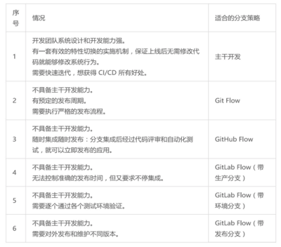

# 持续交付

## 持续交付的概念

持续交付通常以‘发布流水线’的方式来解释，即研发团队从开发、到测试、再到部署，最终将产品交付给最终用户使用的过程.

### 持续交付的价值

研发团队 --> 开发(Coding->build) --> 测试(Deploy->testing) --> 部署(packing->rollout) --> 最终用户

虽然持续交付着重打造的是发布流水线部分，但它所达到的目标是在‘最终用户’和‘研发团队’之间建立紧密的反馈环；通过持续交付新的软件版本，以验证新想法和软件改动的正确性，并衡量这些改动对软件价值(收入、日活、GMV等KPI指标)的影响。

在互联网应用盛行、速度为王的今天，持续交付的价值更是被突显出来。持续交付能力正成为评定一家互联网公司研发能力的重要指标。

### 持续交付与DevOps

**持续交付**

> 持续交付是，提升软件交付速率的一套工程方法和一系列最佳实践的集合。关注点概括为：持续集成构建、测试自动化和部署流水线。

**DevOps**

- Dev(开发团队)的工作是，为软件增加新功能和修复缺陷，这要通过频繁的变更来达到；
- Ops(运维团队)的工作是，保证系统的高稳定性和高性能，这代表着变更越少越不容易出错；

因此，Dev和Ops长久以来处于对立和矛盾的状态。

目前，人们对DevOps的看法，大致概括为四种：一组技术、一个职能、一种文化和一种组织架构。

- DevOps是一组技术，包括：自动化运维、持续交付、高频部署、Docker等内容.
- DevOps是一个职能，全栈工程师.
- DevOps是一种文化，推到Dev与Ops之间的阻碍墙.
- DevOps是一种组织呃架构，将Dev和Ops置于一个团队内，一同工作，同化目标，以达到DevOps文化地彻底贯彻.

**持续交付和DevOps的关系**

- DevOps的本质是一种鼓励协作的研发文化
- 持续交付与DevOps所追求的最终目标是一致的，即快速向用户交付高质量的软件产品
- DevOps的概念比持续交付更宽泛，是持续交付的继续延伸
- 持续交付更专注于技术与实践，是DevOps的工具及技术实现

### 代码分支策略的选择

- "主干开发"集成效率高、冲突少，但对团队个人的开发能力有较高要求；
- "特性分支开发"有利于并行开发，需要一定的流程保证，能保证主干代码质量；

