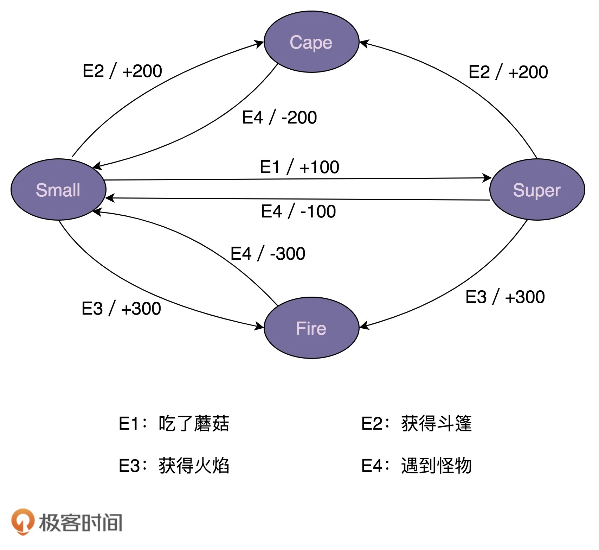

# 编写高质量代码


## 设计原则与思想：面向对象
### 面向对象在谈论什么？
#### 什么是面向对象编程和面向对象编程语言？
面向对象编程的英文缩写是 OOP，全称是 Object Oriented Programming。对应地，面向对象编程语言的英文缩写是 OOPL，全称是 Object Oriented Programming Language。
> 面向对象编程是一种编程范式或编程风格。它以**类或对象**作为组织代码的基本单元，并将封装、抽象、继承、多态四个特性，作为代码设计和实现的基石 。

> 面向对象编程语言是支持类或对象的语法机制，并有现成的语法机制，能方便地实现面向对象编程四大特性（封装、抽象、继承、多态）的编程语言。
#### 什么是面向对象分析和面向对象设计？
面向对象分析英文缩写是 OOA，全称是 Object Oriented Analysis；面向对象设计的英文缩写是 OOD，全称是 Object Oriented Design。OOA、OOD、OOP 三个连在一起就是面向对象分析、设计、编程（实现），正好是面向对象软件开发要经历的三个阶段。

面向对象分析就是要搞清楚做什么，面向对象设计就是要搞清楚怎么做。两个阶段最终的产出是类的设计，包括程序被拆解为哪些类，每个类有哪些属性方法、类与类之间如何交互等等。

### 封装、抽象、继承、多态分别可以解决哪些编程问题？
#### 封装
封装也叫数据访问保护。类通过暴露有限的访问接口，授权外部仅能通过类提供的方式来访问内部信息或者数据。它需要编程语言提供权限访问控制语法来支持，例如 Java 中的 private、protected、public 关键字。

封装特性存在的意义，一方面是保护数据不被随意修改，提高代码的可维护性；另一方面是仅暴露有限的必要接口，提高类的易用性。
#### 抽象
抽象就是讲如何隐藏方法的具体实现，让使用者只需要关心方法提供了哪些功能，不需要知道这些功能是如何实现的。抽象可以通过接口类或者抽象类来实现，但也并不需要特殊的语法机制来支持。

抽象存在的意义，一方面是提高代码的可扩展性、维护性，修改实现不需要改变定义，减少代码的改动范围；另一方面，它也是处理复杂系统的有效手段，能有效地过滤掉不必要关注的信息。
#### 继承
继承是用来表示类之间的 is-a 关系，分为两种模式：单继承和多继承。单继承表示一个子类只继承一个父类，多继承表示一个子类可以继承多个父类。为了实现继承这个特性，编程语言需要提供特殊的语法机制来支持。

继承主要是用来解决代码复用的问题。
#### 多态
多态是指子类可以替换父类，在实际的代码运行过程中，调用子类的方法实现。多态这种特性也需要编程语言提供特殊的语法机制来实现，比如继承、接口类、duck-typing。

多态可以提高代码的扩展性和复用性，是很多设计模式、设计原则、编程技巧的代码实现基础。

### 面向对象与面向过程对比
#### 什么是面向过程编程与面向过程编程语言？
类比面向对象编程与面向对象编程语言的定义，对于面向过程编程和面向过程编程语言这两个概念:
> 面向过程编程也是一种编程范式或编程风格。它以过程（可以理解为方法、函数、操作）作为组织代码的基本单元，以数据（可以理解为成员变量、属性）与方法相分离为最主要的特点。面向过程风格是一种流程化的编程风格，通过拼接一组顺序执行的方法来操作数据完成一项功能。

> 面向过程编程语言首先是一种编程语言。它最大的特点是不支持类和对象两个语法概念，不支持丰富的面向对象编程特性（比如继承、多态、封装），仅支持面向过程编程。

定义不是很严格，也比较抽象，所以，我再用一个例子进一步解释一下。假设我们有一个记录了用户信息的文本文件 users.txt，每行文本的格式是 name&age&gender（比如，小王 &28& 男）。我们希望写一个程序，从 users.txt 文件中逐行读取用户信息，然后格式化成 name\tage\tgender（其中，\t 是分隔符）这种文本格式，并且按照 age 从小到大排序之后，重新写入到另一个文本文件 formatted_users.txt 中。针对这样一个小程序的开发，我们一块来看看，用面向过程和面向对象两种编程风格，编写出来的代码有什么不同。

首先，我们先来看，用面向过程这种编程风格写出来的代码是什么样子的。注意，下面的代码是用 C 语言这种面向过程的编程语言来编写的。
```c
struct User {
  char name[64];
  int age;
  char gender[16];
};

struct User parse_to_user(char* text) {
  // 将text(“小王&28&男”)解析成结构体struct User
}

char* format_to_text(struct User user) {
  // 将结构体struct User格式化成文本（"小王\t28\t男"）
}

void sort_users_by_age(struct User users[]) {
  // 按照年龄从小到大排序users
}

void format_user_file(char* origin_file_path, char* new_file_path) {
  // open files...
  struct User users[1024]; // 假设最大1024个用户
  int count = 0;
  while(1) { // read until the file is empty
    struct User user = parse_to_user(line);
    users[count++] = user;
  }
  
  sort_users_by_age(users);
  
  for (int i = 0; i < count; ++i) {
    char* formatted_user_text = format_to_text(users[i]);
    // write to new file...
  }
  // close files...
}

int main(char** args, int argv) {
  format_user_file("/home/zheng/user.txt", "/home/zheng/formatted_users.txt");
}
```
然后，我们再来看，用面向对象这种编程风格写出来的代码是什么样子的。注意，下面的代码是用 Java 这种面向对象的编程语言来编写的。
```c

 public class User {
  private String name;
  private int age;
  private String gender;
  
  public User(String name, int age, String gender) {
    this.name = name;
    this.age = age;
    this.gender = gender;
  }
  
  public static User praseFrom(String userInfoText) {
    // 将text(“小王&28&男”)解析成类User
  }
  
  public String formatToText() {
    // 将类User格式化成文本（"小王\t28\t男"）
  }
}

public class UserFileFormatter {
  public void format(String userFile, String formattedUserFile) {
    // Open files...
    List users = new ArrayList<>();
    while (1) { // read until file is empty 
      // read from file into userText...
      User user = User.parseFrom(userText);
      users.add(user);
    }
    // sort users by age...
    for (int i = 0; i < users.size(); ++i) {
      String formattedUserText = user.formatToText();
      // write to new file...
    }
    // close files...
  }
}

public class MainApplication {
  public static void main(String[] args) {
    UserFileFormatter userFileFormatter = new UserFileFormatter();
    userFileFormatter.format("/home/zheng/users.txt", "/home/zheng/formatted_users.txt");
  }
}
```
我们可以看出，面向过程和面向对象最基本的区别就是，代码的组织方式不同。**面向过程风格的代码被组织成了一组方法集合及其数据结构（struct User），方法和数据结构的定义是分开的。面向对象风格的代码被组织成一组类，方法和数据结构被绑定一起，定义在类中。**
#### 面向对象编程相比面向过程编程有哪些优势？
- 对于大规模复杂程序的开发，程序的处理流程并非单一的一条主线，而是错综复杂的网状结构。
- 面向对象编程比起面向过程编程，更能应对这种复杂类型的程序开发。面向对象编程相比面向过程编程，具有更加丰富的特性（封装、抽象、继承、多态）。利用这些特性编写出来的代码，更加易扩展、易复用、易维护。
- 从编程语言跟机器打交道的方式的演进规律中，我们可以总结出：面向对象编程语言比起面向过程编程语言，更加人性化、更加高级、更加智能。

### 哪些代码设计看似是面向对象，实际是面向过程?
#### 1.滥用 getter、setter 方法
在设计实现类的时候，除非真的需要，否则尽量不要给属性定义 setter 方法。除此之外，尽管 getter 方法相对 setter 方法要安全些，但是如果返回的是集合容器，那也要防范集合内部数据被修改的风险。
#### 2.Constants 类、Utils 类的设计问题
对于这两种类的设计，我们尽量能做到职责单一，定义一些细化的小类，比如 RedisConstants、FileUtils，而不是定义一个大而全的 Constants 类、Utils 类。除此之外，如果能将这些类中的属性和方法，划分归并到其他业务类中，那是最好不过的了，能极大地提高类的内聚性和代码的可复用性。
> Util类，一般是无状态的，**只包含静态方法**。使用时无需创建类的实例。
> Helper类，可以有状态（类的成员变量），**一般需要创建实例才能使用**。
#### 3.基于贫血模型的开发模式
传统的 MVC 结构分为 Model 层、Controller 层、View 层这三层。不过，在做前后端分离之后，三层结构在后端开发中，会稍微有些调整，被分为 Controller 层、Service 层、Repository 层。Controller 层负责暴露接口给前端调用，Service 层负责核心业务逻辑，Repository 层负责数据读写。而在每一层中，我们又会定义相应的 VO（View Object）、BO（Business Object）、Entity。一般情况下，VO、BO、Entity 中只会定义数据，不会定义方法，所有操作这些数据的业务逻辑都定义在对应的 Controller 类、Service 类、Repository 类中。这就是典型的面向过程的编程风格。

实际上，这种开发模式叫作基于贫血模型的开发模式，也是我们现在非常常用的一种 Web 项目的开发模式。

<u>因为数据和操作是分开定义在 VO/BO/Entity 和 Controler/Service/Repository 中的。</u>今天，你只需要掌握这一点就可以了。为什么这种开发模式如此流行？如何规避面向过程编程的弊端？有没有更好的可替代的开发模式？相关的更多问题，我们在面向对象实战篇中会一一讲解。

### 接口和抽象类的区别?
#### 1. 抽象类和接口的语法特性
抽象类不允许被实例化，只能被继承。它可以包含属性和方法。方法既可以包含代码实现，也可以不包含代码实现。不包含代码实现的方法叫作抽象方法。子类继承抽象类，必须实现抽象类中的所有抽象方法。

接口不能包含属性，只能声明方法，方法不能包含代码实现。类实现接口的时候，必须实现接口中声明的所有方法。
#### 2. 抽象类和接口存在的意义
抽象类是对成员变量和方法的抽象，是一种 is-a 关系，是为了解决代码复用问题。接口仅仅是对方法的抽象，是一种 has-a 关系，表示具有某一组行为特性，是为了解决解耦问题，隔离接口和具体的实现，提高代码的扩展性。

#### 3. 抽象类和接口的应用场景区别
什么时候该用抽象类？什么时候该用接口？实际上，判断的标准很简单。如果要表示一种 is-a 的关系，并且是为了解决代码复用问题，我们就用抽象类；如果要表示一种 has-a 关系，并且是为了解决抽象而非代码复用问题，那我们就用接口。

### 基于接口而非实现编程？
#### 基于接口而非实现编程。这个原则非常重要，是一种非常有效的提高代码质量的手段，在平时的开发中特别经常被用到。（养成习惯，先写接口，再写实现）
1. “基于接口而非实现编程”，这条原则的另一个表述方式，是“基于抽象而非实现编程”。后者的表述方式其实更能体现这条原则的设计初衷。我们在做软件开发的时候，一定要有抽象意识、封装意识、接口意识。越抽象、越顶层、越脱离具体某一实现的设计，越能提高代码的灵活性、扩展性、可维护性。
2. 我们在定义接口的时候，一方面，命名要足够通用，不能包含跟具体实现相关的字眼；另一方面，与特定实现有关的方法不要定义在接口中。
3. “基于接口而非实现编程”这条原则，不仅仅可以指导非常细节的编程开发，还能指导更加上层的架构设计、系统设计等。比如，服务端与客户端之间的“接口”设计、类库的“接口”设计。

### 多用组合少用继承？
#### 为什么不推荐使用继承？
继承是面向对象的四大特性之一，用来表示类之间的 is-a 关系，可以解决代码复用的问题。虽然继承有诸多作用，但继承层次过深、过复杂，也会影响到代码的可维护性。所以，对于是否应该在项目中使用继承，网上有很多争议。很多人觉得继承是一种反模式，应该尽量少用，甚至不用。为什么会有这样的争议？我们通过一个例子来解释一下。

假设我们要设计一个关于鸟的类。我们将“鸟类”这样一个抽象的事物概念，定义为一个抽象类 AbstractBird。所有更细分的鸟，比如麻雀、鸽子、乌鸦等，都继承这个抽象类。我们知道，大部分鸟都会飞，那我们可不可以在 AbstractBird 抽象类中，定义一个 fly() 方法呢？答案是否定的。尽管大部分鸟都会飞，但也有特例，比如鸵鸟就不会飞。鸵鸟继承具有 fly() 方法的父类，那鸵鸟就具有“飞”这样的行为，这显然不符合我们对现实世界中事物的认识。当然，你可能会说，我在鸵鸟这个子类中重写（override）fly() 方法，让它抛出 UnSupportedMethodException 异常不就可以了吗？具体的代码实现如下所示:
```java

public class AbstractBird {
  //...省略其他属性和方法...
  public void fly() { //... }
}

public class Ostrich extends AbstractBird { //鸵鸟
  //...省略其他属性和方法...
  public void fly() {
    throw new UnSupportedMethodException("I can't fly.'");
  }
}
```
这种设计思路虽然可以解决问题，但不够优美。因为除了鸵鸟之外，不会飞的鸟还有很多，比如企鹅。对于这些不会飞的鸟来说，我们都需要重写 fly() 方法，抛出异常。这样的设计，一方面，徒增了编码的工作量；另一方面，也违背了我们之后要讲的最小知识原则（Least Knowledge Principle，也叫最少知识原则或者迪米特法则），暴露不该暴露的接口给外部，增加了类使用过程中被误用的概率。

你可能又会说，那我们再通过 AbstractBird 类派生出两个更加细分的抽象类：会飞的鸟类 AbstractFlyableBird 和不会飞的鸟类 AbstractUnFlyableBird，让麻雀、乌鸦这些会飞的鸟都继承 AbstractFlyableBird，让鸵鸟、企鹅这些不会飞的鸟，都继承 AbstractUnFlyableBird 类，不就可以了吗？具体的继承关系如下图所示：

从图中我们可以看出，继承关系变成了三层。不过，整体上来讲，目前的继承关系还比较简单，层次比较浅，也算是一种可以接受的设计思路。我们再继续加点难度。在刚刚这个场景中，我们只关注“鸟会不会飞”，但如果我们还关注“鸟会不会叫”，那这个时候，我们又该如何设计类之间的继承关系呢？

是否会飞？是否会叫？两个行为搭配起来会产生四种情况：会飞会叫、不会飞会叫、会飞不会叫、不会飞不会叫。如果我们继续沿用刚才的设计思路，那就需要再定义四个抽象类（AbstractFlyableTweetableBird、AbstractFlyableUnTweetableBird、AbstractUnFlyableTweetableBird、AbstractUnFlyableUnTweetableBird）。

如果我们还需要考虑“是否会下蛋”这样一个行为，那估计就要组合爆炸了。类的继承层次会越来越深、继承关系会越来越复杂。而这种层次很深、很复杂的继承关系，一方面，会导致代码的可读性变差。因为我们要搞清楚某个类具有哪些方法、属性，必须阅读父类的代码、父类的父类的代码……一直追溯到最顶层父类的代码。另一方面，这也破坏了类的封装特性，将父类的实现细节暴露给了子类。子类的实现依赖父类的实现，两者高度耦合，一旦父类代码修改，就会影响所有子类的逻辑。

总之，继承最大的问题就在于：继承层次过深、继承关系过于复杂会影响到代码的可读性和可维护性。这也是为什么我们不推荐使用继承。那刚刚例子中继承存在的问题，我们又该如何来解决呢？你可以先自己思考一下，再听我下面的讲解。

#### 组合相比继承有哪些优势？
实际上，我们可以利用组合（composition）、接口、委托（delegation）三个技术手段，一块儿来解决刚刚继承存在的问题。
> 继承(Inheritance)：利用extends来扩展一个基类。is-a的关系。

> 组合(composition)：一个类的定义中使用其他对象。has-a的关系。

> 委托(delegation)：一个对象请求另一个对象的功能，捕获一个操作并将其发送到另一个对象。有uses-a, owns-a, has-a三种关系。
我们前面讲到接口的时候说过，接口表示具有某种行为特性。针对“会飞”这样一个行为特性，我们可以定义一个 Flyable 接口，只让会飞的鸟去实现这个接口。对于会叫、会下蛋这些行为特性，我们可以类似地定义 Tweetable 接口、EggLayable 接口。我们将这个设计思路翻译成 Java 代码的话，就是下面这个样子：
```java

public interface Flyable {
  void fly();
}
public interface Tweetable {
  void tweet();
}
public interface EggLayable {
  void layEgg();
}
public class Ostrich implements Tweetable, EggLayable {//鸵鸟
  //... 省略其他属性和方法...
  @Override
  public void tweet() { //... }
  @Override
  public void layEgg() { //... }
}
public class Sparrow impelents Flyable, Tweetable, EggLayable {//麻雀
  //... 省略其他属性和方法...
  @Override
  public void fly() { //... }
  @Override
  public void tweet() { //... }
  @Override
  public void layEgg() { //... }
}
```
不过，我们知道，接口只声明方法，不定义实现。也就是说，每个会下蛋的鸟都要实现一遍 layEgg() 方法，并且实现逻辑是一样的，这就会导致代码重复的问题。那这个问题又该如何解决呢？

我们可以针对三个接口再定义三个实现类，它们分别是：实现了 fly() 方法的 FlyAbility 类、实现了 tweet() 方法的 TweetAbility 类、实现了 layEgg() 方法的 EggLayAbility 类。然后，通过组合和委托技术来消除代码重复。具体的代码实现如下所示：
```java

public interface Flyable {
  void fly()；
}
public class FlyAbility implements Flyable {
  @Override
  public void fly() { //... }
}
//省略Tweetable/TweetAbility/EggLayable/EggLayAbility

public class Ostrich implements Tweetable, EggLayable {//鸵鸟
  private TweetAbility tweetAbility = new TweetAbility(); //组合
  private EggLayAbility eggLayAbility = new EggLayAbility(); //组合
  //... 省略其他属性和方法...
  @Override
  public void tweet() {
    tweetAbility.tweet(); // 委托
  }
  @Override
  public void layEgg() {
    eggLayAbility.layEgg(); // 委托
  }
}
```
我们知道继承主要有三个作用：表示 is-a 关系，支持多态特性，代码复用。而这三个作用都可以通过其他技术手段来达成。比如 is-a 关系，我们可以通过组合和接口的 has-a 关系来替代；多态特性我们可以利用接口来实现；代码复用我们可以通过组合和委托来实现。所以，从理论上讲，通过组合、接口、委托三个技术手段，我们完全可以替换掉继承，在项目中不用或者少用继承关系，特别是一些复杂的继承关系。

#### 如何判断该用组合还是继承？
如果类之间的继承结构稳定（不会轻易改变），继承层次比较浅（比如，最多有两层继承关系），继承关系不复杂，我们就可以大胆地使用继承。反之，系统越不稳定，继承层次很深，继承关系复杂，我们就尽量使用组合来替代继承。

除此之外，还有一些设计模式会固定使用继承或者组合。比如，装饰者模式（decorator pattern）、策略模式（strategy pattern）、组合模式（composite pattern）等都使用了组合关系，而模板模式（template pattern）使用了继承关系。

前面我们讲到继承可以实现代码复用。利用继承特性，我们把相同的属性和方法，抽取出来，定义到父类中。子类复用父类中的属性和方法，达到代码复用的目的。但是，有的时候，从业务含义上，A 类和 B 类并不一定具有继承关系。比如，Crawler 类和 PageAnalyzer 类，它们都用到了 URL 拼接和分割的功能，但并不具有继承关系（既不是父子关系，也不是兄弟关系）。仅仅为了代码复用，生硬地抽象出一个父类出来，会影响到代码的可读性。如果不熟悉背后设计思路的同事，发现 Crawler 类和 PageAnalyzer 类继承同一个父类，而父类中定义的却只是 URL 相关的操作，会觉得这个代码写得莫名其妙，理解不了。这个时候，使用组合就更加合理、更加灵活。具体的代码实现如下所示：
```java

public class Url {
  //...省略属性和方法
}

public class Crawler {
  private Url url; // 组合
  public Crawler() {
    this.url = new Url();
  }
  //...
}

public class PageAnalyzer {
  private Url url; // 组合
  public PageAnalyzer() {
    this.url = new Url();
  }
  //..
}
```

### 贫血模型与充血模型？
#### 什么是基于贫血模型的传统开发模式？
MVC 三层架构中的 M 表示 Model，V 表示 View，C 表示 Controller。它将整个项目分为三层：展示层、逻辑层、数据层。MVC 三层开发架构是一个比较笼统的分层方式，落实到具体的开发层面，很多项目也并不会 100% 遵从 MVC 固定的分层方式，而是会根据具体的项目需求，做适当的调整。

比如，现在很多 Web 或者 App 项目都是前后端分离的，后端负责暴露接口给前端调用。这种情况下，我们一般就将后端项目分为 Repository 层、Service 层、Controller 层。其中，Repository 层负责数据访问，Service 层负责业务逻辑，Controller 层负责暴露接口。
```java

////////// Controller+VO(View Object) //////////
public class UserController {
  private UserService userService; //通过构造函数或者IOC框架注入
  
  public UserVo getUserById(Long userId) {
    UserBo userBo = userService.getUserById(userId);
    UserVo userVo = [...convert userBo to userVo...];
    return userVo;
  }
}

public class UserVo {//省略其他属性、get/set/construct方法
  private Long id;
  private String name;
  private String cellphone;
}

////////// Service+BO(Business Object) //////////
public class UserService {
  private UserRepository userRepository; //通过构造函数或者IOC框架注入
  
  public UserBo getUserById(Long userId) {
    UserEntity userEntity = userRepository.getUserById(userId);
    UserBo userBo = [...convert userEntity to userBo...];
    return userBo;
  }
}

public class UserBo {//省略其他属性、get/set/construct方法
  private Long id;
  private String name;
  private String cellphone;
}

////////// Repository+Entity //////////
public class UserRepository {
  public UserEntity getUserById(Long userId) { //... }
}

public class UserEntity {//省略其他属性、get/set/construct方法
  private Long id;
  private String name;
  private String cellphone;
}
```
我们平时开发 Web 后端项目的时候，基本上都是这么组织代码的。其中，UserEntity 和 UserRepository 组成了数据访问层，UserBo 和 UserService 组成了业务逻辑层，UserVo 和 UserController 在这里属于接口层。

<u>像 UserBo 这样，只包含数据，不包含业务逻辑的类，就叫作贫血模型（Anemic Domain Model）。同理，UserEntity、UserVo 都是基于贫血模型设计的。这种贫血模型将数据与操作分离，破坏了面向对象的封装特性，是一种典型的面向过程的编程风格。</u>

#### 什么是充血模型？
充血模型（Rich Domain Model），数据和对应的业务逻辑被封装到同一个类中。因此，这种充血模型满足面向对象的封装特性，是典型的面向对象编程风格。

#### 什么是基于充血模型的 DDD 开发模式？
领域驱动设计，即 DDD，主要是用来指导如何解耦业务系统，划分业务模块，定义业务领域模型及其交互。

实际上，基于充血模型的 DDD 开发模式实现的代码，也是按照 MVC 三层架构分层的。Controller 层还是负责暴露接口，Repository 层还是负责数据存取，Service 层负责核心业务逻辑。它跟基于贫血模型的传统开发模式的区别主要在 Service 层。

<u>在基于贫血模型的传统开发模式中，Service 层包含 Service 类和 BO 类两部分，BO 是贫血模型，只包含数据，不包含具体的业务逻辑。业务逻辑集中在 Service 类中。在基于充血模型的 DDD 开发模式中，Service 层包含 Service 类和 Domain 类两部分。Domain 就相当于贫血模型中的 BO。不过，Domain 与 BO 的区别在于它是基于充血模型开发的，既包含数据，也包含业务逻辑。而 Service 类变得非常单薄。总结一下的话就是，基于贫血模型的传统的开发模式，重 Service 轻 BO；基于充血模型的 DDD 开发模式，轻 Service 重 Domain。</u>

不过，DDD 也并非银弹。对于业务不复杂的系统开发来说，基于贫血模型的传统开发模式简单够用，基于充血模型的 DDD 开发模式有点大材小用，无法发挥作用。相反，对于业务复杂的系统开发来说，基于充血模型的 DDD 开发模式，因为前期需要在设计上投入更多时间和精力，来提高代码的复用性和可维护性，所以相比基于贫血模型的开发模式，更加有优势。

### 实战一:利用DDD开发一个虚拟钱包系统？
#### 钱包业务背景介绍
为了方便后续的讲解，我们限定钱包暂时只支持充值、提现、支付、查询余额、查询交易流水这五个核心的功能，其他比如冻结、透支、转赠等不常用的功能，我们暂不考虑。

1. 充值
用户通过三方支付渠道，把自己银行卡账户内的钱，充值到虚拟钱包账号中。这整个过程，我们可以分解为三个主要的操作流程：第一个操作是从用户的银行卡账户转账到应用的公共银行卡账户；第二个操作是将用户的充值金额加到虚拟钱包余额上；第三个操作是记录刚刚这笔交易流水。

2. 支付
用户用钱包内的余额，支付购买应用内的商品。实际上，支付的过程就是一个转账的过程，从用户的虚拟钱包账户划钱到商家的虚拟钱包账户上。除此之外，我们也需要记录这笔支付的交易流水信息。

3. 提现
除了充值、支付之外，用户还可以将虚拟钱包中的余额，提现到自己的银行卡中。这个过程实际上就是扣减用户虚拟钱包中的余额，并且触发真正的银行转账操作，从应用的公共银行账户转钱到用户的银行账户。同样，我们也需要记录这笔提现的交易流水信息。

4. 查询余额
查询余额功能比较简单，我们看一下虚拟钱包中的余额数字即可。

5. 查询交易流水
我们只支持三种类型的交易流水：充值、支付、提现。在用户充值、支付、提现的时候，我们会记录相应的交易信息。在需要查询的时候，我们只需要将之前记录的交易流水，按照时间、类型等条件过滤之后，显示出来即可。

#### 钱包系统的设计思路
我们可以把整个钱包系统的业务划分为两部分，其中一部分单纯跟应用内的虚拟钱包账户打交道，另一部分单纯跟银行账户打交道。我们基于这样一个业务划分，给系统解耦，将整个钱包系统拆分为两个子系统：虚拟钱包系统和三方支付系统。

我们接来下只聚焦于虚拟钱包系统的设计与实现。对于三方支付系统以及整个钱包系统的设计与实现，我们不做讲解。你可以自己思考下。

现在我们来看下，如果要支持钱包的这五个核心功能，虚拟钱包系统需要对应实现哪些操作。

从图中我们可以看出，虚拟钱包系统要支持的操作非常简单，就是余额的加加减减。其中，充值、提现、查询余额三个功能，只涉及一个账户余额的加减操作，而支付功能涉及两个账户的余额加减操作：一个账户减余额，另一个账户加余额。

从图中我们可以发现，交易流水的数据格式包含两个钱包账号，一个是入账钱包账号，一个是出账钱包账号。为什么要有两个账号信息呢？这主要是为了兼容支付这种涉及两个账户的交易类型。不过，对于充值、提现这两种交易类型来说，我们只需要记录一个钱包账户信息就够了。

接下来，我们来看一下，如何分别用基于贫血模型的传统开发模式和基于充血模型的 DDD 开发模式，来实现这样一个虚拟钱包系统？

#### 基于贫血模型的传统开发模式
这是一个典型的 Web 后端项目的三层结构。其中，Controller 和 VO 负责暴露接口，具体的代码实现如下所示。注意，Controller 中，接口实现比较简单，主要就是调用 Service 的方法，所以，我省略了具体的代码实现。
```java

public class VirtualWalletController {
  // 通过构造函数或者IOC框架注入
  private VirtualWalletService virtualWalletService;
  
  public BigDecimal getBalance(Long walletId) { ... } //查询余额
  public void debit(Long walletId, BigDecimal amount) { ... } //出账
  public void credit(Long walletId, BigDecimal amount) { ... } //入账
  public void transfer(Long fromWalletId, Long toWalletId, BigDecimal amount) { ...} //转账
  //省略查询transaction的接口
}
```
Service 和 BO 负责核心业务逻辑，Repository 和 Entity 负责数据存取。Repository 这一层的代码实现比较简单，不是我们讲解的重点，所以我也省略掉了。Service 层的代码如下所示。注意，这里我省略了一些不重要的校验代码，比如，对 amount 是否小于 0、钱包是否存在的校验等等。
```java

public class VirtualWalletBo {//省略getter/setter/constructor方法
  private Long id;
  private Long createTime;
  private BigDecimal balance;
}

public Enum TransactionType {
  DEBIT,
  CREDIT,
  TRANSFER;
}

public class VirtualWalletService {
  // 通过构造函数或者IOC框架注入
  private VirtualWalletRepository walletRepo;
  private VirtualWalletTransactionRepository transactionRepo;
  
  public VirtualWalletBo getVirtualWallet(Long walletId) {
    VirtualWalletEntity walletEntity = walletRepo.getWalletEntity(walletId);
    VirtualWalletBo walletBo = convert(walletEntity);
    return walletBo;
  }
  
  public BigDecimal getBalance(Long walletId) {
    return walletRepo.getBalance(walletId);
  }

  @Transactional
  public void debit(Long walletId, BigDecimal amount) {
    VirtualWalletEntity walletEntity = walletRepo.getWalletEntity(walletId);
    BigDecimal balance = walletEntity.getBalance();
    if (balance.compareTo(amount) < 0) {
      throw new NoSufficientBalanceException(...);
    }
    VirtualWalletTransactionEntity transactionEntity = new VirtualWalletTransactionEntity();
    transactionEntity.setAmount(amount);
    transactionEntity.setCreateTime(System.currentTimeMillis());
    transactionEntity.setType(TransactionType.DEBIT);
    transactionEntity.setFromWalletId(walletId);
    transactionRepo.saveTransaction(transactionEntity);
    walletRepo.updateBalance(walletId, balance.subtract(amount));
  }

  @Transactional
  public void credit(Long walletId, BigDecimal amount) {
    VirtualWalletTransactionEntity transactionEntity = new VirtualWalletTransactionEntity();
    transactionEntity.setAmount(amount);
    transactionEntity.setCreateTime(System.currentTimeMillis());
    transactionEntity.setType(TransactionType.CREDIT);
    transactionEntity.setFromWalletId(walletId);
    transactionRepo.saveTransaction(transactionEntity);
    VirtualWalletEntity walletEntity = walletRepo.getWalletEntity(walletId);
    BigDecimal balance = walletEntity.getBalance();
    walletRepo.updateBalance(walletId, balance.add(amount));
  }

  @Transactional
  public void transfer(Long fromWalletId, Long toWalletId, BigDecimal amount) {
    VirtualWalletTransactionEntity transactionEntity = new VirtualWalletTransactionEntity();
    transactionEntity.setAmount(amount);
    transactionEntity.setCreateTime(System.currentTimeMillis());
    transactionEntity.setType(TransactionType.TRANSFER);
    transactionEntity.setFromWalletId(fromWalletId);
    transactionEntity.setToWalletId(toWalletId);
    transactionRepo.saveTransaction(transactionEntity);
    debit(fromWalletId, amount);
    credit(toWalletId, amount);
  }
}
```
#### 基于充血模型的 DDD 开发模式
基于充血模型的 DDD 开发模式，跟基于贫血模型的传统开发模式的主要区别就在 Service 层，Controller 层和 Repository 层的代码基本上相同

在这种开发模式下，我们把虚拟钱包 VirtualWallet 类设计成一个充血的 Domain 领域模型，并且将原来在 Service 类中的部分业务逻辑移动到 VirtualWallet 类中，让 Service 类的实现依赖 VirtualWallet 类。具体的代码实现如下所示：
```java

public class VirtualWallet { // Domain领域模型(充血模型)
  private Long id;
  private Long createTime = System.currentTimeMillis();;
  private BigDecimal balance = BigDecimal.ZERO;
  
  public VirtualWallet(Long preAllocatedId) {
    this.id = preAllocatedId;
  }
  
  public BigDecimal balance() {
    return this.balance;
  }
  
  public void debit(BigDecimal amount) {
    if (this.balance.compareTo(amount) < 0) {
      throw new InsufficientBalanceException(...);
    }
    this.balance = this.balance.subtract(amount);
  }
  
  public void credit(BigDecimal amount) {
    if (amount.compareTo(BigDecimal.ZERO) < 0) {
      throw new InvalidAmountException(...);
    }
    this.balance = this.balance.add(amount);
  }
}

public class VirtualWalletService {
  // 通过构造函数或者IOC框架注入
  private VirtualWalletRepository walletRepo;
  private VirtualWalletTransactionRepository transactionRepo;
  
  public VirtualWallet getVirtualWallet(Long walletId) {
    VirtualWalletEntity walletEntity = walletRepo.getWalletEntity(walletId);
    VirtualWallet wallet = convert(walletEntity);
    return wallet;
  }
  
  public BigDecimal getBalance(Long walletId) {
    return walletRepo.getBalance(walletId);
  }
  
  @Transactional
  public void debit(Long walletId, BigDecimal amount) {
    VirtualWalletEntity walletEntity = walletRepo.getWalletEntity(walletId);
    VirtualWallet wallet = convert(walletEntity);
    wallet.debit(amount);
    VirtualWalletTransactionEntity transactionEntity = new VirtualWalletTransactionEntity();
    transactionEntity.setAmount(amount);
    transactionEntity.setCreateTime(System.currentTimeMillis());
    transactionEntity.setType(TransactionType.DEBIT);
    transactionEntity.setFromWalletId(walletId);
    transactionRepo.saveTransaction(transactionEntity);
    walletRepo.updateBalance(walletId, wallet.balance());
  }
  
  @Transactional
  public void credit(Long walletId, BigDecimal amount) {
    VirtualWalletEntity walletEntity = walletRepo.getWalletEntity(walletId);
    VirtualWallet wallet = convert(walletEntity);
    wallet.credit(amount);
    VirtualWalletTransactionEntity transactionEntity = new VirtualWalletTransactionEntity();
    transactionEntity.setAmount(amount);
    transactionEntity.setCreateTime(System.currentTimeMillis());
    transactionEntity.setType(TransactionType.CREDIT);
    transactionEntity.setFromWalletId(walletId);
    transactionRepo.saveTransaction(transactionEntity);
    walletRepo.updateBalance(walletId, wallet.balance());
  }

  @Transactional
  public void transfer(Long fromWalletId, Long toWalletId, BigDecimal amount) {
    //...跟基于贫血模型的传统开发模式的代码一样...
  }
}

```
看了上面的代码，你可能会说，领域模型 VirtualWallet 类很单薄，包含的业务逻辑很简单。相对于原来的贫血模型的设计思路，这种充血模型的设计思路，貌似并没有太大优势。你说得没错！这也是大部分业务系统都使用基于贫血模型开发的原因。不过，如果虚拟钱包系统需要支持更复杂的业务逻辑，那充血模型的优势就显现出来了。比如，我们要支持透支一定额度和冻结部分余额的功能。这个时候，我们重新来看一下 VirtualWallet 类的实现代码。
```java

public class VirtualWallet {
  private Long id;
  private Long createTime = System.currentTimeMillis();;
  private BigDecimal balance = BigDecimal.ZERO;
  private boolean isAllowedOverdraft = true;
  private BigDecimal overdraftAmount = BigDecimal.ZERO;
  private BigDecimal frozenAmount = BigDecimal.ZERO;
  
  public VirtualWallet(Long preAllocatedId) {
    this.id = preAllocatedId;
  }
  
  public void freeze(BigDecimal amount) { ... }
  public void unfreeze(BigDecimal amount) { ...}
  public void increaseOverdraftAmount(BigDecimal amount) { ... }
  public void decreaseOverdraftAmount(BigDecimal amount) { ... }
  public void closeOverdraft() { ... }
  public void openOverdraft() { ... }
  
  public BigDecimal balance() {
    return this.balance;
  }
  
  public BigDecimal getAvaliableBalance() {
    BigDecimal totalAvaliableBalance = this.balance.subtract(this.frozenAmount);
    if (isAllowedOverdraft) {
      totalAvaliableBalance += this.overdraftAmount;
    }
    return totalAvaliableBalance;
  }
  
  public void debit(BigDecimal amount) {
    BigDecimal totalAvaliableBalance = getAvaliableBalance();
    if (totoalAvaliableBalance.compareTo(amount) < 0) {
      throw new InsufficientBalanceException(...);
    }
    this.balance = this.balance.subtract(amount);
  }
  
  public void credit(BigDecimal amount) {
    if (amount.compareTo(BigDecimal.ZERO) < 0) {
      throw new InvalidAmountException(...);
    }
    this.balance = this.balance.add(amount);
  }
}

```
领域模型 VirtualWallet 类添加了简单的冻结和透支逻辑之后，功能看起来就丰富了很多，代码也没那么单薄了。如果功能继续演进，我们可以增加更加细化的冻结策略、透支策略、支持钱包账号（VirtualWallet id 字段）自动生成的逻辑（不是通过构造函数经外部传入 ID，而是通过分布式 ID 生成算法来自动生成 ID）等等。VirtualWallet 类的业务逻辑会变得越来越复杂，也就很值得设计成充血模型了。

#### 思辨：在基于充血模型的 DDD 开发模式中，将业务逻辑移动到 Domain 中，Service 类变得很薄，但在我们的代码设计与实现中，并没有完全将 Service 类去掉，这是为什么？或者说，Service 类在这种情况下担当的职责是什么？哪些功能逻辑会放到 Service 类中？

区别于 Domain 的职责，Service 类主要有下面这样几个职责。

1. <u>Service 类负责与 Repository 交流。在我的设计与代码实现中，VirtualWalletService 类负责与 Repository 层打交道，调用 Respository 类的方法，获取数据库中的数据，转化成领域模型 VirtualWallet，然后由领域模型 VirtualWallet 来完成业务逻辑，最后调用 Repository 类的方法，将数据存回数据库。</u>

这里我再稍微解释一下，之所以让 VirtualWalletService 类与 Repository 打交道，而不是让领域模型 VirtualWallet 与 Repository 打交道，那是因为我们想保持领域模型的独立性，不与任何其他层的代码（Repository 层的代码）或开发框架（比如 Spring、MyBatis）耦合在一起，将流程性的代码逻辑（比如从 DB 中取数据、映射数据）与领域模型的业务逻辑解耦，让领域模型更加可复用。

2. Service 类负责跨领域模型的业务聚合功能。VirtualWalletService 类中的 transfer() 转账函数会涉及两个钱包的操作，因此这部分业务逻辑无法放到 VirtualWallet 类中，所以，我们暂且把转账业务放到 VirtualWalletService 类中了。当然，虽然功能演进，使得转账业务变得复杂起来之后，我们也可以将转账业务抽取出来，设计成一个独立的领域模型。

3. Service 类负责一些非功能性及与三方系统交互的工作。比如幂等、事务、发邮件、发消息、记录日志、调用其他系统的 RPC 接口等，都可以放到 Service 类中。

### 实战二:利用面向对象开发接口鉴权功能
面向对象分析（OOA）、面向对象设计（OOD）、面向对象编程（OOP），是面向对象开发的三个主要环节。

#### 案例介绍和难点剖析
假设，你正在参与开发一个微服务。微服务通过 HTTP 协议暴露接口给其他系统调用，说直白点就是，其他系统通过 URL 来调用微服务的接口。有一天，你的 leader 找到你说，“为了保证接口调用的安全性，我们希望设计实现一个接口调用鉴权功能，只有经过认证之后的系统才能调用我们的接口，没有认证过的系统调用我们的接口会被拒绝。我希望由你来负责这个任务的开发，争取尽快上线。”leader 丢下这些话就走了。这个时候，你该如何来做呢？有没有脑子里一团浆糊，一时间无从下手的感觉呢？为什么会有这种感觉呢？我个人觉得主要有下面两点原因。

##### 1. 需求不明确

leader 给到的需求过于模糊、笼统，不够具体、细化，离落地到设计、编码还有一定的距离。而人的大脑不擅长思考这种过于抽象的问题。这也是真实的软件开发区别于应试教育的地方。应试教育中的考试题目，一般都是一个非常具体的问题，我们去解答就好了。而真实的软件开发中，需求几乎都不是很明确。我们前面讲过，面向对象分析主要的分析对象是“需求”，因此，面向对象分析可以粗略地看成“需求分析”。实际上，不管是需求分析还是面向对象分析，我们首先要做的都是将笼统的需求细化到足够清晰、可执行。我们需要通过沟通、挖掘、分析、假设、梳理，搞清楚具体的需求有哪些，哪些是现在要做的，哪些是未来可能要做的，哪些是不用考虑做的。

##### 2. 缺少锻炼

相比单纯的业务 CRUD 开发，鉴权这个开发任务，要更有难度。鉴权作为一个跟具体业务无关的功能，我们完全可以把它开发成一个独立的框架，集成到很多业务系统中。而作为被很多系统复用的通用框架，比起普通的业务代码，我们对框架的代码质量要求要更高。

#### 一、对案例进行需求分析
实际上，这跟做算法题类似，先从最简单的方案想起，然后再优化。所以，我把整个的分析过程分为了循序渐进的四轮。每一轮都是对上一轮的迭代优化，最后形成一个可执行、可落地的需求列表。

##### 1. 第一轮基础分析

对于如何做鉴权这样一个问题，最简单的解决方案就是，通过用户名加密码来做认证。我们给每个允许访问我们服务的调用方，派发一个应用名（或者叫应用 ID、AppID）和一个对应的密码（或者叫秘钥）。调用方每次进行接口请求的时候，都携带自己的 AppID 和密码。微服务在接收到接口调用请求之后，会解析出 AppID 和密码，跟存储在微服务端的 AppID 和密码进行比对。如果一致，说明认证成功，则允许接口调用请求；否则，就拒绝接口调用请求。

##### 2. 第二轮分析优化

不过，这样的验证方式，每次都要明文传输密码。密码很容易被截获，是不安全的。那如果我们借助加密算法（比如 SHA），对密码进行加密之后，再传递到微服务端验证，是不是就可以了呢？实际上，这样也是不安全的，因为加密之后的密码及 AppID，照样可以被未认证系统（或者说黑客）截获，未认证系统可以携带这个加密之后的密码以及对应的 AppID，伪装成已认证系统来访问我们的接口。这就是典型的**“重放攻击”**。

提出问题，然后再解决问题，是一个非常好的迭代优化方法。对于刚刚这个问题，我们可以借助 OAuth 的验证思路来解决。调用方将请求接口的 URL 跟 AppID、密码拼接在一起，然后进行加密，生成一个 token。调用方在进行接口请求的的时候，将这个 token 及 AppID，随 URL 一块传递给微服务端。微服务端接收到这些数据之后，根据 AppID 从数据库中取出对应的密码，并通过同样的 token 生成算法，生成另外一个 token。用这个新生成的 token 跟调用方传递过来的 token 对比。如果一致，则允许接口调用请求；否则，就拒绝接口调用请求。

##### 3. 第三轮分析优化

不过，这样的设计仍然存在重放攻击的风险，还是不够安全。每个 URL 拼接上 AppID、密码生成的 token 都是固定的。未认证系统截获 URL、token 和 AppID 之后，还是可以通过重放攻击的方式，伪装成认证系统，调用这个 URL 对应的接口。

为了解决这个问题，我们可以进一步优化 token 生成算法，引入一个随机变量，让每次接口请求生成的 token 都不一样。我们可以选择时间戳作为随机变量。原来的 token 是对 URL、AppID、密码三者进行加密生成的，现在我们将 URL、AppID、密码、时间戳四者进行加密来生成 token。调用方在进行接口请求的时候，将 token、AppID、时间戳，随 URL 一并传递给微服务端。

<u>微服务端在收到这些数据之后，会验证当前时间戳跟传递过来的时间戳，是否在一定的时间窗口内（比如一分钟）。如果超过一分钟，则判定 token 过期，拒绝接口请求。如果没有超过一分钟，则说明 token 没有过期，就再通过同样的 token 生成算法，在服务端生成新的 token，与调用方传递过来的 token 比对，看是否一致。如果一致，则允许接口调用请求；否则，就拒绝接口调用请求。</u>


##### 4. 第四轮分析优化

不过，你可能会说，这样还是不够安全啊。未认证系统还是可以在这一分钟的 token 失效窗口内，通过截获请求、重放请求，来调用我们的接口啊！你说得没错。不过，攻与防之间，本来就没有绝对的安全。我们能做的就是，尽量提高攻击的成本。这个方案虽然还有漏洞，但是实现起来足够简单，而且不会过度影响接口本身的性能（比如响应时间）。所以，权衡安全性、开发成本、对系统性能的影响，这个方案算是比较折中、比较合理的了。

实际上，还有一个细节我们没有考虑到，那就是，如何在微服务端存储每个授权调用方的 AppID 和密码。当然，这个问题并不难。最容易想到的方案就是存储到数据库里，比如 MySQL。不过，开发像鉴权这样的非业务功能，最好不要与具体的第三方系统有过度的耦合。

针对 AppID 和密码的存储，我们最好能灵活地支持各种不同的存储方式，比如 ZooKeeper、本地配置文件、自研配置中心、MySQL、Redis 等。我们不一定针对每种存储方式都去做代码实现，但起码要留有扩展点，保证系统有足够的灵活性和扩展性，能够在我们切换存储方式的时候，尽可能地减少代码的改动。

##### 5. 最终确定需求

最终需求描述：
- 调用方进行接口请求的时候，将 URL、AppID、密码、时间戳拼接在一起，通过加密算法生成 token，并且将 token、AppID、时间戳拼接在 URL 中，一并发送到微服务端。
- 微服务端在接收到调用方的接口请求之后，从请求中拆解出 token、AppID、时间戳。
- 微服务端首先检查传递过来的时间戳跟当前时间，是否在 token 失效时间窗口内。如果已经超过失效时间，那就算接口调用鉴权失败，拒绝接口调用请求。
- 如果 token 验证没有过期失效，微服务端再从自己的存储中，取出 AppID 对应的密码，通过同样的 token 生成算法，生成另外一个 token，与调用方传递过来的 token 进行匹配；如果一致，则鉴权成功，允许接口调用，否则就拒绝接口调用。

这就是我们需求分析的整个思考过程，从最粗糙、最模糊的需求开始，通过“提出问题 - 解决问题”的方式，循序渐进地进行优化，最后得到一个足够清晰、可落地的需求描述。

#### 二、如何进行面向对象设计？
面向对象分析的产出是详细的需求描述，那面向对象设计的产出就是类。主要包含以下几个部分：
- 划分职责进而识别出有哪些类；
- 定义类及其属性和方法；
- 定义类与类之间的交互关系；
- 将类组装起来并提供执行入口。

##### 1. 划分职责进而识别出有哪些类

**根据需求描述，把其中涉及的功能点，一个一个罗列出来，然后再去看哪些功能点职责相近，操作同样的属性，是否应该归为同一个类。**

拆解出来的每个功能点要尽可能的小。每个功能点只负责做一件很小的事情（专业叫法是“单一职责”）。得到的功能点列表：
- 把 URL、AppID、密码、时间戳拼接为一个字符串；
- 对字符串通过加密算法加密生成 token；
- 将 token、AppID、时间戳拼接到 URL 中，形成新的 URL；
- 解析 URL，得到 token、AppID、时间戳等信息；
- 从存储中取出 AppID 和对应的密码；
- 根据时间戳判断 token 是否过期失效；
- 验证两个 token 是否匹配；

从上面的功能列表中，我们发现，1、2、6、7 都是跟 token 有关，负责 token 的生成、验证；3、4 都是在处理 URL，负责 URL 的拼接、解析；5 是操作 AppID 和密码，负责从存储中读取 AppID 和密码。所以，我们可以粗略地得到三个核心的类：AuthToken、Url、CredentialStorage。AuthToken 负责实现 1、2、6、7 这四个操作；Url 负责 3、4 两个操作；CredentialStorage 负责 5 这个操作。

对复杂的需求开发，我们首先要做的是进行模块划分，将需求先简单划分成几个小的、独立的功能模块，然后再在模块内部，应用我们刚刚讲的方法，进行面向对象设计。而模块的划分和识别，跟类的划分和识别，是类似的套路。

##### 2. 定义类及其属性和方法

**AuthToken 类相关的功能点有四个：**
- 把 URL、AppID、密码、时间戳拼接为一个字符串；
- 对字符串通过加密算法加密生成 token；
- 根据时间戳判断 token 是否过期失效；
- 验证两个 token 是否匹配。

对于方法的识别，很多面向对象相关的书籍，一般都是这么讲的，<u>识别出需求描述中的动词，作为候选的方法，再进一步过滤筛选。类比一下方法的识别，我们可以把功能点中涉及的名词，作为候选属性，然后同样进行过滤筛选。</u>

我们可以借用这个思路，根据功能点描述，识别出来 AuthToken 类的属性和方法，如下所示：

从上面的类图中，我们可以发现这样三个小细节。

- 第一个细节：并不是所有出现的名词都被定义为类的属性，比如 URL、AppID、密码、时间戳这几个名词，我们把它作为了方法的参数。
- 第二个细节：我们还需要挖掘一些没有出现在功能点描述中属性，比如 createTime，expireTimeInterval，它们用在 isExpired() 函数中，用来判定 token 是否过期。
- 第三个细节：我们还给 AuthToken 类添加了一个功能点描述中没有提到的方法 getToken()。

第一个细节告诉我们，从业务模型上来说，不应该属于这个类的属性和方法，不应该被放到这个类里。比如 URL、AppID 这些信息，从业务模型上来说，不应该属于 AuthToken，所以我们不应该放到这个类中。

第二、第三个细节告诉我们，在设计类具有哪些属性和方法的时候，不能单纯地依赖当下的需求，还要分析这个类从业务模型上来讲，理应具有哪些属性和方法。这样可以一方面保证类定义的完整性，另一方面不仅为当下的需求还为未来的需求做些准备。

**Url 类相关的功能点有两个：**
- 将 token、AppID、时间戳拼接到 URL 中，形成新的 URL；
- 解析 URL，得到 token、AppID、时间戳等信息。

虽然需求描述中，我们都是以 URL 来代指接口请求，但是，接口请求并不一定是以 URL 的形式来表达，还有可能是 Dubbo、RPC 等其他形式。为了让这个类更加通用，命名更加贴切，我们接下来把它命名为 ApiRequest。下面是我根据功能点描述设计的 ApiRequest 类。


**CredentialStorage 类相关的功能点有一个：**
- 从存储中取出 AppID 和对应的密码

CredentialStorage 类非常简单，类图如下所示。为了做到抽象封装具体的存储方式，我们将 CredentialStorage 设计成了接口，基于接口而非具体的实现编程。


##### 3. 定义类与类之间的交互关系
##### 什么是 UML？我们是否需要 UML？
UML（Unified Model Language），统一建模语言。很多讲解面向对象或设计模式的书籍，常用它来画图表达面向对象或设计模式的设计思路。

实际上，UML 是一种非常复杂的东西。它不仅仅包含我们常提到类图，还有用例图、顺序图、活动图、状态图、组件图等。在我看来，即便仅仅使用类图，学习成本也是很高的。就单说类之间的关系，UML 就定义了很多种，比如泛化、实现、关联、聚合、组合、依赖等。

从开发经验来说，UML 在互联网公司的项目开发中，用处可能并不大。为了文档化软件设计或者方便讨论软件设计，大部分情况下，我们随手画个不那么规范的草图，能够达意，方便沟通就够了，而完全按照 UML 规范来将草图标准化，所付出的代价是不值得的。

**UML 统一建模语言中定义了六种类之间的关系。它们分别是：泛化、实现、关联、聚合、组合、依赖。**

我们从更加贴近编程的角度，对类与类之间的关系做了调整，只保留了四个关系：<u>泛化、实现、组合、依赖</u>，这样你掌握起来会更加容易。

其中，泛化、实现、依赖的定义不变，组合关系替代 UML 中组合、聚合、关联三个概念，也就相当于重新命名关联关系为组合关系，并且不再区分 UML 中的组合和聚合两个概念。之所以这样重新命名，是为了跟我们前面讲的“多用组合少用继承”设计原则中的“组合”统一含义。<u>只要 B 类对象是 A 类对象的成员变量，那我们就称，A 类跟 B 类是组合关系。</u>

**泛化**（Generalization）可以简单理解为继承关系。具体到 Java 代码就是下面这样：
```java
public class A { ... }
public class B extends A { ... }
```

**实现**（Realization）一般是指接口和实现类之间的关系。具体到 Java 代码就是下面这样：
```java
public interface A {...}
public class B implements A { ... }
```

**聚合**（Aggregation）是一种包含关系，A 类对象包含 B 类对象，B 类对象的生命周期可以不依赖 A 类对象的生命周期，<u>也就是说可以单独销毁 A 类对象而不影响 B 对象</u>，比如课程与学生之间的关系。具体到 Java 代码就是下面这样：
```java
public class A {
  private B b;
  public A(B b) {
    this.b = b;
  }
}
```

**组合**（Composition）也是一种包含关系。A 类对象包含 B 类对象，B 类对象的生命周期依赖 A 类对象的生命周期，<u>B 类对象不可单独存在</u>，比如鸟与翅膀之间的关系。具体到 Java 代码就是下面这样：
```java
public class A {
  private B b;
  public A() {
    this.b = new B();
  }
}
```

**关联**（Association）是一种非常弱的关系，包含聚合、组合两种关系。具体到代码层面，如果 B 类对象是 A 类的成员变量，那 B 类和 A 类就是关联关系。具体到 Java 代码就是下面这样：
```java
public class A {
  private B b;
  public A(B b) {
    this.b = b;
  }
}
或者
public class A {
  private B b;
  public A() {
    this.b = new B();
  }
}
```

**依赖**（Dependency）是一种比关联关系更加弱的关系，包含关联关系。不管是 B 类对象是 A 类对象的成员变量，还是 A 类的方法使用 B 类对象作为参数或者返回值、局部变量，只要 B 类对象和 A 类对象有任何使用关系，我们都称它们有依赖关系。具体到 Java 代码就是下面这样：
```java
public class A {
  private B b;
  public A(B b) {
    this.b = b;
  }
}
或者
public class A {
  private B b;
  public A() {
    this.b = new B();
  }
}
或者
public class A {
  public void func(B b) { ... }
}
```

4. 将类组装起来并提供执行入口

类定义好了，类之间必要的交互关系也设计好了，接下来我们要将所有的类组装在一起，提供一个执行入口。这个入口可能是一个 main() 函数，也可能是一组给外部用的 API 接口。通过这个入口，我们能触发整个代码跑起来。

接口鉴权并不是一个独立运行的系统，而是一个集成在系统上运行的组件，所以，我们封装所有的实现细节，设计了一个最顶层的 ApiAuthenticator 接口类，暴露一组给外部调用者使用的 API 接口，作为触发执行鉴权逻辑的入口。具体的类的设计如下所示：


#### 三、如何进行面向对象编程？

接下来，面向对象编程的工作，就是将这些设计思路翻译成代码实现。

对于 AuthToken、ApiRequest、CredentialStorage 这三个类，在这里我就不给出具体的代码实现了。
```java
public interface ApiAuthenticator {
  void auth(String url);
  void auth(ApiRequest apiRequest);
}

public class DefaultApiAuthenticatorImpl implements ApiAuthenticator {
  private CredentialStorage credentialStorage;
  
  public DefaultApiAuthenticatorImpl() {
    this.credentialStorage = new MysqlCredentialStorage();
  }
  
  public DefaultApiAuthenticatorImpl(CredentialStorage credentialStorage) {
    this.credentialStorage = credentialStorage;
  }

  @Override
  public void auth(String url) {
    ApiRequest apiRequest = ApiRequest.buildFromUrl(url);
    auth(apiRequest);
  }

  @Override
  public void auth(ApiRequest apiRequest) {
    String appId = apiRequest.getAppId();
    String token = apiRequest.getToken();
    long timestamp = apiRequest.getTimestamp();
    String originalUrl = apiRequest.getOriginalUrl();

    AuthToken clientAuthToken = new AuthToken(token, timestamp);
    if (clientAuthToken.isExpired()) {
      throw new RuntimeException("Token is expired.");
    }

    String password = credentialStorage.getPasswordByAppId(appId);
    AuthToken serverAuthToken = AuthToken.generate(originalUrl, appId, password, timestamp);
    if (!serverAuthToken.match(clientAuthToken)) {
      throw new RuntimeException("Token verfication failed.");
    }
  }
}
```

#### 辩思
不过，在平时的工作中，大部分程序员往往都是在脑子里或者草纸上完成面向对象分析和设计，然后就开始写代码了，边写边思考边重构，并不会严格地按照刚刚的流程来执行。而且，说实话，即便我们在写代码之前，花很多时间做分析和设计，绘制出完美的类图、UML 图，也不可能把每个细节、交互都想得很清楚。在落实到代码的时候，我们还是要反复迭代、重构、打破重写。

## 设计原则与思想：设计原则

### 1.SOLID 原则：SRP 单一职责原则

<u>一个类只负责完成一个职责或者功能。</u>单一职责原则通过避免设计大而全的类，避免将不相关的功能耦合在一起，来提高类的内聚性。同时，类职责单一，类依赖的和被依赖的其他类也会变少，减少了代码的耦合性，以此来实现代码的高内聚、松耦合。但是，如果拆分得过细，实际上会适得其反，反倒会降低内聚性，也会影响代码的可维护性。

不同的应用场景、不同阶段的需求背景、不同的业务层面，对同一个类的职责是否单一，可能会有不同的判定结果。实际上，一些侧面的判断指标更具有指导意义和可执行性，比如，出现下面这些情况就有可能说明这类的设计不满足单一职责原则：

- 类中的代码行数、函数或者属性过多；
- 类依赖的其他类过多或者依赖类的其他类过多；
- 私有方法过多；
- 比较难给类起一个合适的名字；
- 类中大量的方法都是集中操作类中的某几个属性。

### 2.SOLID 原则：OCP 开闭原则

**如何理解“对扩展开放、修改关闭”？**

添加一个新的功能，应该是通过在已有代码基础上扩展代码（新增模块、类、方法、属性等），而非修改已有代码（修改模块、类、方法、属性等）的方式来完成。关于定义，我们有两点要注意。第一点是，开闭原则并不是说完全杜绝修改，而是以最小的修改代码的代价来完成新功能的开发。第二点是，同样的代码改动，在粗代码粒度下，可能被认定为“修改”；在细代码粒度下，可能又被认定为“扩展”。

**如何做到“对扩展开放、修改关闭”？**

我们要时刻具备扩展意识、抽象意识、封装意识。在写代码的时候，我们要多花点时间思考一下，这段代码未来可能有哪些需求变更，如何设计代码结构，事先留好扩展点，以便在未来需求变更的时候，在不改动代码整体结构、做到最小代码改动的情况下，将新的代码灵活地插入到扩展点上。

很多设计原则、设计思想、设计模式，都是以提高代码的扩展性为最终目的的。特别是 23 种经典设计模式，大部分都是为了解决代码的扩展性问题而总结出来的，都是以开闭原则为指导原则的。最常用来提高代码扩展性的方法有：多态、依赖注入、基于接口而非实现编程，以及大部分的设计模式（比如，装饰、策略、模板、职责链、状态）。

### 3.SOLID 原则：LSP 里式替换原则

<u>子类对象（object of subtype/derived class）能够替换程序（program）中父类对象（object of base/parent class）出现的任何地方，并且保证原来程序的逻辑行为（behavior）不变及正确性不被破坏。</u>

里式替换原则是用来指导继承关系中子类该如何设计的一个原则。理解里式替换原则，最核心的就是理解“design by contract，按照协议来设计”这几个字。父类定义了函数的“约定”（或者叫协议），那子类可以改变函数的内部实现逻辑，但不能改变函数的原有“约定”。这里的“约定”包括：函数声明要实现的功能；对输入、输出、异常的约定；甚至包括注释中所罗列的任何特殊说明。

理解这个原则，我们还要弄明白，里式替换原则跟多态的区别。虽然从定义描述和代码实现上来看，多态和里式替换有点类似，但它们关注的角度是不一样的。<u>多态是面向对象编程的一大特性，也是面向对象编程语言的一种语法。它是一种代码实现的思路。而里式替换是一种设计原则，用来指导继承关系中子类该如何设计，子类的设计要保证在替换父类的时候，不改变原有程序的逻辑及不破坏原有程序的正确性。</u>

### 4.SOLID 原则：ISP 接口隔离原则


## 设计原则与思想：规范与重构

## 设计模式与范式：创建型

### 单例模式
#### 1. 单例的定义
> **单例设计模式**（Singleton Design Pattern）理解起来非常简单。一个类只允许创建一个对象（或者实例），那这个类就是一个单例类，这种设计模式就叫作单例设计模式，简称单例模式。


#### 2. 单例的用处
- 处理资源访问冲突

我们先来看第一个例子。在这个例子中，我们自定义实现了一个往文件中打印日志的 Logger 类。具体的代码实现如下所示：
```java

public class Logger {
  private FileWriter writer;
  
  public Logger() {
    File file = new File("/Users/wangzheng/log.txt");
    writer = new FileWriter(file, true); //true表示追加写入
  }
  
  public void log(String message) {
    writer.write(message);
  }
}

// Logger类的应用示例：
public class UserController {
  private Logger logger = new Logger();
  
  public void login(String username, String password) {
    // ...省略业务逻辑代码...
    logger.log(username + " logined!");
  }
}

public class OrderController {
  private Logger logger = new Logger();
  
  public void create(OrderVo order) {
    // ...省略业务逻辑代码...
    logger.log("Created an order: " + order.toString());
  }
}
```
在上面的代码中，我们注意到，所有的日志都写入到同一个文件 /Users/wangzheng/log.txt 中。在 UserController 和 OrderController 中，我们分别创建两个 Logger 对象。<u>在 Web 容器的 Servlet 多线程环境下，如果两个 Servlet 线程同时分别执行 login() 和 create() 两个函数，并且同时写日志到 log.txt 文件中，那就有可能存在日志信息互相覆盖的情况。</u>

为什么会出现互相覆盖呢？我们可以这么类比着理解。在多线程环境下，如果两个线程同时给同一个共享变量加 1，因为共享变量是竞争资源，所以，共享变量最后的结果有可能并不是加了 2，而是只加了 1。同理，这里的 log.txt 文件也是竞争资源，两个线程同时往里面写数据，就有可能存在互相覆盖的情况。

那如何来解决这个问题呢？我们最先想到的就是通过加锁的方式：给 log() 函数加互斥锁（Java 中可以通过 synchronized 的关键字），同一时刻只允许一个线程调用执行 log() 函数。具体的代码实现如下所示：
```java

public class Logger {
  private FileWriter writer;

  public Logger() {
    File file = new File("/Users/wangzheng/log.txt");
    writer = new FileWriter(file, true); //true表示追加写入
  }
  
  public void log(String message) {
    synchronized(this) {
      writer.write(mesasge);
    }
  }
}
```
不过，你仔细想想，这真的能解决多线程写入日志时互相覆盖的问题吗？答案是否定的。这是因为，这种锁是一个对象级别的锁，一个对象在不同的线程下同时调用 log() 函数，会被强制要求顺序执行。但是，<u>不同的对象之间并不共享同一把锁。</u>在不同的线程下，通过不同的对象调用执行 log() 函数，锁并不会起作用，仍然有可能存在写入日志互相覆盖的问题。

我这里稍微补充一下，在刚刚的讲解和给出的代码中，我故意“隐瞒”了一个事实：我们给 log() 函数加不加对象级别的锁，其实都没有关系。因为 FileWriter 本身就是线程安全的，它的内部实现中本身就加了对象级别的锁，因此，在外层调用 write() 函数的时候，再加对象级别的锁实际上是多此一举。因为不同的 Logger 对象不共享 FileWriter 对象，所以，FileWriter 对象级别的锁也解决不了数据写入互相覆盖的问题。

那我们该怎么解决这个问题呢？实际上，要想解决这个问题也不难，我们只需要把对象级别的锁，换成类级别的锁就可以了。让所有的对象都共享同一把锁。这样就避免了不同对象之间同时调用 log() 函数，而导致的日志覆盖问题。具体的代码实现如下所示：
```java

public class Logger {
  private FileWriter writer;

  public Logger() {
    File file = new File("/Users/wangzheng/log.txt");
    writer = new FileWriter(file, true); //true表示追加写入
  }
  
  public void log(String message) {
    synchronized(Logger.class) { // 类级别的锁
      writer.write(mesasge);
    }
  }
}
```
除了使用类级别锁之外，实际上，解决资源竞争问题的办法还有很多，分布式锁是最常听到的一种解决方案。不过，实现一个安全可靠、无 bug、高性能的分布式锁，并不是件容易的事情。<u>除此之外，并发队列（比如 Java 中的 BlockingQueue）也可以解决这个问题：多个线程同时往并发队列里写日志，一个单独的线程负责将并发队列中的数据，写入到日志文件。这种方式实现起来也稍微有点复杂。</u>

相对于这两种解决方案，单例模式的解决思路就简单一些了。单例模式相对于之前类级别锁的好处是，不用创建那么多 Logger 对象，一方面节省内存空间，另一方面节省系统文件句柄（对于操作系统来说，文件句柄也是一种资源，不能随便浪费）。

我们将 Logger 设计成一个单例类，程序中只允许创建一个 Logger 对象，所有的线程共享使用的这一个 Logger 对象，共享一个 FileWriter 对象，而 FileWriter 本身是对象级别线程安全的，也就避免了多线程情况下写日志会互相覆盖的问题。

- 表示全局唯一类

从业务概念上，有些数据在系统中只应该保存一份，就比较适合设计为单例类。

比如，配置信息类。在系统中，我们只有一个配置文件，当配置文件被加载到内存之后，以对象的形式存在，也理所应当只有一份。

再比如，唯一递增 ID 号码生成器（第 34 讲中我们讲的是唯一 ID 生成器，这里讲的是唯一递增 ID 生成器），如果程序中有两个对象，那就会存在生成重复 ID 的情况，所以，我们应该将 ID 生成器类设计为单例。
```java

import java.util.concurrent.atomic.AtomicLong;
public class IdGenerator {
  // AtomicLong是一个Java并发库中提供的一个原子变量类型,
  // 它将一些线程不安全需要加锁的复合操作封装为了线程安全的原子操作，
  // 比如下面会用到的incrementAndGet().
  private AtomicLong id = new AtomicLong(0);
  private static final IdGenerator instance = new IdGenerator();
  private IdGenerator() {}
  public static IdGenerator getInstance() {
    return instance;
  }
  public long getId() { 
    return id.incrementAndGet();
  }
}

// IdGenerator使用举例
long id = IdGenerator.getInstance().getId();
```
#### 3. 单例的实现
要实现一个单例，我们需要关注的点无外乎下面几个：

- 构造函数需要是 private 访问权限的，这样才能避免外部通过 new 创建实例；
- 考虑对象创建时的线程安全问题；
- 考虑是否支持延迟加载；
- 考虑 getInstance() 性能是否高（是否加锁）。


- 1. 饿汉式

饿汉式的实现方式比较简单。在类加载的时候，instance 静态实例就已经创建并初始化好了，所以，instance 实例的创建过程是线程安全的。不过，这样的实现方式不支持延迟加载（在真正用到 IdGenerator 的时候，再创建实例）。
```java
public class IdGenerator { 
  private AtomicLong id = new AtomicLong(0);
  private static final IdGenerator instance = new IdGenerator();
  private IdGenerator() {}
  public static IdGenerator getInstance() {
    return instance;
  }
  public long getId() { 
    return id.incrementAndGet();
  }
}
```
有人觉得这种实现方式不好，因为不支持延迟加载，如果实例占用资源多（比如占用内存多）或初始化耗时长（比如需要加载各种配置文件），提前初始化实例是一种浪费资源的行为。最好的方法应该在用到的时候再去初始化。不过，我个人并不认同这样的观点。

如果初始化耗时长，那我们最好不要等到真正要用它的时候，才去执行这个耗时长的初始化过程，这会影响到系统的性能（比如，在响应客户端接口请求的时候，做这个初始化操作，会导致此请求的响应时间变长，甚至超时）。采用饿汉式实现方式，将耗时的初始化操作，提前到程序启动的时候完成，这样就能避免在程序运行的时候，再去初始化导致的性能问题。

如果实例占用资源多，按照 fail-fast 的设计原则（有问题及早暴露），那我们也希望在程序启动时就将这个实例初始化好。如果资源不够，就会在程序启动的时候触发报错（比如 Java 中的 PermGen Space OOM），我们可以立即去修复。这样也能避免在程序运行一段时间后，突然因为初始化这个实例占用资源过多，导致系统崩溃，影响系统的可用性。

- 2. 懒汉式

懒汉式相对于饿汉式的优势是支持延迟加载。这种实现方式会导致频繁加锁、释放锁，以及并发度低等问题，频繁的调用会产生性能瓶颈。
```java
public class IdGenerator { 
  private AtomicLong id = new AtomicLong(0);
  private static IdGenerator instance;
  private IdGenerator() {}
  public static synchronized IdGenerator getInstance() {
    if (instance == null) {
      instance = new IdGenerator();
    }
    return instance;
  }
  public long getId() { 
    return id.incrementAndGet();
  }
}
```
不过懒汉式的缺点也很明显，我们给 getInstance() 这个方法加了一把大锁（synchronzed），导致这个函数的并发度很低。量化一下的话，并发度是 1，也就相当于串行操作了。而这个函数是在单例使用期间，一直会被调用。如果这个单例类偶尔会被用到，那这种实现方式还可以接受。但是，如果频繁地用到，那频繁加锁、释放锁及并发度低等问题，会导致性能瓶颈，这种实现方式就不可取了。

- 双重检测

双重检测实现方式既支持延迟加载、又支持高并发的单例实现方式。只要 instance 被创建之后，再调用 getInstance() 函数都不会进入到加锁逻辑中。所以，这种实现方式解决了懒汉式并发度低的问题。
```java
public class IdGenerator { 
  private AtomicLong id = new AtomicLong(0);
  private static IdGenerator instance;
  private IdGenerator() {}
  public static IdGenerator getInstance() {
    if (instance == null) {
      synchronized(IdGenerator.class) { // 此处为类级别的锁
        if (instance == null) {
          instance = new IdGenerator();
        }
      }
    }
    return instance;
  }
  public long getId() { 
    return id.incrementAndGet();
  }
}
```

- 4. 静态内部类

利用 Java 的静态内部类来实现单例。这种实现方式，既支持延迟加载，也支持高并发，实现起来也比双重检测简单。
```java
public class IdGenerator { 
  private AtomicLong id = new AtomicLong(0);
  private IdGenerator() {}

  private static class SingletonHolder{
    private static final IdGenerator instance = new IdGenerator();
  }
  
  public static IdGenerator getInstance() {
    return SingletonHolder.instance;
  }
 
  public long getId() { 
    return id.incrementAndGet();
  }
}
```

- 5. 枚举

最简单的实现方式，基于枚举类型的单例实现。这种实现方式通过 Java 枚举类型本身的特性，保证了实例创建的线程安全性和实例的唯一性。

#### 4. 单例存在哪些问题

- 1. 单例对 OOP 特性的支持不友好

我们知道，OOP 的四大特性是封装、抽象、继承、多态。单例这种设计模式对于其中的抽象、继承、多态都支持得不好。为什么这么说呢？我们还是通过 IdGenerator 这个例子来讲解。
```java
public class Order {
  public void create(...) {
    //...
    long id = IdGenerator.getInstance().getId();
    //...
  }
}

public class User {
  public void create(...) {
    // ...
    long id = IdGenerator.getInstance().getId();
    //...
  }
}
```

<u>IdGenerator 的使用方式违背了基于接口而非实现的设计原则</u>，也就违背了广义上理解的 OOP 的抽象特性。如果未来某一天，我们希望针对不同的业务采用不同的 ID 生成算法。比如，订单 ID 和用户 ID 采用不同的 ID 生成器来生成。为了应对这个需求变化，我们需要修改所有用到 IdGenerator 类的地方，这样代码的改动就会比较大。
```java
public class Order {
  public void create(...) {
    //...
    long id = IdGenerator.getInstance().getId();
    // 需要将上面一行代码，替换为下面一行代码
    long id = OrderIdGenerator.getIntance().getId();
    //...
  }
}

public class User {
  public void create(...) {
    // ...
    long id = IdGenerator.getInstance().getId();
    // 需要将上面一行代码，替换为下面一行代码
    long id = UserIdGenerator.getIntance().getId();
  }
}
```

- 2. 单例会隐藏类之间的依赖关系

通过构造函数、参数传递等方式声明的类之间的依赖关系，我们通过查看函数的定义，就能很容易识别出来。但是，单例类不需要显示创建、不需要依赖参数传递，在函数中直接调用就可以了。如果代码比较复杂，这种调用关系就会非常隐蔽。在阅读代码的时候，我们就需要仔细查看每个函数的代码实现，才能知道这个类到底依赖了哪些单例类。

- 3. 单例对代码的扩展性不友好

我们知道，单例类只能有一个对象实例。如果未来某一天，我们需要在代码中创建两个实例或多个实例，那就要对代码有比较大的改动。你可能会说，会有这样的需求吗？既然单例类大部分情况下都用来表示全局类，怎么会需要两个或者多个实例呢？

实际上，这样的需求并不少见。我们拿数据库连接池来举例解释一下。

在系统设计初期，我们觉得系统中只应该有一个数据库连接池，这样能方便我们控制对数据库连接资源的消耗。所以，我们把数据库连接池类设计成了单例类。但之后我们发现，系统中有些 SQL 语句运行得非常慢。这些 SQL 语句在执行的时候，长时间占用数据库连接资源，导致其他 SQL 请求无法响应。为了解决这个问题，我们希望将慢 SQL 与其他 SQL 隔离开来执行。为了实现这样的目的，我们可以在系统中创建两个数据库连接池，慢 SQL 独享一个数据库连接池，其他 SQL 独享另外一个数据库连接池，这样就能避免慢 SQL 影响到其他 SQL 的执行。

如果我们将数据库连接池设计成单例类，显然就无法适应这样的需求变更，也就是说，单例类在某些情况下会影响代码的扩展性、灵活性。所以，数据库连接池、线程池这类的资源池，最好还是不要设计成单例类。实际上，一些开源的数据库连接池、线程池也确实没有设计成单例类。

- 4. 单例对代码的可测试性不友好

单例模式的使用会影响到代码的可测试性。如果单例类依赖比较重的外部资源，比如 DB，我们在写单元测试的时候，希望能通过 mock 的方式将它替换掉。而单例类这种硬编码式的使用方式，导致无法实现 mock 替换。

- 5. 单例不支持有参数的构造函数

单例不支持有参数的构造函数，比如我们创建一个连接池的单例对象，我们没法通过参数来指定连接池的大小。针对这个问题，我们来看下都有哪些解决方案。

<u>第一种解决思路是：创建完实例之后，再调用 init() 函数传递参数。需要注意的是，我们在使用这个单例类的时候，要先调用 init() 方法，然后才能调用 getInstance() 方法，否则代码会抛出异常</u>。具体的代码实现如下所示：
```java

public class Singleton {
  private static Singleton instance = null;
  private final int paramA;
  private final int paramB;

  private Singleton(int paramA, int paramB) {
    this.paramA = paramA;
    this.paramB = paramB;
  }

  public static Singleton getInstance() {
    if (instance == null) {
       throw new RuntimeException("Run init() first.");
    }
    return instance;
  }

  public synchronized static Singleton init(int paramA, int paramB) {
    if (instance != null){
       throw new RuntimeException("Singleton has been created!");
    }
    instance = new Singleton(paramA, paramB);
    return instance;
  }
}

Singleton.init(10, 50); // 先init，再使用
Singleton singleton = Singleton.getInstance();
```

第二种解决思路是：将参数放到 getIntance() 方法中。具体的代码实现如下所示：
```java

public class Singleton {
  private static Singleton instance = null;
  private final int paramA;
  private final int paramB;

  private Singleton(int paramA, int paramB) {
    this.paramA = paramA;
    this.paramB = paramB;
  }

  public synchronized static Singleton getInstance(int paramA, int paramB) {
    if (instance == null) {
      instance = new Singleton(paramA, paramB);
    }
    return instance;
  }
}

Singleton singleton = Singleton.getInstance(10, 50);
```

不知道你有没有发现，上面的代码实现稍微有点问题。如果我们如下两次执行 getInstance() 方法，那获取到的 singleton1 和 signleton2 的 paramA 和 paramB 都是 10 和 50。也就是说，第二次的参数（20，30）没有起作用，而构建的过程也没有给与提示，这样就会误导用户,(不过可以判断传进来的参数和已经存在的instance里面的两个成员变量的值，如果全部相等，就直接返回已经存在的instance，否则就新创建一个instance返回)。

<u>第三种解决思路是：将参数放到另外一个全局变量中。具体的代码实现如下。Config 是一个存储了 paramA 和 paramB 值的全局变量。里面的值既可以像下面的代码那样通过静态常量来定义，也可以从配置文件中加载得到。实际上，这种方式是最值得推荐的。</u>
```java

public class Config {
  public static final int PARAM_A = 123;
  public static final int PARAM_B = 245;
}

public class Singleton {
  private static Singleton instance = null;
  private final int paramA;
  private final int paramB;

  private Singleton() {
    this.paramA = Config.PARAM_A;
    this.paramB = Config.PARAM_B;
  }

  public synchronized static Singleton getInstance() {
    if (instance == null) {
      instance = new Singleton();
    }
    return instance;
  }
}
```

#### 5. 有何替代解决方案？

实际上，单例除了我们之前讲到的使用方法之外，还有另外一种使用方法。具体的代码如下所示：
```java

// 1. 老的使用方式
public demofunction() {
  //...
  long id = IdGenerator.getInstance().getId();
  //...
}

// 2. 新的使用方式：依赖注入
public demofunction(IdGenerator idGenerator) {
  long id = idGenerator.getId();
}
// 外部调用demofunction()的时候，传入idGenerator
IdGenerator idGenerator = IdGenerator.getInsance();
demofunction(idGenerator);
```
基于新的使用方式，我们将单例生成的对象，作为参数传递给函数（也可以通过构造函数传递给类的成员变量），可以解决单例隐藏类之间依赖关系的问题。不过，对于单例存在的其他问题，比如对 OOP 特性、扩展性、可测性不友好等问题，还是无法解决。

所以，如果要完全解决这些问题，我们可能要从根上，寻找其他方式来实现全局唯一类。实际上，类对象的全局唯一性可以通过多种不同的方式来保证。<u>我们既可以通过单例模式来强制保证，也可以通过工厂模式、IOC 容器（比如 Spring IOC 容器）来保证，</u>还可以通过程序员自己来保证（自己在编写代码的时候自己保证不要创建两个类对象）。这就类似 Java 中内存对象的释放由 JVM 来负责，而 C++ 中由程序员自己负责，道理是一样的。

对于替代方案**工厂模式、IOC 容器**的详细讲解，我们放到后面的章节中讲解。

#### 6. 如何理解单例模式中的唯一性？

定义中提到，“一个类只允许创建唯一一个对象”。那对象的唯一性的作用范围是什么呢？是指线程内只允许创建一个对象，还是指进程内只允许创建一个对象？答案是后者，也就是说，<u>单例模式创建的对象是进程唯一的</u>。

进程之间是不共享地址空间的，如果我们在一个进程中创建另外一个进程（比如，代码中有一个 fork() 语句，进程执行到这条语句的时候会创建一个新的进程），操作系统会给新进程分配新的地址空间，并且将老进程地址空间的所有内容，重新拷贝一份到新进程的地址空间中，这些内容包括代码、数据（比如 user 临时变量、User 对象）。

所以，单例类在老进程中存在且只能存在一个对象，在新进程中也会存在且只能存在一个对象。而且，这两个对象并不是同一个对象，这也就说，单例类中对象的唯一性的作用范围是进程内的，在进程间是不唯一的。

#### 7. 如何实现线程唯一的单例？

<u>我们通过一个 HashMap 来存储对象，其中 key 是线程 ID，value 是对象。这样我们就可以做到，不同的线程对应不同的对象，同一个线程只能对应一个对象。</u>实际上，Java 语言本身提供了 ThreadLocal 工具类，可以更加轻松地实现线程唯一单例。不过，ThreadLocal 底层实现原理也是基于下面代码中所示的 HashMap。
```java

public class IdGenerator {
  private AtomicLong id = new AtomicLong(0);

  private static final ConcurrentHashMap<Long, IdGenerator> instances
          = new ConcurrentHashMap<>();

  private IdGenerator() {}

  public static IdGenerator getInstance() {
    Long currentThreadId = Thread.currentThread().getId();
    instances.putIfAbsent(currentThreadId, new IdGenerator());
    return instances.get(currentThreadId);
  }

  public long getId() {
    return id.incrementAndGet();
  }
}
```

#### 8. 如何实现集群环境下的单例？

“进程唯一”指的是进程内唯一、进程间不唯一。“线程唯一”指的是线程内唯一、线程间不唯一。集群相当于多个进程构成的一个集合，“集群唯一”就相当于是进程内唯一、进程间也唯一。也就是说，不同的进程间共享同一个对象，不能创建同一个类的多个对象。

为了实现集群环境下单例我们需要把这个单例对象序列化并存储到外部共享存储区（比如文件）。进程在使用这个单例对象的时候，需要先从外部共享存储区中将它读取到内存，并反序列化成对象，然后再使用，使用完成之后还需要再存储回外部共享存储区。

为了保证任何时刻，在进程间都只有一份对象存在，一个进程在获取到对象之后，需要对对象加锁，避免其他进程再将其获取。在进程使用完这个对象之后，还需要显式地将对象从内存中删除，并且释放对对象的加锁。

按照这个思路，我用伪代码实现了一下这个过程，具体如下所示：
```java

public class IdGenerator {
  private AtomicLong id = new AtomicLong(0);
  private static IdGenerator instance;
  private static SharedObjectStorage storage = FileSharedObjectStorage(/*入参省略，比如文件地址*/);
  private static DistributedLock lock = new DistributedLock();
  
  private IdGenerator() {}

  public synchronized static IdGenerator getInstance() 
    if (instance == null) {
      lock.lock();
      instance = storage.load(IdGenerator.class);
    }
    return instance;
  }
  
  public synchroinzed void freeInstance() {
    storage.save(this, IdGeneator.class);
    instance = null; //释放对象
    lock.unlock();
  }
  
  public long getId() { 
    return id.incrementAndGet();
  }
}

// IdGenerator使用举例
IdGenerator idGeneator = IdGenerator.getInstance();
long id = idGenerator.getId();
IdGenerator.freeInstance();
```

#### 9. 如何实现一个多例模式？

“单例”指的是，一个类只能创建一个对象。对应地，“多例”指的就是，一个类可以创建多个对象，但是个数是有限制的，比如只能创建 3 个对象。如果用代码来简单示例一下的话，就是下面这个样子:
```java

public class BackendServer {
  private long serverNo;
  private String serverAddress;

  private static final int SERVER_COUNT = 3;
  private static final Map<Long, BackendServer> serverInstances = new HashMap<>();

  static {
    serverInstances.put(1L, new BackendServer(1L, "192.134.22.138:8080"));
    serverInstances.put(2L, new BackendServer(2L, "192.134.22.139:8080"));
    serverInstances.put(3L, new BackendServer(3L, "192.134.22.140:8080"));
  }

  private BackendServer(long serverNo, String serverAddress) {
    this.serverNo = serverNo;
    this.serverAddress = serverAddress;
  }

  public BackendServer getInstance(long serverNo) {
    return serverInstances.get(serverNo);
  }

  public BackendServer getRandomInstance() {
    Random r = new Random();
    int no = r.nextInt(SERVER_COUNT)+1;
    return serverInstances.get(no);
  }
}
```

实际上，对于多例模式，还有一种理解方式：同一类型的只能创建一个对象，不同类型的可以创建多个对象。这里的“类型”如何理解呢？

我们还是通过一个例子来解释一下，具体代码如下所示。在代码中，logger name 就是刚刚说的“类型”，同一个 logger name 获取到的对象实例是相同的，不同的 logger name 获取到的对象实例是不同的。
```java

public class Logger {
  private static final ConcurrentHashMap<String, Logger> instances
          = new ConcurrentHashMap<>();

  private Logger() {}

  public static Logger getInstance(String loggerName) {
    instances.putIfAbsent(loggerName, new Logger());
    return instances.get(loggerName);
  }

  public void log() {
    //...
  }
}

//l1==l2, l1!=l3
Logger l1 = Logger.getInstance("User.class");
Logger l2 = Logger.getInstance("User.class");
Logger l3 = Logger.getInstance("Order.class");
```
这种多例模式的理解方式有点类似工厂模式。它跟工厂模式的不同之处是，多例模式创建的对象都是同一个类的对象，而工厂模式创建的是不同子类的对象，关于这一点，下一节课中就会讲到。实际上，它还有点类似享元模式，两者的区别等到我们讲到享元模式的时候再来分析。除此之外，实际上，枚举类型也相当于多例模式，一个类型只能对应一个对象，一个类可以创建多个对象。

### 工厂模式

工厂模式分为三种更加细分的类型：<u>简单工厂、工厂方法和抽象工厂</u>

在这三种细分的工厂模式中，简单工厂、工厂方法原理比较简单，在实际的项目中也比较常用。而抽象工厂的原理稍微复杂点，在实际的项目中相对也不常用

#### 1. 简单工厂

什么是简单工厂模式。我们通过一个例子来解释一下。

在下面这段代码中，我们根据配置文件的后缀（json、xml、yaml、properties），选择不同的解析器（JsonRuleConfigParser、XmlRuleConfigParser……），将存储在文件中的配置解析成内存对象 RuleConfig。
```java

public class RuleConfigSource {
  public RuleConfig load(String ruleConfigFilePath) {
    String ruleConfigFileExtension = getFileExtension(ruleConfigFilePath);
    IRuleConfigParser parser = null;
    if ("json".equalsIgnoreCase(ruleConfigFileExtension)) {
      parser = new JsonRuleConfigParser();
    } else if ("xml".equalsIgnoreCase(ruleConfigFileExtension)) {
      parser = new XmlRuleConfigParser();
    } else if ("yaml".equalsIgnoreCase(ruleConfigFileExtension)) {
      parser = new YamlRuleConfigParser();
    } else if ("properties".equalsIgnoreCase(ruleConfigFileExtension)) {
      parser = new PropertiesRuleConfigParser();
    } else {
      throw new InvalidRuleConfigException(
             "Rule config file format is not supported: " + ruleConfigFilePath);
    }

    String configText = "";
    //从ruleConfigFilePath文件中读取配置文本到configText中
    RuleConfig ruleConfig = parser.parse(configText);
    return ruleConfig;
  }

  private String getFileExtension(String filePath) {
    //...解析文件名获取扩展名，比如rule.json，返回json
    return "json";
  }
}
```
在“规范和重构”那一部分中，我们有讲到，为了让代码逻辑更加清晰，可读性更好，<u>我们要善于将功能独立的代码块封装成函数</u>。按照这个设计思路，我们可以将代码中涉及 parser 创建的部分逻辑剥离出来，抽象成 createParser() 函数。重构之后的代码如下所示：
```java

  public RuleConfig load(String ruleConfigFilePath) {
    String ruleConfigFileExtension = getFileExtension(ruleConfigFilePath);
    IRuleConfigParser parser = createParser(ruleConfigFileExtension);
    if (parser == null) {
      throw new InvalidRuleConfigException(
              "Rule config file format is not supported: " + ruleConfigFilePath);
    }

    String configText = "";
    //从ruleConfigFilePath文件中读取配置文本到configText中
    RuleConfig ruleConfig = parser.parse(configText);
    return ruleConfig;
  }

  private String getFileExtension(String filePath) {
    //...解析文件名获取扩展名，比如rule.json，返回json
    return "json";
  }

  private IRuleConfigParser createParser(String configFormat) {
    IRuleConfigParser parser = null;
    if ("json".equalsIgnoreCase(configFormat)) {
      parser = new JsonRuleConfigParser();
    } else if ("xml".equalsIgnoreCase(configFormat)) {
      parser = new XmlRuleConfigParser();
    } else if ("yaml".equalsIgnoreCase(configFormat)) {
      parser = new YamlRuleConfigParser();
    } else if ("properties".equalsIgnoreCase(configFormat)) {
      parser = new PropertiesRuleConfigParser();
    }
    return parser;
  }
}
```
<u>为了让类的职责更加单一、代码更加清晰，我们还可以进一步将 createParser() 函数剥离到一个独立的类中，让这个类只负责对象的创建。而这个类就是我们现在要讲的简单工厂模式类</u>。具体的代码如下所示：
```java
// 简单工厂的第一种实现
public class RuleConfigSource {
  public RuleConfig load(String ruleConfigFilePath) {
    String ruleConfigFileExtension = getFileExtension(ruleConfigFilePath);
    IRuleConfigParser parser = RuleConfigParserFactory.createParser(ruleConfigFileExtension);
    if (parser == null) {
      throw new InvalidRuleConfigException(
              "Rule config file format is not supported: " + ruleConfigFilePath);
    }

    String configText = "";
    //从ruleConfigFilePath文件中读取配置文本到configText中
    RuleConfig ruleConfig = parser.parse(configText);
    return ruleConfig;
  }

  private String getFileExtension(String filePath) {
    //...解析文件名获取扩展名，比如rule.json，返回json
    return "json";
  }
}

public class RuleConfigParserFactory {
  public static IRuleConfigParser createParser(String configFormat) {
    IRuleConfigParser parser = null;
    if ("json".equalsIgnoreCase(configFormat)) {
      parser = new JsonRuleConfigParser();
    } else if ("xml".equalsIgnoreCase(configFormat)) {
      parser = new XmlRuleConfigParser();
    } else if ("yaml".equalsIgnoreCase(configFormat)) {
      parser = new YamlRuleConfigParser();
    } else if ("properties".equalsIgnoreCase(configFormat)) {
      parser = new PropertiesRuleConfigParser();
    }
    return parser;
  }
}
```
<u>大部分工厂类都是以“Factory”这个单词结尾的</u>，但也不是必须的，比如 Java 中的 DateFormat、Calender。除此之外，工厂类中创建对象的方法一般都是 create 开头，比如代码中的 createParser()，但有的也命名为 getInstance()、createInstance()、newInstance()，有的甚至命名为 valueOf()（比如 Java String 类的 valueOf() 函数）等等，这个我们根据具体的场景和习惯来命名就好。

在上面的代码实现中，我们每次调用 RuleConfigParserFactory 的 createParser() 的时候，都要创建一个新的 parser。实际上，如果 parser 可以复用，为了节省内存和对象创建的时间，我们可以将 parser 事先创建好缓存起来。当调用 createParser() 函数的时候，我们从缓存中取出 parser 对象直接使用。

这有点类似单例模式和简单工厂模式的结合，具体的代码实现如下所示。在接下来的讲解中，<u>我们把上一种实现方法叫作简单工厂模式的第一种实现方法，把下面这种实现方法叫作简单工厂模式的第二种实现方法</u>。
```java
// 简单工厂的第二种实现
public class RuleConfigParserFactory {
  private static final Map<String, RuleConfigParser> cachedParsers = new HashMap<>();

  static {
    cachedParsers.put("json", new JsonRuleConfigParser());
    cachedParsers.put("xml", new XmlRuleConfigParser());
    cachedParsers.put("yaml", new YamlRuleConfigParser());
    cachedParsers.put("properties", new PropertiesRuleConfigParser());
  }

  public static IRuleConfigParser createParser(String configFormat) {
    if (configFormat == null || configFormat.isEmpty()) {
      return null;//返回null还是IllegalArgumentException全凭你自己说了算
    }
    IRuleConfigParser parser = cachedParsers.get(configFormat.toLowerCase());
    return parser;
  }
}
```
对于上面两种简单工厂模式的实现方法，如果我们要添加新的 parser，那势必要改动到 RuleConfigParserFactory 的代码，<u>那这是不是违反开闭原则呢？实际上，如果不是需要频繁地添加新的 parser，只是偶尔修改一下 RuleConfigParserFactory 代码，稍微不符合开闭原则，也是完全可以接受的</u>。

除此之外，在 RuleConfigParserFactory 的第一种代码实现中，有一组 if 分支判断逻辑，是不是应该用多态或其他设计模式来替代呢？实际上，如果 if 分支并不是很多，代码中有 if 分支也是完全可以接受的。应用多态或设计模式来替代 if 分支判断逻辑，也并不是没有任何缺点的，它虽然提高了代码的扩展性，更加符合开闭原则，但也增加了类的个数，牺牲了代码的可读性。关于这一点，我们在后面章节中会详细讲到。

<u>总结一下，尽管简单工厂模式的代码实现中，有多处 if 分支判断逻辑，违背开闭原则，但权衡扩展性和可读性，这样的代码实现在大多数情况下（比如，不需要频繁地添加 parser，也没有太多的 parser）是没有问题的。</u>

#### 2. 工厂方法（Factory Method）

如果我们非得要将 if 分支逻辑去掉，那该怎么办呢？比较经典处理方法就是利用多态。按照多态的实现思路，对上面的代码进行重构。重构之后的代码如下所示：
```java

public interface IRuleConfigParserFactory {
  IRuleConfigParser createParser();
}

public class JsonRuleConfigParserFactory implements IRuleConfigParserFactory {
  @Override
  public IRuleConfigParser createParser() {
    return new JsonRuleConfigParser();
  }
}

public class XmlRuleConfigParserFactory implements IRuleConfigParserFactory {
  @Override
  public IRuleConfigParser createParser() {
    return new XmlRuleConfigParser();
  }
}

public class YamlRuleConfigParserFactory implements IRuleConfigParserFactory {
  @Override
  public IRuleConfigParser createParser() {
    return new YamlRuleConfigParser();
  }
}

public class PropertiesRuleConfigParserFactory implements IRuleConfigParserFactory {
  @Override
  public IRuleConfigParser createParser() {
    return new PropertiesRuleConfigParser();
  }
}
```
实际上，这就是工厂方法模式的典型代码实现。这样当我们新增一种 parser 的时候，只需要新增一个实现了 IRuleConfigParserFactory 接口的 Factory 类即可。<u>所以，工厂方法模式比起简单工厂模式更加符合开闭原则</u>。

从上面的工厂方法的实现来看，一切都很完美，但是实际上存在挺大的问题。问题存在于这些工厂类的使用上。接下来，我们看一下，如何用这些工厂类来实现 RuleConfigSource 的 load() 函数。具体的代码如下所示：
```java

public class RuleConfigSource {
  public RuleConfig load(String ruleConfigFilePath) {
    String ruleConfigFileExtension = getFileExtension(ruleConfigFilePath);

    IRuleConfigParserFactory parserFactory = null;
    if ("json".equalsIgnoreCase(ruleConfigFileExtension)) {
      parserFactory = new JsonRuleConfigParserFactory();
    } else if ("xml".equalsIgnoreCase(ruleConfigFileExtension)) {
      parserFactory = new XmlRuleConfigParserFactory();
    } else if ("yaml".equalsIgnoreCase(ruleConfigFileExtension)) {
      parserFactory = new YamlRuleConfigParserFactory();
    } else if ("properties".equalsIgnoreCase(ruleConfigFileExtension)) {
      parserFactory = new PropertiesRuleConfigParserFactory();
    } else {
      throw new InvalidRuleConfigException("Rule config file format is not supported: " + ruleConfigFilePath);
    }
    IRuleConfigParser parser = parserFactory.createParser();

    String configText = "";
    //从ruleConfigFilePath文件中读取配置文本到configText中
    RuleConfig ruleConfig = parser.parse(configText);
    return ruleConfig;
  }

  private String getFileExtension(String filePath) {
    //...解析文件名获取扩展名，比如rule.json，返回json
    return "json";
  }
}
```
从上面的代码实现来看，工厂类对象的创建逻辑又耦合进了 load() 函数中，跟我们最初的代码版本非常相似，引入工厂方法非但没有解决问题，反倒让设计变得更加复杂了。那怎么来解决这个问题呢？

<u>我们可以为工厂类再创建一个简单工厂，也就是工厂的工厂，用来创建工厂类对象。</u>这段话听起来有点绕，我把代码实现出来了，你一看就能明白了。其中，RuleConfigParserFactoryMap 类是创建工厂对象的工厂类，getParserFactory() 返回的是缓存好的单例工厂对象。
```java

public class RuleConfigSource {
  public RuleConfig load(String ruleConfigFilePath) {
    String ruleConfigFileExtension = getFileExtension(ruleConfigFilePath);

    IRuleConfigParserFactory parserFactory = RuleConfigParserFactoryMap.getParserFactory(ruleConfigFileExtension);
    if (parserFactory == null) {
      throw new InvalidRuleConfigException("Rule config file format is not supported: " + ruleConfigFilePath);
    }
    IRuleConfigParser parser = parserFactory.createParser();

    String configText = "";
    //从ruleConfigFilePath文件中读取配置文本到configText中
    RuleConfig ruleConfig = parser.parse(configText);
    return ruleConfig;
  }

  private String getFileExtension(String filePath) {
    //...解析文件名获取扩展名，比如rule.json，返回json
    return "json";
  }
}

//因为工厂类只包含方法，不包含成员变量，完全可以复用，
//不需要每次都创建新的工厂类对象，所以，简单工厂模式的第二种实现思路更加合适。
public class RuleConfigParserFactoryMap { //工厂的工厂
  private static final Map<String, IRuleConfigParserFactory> cachedFactories = new HashMap<>();

  static {
    cachedFactories.put("json", new JsonRuleConfigParserFactory());
    cachedFactories.put("xml", new XmlRuleConfigParserFactory());
    cachedFactories.put("yaml", new YamlRuleConfigParserFactory());
    cachedFactories.put("properties", new PropertiesRuleConfigParserFactory());
  }

  public static IRuleConfigParserFactory getParserFactory(String type) {
    if (type == null || type.isEmpty()) {
      return null;
    }
    IRuleConfigParserFactory parserFactory = cachedFactories.get(type.toLowerCase());
    return parserFactory;
  }
}
```
<u>当我们需要添加新的规则配置解析器的时候，我们只需要创建新的 parser 类和 parser factory 类，并且在 RuleConfigParserFactoryMap 类中，将新的 parser factory 对象添加到 cachedFactories 中即可。代码的改动非常少，基本上符合开闭原则。</u>

实际上，对于规则配置文件解析这个应用场景来说，工厂模式需要额外创建诸多 Factory 类，也会增加代码的复杂性，而且，每个 Factory 类只是做简单的 new 操作，功能非常单薄（只有一行代码），也没必要设计成独立的类，所以，<u>在这个应用场景下，简单工厂模式简单好用，比工厂方法模式更加合适</u>。

##### 那什么时候该用工厂方法模式，而非简单工厂模式呢？

<u>我们前面提到，之所以将某个代码块剥离出来，独立为函数或者类，原因是这个代码块的逻辑过于复杂，剥离之后能让代码更加清晰，更加可读、可维护。但是，如果代码块本身并不复杂，就几行代码而已，我们完全没必要将它拆分成单独的函数或者类。</u>

<u>基于这个设计思想，当对象的创建逻辑比较复杂，不只是简单的 new 一下就可以，而是要组合其他类对象，做各种初始化操作的时候，我们推荐使用工厂方法模式，将复杂的创建逻辑拆分到多个工厂类中，让每个工厂类都不至于过于复杂。而使用简单工厂模式，将所有的创建逻辑都放到一个工厂类中，会导致这个工厂类变得很复杂。</u>

除此之外，在某些场景下，如果对象不可复用，那工厂类每次都要返回不同的对象。如果我们使用简单工厂模式来实现，就只能选择第一种包含 if 分支逻辑的实现方式。如果我们还想避免烦人的 if-else 分支逻辑，这个时候，我们就推荐使用工厂方法模式。

#### 3. 抽象工厂（Abstract Factory）

讲完了简单工厂、工厂方法，我们再来看抽象工厂模式。抽象工厂模式的应用场景比较特殊，没有前两种常用.

简单工厂和工厂方法中，类只有一种分类方式。比如，在规则配置解析那个例子中，解析器类只会根据配置文件格式（Json、Xml、Yaml……）来分类。但是，如果类有两种分类方式，比如，我们既可以按照配置文件格式来分类，也可以按照解析的对象（Rule 规则配置还是 System 系统配置）来分类，那就会对应下面这 8 个 parser 类。
```java

针对规则配置的解析器：基于接口IRuleConfigParser
JsonRuleConfigParser
XmlRuleConfigParser
YamlRuleConfigParser
PropertiesRuleConfigParser

针对系统配置的解析器：基于接口ISystemConfigParser
JsonSystemConfigParser
XmlSystemConfigParser
YamlSystemConfigParser
PropertiesSystemConfigParser
```
针对这种特殊的场景，如果还是继续用工厂方法来实现的话，我们要针对每个 parser 都编写一个工厂类，也就是要编写 8 个工厂类。如果我们未来还需要增加针对业务配置的解析器（比如 IBizConfigParser），那就要再对应地增加 4 个工厂类。而我们知道，过多的类也会让系统难维护。这个问题该怎么解决呢？

抽象工厂就是针对这种非常特殊的场景而诞生的。我们可以<u>让一个工厂负责创建多个不同类型的对象（IRuleConfigParser、ISystemConfigParser 等），而不是只创建一种 parser 对象。这样就可以有效地减少工厂类的个数。</u>具体的代码实现如下所示：
```java

public interface IConfigParserFactory {
  IRuleConfigParser createRuleParser();
  ISystemConfigParser createSystemParser();
  //此处可以扩展新的parser类型，比如IBizConfigParser
}

public class JsonConfigParserFactory implements IConfigParserFactory {
  @Override
  public IRuleConfigParser createRuleParser() {
    return new JsonRuleConfigParser();
  }

  @Override
  public ISystemConfigParser createSystemParser() {
    return new JsonSystemConfigParser();
  }
}

public class XmlConfigParserFactory implements IConfigParserFactory {
  @Override
  public IRuleConfigParser createRuleParser() {
    return new XmlRuleConfigParser();
  }

  @Override
  public ISystemConfigParser createSystemParser() {
    return new XmlSystemConfigParser();
  }
}

// 省略YamlConfigParserFactory和PropertiesConfigParserFactory代码
```
#### 4. 总结

<u>当创建逻辑比较复杂，是一个“大工程”的时候，我们就考虑使用工厂模式，封装对象的创建过程，将对象的创建和使用相分离。</u>何为创建逻辑比较复杂呢？我总结了下面两种情况。

- 第一种情况：类似规则配置解析的例子，代码中存在 if-else 分支判断，动态地根据不同的类型创建不同的对象。针对这种情况，我们就考虑使用工厂模式，将这一大坨 if-else 创建对象的代码抽离出来，放到工厂类中。
- 还有一种情况，尽管我们不需要根据不同的类型创建不同的对象，但是，单个对象本身的创建过程比较复杂，比如前面提到的要组合其他类对象，做各种初始化操作。在这种情况下，我们也可以考虑使用工厂模式，将对象的创建过程封装到工厂类中。

对于第一种情况，当每个对象的创建逻辑都比较简单的时候，我推荐使用简单工厂模式，将多个对象的创建逻辑放到一个工厂类中。当每个对象的创建逻辑都比较复杂的时候，为了避免设计一个过于庞大的简单工厂类，我推荐使用工厂方法模式，将创建逻辑拆分得更细，每个对象的创建逻辑独立到各自的工厂类中。同理，对于第二种情况，因为单个对象本身的创建逻辑就比较复杂，所以，我建议使用工厂方法模式。

现在，我们上升一个思维层面来看工厂模式，它的作用无外乎下面这四个。这也是判断要不要使用工厂模式的最本质的参考标准。

- 封装变化：创建逻辑有可能变化，封装成工厂类之后，创建逻辑的变更对调用者透明。
- 代码复用：创建代码抽离到独立的工厂类之后可以复用。
- 隔离复杂性：封装复杂的创建逻辑，调用者无需了解如何创建对象。
- 控制复杂度：将创建代码抽离出来，让原本的函数或类职责更单一，代码更简洁。

#### 5. DI容器

我们再来讲一个创建对象的“大工程”，依赖注入框架，或者叫依赖注入容器（Dependency Injection Container），简称 DI 容器.

##### 工厂模式和 DI 容器有何区别？

<u>DI 容器底层最基本的设计思路就是基于工厂模式的。DI 容器相当于一个大的工厂类，负责在程序启动的时候，根据配置（要创建哪些类对象，每个类对象的创建需要依赖哪些其他类对象）事先创建好对象。当应用程序需要使用某个类对象的时候，直接从容器中获取即可。正是因为它持有一堆对象，所以这个框架才被称为“容器”。</u>

<u>一个工厂类只负责某个类对象或者某一组相关类对象（继承自同一抽象类或者接口的子类）的创建，而 DI 容器负责的是整个应用中所有类对象的创建。</u>

##### DI 容器的核心功能有哪些？

<u>一个简单的 DI 容器的核心功能一般有三个：配置解析、对象创建和对象生命周期管理。</u>

**配置解析**

在上节课讲的工厂模式中，工厂类要创建哪个类对象是事先确定好的，并且是写死在工厂类代码中的。作为一个通用的框架来说，框架代码跟应用代码应该是高度解耦的，DI 容器事先并不知道应用会创建哪些对象，不可能把某个应用要创建的对象写死在框架代码中。所以，我们需要通过一种形式，让应用告知 DI 容器要创建哪些对象。这种形式就是我们要讲的配置。

<u>我们将需要由 DI 容器来创建的类对象和创建类对象的必要信息（使用哪个构造函数以及对应的构造函数参数都是什么等等），放到配置文件中。容器读取配置文件，根据配置文件提供的信息来创建对象。</u>

下面是一个典型的 Spring 容器的配置文件。Spring 容器读取这个配置文件，解析出要创建的两个对象：rateLimiter 和 redisCounter，并且得到两者的依赖关系：rateLimiter 依赖 redisCounter。
```java

public class RateLimiter {
  private RedisCounter redisCounter;
  public RateLimiter(RedisCounter redisCounter) {
    this.redisCounter = redisCounter;
  }
  public void test() {
    System.out.println("Hello World!");
  }
  //...
}

public class RedisCounter {
  private String ipAddress;
  private int port;
  public RedisCounter(String ipAddress, int port) {
    this.ipAddress = ipAddress;
    this.port = port;
  }
  //...
}

配置文件beans.xml：
<beans>
   <bean id="rateLimiter" class="com.xzg.RateLimiter">
      <constructor-arg ref="redisCounter"/>
   </bean>
 
   <bean id="redisCounter" class="com.xzg.redisCounter">
     <constructor-arg type="String" value="127.0.0.1">
     <constructor-arg type="int" value=1234>
   </bean>
</beans>
```

**对象创建**

在 DI 容器中，如果我们给每个类都对应创建一个工厂类，那项目中类的个数会成倍增加，这会增加代码的维护成本。要解决这个问题并不难。我们只需要将所有类对象的创建都放到一个工厂类中完成就可以了，比如 BeansFactory。

如果要创建的类对象非常多，BeansFactory 中的代码会不会线性膨胀（代码量跟创建对象的个数成正比）呢？实际上并不会。待会讲到 DI 容器的具体实现的时候，我们会讲“反射”这种机制，它能在程序运行的过程中，动态地加载类、创建对象，不需要事先在代码中写死要创建哪些对象。所以，不管是创建一个对象还是十个对象，BeansFactory 工厂类代码都是一样的。

**生命周期**

简单工厂模式有两种实现方式，一种是每次都返回新创建的对象，另一种是每次都返回同一个事先创建好的对象，也就是所谓的单例对象。在 Spring 框架中，我们可以通过配置 scope 属性，来区分这两种不同类型的对象。scope=prototype 表示返回新创建的对象，scope=singleton 表示返回单例对象。

除此之外，我们还可以配置对象是否支持懒加载。如果 lazy-init=true，对象在真正被使用到的时候（比如：BeansFactory.getBean(“userService”)）才被被创建；如果 lazy-init=false，对象在应用启动的时候就事先创建好。

不仅如此，我们还可以配置对象的 init-method 和 destroy-method 方法，比如 init-method=loadProperties()，destroy-method=updateConfigFile()。DI 容器在创建好对象之后，会主动调用 init-method 属性指定的方法来初始化对象。在对象被最终销毁之前，DI 容器会主动调用 destroy-method 属性指定的方法来做一些清理工作，比如释放数据库连接池、关闭文件。

#### 如何实现一个简单的 DI 容器？

<u>核心逻辑只需要包括这样两个部分：配置文件解析、根据配置文件通过“反射”语法来创建对象。</u>

**1. 最小原型设计**

我们只实现一个 DI 容器的最小原型。像 Spring 框架这样的 DI 容器，它支持的配置格式非常灵活和复杂。在最小原型中，我们只支持下面配置文件中涉及的配置语法.
```java

配置文件beans.xml
<beans>
   <bean id="rateLimiter" class="com.xzg.RateLimiter">
      <constructor-arg ref="redisCounter"/>
   </bean>
 
   <bean id="redisCounter" class="com.xzg.redisCounter" scope="singleton" lazy-init="true">
     <constructor-arg type="String" value="127.0.0.1">
     <constructor-arg type="int" value=1234>
   </bean>
</bean
```
最小原型的使用方式跟 Spring 框架非常类似，示例代码如下所示：
```java

public class Demo {
  public static void main(String[] args) {
    ApplicationContext applicationContext = new ClassPathXmlApplicationContext(
            "beans.xml");
    RateLimiter rateLimiter = (RateLimiter) applicationContext.getBean("rateLimiter");
    rateLimiter.test();
    //...
  }
}
```

**2. 提供执行入口**

执行入口就是一组暴露给外部使用的接口和类。过刚刚的最小原型使用示例代码，我们可以看出，执行入口主要包含两部分：ApplicationContext 和 ClassPathXmlApplicationContext。其中，ApplicationContext 是接口，ClassPathXmlApplicationContext 是接口的实现类。两个类具体实现如下所示：

```java

public interface ApplicationContext {
  Object getBean(String beanId);
}

public class ClassPathXmlApplicationContext implements ApplicationContext {
  private BeansFactory beansFactory;
  private BeanConfigParser beanConfigParser;

  public ClassPathXmlApplicationContext(String configLocation) {
    this.beansFactory = new BeansFactory();
    this.beanConfigParser = new XmlBeanConfigParser();
    loadBeanDefinitions(configLocation);
  }

  private void loadBeanDefinitions(String configLocation) {
    InputStream in = null;
    try {
      in = this.getClass().getResourceAsStream("/" + configLocation);
      if (in == null) {
        throw new RuntimeException("Can not find config file: " + configLocation);
      }
      List<BeanDefinition> beanDefinitions = beanConfigParser.parse(in);
      beansFactory.addBeanDefinitions(beanDefinitions);
    } finally {
      if (in != null) {
        try {
          in.close();
        } catch (IOException e) {
          // TODO: log error
        }
      }
    }
  }

  @Override
  public Object getBean(String beanId) {
    return beansFactory.getBean(beanId);
  }
}
```
从上面的代码中，我们可以看出，ClassPathXmlApplicationContext 负责组装 BeansFactory 和 BeanConfigParser 两个类，串联执行流程：从 classpath 中加载 XML 格式的配置文件，通过 BeanConfigParser 解析为统一的 BeanDefinition 格式，然后，BeansFactory 根据 BeanDefinition 来创建对象

**3. 配置文件解析**

配置文件解析主要包含 BeanConfigParser 接口和 XmlBeanConfigParser 实现类，负责将配置文件解析为 BeanDefinition 结构，以便 BeansFactory 根据这个结构来创建对象。这里我只给出两个类的大致设计思路，并未给出具体的实现代码。
```java

public interface BeanConfigParser {
  List<BeanDefinition> parse(InputStream inputStream);
  List<BeanDefinition> parse(String configContent);
}

public class XmlBeanConfigParser implements BeanConfigParser {

  @Override
  public List<BeanDefinition> parse(InputStream inputStream) {
    String content = null;
    // TODO:...
    return parse(content);
  }

  @Override
  public List<BeanDefinition> parse(String configContent) {
    List<BeanDefinition> beanDefinitions = new ArrayList<>();
    // TODO:...
    return beanDefinitions;
  }

}

public class BeanDefinition {
  private String id;
  private String className;
  private List<ConstructorArg> constructorArgs = new ArrayList<>();
  private Scope scope = Scope.SINGLETON;
  private boolean lazyInit = false;
  // 省略必要的getter/setter/constructors
 
  public boolean isSingleton() {
    return scope.equals(Scope.SINGLETON);
  }


  public static enum Scope {
    SINGLETON,
    PROTOTYPE
  }
  
  public static class ConstructorArg {
    private boolean isRef;
    private Class type;
    private Object arg;
    // 省略必要的getter/setter/constructors
  }
}
```

**4. 核心工厂类设计**

这是我们这个 DI 容器最核心的一个类了。它负责根据从配置文件解析得到的 BeanDefinition 来创建对象。

如果对象的 scope 属性是 singleton，那对象创建之后会缓存在 singletonObjects 这样一个 map 中，下次再请求此对象的时候，直接从 map 中取出返回，不需要重新创建。如果对象的 scope 属性是 prototype，那每次请求对象，BeansFactory 都会创建一个新的对象返回。

BeansFactory 创建对象用到的主要技术点就是 Java 中的反射语法：一种动态加载类和创建对象的机制。

具体代码实现如下所示：
```java

public class BeansFactory {
  private ConcurrentHashMap<String, Object> singletonObjects = new ConcurrentHashMap<>();
  private ConcurrentHashMap<String, BeanDefinition> beanDefinitions = new ConcurrentHashMap<>();

  public void addBeanDefinitions(List<BeanDefinition> beanDefinitionList) {
    for (BeanDefinition beanDefinition : beanDefinitionList) {
      this.beanDefinitions.putIfAbsent(beanDefinition.getId(), beanDefinition);
    }

    for (BeanDefinition beanDefinition : beanDefinitionList) {
      if (beanDefinition.isLazyInit() == false && beanDefinition.isSingleton()) {
        createBean(beanDefinition);
      }
    }
  }

  public Object getBean(String beanId) {
    BeanDefinition beanDefinition = beanDefinitions.get(beanId);
    if (beanDefinition == null) {
      throw new NoSuchBeanDefinitionException("Bean is not defined: " + beanId);
    }
    return createBean(beanDefinition);
  }

  @VisibleForTesting
  protected Object createBean(BeanDefinition beanDefinition) {
    if (beanDefinition.isSingleton() && singletonObjects.contains(beanDefinition.getId())) {
      return singletonObjects.get(beanDefinition.getId());
    }

    Object bean = null;
    try {
      Class beanClass = Class.forName(beanDefinition.getClassName());
      List<BeanDefinition.ConstructorArg> args = beanDefinition.getConstructorArgs();
      if (args.isEmpty()) {
        bean = beanClass.newInstance();
      } else {
        Class[] argClasses = new Class[args.size()];
        Object[] argObjects = new Object[args.size()];
        for (int i = 0; i < args.size(); ++i) {
          BeanDefinition.ConstructorArg arg = args.get(i);
          if (!arg.getIsRef()) {
            argClasses[i] = arg.getType();
            argObjects[i] = arg.getArg();
          } else {
            BeanDefinition refBeanDefinition = beanDefinitions.get(arg.getArg());
            if (refBeanDefinition == null) {
              throw new NoSuchBeanDefinitionException("Bean is not defined: " + arg.getArg());
            }
            argClasses[i] = Class.forName(refBeanDefinition.getClassName());
            argObjects[i] = createBean(refBeanDefinition);
          }
        }
        bean = beanClass.getConstructor(argClasses).newInstance(argObjects);
      }
    } catch (ClassNotFoundException | IllegalAccessException
            | InstantiationException | NoSuchMethodException | InvocationTargetException e) {
      throw new BeanCreationFailureException("", e);
    }

    if (bean != null && beanDefinition.isSingleton()) {
      singletonObjects.putIfAbsent(beanDefinition.getId(), bean);
      return singletonObjects.get(beanDefinition.getId());
    }
    return bean;
  }
}
```

### 建造者模式

#### 1. 为什么需要使用建造者模式?

如果存在下面情况中的任意一种，我们就要考虑使用建造者模式了。

- 我们把类的必填属性放到构造函数中，强制创建对象的时候就设置。如果必填的属性有很多，把这些必填属性都放到构造函数中设置，那构造函数就又会出现参数列表很长的问题。如果我们把必填属性通过 set() 方法设置，那校验这些必填属性是否已经填写的逻辑就无处安放了。
- 如果类的属性之间有一定的依赖关系或者约束条件，我们继续使用构造函数配合 set() 方法的设计思路，那这些依赖关系或约束条件的校验逻辑就无处安放了。
- 如果我们希望创建不可变对象，也就是说，对象在创建好之后，就不能再修改内部的属性值，要实现这个功能，我们就不能在类中暴露 set() 方法。构造函数配合 set() 方法来设置属性值的方式就不适用了。

假设有这样一道设计面试题：我们需要定义一个资源池配置类 ResourcePoolConfig。这里的资源池，你可以简单理解为线程池、连接池、对象池等。在这个资源池配置类中，有以下几个成员变量，也就是可配置项。现在，请你编写代码实现这个 ResourcePoolConfig 类。

最常见、最容易想到的实现思路如下代码所示。因为 maxTotal、maxIdle、minIdle 不是必填变量，所以在创建 ResourcePoolConfig 对象的时候，我们通过往构造函数中，给这几个参数传递 null 值，来表示使用默认值。
```java

public class ResourcePoolConfig {
  private static final int DEFAULT_MAX_TOTAL = 8;
  private static final int DEFAULT_MAX_IDLE = 8;
  private static final int DEFAULT_MIN_IDLE = 0;

  private String name;
  private int maxTotal = DEFAULT_MAX_TOTAL;
  private int maxIdle = DEFAULT_MAX_IDLE;
  private int minIdle = DEFAULT_MIN_IDLE;

  public ResourcePoolConfig(String name, Integer maxTotal, Integer maxIdle, Integer minIdle) {
    if (StringUtils.isBlank(name)) {
      throw new IllegalArgumentException("name should not be empty.");
    }
    this.name = name;

    if (maxTotal != null) {
      if (maxTotal <= 0) {
        throw new IllegalArgumentException("maxTotal should be positive.");
      }
      this.maxTotal = maxTotal;
    }

    if (maxIdle != null) {
      if (maxIdle < 0) {
        throw new IllegalArgumentException("maxIdle should not be negative.");
      }
      this.maxIdle = maxIdle;
    }

    if (minIdle != null) {
      if (minIdle < 0) {
        throw new IllegalArgumentException("minIdle should not be negative.");
      }
      this.minIdle = minIdle;
    }
  }
  //...省略getter方法...
}
```
现在，ResourcePoolConfig 只有 4 个可配置项，对应到构造函数中，也只有 4 个参数，参数的个数不多。但是，如果可配置项逐渐增多，变成了 8 个、10 个，甚至更多，那继续沿用现在的设计思路，构造函数的参数列表会变得很长，代码在可读性和易用性上都会变差。在使用构造函数的时候，我们就容易搞错各参数的顺序，传递进错误的参数值，导致非常隐蔽的 bug。
```java
// 参数太多，导致可读性差、参数可能传递错误
ResourcePoolConfig config = new ResourcePoolConfig("dbconnectionpool", 16, null, 8, null, false , true, 10, 20，false， true);
```
解决这个问题的办法你应该也已经想到了，那就是用 set() 函数来给成员变量赋值，以替代冗长的构造函数。我们直接看代码，具体如下所示。其中，配置项 name 是必填的，所以我们把它放到构造函数中设置，强制创建类对象的时候就要填写。<u>其他配置项 maxTotal、maxIdle、minIdle 都不是必填的，所以我们通过 set() 函数来设置，让使用者自主选择填写或者不填写</u>。
```java

public class ResourcePoolConfig {
  private static final int DEFAULT_MAX_TOTAL = 8;
  private static final int DEFAULT_MAX_IDLE = 8;
  private static final int DEFAULT_MIN_IDLE = 0;

  private String name;
  private int maxTotal = DEFAULT_MAX_TOTAL;
  private int maxIdle = DEFAULT_MAX_IDLE;
  private int minIdle = DEFAULT_MIN_IDLE;
  
  public ResourcePoolConfig(String name) {
    if (StringUtils.isBlank(name)) {
      throw new IllegalArgumentException("name should not be empty.");
    }
    this.name = name;
  }

  public void setMaxTotal(int maxTotal) {
    if (maxTotal <= 0) {
      throw new IllegalArgumentException("maxTotal should be positive.");
    }
    this.maxTotal = maxTotal;
  }

  public void setMaxIdle(int maxIdle) {
    if (maxIdle < 0) {
      throw new IllegalArgumentException("maxIdle should not be negative.");
    }
    this.maxIdle = maxIdle;
  }

  public void setMinIdle(int minIdle) {
    if (minIdle < 0) {
      throw new IllegalArgumentException("minIdle should not be negative.");
    }
    this.minIdle = minIdle;
  }
  //...省略getter方法...
}
```
接下来，我们来看新的 ResourcePoolConfig 类该如何使用。我写了一个示例代码，如下所示。没有了冗长的函数调用和参数列表，代码在可读性和易用性上提高了很多。
```java
// ResourcePoolConfig使用举例
ResourcePoolConfig config = new ResourcePoolConfig("dbconnectionpool");
config.setMaxTotal(16);
config.setMaxIdle(8);
```
至此，我们仍然没有用到建造者模式，通过构造函数设置必填项，通过 set() 方法设置可选配置项，就能实现我们的设计需求。如果我们把问题的难度再加大点，比如，还需要解决下面这三个问题，那现在的设计思路就不能满足了。

- 如果必填的配置项有很多，把这些必填配置项都放到构造函数中设置，那构造函数就又会出现参数列表很长的问题。如果我们把必填项也通过 set() 方法设置，那校验这些必填项是否已经填写的逻辑就无处安放了。
- 除此之外，假设配置项之间有一定的依赖关系，比如，如果用户设置了 maxTotal、maxIdle、minIdle 其中一个，就必须显式地设置另外两个；或者配置项之间有一定的约束条件，比如，maxIdle 和 minIdle 要小于等于 maxTotal。如果我们继续使用现在的设计思路，那这些配置项之间的依赖关系或者约束条件的校验逻辑就无处安放了。
- 如果我们希望 ResourcePoolConfig 类对象是不可变对象，也就是说，对象在创建好之后，就不能再修改内部的属性值。要实现这个功能，我们就不能在 ResourcePoolConfig 类中暴露 set() 方法。

<u>我们可以把校验逻辑放置到 Builder 类中，先创建建造者，并且通过 set() 方法设置建造者的变量值，然后在使用 build() 方法真正创建对象之前，做集中的校验，校验通过之后才会创建对象。除此之外，我们把 ResourcePoolConfig 的构造函数改为 private 私有权限。这样我们就只能通过建造者来创建 ResourcePoolConfig 类对象。并且，ResourcePoolConfig 没有提供任何 set() 方法，这样我们创建出来的对象就是不可变对象了。</u>

具体的代码如下所示：
```java

public class ResourcePoolConfig {
  private String name;
  private int maxTotal;
  private int maxIdle;
  private int minIdle;

  private ResourcePoolConfig(Builder builder) {
    this.name = builder.name;
    this.maxTotal = builder.maxTotal;
    this.maxIdle = builder.maxIdle;
    this.minIdle = builder.minIdle;
  }
  //...省略getter方法...

  //我们将Builder类设计成了ResourcePoolConfig的内部类。
  //我们也可以将Builder类设计成独立的非内部类ResourcePoolConfigBuilder。
  public static class Builder {
    private static final int DEFAULT_MAX_TOTAL = 8;
    private static final int DEFAULT_MAX_IDLE = 8;
    private static final int DEFAULT_MIN_IDLE = 0;

    private String name;
    private int maxTotal = DEFAULT_MAX_TOTAL;
    private int maxIdle = DEFAULT_MAX_IDLE;
    private int minIdle = DEFAULT_MIN_IDLE;

    public ResourcePoolConfig build() {
      // 校验逻辑放到这里来做，包括必填项校验、依赖关系校验、约束条件校验等
      if (StringUtils.isBlank(name)) {
        throw new IllegalArgumentException("...");
      }
      if (maxIdle > maxTotal) {
        throw new IllegalArgumentException("...");
      }
      if (minIdle > maxTotal || minIdle > maxIdle) {
        throw new IllegalArgumentException("...");
      }

      return new ResourcePoolConfig(this);
    }

    public Builder setName(String name) {
      if (StringUtils.isBlank(name)) {
        throw new IllegalArgumentException("...");
      }
      this.name = name;
      return this;
    }

    public Builder setMaxTotal(int maxTotal) {
      if (maxTotal <= 0) {
        throw new IllegalArgumentException("...");
      }
      this.maxTotal = maxTotal;
      return this;
    }

    public Builder setMaxIdle(int maxIdle) {
      if (maxIdle < 0) {
        throw new IllegalArgumentException("...");
      }
      this.maxIdle = maxIdle;
      return this;
    }

    public Builder setMinIdle(int minIdle) {
      if (minIdle < 0) {
        throw new IllegalArgumentException("...");
      }
      this.minIdle = minIdle;
      return this;
    }
  }
}

// 这段代码会抛出IllegalArgumentException，因为minIdle>maxIdle
ResourcePoolConfig config = new ResourcePoolConfig.Builder()
        .setName("dbconnectionpool")
        .setMaxTotal(16)
        .setMaxIdle(10)
        .setMinIdle(12)
        .build();
```
实际上，使用建造者模式创建对象，还能避免对象存在无效状态。

如果我们并不是很关心对象是否有短暂的无效状态，也不是太在意对象是否是可变的。比如，对象只是用来映射数据库读出来的数据，那我们直接暴露 set() 方法来设置类的成员变量值是完全没问题的。而且，<u>使用建造者模式来构建对象，代码实际上是有点重复的，ResourcePoolConfig 类中的成员变量，要在 Builder 类中重新再定义一遍。</u>

#### 2. 与工厂模式有何区别？

- 工厂模式是用来创建不同但是相关类型的对象（继承同一父类或者接口的一组子类），由给定的参数来决定创建哪种类型的对象。
- 建造者模式是用来创建一种类型的复杂对象，通过设置不同的可选参数，“定制化”地创建不同的对象。

网上有一个经典的例子很好地解释了两者的区别:

顾客走进一家餐馆点餐，我们利用工厂模式，根据用户不同的选择，来制作不同的食物，比如披萨、汉堡、沙拉。对于披萨来说，用户又有各种配料可以定制，比如奶酪、西红柿、起司，我们通过建造者模式根据用户选择的不同配料来制作披萨。

实际上，我们也不要太学院派，非得把工厂模式、建造者模式分得那么清楚，我们需要知道的是，每个模式为什么这么设计，能解决什么问题。只有了解了这些最本质的东西，我们才能不生搬硬套，才能灵活应用，甚至可以混用各种模式创造出新的模式，来解决特定场景的问题。

### 原型模式

对于熟悉 JavaScript 语言的前端程序员来说，原型模式是一种比较常用的开发模式。这是因为，有别于 Java、C++ 等基于类的面向对象编程语言，JavaScript 是一种基于原型的面向对象编程语言。即便 JavaScript 现在也引入了类的概念，但它也只是基于原型的语法糖而已。不过，如果你熟悉的是 Java、C++ 等这些编程语言，那在实际的开发中，就很少用到原型模式了。

#### 1. 原型模式的原理与应用

> 如果对象的创建成本比较大，而同一个类的不同对象之间差别不大（大部分字段都相同），在这种情况下，我们可以利用对已有对象（原型）进行复制（或者叫拷贝）的方式来创建新对象，以达到节省创建时间的目的。这种基于原型来创建对象的方式就叫作原型设计模式（Prototype Design Pattern），简称原型模式。

##### 那何为“对象的创建成本比较大”？

实际上，创建对象包含的申请内存、给成员变量赋值这一过程，本身并不会花费太多时间，或者说对于大部分业务系统来说，这点时间完全是可以忽略的。应用一个复杂的模式，只得到一点点的性能提升，这就是所谓的过度设计，得不偿失。

<u>但是，如果对象中的数据需要经过复杂的计算才能得到（比如排序、计算哈希值），或者需要从 RPC、网络、数据库、文件系统等非常慢速的 IO 中读取，这种情况下，我们就可以利用原型模式，从其他已有对象中直接拷贝得到，而不用每次在创建新对象的时候，都重复执行这些耗时的操作。</u>

接下来，我们通过一个例子来解释一下刚刚这段话:

假设数据库中存储了大约 10 万条“搜索关键词”信息，每条信息包含关键词、关键词被搜索的次数、信息最近被更新的时间等。系统 A 在启动的时候会加载这份数据到内存中，用于处理某些其他的业务需求。为了方便快速地查找某个关键词对应的信息，我们给关键词建立一个散列表索引。

如果你熟悉的是 Java 语言，可以直接使用语言中提供的 HashMap 容器来实现。其中，HashMap 的 key 为搜索关键词，value 为关键词详细信息（比如搜索次数）。我们只需要将数据从数据库中读取出来，放入 HashMap 就可以了。

不过，我们还有另外一个系统 B，专门用来分析搜索日志，定期（比如间隔 10 分钟）批量地更新数据库中的数据，并且标记为新的数据版本。比如，在下面的示例图中，我们对 v2 版本的数据进行更新，得到 v3 版本的数据。这里我们假设只有更新和新添关键词，没有删除关键词的行为。

为了保证系统 A 中数据的实时性（不一定非常实时，但数据也不能太旧），系统 A 需要定期根据数据库中的数据，更新内存中的索引和数据。

我们该如何实现这个需求呢？

实际上，也不难。我们只需要在系统 A 中，记录当前数据的版本 Va 对应的更新时间 Ta，从数据库中捞出更新时间大于 Ta 的所有搜索关键词，也就是找出 Va 版本与最新版本数据的“差集”，然后针对差集中的每个关键词进行处理。如果它已经在散列表中存在了，我们就更新相应的搜索次数、更新时间等信息；如果它在散列表中不存在，我们就将它插入到散列表中:
```java

public class Demo {
  private ConcurrentHashMap<String, SearchWord> currentKeywords = new ConcurrentHashMap<>();
  private long lastUpdateTime = -1;

  public void refresh() {
    // 从数据库中取出更新时间>lastUpdateTime的数据，放入到currentKeywords中
    List<SearchWord> toBeUpdatedSearchWords = getSearchWords(lastUpdateTime);
    long maxNewUpdatedTime = lastUpdateTime;
    for (SearchWord searchWord : toBeUpdatedSearchWords) {
      if (searchWord.getLastUpdateTime() > maxNewUpdatedTime) {
        maxNewUpdatedTime = searchWord.getLastUpdateTime();
      }
      if (currentKeywords.containsKey(searchWord.getKeyword())) {
        currentKeywords.replace(searchWord.getKeyword(), searchWord);
      } else {
        currentKeywords.put(searchWord.getKeyword(), searchWord);
      }
    }

    lastUpdateTime = maxNewUpdatedTime;
  }

  private List<SearchWord> getSearchWords(long lastUpdateTime) {
    // TODO: 从数据库中取出更新时间>lastUpdateTime的数据
    return null;
  }
}
```
不过，现在，我们有一个特殊的要求：任何时刻，系统 A 中的所有数据都必须是同一个版本的，要么都是版本 a，要么都是版本 b，不能有的是版本 a，有的是版本 b。那刚刚的更新方式就不能满足这个要求了。除此之外，我们还要求：在更新内存数据的时候，系统 A 不能处于不可用状态，也就是不能停机更新数据。

实际上，也不难。我们把正在使用的数据的版本定义为“服务版本”，当我们要更新内存中的数据的时候，我们并不是直接在服务版本（假设是版本 a 数据）上更新，而是重新创建另一个版本数据（假设是版本 b 数据），等新的版本数据建好之后，再一次性地将服务版本从版本 a 切换到版本 b。这样既保证了数据一直可用，又避免了中间状态的存在:
```java

public class Demo {
  private HashMap<String, SearchWord> currentKeywords=new HashMap<>();

  public void refresh() {
    HashMap<String, SearchWord> newKeywords = new LinkedHashMap<>();

    // 从数据库中取出所有的数据，放入到newKeywords中
    List<SearchWord> toBeUpdatedSearchWords = getSearchWords();
    for (SearchWord searchWord : toBeUpdatedSearchWords) {
      newKeywords.put(searchWord.getKeyword(), searchWord);
    }

    currentKeywords = newKeywords;
  }

  private List<SearchWord> getSearchWords() {
    // TODO: 从数据库中取出所有的数据
    return null;
  }
}
```
不过，在上面的代码实现中，newKeywords 构建的成本比较高。我们需要将这 10 万条数据从数据库中读出，然后计算哈希值，构建 newKeywords。这个过程显然是比较耗时。为了提高效率，原型模式就派上用场了。

我们拷贝 currentKeywords 数据到 newKeywords 中，然后从数据库中只捞出新增或者有更新的关键词，更新到 newKeywords 中。而相对于 10 万条数据来说，每次新增或者更新的关键词个数是比较少的，所以，这种策略大大提高了数据更新的效率:
```java
public class Demo {
  private HashMap<String, SearchWord> currentKeywords=new HashMap<>();
  private long lastUpdateTime = -1;

  public void refresh() {
    // 原型模式就这么简单，拷贝已有对象的数据，更新少量差值
    HashMap<String, SearchWord> newKeywords = (HashMap<String, SearchWord>) currentKeywords.clone(); // clone

    // 从数据库中取出更新时间>lastUpdateTime的数据，放入到newKeywords中
    List<SearchWord> toBeUpdatedSearchWords = getSearchWords(lastUpdateTime);
    long maxNewUpdatedTime = lastUpdateTime;
    for (SearchWord searchWord : toBeUpdatedSearchWords) {
      if (searchWord.getLastUpdateTime() > maxNewUpdatedTime) {
        maxNewUpdatedTime = searchWord.getLastUpdateTime();
      }
      if (newKeywords.containsKey(searchWord.getKeyword())) {
        SearchWord oldSearchWord = newKeywords.get(searchWord.getKeyword());
        oldSearchWord.setCount(searchWord.getCount());
        oldSearchWord.setLastUpdateTime(searchWord.getLastUpdateTime());
      } else {
        newKeywords.put(searchWord.getKeyword(), searchWord);
      }
    }

    lastUpdateTime = maxNewUpdatedTime;
    currentKeywords = newKeywords;
  }

  private List<SearchWord> getSearchWords(long lastUpdateTime) {
    // TODO: 从数据库中取出更新时间>lastUpdateTime的数据
    return null;
  }
}
```
这里我们利用了 Java 中的 clone() 语法来复制一个对象。如果你熟悉的语言没有这个语法，那把数据从 currentKeywords 中一个个取出来，然后再重新计算哈希值，放入到 newKeywords 中也是可以接受的。毕竟，最耗时的还是从数据库中取数据的操作。相对于数据库的 IO 操作来说，内存操作和 CPU 计算的耗时都是可以忽略的。

不过，不知道你有没有发现，实际上，刚刚的代码实现是有问题的。要弄明白到底有什么问题，我们需要先了解另外两个概念：深拷贝（Deep Copy）和浅拷贝（Shallow Copy）

#### 2. 原型模式的实现方式：深拷贝和浅拷贝

我们来看，在内存中，用散列表组织的搜索关键词信息是如何存储的。散列表索引中，每个结点存储的 key 是搜索关键词，value 是 SearchWord 对象的内存地址。SearchWord 对象本身存储在散列表之外的内存空间中。

<u>浅拷贝和深拷贝的区别在于，浅拷贝只会复制图中的索引（散列表），不会复制数据（SearchWord 对象）本身。相反，深拷贝不仅仅会复制索引，还会复制数据本身。</u>

浅拷贝得到的对象（newKeywords）跟原始对象（currentKeywords）共享数据（SearchWord 对象），而深拷贝得到的是一份完完全全独立的对象。具体的对比如下图所示：

在 Java 语言中，Object 类的 clone() 方法执行的就是我们刚刚说的浅拷贝。它只会拷贝对象中的基本数据类型的数据（比如，int、long），以及引用对象（SearchWord）的内存地址，不会递归地拷贝引用对象本身。

在上面的代码中，我们通过调用 HashMap 上的 clone() 浅拷贝方法来实现原型模式。当我们通过 newKeywords 更新 SearchWord 对象的时候（比如，更新“设计模式”这个搜索关键词的访问次数），newKeywords 和 currentKeywords 因为指向相同的一组 SearchWord 对象，就会导致 currentKeywords 中指向的 SearchWord，有的是老版本的，有的是新版本的，就没法满足我们之前的需求：currentKeywords 中的数据在任何时刻都是同一个版本的，不存在介于老版本与新版本之间的中间状态。

现在，我们又该如何来解决这个问题呢？

我们可以将浅拷贝替换为深拷贝。newKeywords 不仅仅复制 currentKeywords 的索引，还把 SearchWord 对象也复制一份出来，这样 newKeywords 和 currentKeywords 就指向不同的 SearchWord 对象，也就不存在更新 newKeywords 的数据会导致 currentKeywords 的数据也被更新的问题了。

那如何实现深拷贝呢？总结一下的话，有下面两种方法。

第一种方法：递归拷贝对象、对象的引用对象以及引用对象的引用对象……直到要拷贝的对象只包含基本数据类型数据，没有引用对象为止。根据这个思路对之前的代码进行重构。重构之后的代码如下所示：
```java

public class Demo {
  private HashMap<String, SearchWord> currentKeywords=new HashMap<>();
  private long lastUpdateTime = -1;

  public void refresh() {
    // Deep copy
    HashMap<String, SearchWord> newKeywords = new HashMap<>();
    for (HashMap.Entry<String, SearchWord> e : currentKeywords.entrySet()) {
      SearchWord searchWord = e.getValue();
      SearchWord newSearchWord = new SearchWord(
              searchWord.getKeyword(), searchWord.getCount(), searchWord.getLastUpdateTime());
      newKeywords.put(e.getKey(), newSearchWord);
    }

    // 从数据库中取出更新时间>lastUpdateTime的数据，放入到newKeywords中
    List<SearchWord> toBeUpdatedSearchWords = getSearchWords(lastUpdateTime);
    long maxNewUpdatedTime = lastUpdateTime;
    for (SearchWord searchWord : toBeUpdatedSearchWords) {
      if (searchWord.getLastUpdateTime() > maxNewUpdatedTime) {
        maxNewUpdatedTime = searchWord.getLastUpdateTime();
      }
      if (newKeywords.containsKey(searchWord.getKeyword())) {
        SearchWord oldSearchWord = newKeywords.get(searchWord.getKeyword());
        oldSearchWord.setCount(searchWord.getCount());
        oldSearchWord.setLastUpdateTime(searchWord.getLastUpdateTime());
      } else {
        newKeywords.put(searchWord.getKeyword(), searchWord);
      }
    }

    lastUpdateTime = maxNewUpdatedTime;
    currentKeywords = newKeywords;
  }

  private List<SearchWord> getSearchWords(long lastUpdateTime) {
    // TODO: 从数据库中取出更新时间>lastUpdateTime的数据
    return null;
  }

}
```
第二种方法：先将对象序列化，然后再反序列化成新的对象。具体的示例代码如下所示：
```java

public Object deepCopy(Object object) {
  ByteArrayOutputStream bo = new ByteArrayOutputStream();
  ObjectOutputStream oo = new ObjectOutputStream(bo);
  oo.writeObject(object);
  
  ByteArrayInputStream bi = new ByteArrayInputStream(bo.toByteArray());
  ObjectInputStream oi = new ObjectInputStream(bi);
  
  return oi.readObject();
}
```
刚刚的两种实现方法，不管采用哪种，深拷贝都要比浅拷贝耗时、耗内存空间。针对我们这个应用场景，有没有更快、更省内存的实现方式呢？

<u>我们可以先采用浅拷贝的方式创建 newKeywords。对于需要更新的 SearchWord 对象，我们再使用深度拷贝的方式创建一份新的对象，替换 newKeywords 中的老对象。</u>毕竟需要更新的数据是很少的。这种方式即利用了浅拷贝节省时间、空间的优点，又能保证 currentKeywords 中的中数据都是老版本的数据。具体的代码实现如下所示。<u>这也是标题中讲到的，在我们这个应用场景下，最快速 clone 散列表的方式。</u>
```java

public class Demo {
  private HashMap<String, SearchWord> currentKeywords=new HashMap<>();
  private long lastUpdateTime = -1;

  public void refresh() {
    // Shallow copy
    HashMap<String, SearchWord> newKeywords = (HashMap<String, SearchWord>) currentKeywords.clone();

    // 从数据库中取出更新时间>lastUpdateTime的数据，放入到newKeywords中
    List<SearchWord> toBeUpdatedSearchWords = getSearchWords(lastUpdateTime);
    long maxNewUpdatedTime = lastUpdateTime;
    for (SearchWord searchWord : toBeUpdatedSearchWords) {
      if (searchWord.getLastUpdateTime() > maxNewUpdatedTime) {
        maxNewUpdatedTime = searchWord.getLastUpdateTime();
      }
      if (newKeywords.containsKey(searchWord.getKeyword())) {
        newKeywords.remove(searchWord.getKeyword());
      }
      newKeywords.put(searchWord.getKeyword(), searchWord);
    }

    lastUpdateTime = maxNewUpdatedTime;
    currentKeywords = newKeywords;
  }

  private List<SearchWord> getSearchWords(long lastUpdateTime) {
    // TODO: 从数据库中取出更新时间>lastUpdateTime的数据
    return null;
  }
}
```

## 设计模式与范式：结构型

结构型模式主要总结了一些类或对象组合在一起的经典结构，这些经典的结构可以解决特定应用场景的问题。结构型模式包括：代理模式、桥接模式、装饰器模式、适配器模式、门面模式、组合模式、享元模式。

### 代理模式

#### 1. 代理模式的原理解析

> 代理模式（Proxy Design Pattern）在不改变原始类（或叫被代理类）代码的情况下，通过引入代理类来给原始类附加功能。

例子：性能计数器，我们开发了一个 MetricsCollector 类，用来收集接口请求的原始数据，比如访问时间、处理时长等。在业务系统中，我们采用如下方式来使用这个 MetricsCollector 类：
```java

public class UserController {
  //...省略其他属性和方法...
  private MetricsCollector metricsCollector; // 依赖注入

  public UserVo login(String telephone, String password) {
    long startTimestamp = System.currentTimeMillis();

    // ... 省略login逻辑...

    long endTimeStamp = System.currentTimeMillis();
    long responseTime = endTimeStamp - startTimestamp;
    RequestInfo requestInfo = new RequestInfo("login", responseTime, startTimestamp);
    metricsCollector.recordRequest(requestInfo);

    //...返回UserVo数据...
  }

  public UserVo register(String telephone, String password) {
    long startTimestamp = System.currentTimeMillis();

    // ... 省略register逻辑...

    long endTimeStamp = System.currentTimeMillis();
    long responseTime = endTimeStamp - startTimestamp;
    RequestInfo requestInfo = new RequestInfo("register", responseTime, startTimestamp);
    metricsCollector.recordRequest(requestInfo);

    //...返回UserVo数据...
  }
}
```
上面的写法有两个问题。第一，性能计数器框架代码侵入到业务代码中，跟业务代码高度耦合。如果未来需要替换这个框架，那替换的成本会比较大。第二，收集接口请求的代码跟业务代码无关，本就不应该放到一个类中。业务类最好职责更加单一，只聚焦业务处理。

为了将框架代码和业务代码解耦，代理模式就派上用场了。代理类 UserControllerProxy 和原始类 UserController 实现相同的接口 IUserController。<u>UserController 类只负责业务功能。代理类 UserControllerProxy 负责在业务代码执行前后附加其他逻辑代码，并通过委托的方式调用原始类来执行业务代码</u>。具体的代码实现如下所示：
```java

public interface IUserController {
  UserVo login(String telephone, String password);
  UserVo register(String telephone, String password);
}

public class UserController implements IUserController {
  //...省略其他属性和方法...

  @Override
  public UserVo login(String telephone, String password) {
    //...省略login逻辑...
    //...返回UserVo数据...
  }

  @Override
  public UserVo register(String telephone, String password) {
    //...省略register逻辑...
    //...返回UserVo数据...
  }
}

public class UserControllerProxy implements IUserController {
  private MetricsCollector metricsCollector;
  private UserController userController;

  public UserControllerProxy(UserController userController) {
    this.userController = userController;
    this.metricsCollector = new MetricsCollector();
  }

  @Override
  public UserVo login(String telephone, String password) {
    long startTimestamp = System.currentTimeMillis();

    // 委托
    UserVo userVo = userController.login(telephone, password);

    long endTimeStamp = System.currentTimeMillis();
    long responseTime = endTimeStamp - startTimestamp;
    RequestInfo requestInfo = new RequestInfo("login", responseTime, startTimestamp);
    metricsCollector.recordRequest(requestInfo);

    return userVo;
  }

  @Override
  public UserVo register(String telephone, String password) {
    long startTimestamp = System.currentTimeMillis();

    UserVo userVo = userController.register(telephone, password);

    long endTimeStamp = System.currentTimeMillis();
    long responseTime = endTimeStamp - startTimestamp;
    RequestInfo requestInfo = new RequestInfo("register", responseTime, startTimestamp);
    metricsCollector.recordRequest(requestInfo);

    return userVo;
  }
}

//UserControllerProxy使用举例
//因为原始类和代理类实现相同的接口，是基于接口而非实现编程
//将UserController类对象替换为UserControllerProxy类对象，不需要改动太多代码
IUserController userController = new UserControllerProxy(new UserController());
```
参照基于接口而非实现编程的设计思想，将原始类对象替换为代理类对象的时候，为了让代码改动尽量少，在刚刚的代理模式的代码实现中，代理类和原始类需要实现相同的接口。但是，如果原始类并没有定义接口，并且原始类代码并不是我们开发维护的（比如它来自一个第三方的类库），我们也没办法直接修改原始类，给它重新定义一个接口。在这种情况下，我们该如何实现代理模式呢？

<u>对于这种外部类的扩展，我们一般都是采用继承的方式。</u>这里也不例外。我们让代理类继承原始类，然后扩展附加功能。
```java

public class UserControllerProxy extends UserController {
  private MetricsCollector metricsCollector;

  public UserControllerProxy() {
    this.metricsCollector = new MetricsCollector();
  }

  public UserVo login(String telephone, String password) {
    long startTimestamp = System.currentTimeMillis();

    UserVo userVo = super.login(telephone, password);

    long endTimeStamp = System.currentTimeMillis();
    long responseTime = endTimeStamp - startTimestamp;
    RequestInfo requestInfo = new RequestInfo("login", responseTime, startTimestamp);
    metricsCollector.recordRequest(requestInfo);

    return userVo;
  }

  public UserVo register(String telephone, String password) {
    long startTimestamp = System.currentTimeMillis();

    UserVo userVo = super.register(telephone, password);

    long endTimeStamp = System.currentTimeMillis();
    long responseTime = endTimeStamp - startTimestamp;
    RequestInfo requestInfo = new RequestInfo("register", responseTime, startTimestamp);
    metricsCollector.recordRequest(requestInfo);

    return userVo;
  }
}
//UserControllerProxy使用举例
UserController userController = new UserControllerProxy();
```

#### 2. 动态代理的原理解析

刚刚的代码实现还是有点问题。一方面，我们需要在代理类中，将原始类中的所有的方法，都重新实现一遍，并且为每个方法都附加相似的代码逻辑。另一方面，如果要添加的附加功能的类有不止一个，我们需要针对每个类都创建一个代理类。

们可以使用动态代理来解决这个问题。<u>所谓动态代理（Dynamic Proxy），就是我们不事先为每个原始类编写代理类，而是在运行的时候，动态地创建原始类对应的代理类，然后在系统中用代理类替换掉原始类。</u>那如何实现动态代理呢？

如果你熟悉的是 Java 语言，实现动态代理就是件很简单的事情。因为 Java 语言本身就已经提供了动态代理的语法（实际上，动态代理底层依赖的就是 Java 的反射语法）。MetricsCollectorProxy 作为一个动态代理类，动态地给每个需要收集接口请求信息的类创建代理类:
```java

public class MetricsCollectorProxy {
  private MetricsCollector metricsCollector;

  public MetricsCollectorProxy() {
    this.metricsCollector = new MetricsCollector();
  }

  public Object createProxy(Object proxiedObject) {
    Class<?>[] interfaces = proxiedObject.getClass().getInterfaces();
    DynamicProxyHandler handler = new DynamicProxyHandler(proxiedObject);
    return Proxy.newProxyInstance(proxiedObject.getClass().getClassLoader(), interfaces, handler);
  }

  private class DynamicProxyHandler implements InvocationHandler {
    private Object proxiedObject;

    public DynamicProxyHandler(Object proxiedObject) {
      this.proxiedObject = proxiedObject;
    }

    @Override
    public Object invoke(Object proxy, Method method, Object[] args) throws Throwable {
      long startTimestamp = System.currentTimeMillis();
      Object result = method.invoke(proxiedObject, args);
      long endTimeStamp = System.currentTimeMillis();
      long responseTime = endTimeStamp - startTimestamp;
      String apiName = proxiedObject.getClass().getName() + ":" + method.getName();
      RequestInfo requestInfo = new RequestInfo(apiName, responseTime, startTimestamp);
      metricsCollector.recordRequest(requestInfo);
      return result;
    }
  }
}

//MetricsCollectorProxy使用举例
MetricsCollectorProxy proxy = new MetricsCollectorProxy();
IUserController userController = (IUserController) proxy.createProxy(new UserController());
```
实际上，Spring AOP 底层的实现原理就是基于动态代理。用户配置好需要给哪些类创建代理，并定义好在执行原始类的业务代码前后执行哪些附加功能。Spring 为这些类创建动态代理对象，并在 JVM 中替代原始类对象。原本在代码中执行的原始类的方法，被换作执行代理类的方法，也就实现了给原始类添加附加功能的目的。

#### 3. 代理模式的应用场景

**1. 业务系统的非功能性需求开发**

代理模式最常用的一个应用场景就是，<u>在业务系统中开发一些非功能性需求，比如：监控、统计、鉴权、限流、事务、幂等、日志。我们将这些附加功能与业务功能解耦，放到代理类中统一处理，让程序员只需要关注业务方面的开发。</u>实际上，前面举的搜集接口请求信息的例子，就是这个应用场景的一个典型例子。

**2. 代理模式在 RPC、缓存中的应用**

<u>实际上，RPC 框架也可以看作一种代理模式，</u>GoF 的《设计模式》一书中把它称作远程代理。通过远程代理，将网络通信、数据编解码等细节隐藏起来。客户端在使用 RPC 服务的时候，就像使用本地函数一样，无需了解跟服务器交互的细节。除此之外，RPC 服务的开发者也只需要开发业务逻辑，就像开发本地使用的函数一样，不需要关注跟客户端的交互细节。

关于远程代理的代码示例，我自己实现了一个简单的 RPC 框架 Demo，放到了 GitHub 中，你可以点击这里的[链接](https://github.com/wangzheng0822/codedesign/tree/master/com/xzg/cd/rpc)查看。

<u>我们再来看代理模式在缓存中的应用。</u>假设我们要开发一个接口请求的缓存功能，对于某些接口请求，如果入参相同，在设定的过期时间内，直接返回缓存结果，而不用重新进行逻辑处理。比如，针对获取用户个人信息的需求，我们可以开发两个接口，一个支持缓存，一个支持实时查询。对于需要实时数据的需求，我们让其调用实时查询接口，对于不需要实时数据的需求，我们让其调用支持缓存的接口。那如何来实现接口请求的缓存功能呢？

最简单的实现方法就是刚刚我们讲到的，给每个需要支持缓存的查询需求都开发两个不同的接口，一个支持缓存，一个支持实时查询。但是，这样做显然增加了开发成本，而且会让代码看起来非常臃肿（接口个数成倍增加），也不方便缓存接口的集中管理（增加、删除缓存接口）、集中配置（比如配置每个接口缓存过期时间）。

针对这些问题，代理模式就能派上用场了，确切地说，应该是动态代理。如果是基于 Spring 框架来开发的话，那就可以在 AOP 切面中完成接口缓存的功能。在应用启动的时候，我们从配置文件中加载需要支持缓存的接口，以及相应的缓存策略（比如过期时间）等。当请求到来的时候，我们在 AOP 切面中拦截请求，如果请求中带有支持缓存的字段（比如 http://…?..&cached=true），我们便从缓存（内存缓存或者 Redis 缓存等）中获取数据直接返回。

### 桥接模式

桥接模式的代码实现非常简单，但是理解起来稍微有点难度，并且应用场景也比较局限，所以，相当于代理模式来说，桥接模式在实际的项目中并没有那么常用，你只需要简单了解，见到能认识就可以，并不是我们学习的重点。

#### 1.桥接模式的原理解析

桥接模式，也叫作桥梁模式，英文是 Bridge Design Pattern。这个模式可以说是 23 种设计模式中最难理解的模式之一了。

桥接模式有两种理解方式。第一种理解方式是“将抽象和实现解耦，让它们能独立开发”。这种理解方式比较特别，应用场景也不多。另一种理解方式更加简单，类似“组合优于继承”设计原则，这种理解方式更加通用，应用场景比较多。不管是哪种理解方式，它们的代码结构都是相同的，都是一种类之间的组合关系。

JDBC 驱动是桥接模式的经典应用。

#### 2.桥接模式的应用举例

我们讲过一个 API 接口监控告警的例子：根据不同的告警规则，触发不同类型的告警。告警支持多种通知渠道，包括：邮件、短信、微信、自动语音电话。通知的紧急程度有多种类型，包括：SEVERE（严重）、URGENCY（紧急）、NORMAL（普通）、TRIVIAL（无关紧要）。不同的紧急程度对应不同的通知渠道。比如，SERVE（严重）级别的消息会通过“自动语音电话”告知相关人员。

我们先来看最简单、最直接的一种实现方式。代码如下所示：
```java

public enum NotificationEmergencyLevel {
  SEVERE, URGENCY, NORMAL, TRIVIAL
}

public class Notification {
  private List<String> emailAddresses;
  private List<String> telephones;
  private List<String> wechatIds;

  public Notification() {}

  public void setEmailAddress(List<String> emailAddress) {
    this.emailAddresses = emailAddress;
  }

  public void setTelephones(List<String> telephones) {
    this.telephones = telephones;
  }

  public void setWechatIds(List<String> wechatIds) {
    this.wechatIds = wechatIds;
  }

  public void notify(NotificationEmergencyLevel level, String message) {
    if (level.equals(NotificationEmergencyLevel.SEVERE)) {
      //...自动语音电话
    } else if (level.equals(NotificationEmergencyLevel.URGENCY)) {
      //...发微信
    } else if (level.equals(NotificationEmergencyLevel.NORMAL)) {
      //...发邮件
    } else if (level.equals(NotificationEmergencyLevel.TRIVIAL)) {
      //...发邮件
    }
  }
}

//在API监控告警的例子中，我们如下方式来使用Notification类：
public class ErrorAlertHandler extends AlertHandler {
  public ErrorAlertHandler(AlertRule rule, Notification notification){
    super(rule, notification);
  }


  @Override
  public void check(ApiStatInfo apiStatInfo) {
    if (apiStatInfo.getErrorCount() > rule.getMatchedRule(apiStatInfo.getApi()).getMaxErrorCount()) {
      notification.notify(NotificationEmergencyLevel.SEVERE, "...");
    }
  }
}
```
Notification 类的代码实现有一个最明显的问题，那就是有很多 if-else 分支逻辑。实际上，<u>如果每个分支中的代码都不复杂，后期也没有无限膨胀的可能（增加更多 if-else 分支判断），那这样的设计问题并不大，没必要非得一定要摒弃 if-else 分支逻辑。</u>

不过，Notification 的代码显然不符合这个条件。因为每个 if-else 分支中的代码逻辑都比较复杂，发送通知的所有逻辑都扎堆在 Notification 类中。我们知道，类的代码越多，就越难读懂，越难修改，维护的成本也就越高。很多设计模式都是试图将庞大的类拆分成更细小的类，然后再通过某种更合理的结构组装在一起。

针对 Notification 的代码，我们将不同渠道的发送逻辑剥离出来，形成独立的消息发送类（MsgSender 相关类）。其中，Notification 类相当于抽象，MsgSender 类相当于实现，两者可以独立开发，<u>通过组合关系（也就是桥梁）任意组合在一起。所谓任意组合的意思就是，不同紧急程度的消息和发送渠道之间的对应关系，不是在代码中固定写死的，我们可以动态地去指定（比如，通过读取配置来获取对应关系）。</u>

重构之后的代码如下所示：
```java

public interface MsgSender {
  void send(String message);
}

public class TelephoneMsgSender implements MsgSender {
  private List<String> telephones;

  public TelephoneMsgSender(List<String> telephones) {
    this.telephones = telephones;
  }

  @Override
  public void send(String message) {
    //...
  }

}

public class EmailMsgSender implements MsgSender {
  // 与TelephoneMsgSender代码结构类似，所以省略...
}

public class WechatMsgSender implements MsgSender {
  // 与TelephoneMsgSender代码结构类似，所以省略...
}

public abstract class Notification {
  protected MsgSender msgSender;

  public Notification(MsgSender msgSender) {
    this.msgSender = msgSender;
  }

  public abstract void notify(String message);
}

public class SevereNotification extends Notification {
  public SevereNotification(MsgSender msgSender) {
    super(msgSender);
  }

  @Override
  public void notify(String message) {
    msgSender.send(message);
  }
}

public class UrgencyNotification extends Notification {
  // 与SevereNotification代码结构类似，所以省略...
}
public class NormalNotification extends Notification {
  // 与SevereNotification代码结构类似，所以省略...
}
public class TrivialNotification extends Notification {
  // 与SevereNotification代码结构类似，所以省略...
}
```

### 装饰器模式

<u>装饰器模式主要解决继承关系过于复杂的问题，通过组合来替代继承。它主要的作用是给原始类添加增强功能。这也是判断是否该用装饰器模式的一个重要的依据。

除此之外，装饰器模式还有一个特点，那就是可以对原始类嵌套使用多个装饰器。为了满足这个应用场景，在设计的时候，装饰器类需要跟原始类继承相同的抽象类或者接口。</u>

#### 1.实例：Java IO 类的“奇怪”用法

Java IO 类库非常庞大和复杂，有几十个类，负责 IO 数据的读取和写入。如果对 Java IO 类做一下分类，我们可以将它划分为四类。针对不同的读取和写入场景，Java IO 又在这四个父类基础之上，扩展出了很多子类。具体如下所示：

在我初学 Java 的时候，曾经对 Java IO 的一些用法产生过很大疑惑，比如下面这样一段代码。我们打开文件 test.txt，从中读取数据。其中，InputStream 是一个抽象类，FileInputStream 是专门用来读取文件流的子类。BufferedInputStream 是一个支持带缓存功能的数据读取类，可以提高数据读取的效率。
```java
在我初学 Java 的时候，曾经对 Java IO 的一些用法产生过很大疑惑，比如下面这样一段代码。我们打开文件 test.txt，从中读取数据。其中，InputStream 是一个抽象类，FileInputStream 是专门用来读取文件流的子类。BufferedInputStream 是一个支持带缓存功能的数据读取类，可以提高数据读取的效率。
```
初看上面的代码，我们会觉得 Java IO 的用法比较麻烦，需要先创建一个 FileInputStream 对象，然后再传递给 BufferedInputStream 对象来使用。我在想，Java IO 为什么不设计一个继承 FileInputStream 并且支持缓存的 BufferedFileInputStream 类呢？这样我们就可以像下面的代码中这样，直接创建一个 BufferedFileInputStream 类对象，打开文件读取数据，用起来岂不是更加简单？
```java

InputStream bin = new BufferedFileInputStream("/user/wangzheng/test.txt");
byte[] data = new byte[128];
while (bin.read(data) != -1) {
  //...
}
```
**基于继承的设计方案**

如果 InputStream 只有一个子类 FileInputStream 的话，那我们在 FileInputStream 基础之上，再设计一个孙子类 BufferedFileInputStream，也算是可以接受的，毕竟继承结构还算简单。但实际上，继承 InputStream 的子类有很多。我们需要给每一个 InputStream 的子类，再继续派生支持缓存读取的子类。

除了支持缓存读取之外，如果我们还需要对功能进行其他方面的增强，比如DataInputStream支持按照基本数据类型（int、boolean、long 等）来读取数据。

在这种情况下，如果我们继续按照继承的方式来实现的话，就需要再继续派生出 DataFileInputStream、DataPipedInputStream 等类。如果我们还需要既支持缓存、又支持按照基本类型读取数据的类，那就要再继续派生出 BufferedDataFileInputStream、BufferedDataPipedInputStream 等 n 多类。这还只是附加了两个增强功能，如果我们需要附加更多的增强功能，那就会导致组合爆炸，类继承结构变得无比复杂，代码既不好扩展，也不好维护。

**基于装饰器模式的设计方案**

```java
针对刚刚的继承结构过于复杂的问题，我们可以通过将继承关系改为组合关系来解决。

public abstract class InputStream {
  //...
  public int read(byte b[]) throws IOException {
    return read(b, 0, b.length);
  }
  
  public int read(byte b[], int off, int len) throws IOException {
    //...
  }
  
  public long skip(long n) throws IOException {
    //...
  }

  public int available() throws IOException {
    return 0;
  }
  
  public void close() throws IOException {}

  public synchronized void mark(int readlimit) {}
    
  public synchronized void reset() throws IOException {
    throw new IOException("mark/reset not supported");
  }

  public boolean markSupported() {
    return false;
  }
}

public class BufferedInputStream extends InputStream {
  protected volatile InputStream in;

  protected BufferedInputStream(InputStream in) {
    this.in = in;
  }
  
  //...实现基于缓存的读数据接口...  
}

public class DataInputStream extends InputStream {
  protected volatile InputStream in;

  protected DataInputStream(InputStream in) {
    this.in = in;
  }
  
  //...实现读取基本类型数据的接口
}
```
看了上面的代码，你可能会问，那装饰器模式就是简单的“用组合替代继承”吗？当然不是。从 Java IO 的设计来看，装饰器模式相对于简单的组合关系，还有两个比较特殊的地方:

<u>第一个比较特殊的地方是：装饰器类和原始类继承同样的父类，这样我们可以对原始类“嵌套”多个装饰器类。</u>比如，下面这样一段代码，我们对 FileInputStream 嵌套了两个装饰器类：BufferedInputStream 和 DataInputStream，让它既支持缓存读取，又支持按照基本数据类型来读取数据。
```java

InputStream in = new FileInputStream("/user/wangzheng/test.txt");
InputStream bin = new BufferedInputStream(in);
DataInputStream din = new DataInputStream(bin);
int data = din.readInt();
```
<u>第二个比较特殊的地方是：装饰器类是对功能的增强，这也是装饰器模式应用场景的一个重要特点。</u>实际上，符合“组合关系”这种代码结构的设计模式有很多，比如之前讲过的代理模式、桥接模式，还有现在的装饰器模式。尽管它们的代码结构很相似，但是每种设计模式的意图是不同的。就拿比较相似的代理模式和装饰器模式来说吧，<u>代理模式中，代理类附加的是跟原始类无关的功能，而在装饰器模式中，装饰器类附加的是跟原始类相关的增强功能。</u>
```java

// 代理模式的代码结构(下面的接口也可以替换成抽象类)
public interface IA {
  void f();
}
public class A impelements IA {
  public void f() { //... }
}
public class AProxy implements IA {
  private IA a;
  public AProxy(IA a) {
    this.a = a;
  }
  
  public void f() {
    // 新添加的代理逻辑
    a.f();
    // 新添加的代理逻辑
  }
}

// 装饰器模式的代码结构(下面的接口也可以替换成抽象类)
public interface IA {
  void f();
}
public class A implements IA {
  public void f() { //... }
}
public class ADecorator implements IA {
  private IA a;
  public ADecorator(IA a) {
    this.a = a;
  }
  
  public void f() {
    // 功能增强代码
    a.f();
    // 功能增强代码
  }
}
```
实际上，如果去查看 JDK 的源码，你会发现，BufferedInputStream、DataInputStream 并非继承自 InputStream，而是另外一个叫 FilterInputStream 的类。那这又是出于什么样的设计意图，才引入这样一个类呢？

我们再重新来看一下 BufferedInputStream 类的代码。InputStream 是一个抽象类而非接口，而且它的大部分函数（比如 read()、available()）都有默认实现，按理来说，我们只需要在 BufferedInputStream 类中重新实现那些需要增加缓存功能的函数就可以了，其他函数继承 InputStream 的默认实现。但实际上，这样做是行不通的。

对于即便是不需要增加缓存功能的函数来说，BufferedInputStream 还是必须把它重新实现一遍，简单包裹对 InputStream 对象的函数调用。具体的代码示例如下所示。<u>如果不重新实现，那 BufferedInputStream 类就无法将最终读取数据的任务，委托给传递进来的 InputStream 对象来完成。</u>(解释：BufferedInputStream里面方法需要转发请求，调用传进来的inputStream的方法，如果不实现InputStream的方法，那就不能转发到传进来的InputStream，而是请求到抽象类inputStream了。而传进来的inputStream不一定是那个抽象类，有可能是添加了其他附加功能的类)
```java

public class BufferedInputStream extends InputStream {
  protected volatile InputStream in;

  protected BufferedInputStream(InputStream in) {
    this.in = in;
  }
  
  // f()函数不需要增强，只是重新调用一下InputStream in对象的f()
  public void f() {
    in.f();
  }  
}
```
实际上，DataInputStream 也存在跟 BufferedInputStream 同样的问题。为了避免代码重复，Java IO 抽象出了一个装饰器父类 FilterInputStream，代码实现如下所示。InputStream 的所有的装饰器类（BufferedInputStream、DataInputStream）都继承自这个装饰器父类。这样，装饰器类只需要实现它需要增强的方法就可以了，其他方法继承装饰器父类的默认实现。
```java

public class FilterInputStream extends InputStream {
  protected volatile InputStream in;

  protected FilterInputStream(InputStream in) {
    this.in = in;
  }

  public int read() throws IOException {
    return in.read();
  }

  public int read(byte b[]) throws IOException {
    return read(b, 0, b.length);
  }
   
  public int read(byte b[], int off, int len) throws IOException {
    return in.read(b, off, len);
  }

  public long skip(long n) throws IOException {
    return in.skip(n);
  }

  public int available() throws IOException {
    return in.available();
  }

  public void close() throws IOException {
    in.close();
  }

  public synchronized void mark(int readlimit) {
    in.mark(readlimit);
  }

  public synchronized void reset() throws IOException {
    in.reset();
  }

  public boolean markSupported() {
    return in.markSupported();
  }
}
```

### 适配器模式

#### 1.适配器模式的原理与实现

> 适配器模式的英文翻译是 Adapter Design Pattern。顾名思义，这个模式就是用来做适配的，它将不兼容的接口转换为可兼容的接口，让原本由于接口不兼容而不能一起工作的类可以一起工作。

对于这个模式，有一个经常被拿来解释它的例子，就是 USB 转接头充当适配器，把两种不兼容的接口，通过转接变得可以一起工作。

适配器模式有两种实现方式：类适配器和对象适配器。其中，类适配器使用继承关系来实现，对象适配器使用组合关系来实现。

具体的代码实现如下所示。其中，ITarget 表示要转化成的接口定义。Adaptee 是一组不兼容 ITarget 接口定义的接口，Adaptor 将 Adaptee 转化成一组符合 ITarget 接口定义的接口。
```java

// 类适配器: 基于继承
public interface ITarget {
  void f1();
  void f2();
  void fc();
}

public class Adaptee {
  public void fa() { //... }
  public void fb() { //... }
  public void fc() { //... }
}

public class Adaptor extends Adaptee implements ITarget {
  public void f1() {
    super.fa();
  }
  
  public void f2() {
    //...重新实现f2()...
  }
  
  // 这里fc()不需要实现，直接继承自Adaptee，这是跟对象适配器最大的不同点
}

// 对象适配器：基于组合
public interface ITarget {
  void f1();
  void f2();
  void fc();
}

public class Adaptee {
  public void fa() { //... }
  public void fb() { //... }
  public void fc() { //... }
}

public class Adaptor implements ITarget {
  private Adaptee adaptee;
  
  public Adaptor(Adaptee adaptee) {
    this.adaptee = adaptee;
  }
  
  public void f1() {
    adaptee.fa(); //委托给Adaptee
  }
  
  public void f2() {
    //...重新实现f2()...
  }
  
  public void fc() {
    adaptee.fc();
  }
}
```
针对这两种实现方式，在实际的开发中，到底该如何选择使用哪一种呢？判断的标准主要有两个，一个是 Adaptee 接口的个数，另一个是 Adaptee 和 ITarget 的契合程度。

- 如果 Adaptee 接口并不多，那两种实现方式都可以。
- 如果 Adaptee 接口很多，而且 Adaptee 和 ITarget 接口定义大部分都相同，那我们推荐使用类适配器，因为 Adaptor 复用父类 Adaptee 的接口，比起对象适配器的实现方式，Adaptor 的代码量要少一些。
- 如果 Adaptee 接口很多，而且 Adaptee 和 ITarget 接口定义大部分都不相同，那我们推荐使用对象适配器，因为组合结构相对于继承更加灵活。

#### 2.适配器模式应用场景总结

一般来说，适配器模式可以看作一种“补偿模式”，用来补救设计上的缺陷。应用这种模式算是“无奈之举”。

**1. 封装有缺陷的接口设计**

假设我们依赖的外部系统在接口设计方面有缺陷（比如包含大量静态方法），引入之后会影响到我们自身代码的可测试性。为了隔离设计上的缺陷，我们希望对外部系统提供的接口进行二次封装，抽象出更好的接口设计，这个时候就可以使用适配器模式了。
```java

public class CD { //这个类来自外部sdk，我们无权修改它的代码
  //...
  public static void staticFunction1() { //... }
  
  public void uglyNamingFunction2() { //... }

  public void tooManyParamsFunction3(int paramA, int paramB, ...) { //... }
  
   public void lowPerformanceFunction4() { //... }
}

// 使用适配器模式进行重构
public class ITarget {
  void function1();
  void function2();
  void fucntion3(ParamsWrapperDefinition paramsWrapper);
  void function4();
  //...
}
// 注意：适配器类的命名不一定非得末尾带Adaptor
public class CDAdaptor extends CD implements ITarget {
  //...
  public void function1() {
     super.staticFunction1();
  }
  
  public void function2() {
    super.uglyNamingFucntion2();
  }
  
  public void function3(ParamsWrapperDefinition paramsWrapper) {
     super.tooManyParamsFunction3(paramsWrapper.getParamA(), ...);
  }
  
  public void function4() {
    //...reimplement it...
  }
}
```
**2. 统一多个类的接口设计**

某个功能的实现依赖多个外部系统（或者说类）。通过适配器模式，将它们的接口适配为统一的接口定义，然后我们就可以使用多态的特性来复用代码逻辑。

假设我们的系统要对用户输入的文本内容做敏感词过滤，为了提高过滤的召回率，我们引入了多款第三方敏感词过滤系统，依次对用户输入的内容进行过滤，过滤掉尽可能多的敏感词。但是，每个系统提供的过滤接口都是不同的。这就意味着我们没法复用一套逻辑来调用各个系统。这个时候，我们就可以使用适配器模式，将所有系统的接口适配为统一的接口定义，这样我们可以复用调用敏感词过滤的代码。
```java

public class ASensitiveWordsFilter { // A敏感词过滤系统提供的接口
  //text是原始文本，函数输出用***替换敏感词之后的文本
  public String filterSexyWords(String text) {
    // ...
  }
  
  public String filterPoliticalWords(String text) {
    // ...
  } 
}

public class BSensitiveWordsFilter  { // B敏感词过滤系统提供的接口
  public String filter(String text) {
    //...
  }
}

public class CSensitiveWordsFilter { // C敏感词过滤系统提供的接口
  public String filter(String text, String mask) {
    //...
  }
}

// 未使用适配器模式之前的代码：代码的可测试性、扩展性不好
public class RiskManagement {
  private ASensitiveWordsFilter aFilter = new ASensitiveWordsFilter();
  private BSensitiveWordsFilter bFilter = new BSensitiveWordsFilter();
  private CSensitiveWordsFilter cFilter = new CSensitiveWordsFilter();
  
  public String filterSensitiveWords(String text) {
    String maskedText = aFilter.filterSexyWords(text);
    maskedText = aFilter.filterPoliticalWords(maskedText);
    maskedText = bFilter.filter(maskedText);
    maskedText = cFilter.filter(maskedText, "***");
    return maskedText;
  }
}

// 使用适配器模式进行改造
public interface ISensitiveWordsFilter { // 统一接口定义
  String filter(String text);
}

public class ASensitiveWordsFilterAdaptor implements ISensitiveWordsFilter {
  private ASensitiveWordsFilter aFilter;
  public String filter(String text) {
    String maskedText = aFilter.filterSexyWords(text);
    maskedText = aFilter.filterPoliticalWords(maskedText);
    return maskedText;
  }
}
//...省略BSensitiveWordsFilterAdaptor、CSensitiveWordsFilterAdaptor...

// 扩展性更好，更加符合开闭原则，如果添加一个新的敏感词过滤系统，
// 这个类完全不需要改动；而且基于接口而非实现编程，代码的可测试性更好。
public class RiskManagement { 
  private List<ISensitiveWordsFilter> filters = new ArrayList<>();
 
  public void addSensitiveWordsFilter(ISensitiveWordsFilter filter) {
    filters.add(filter);
  }
  
  public String filterSensitiveWords(String text) {
    String maskedText = text;
    for (ISensitiveWordsFilter filter : filters) {
      maskedText = filter.filter(maskedText);
    }
    return maskedText;
  }
}
```
**3. 替换依赖的外部系统**

当我们把项目中依赖的一个外部系统替换为另一个外部系统的时候，利用适配器模式，可以减少对代码的改动。具体的代码示例如下所示：
```java

// 外部系统A
public interface IA {
  //...
  void fa();
}
public class A implements IA {
  //...
  public void fa() { //... }
}
// 在我们的项目中，外部系统A的使用示例
public class Demo {
  private IA a;
  public Demo(IA a) {
    this.a = a;
  }
  //...
}
Demo d = new Demo(new A());

// 将外部系统A替换成外部系统B
public class BAdaptor implemnts IA {
  private B b;
  public BAdaptor(B b) {
    this.b= b;
  }
  public void fa() {
    //...
    b.fb();
  }
}
// 借助BAdaptor，Demo的代码中，调用IA接口的地方都无需改动，
// 只需要将BAdaptor如下注入到Demo即可。
Demo d = new Demo(new BAdaptor(new B()));
```
**4. 兼容老版本接口**

在做版本升级的时候，对于一些要废弃的接口，我们不直接将其删除，而是暂时保留，并且标注为 deprecated，并将内部实现逻辑委托为新的接口实现。这样做的好处是，让使用它的项目有个过渡期，而不是强制进行代码修改

同样，我还是通过一个例子，来进一步解释一下。

JDK1.0 中包含一个遍历集合容器的类 Enumeration。JDK2.0 对这个类进行了重构，将它改名为 Iterator 类，并且对它的代码实现做了优化。但是考虑到如果将 Enumeration 直接从 JDK2.0 中删除，那使用 JDK1.0 的项目如果切换到 JDK2.0，代码就会编译不通过。为了避免这种情况的发生，我们必须把项目中所有使用到 Enumeration 的地方，都修改为使用 Iterator 才行。

单独一个项目做 Enumeration 到 Iterator 的替换，勉强还能接受。但是，使用 Java 开发的项目太多了，一次 JDK 的升级，导致所有的项目不做代码修改就会编译报错，这显然是不合理的。这就是我们经常所说的不兼容升级。为了做到兼容使用低版本 JDK 的老代码，我们可以暂时保留 Enumeration 类，并将其实现替换为直接调用 Itertor。代码示例如下所示：
```java

public class Collections {
  public static Emueration emumeration(final Collection c) {
    return new Enumeration() {
      Iterator i = c.iterator();
      
      public boolean hasMoreElments() {
        return i.hashNext();
      }
      
      public Object nextElement() {
        return i.next():
      }
    }
  }
}
```
**5. 适配不同格式的数据**

前面我们讲到，适配器模式主要用于接口的适配，实际上，它还可以用在不同格式的数据之间的适配。比如，把从不同征信系统拉取的不同格式的征信数据，统一为相同的格式，以方便存储和使用。再比如，Java 中的 Arrays.asList() 也可以看作一种数据适配器，将数组类型的数据转化为集合容器类型。
```java

List<String> stooges = Arrays.asList("Larry", "Moe", "Curly");
```
#### 3.代理、桥接、装饰器、适配器 4 种设计模式的区别


代理、桥接、装饰器、适配器，这 4 种模式是比较常用的结构型设计模式。它们的代码结构非常相似。<u>笼统来说，它们都可以称为 Wrapper 模式，也就是通过 Wrapper 类二次封装原始类。</u>

尽管代码结构相似，但这 4 种设计模式的用意完全不同，也就是说要解决的问题、应用场景不同，这也是它们的主要区别。这里我就简单说一下它们之间的区别。

**代理模式：**代理模式在不改变原始类接口的条件下，为原始类定义一个代理类，<u>主要目的是控制访问，而非加强功能，这是它跟装饰器模式最大的不同。</u>

**桥接模式：**桥接模式的目的是将接口部分和实现部分分离，从而让它们可以较为容易、也相对独立地加以改变。

**装饰器模式：**<u>装饰者模式在不改变原始类接口的情况下，对原始类功能进行增强，并且支持多个装饰器的嵌套使用。</u>

**适配器模式：**<u>适配器模式是一种事后的补救策略。适配器提供跟原始类不同的接口，而代理模式、装饰器模式提供的都是跟原始类相同的接口。</u>

### 门面模式

如果你平时的工作涉及接口开发，不知道你有没有遇到关于接口粒度的问题呢？

为了保证接口的可复用性（或者叫通用性），我们需要将接口尽量设计得细粒度一点，职责单一一点。但是，如果接口的粒度过小，在接口的使用者开发一个业务功能时，就会导致需要调用 n 多细粒度的接口才能完成。调用者肯定会抱怨接口不好用。

相反，如果接口粒度设计得太大，一个接口返回 n 多数据，要做 n 多事情，就会导致接口不够通用、可复用性不好。接口不可复用，那针对不同的调用者的业务需求，我们就需要开发不同的接口来满足，这就会导致系统的接口无限膨胀。

那如何来解决接口的可复用性（通用性）和易用性之间的矛盾呢？

#### 1.门面模式的原理与实现

> 门面模式，也叫外观模式，英文全称是 Facade Design Pattern。门面模式为子系统提供一组统一的接口，定义一组高层接口让子系统更易用。

进一步解释一下: 假设有一个系统 A，提供了 a、b、c、d 四个接口。系统 B 完成某个业务功能，需要调用 A 系统的 a、b、d 接口。利用门面模式，我们提供一个包裹 a、b、d 接口调用的门面接口 x，给系统 B 直接使用。

不知道你会不会有这样的疑问，让系统 B 直接调用 a、b、d 感觉没有太大问题呀，为什么还要提供一个包裹 a、b、d 的接口 x 呢？关于这个问题，我通过一个具体的例子来解释一下:

假设我们刚刚提到的系统 A 是一个后端服务器，系统 B 是 App 客户端。App 客户端通过后端服务器提供的接口来获取数据。我们知道，App 和服务器之间是通过移动网络通信的，网络通信耗时比较多，为了提高 App 的响应速度，我们要尽量减少 App 与服务器之间的网络通信次数。

假设，完成某个业务功能（比如显示某个页面信息）需要“依次”调用 a、b、d 三个接口，因自身业务的特点，不支持并发调用这三个接口。

如果我们现在发现 App 客户端的响应速度比较慢，排查之后发现，是因为过多的接口调用过多的网络通信。针对这种情况，我们就可以利用门面模式，让后端服务器提供一个包裹 a、b、d 三个接口调用的接口 x。App 客户端调用一次接口 x，来获取到所有想要的数据，将网络通信的次数从 3 次减少到 1 次，也就提高了 App 的响应速度。

#### 2.门面模式的应用场景举例

**1. 解决易用性问题**

<u>门面模式可以用来封装系统的底层实现，隐藏系统的复杂性，提供一组更加简单易用、更高层的接口。</u>比如，Linux 系统调用函数就可以看作一种“门面”。它是 Linux 操作系统暴露给开发者的一组“特殊”的编程接口，它封装了底层更基础的 Linux 内核调用。再比如，Linux 的 Shell 命令，实际上也可以看作一种门面模式的应用。它继续封装系统调用，提供更加友好、简单的命令，让我们可以直接通过执行命令来跟操作系统交互。

我们前面也多次讲过，设计原则、思想、模式很多都是相通的，是同一个道理不同角度的表述。实际上，从隐藏实现复杂性，提供更易用接口这个意图来看，门面模式有点类似之前讲到的迪米特法则（最少知识原则）和接口隔离原则：两个有交互的系统，只暴露有限的必要的接口。除此之外，门面模式还有点类似之前提到封装、抽象的设计思想，提供更抽象的接口，封装底层实现细节。

**2. 解决性能问题**

刚我们已经讲过了。我们通过将多个接口调用替换为一个门面接口调用，减少网络通信成本，提高 App 客户端的响应速度。

如果门面接口不多，我们完全可以将它跟非门面接口放到一块，也不需要特殊标记，当作普通接口来用即可。如果门面接口很多，我们可以在已有的接口之上，再重新抽象出一层，专门放置门面接口，从类、包的命名上跟原来的接口层做区分。如果门面接口特别多，并且很多都是跨多个子系统的，我们可以将门面接口放到一个新的子系统中。

**3. 解决分布式事务问题**

在一个金融系统中，有两个业务领域模型，用户和钱包。这两个业务领域模型都对外暴露了一系列接口，比如用户的增删改查接口、钱包的增删改查接口。假设有这样一个业务场景：在用户注册的时候，我们不仅会创建用户（在数据库 User 表中），还会给用户创建一个钱包（在数据库的 Wallet 表中）。

对于这样一个简单的业务需求，我们可以通过依次调用用户的创建接口和钱包的创建接口来完成。但是，用户注册需要支持事务，也就是说，创建用户和钱包的两个操作，要么都成功，要么都失败，不能一个成功、一个失败。

<u>要支持两个接口调用在一个事务中执行，是比较难实现的，这涉及分布式事务问题。虽然我们可以通过引入分布式事务框架或者事后补偿的机制来解决，但代码实现都比较复杂。而最简单的解决方案是，利用数据库事务或者 Spring 框架提供的事务（如果是 Java 语言的话），在一个事务中，执行创建用户和创建钱包这两个 SQL 操作。这就要求两个 SQL 操作要在一个接口中完成，所以，我们可以借鉴门面模式的思想，再设计一个包裹这两个操作的新接口，让新接口在一个事务中执行两个 SQL 操作。</u>

### 组合模式

还剩下两个不那么常用的：组合模式和享元模式。

<u>组合模式跟我们之前讲的面向对象设计中的“组合关系（通过组合来组装两个类）”，完全是两码事。这里讲的“组合模式”，主要是用来处理树形结构数据。这里的“数据”，你可以简单理解为一组对象集合.</u>

<u>正因为其应用场景的特殊性，数据必须能表示成树形结构，这也导致了这种模式在实际的项目开发中并不那么常用。但是，一旦数据满足树形结构，应用这种模式就能发挥很大的作用，能让代码变得非常简洁。</u>

#### 1.组合模式的原理与实现

> 将一组对象组织（Compose）成树形结构，以表示一种“部分 - 整体”的层次结构。组合让客户端（在很多设计模式书籍中，“客户端”代指代码的使用者。）可以统一单个对象和组合对象的处理逻辑。

组合模式的设计思路，与其说是一种设计模式，倒不如说是对业务场景的一种数据结构和算法的抽象。其中，数据可以表示成树这种数据结构，业务需求可以通过在树上的递归遍历算法来实现。

#### 2.组合模式的应用场景举例

在实际的项目中，遇到类似的可以表示成树形结构的业务场景，你只要“照葫芦画瓢”去设计就可以了。

假设我们在开发一个 OA 系统（办公自动化系统）。公司的组织结构包含部门和员工两种数据类型。其中，部门又可以包含子部门和员工。在数据库中的表结构如下所示：

我们希望在内存中构建整个公司的人员架构图（部门、子部门、员工的隶属关系），并且提供接口计算出部门的薪资成本（隶属于这个部门的所有员工的薪资和）。

部门包含子部门和员工，这是一种嵌套结构，可以表示成树这种数据结构。计算每个部门的薪资开支这样一个需求，也可以通过在树上的遍历算法来实现。所以，从这个角度来看，这个应用场景可以使用组合模式来设计和实现。

其中，HumanResource 是部门类（Department）和员工类（Employee）抽象出来的父类，为的是能统一薪资的处理逻辑。Demo 中的代码负责从数据库中读取数据并在内存中构建组织架构图。
```java

public abstract class HumanResource {
  protected long id;
  protected double salary;

  public HumanResource(long id) {
    this.id = id;
  }

  public long getId() {
    return id;
  }

  public abstract double calculateSalary();
}

public class Employee extends HumanResource {
  public Employee(long id, double salary) {
    super(id);
    this.salary = salary;
  }

  @Override
  public double calculateSalary() {
    return salary;
  }
}

public class Department extends HumanResource {
  private List<HumanResource> subNodes = new ArrayList<>();

  public Department(long id) {
    super(id);
  }

  @Override
  public double calculateSalary() {
    double totalSalary = 0;
    for (HumanResource hr : subNodes) {
      totalSalary += hr.calculateSalary();
    }
    this.salary = totalSalary;
    return totalSalary;
  }

  public void addSubNode(HumanResource hr) {
    subNodes.add(hr);
  }
}

// 构建组织架构的代码
public class Demo {
  private static final long ORGANIZATION_ROOT_ID = 1001;
  private DepartmentRepo departmentRepo; // 依赖注入
  private EmployeeRepo employeeRepo; // 依赖注入

  public void buildOrganization() {
    Department rootDepartment = new Department(ORGANIZATION_ROOT_ID);
    buildOrganization(rootDepartment);
  }

  private void buildOrganization(Department department) {
    List<Long> subDepartmentIds = departmentRepo.getSubDepartmentIds(department.getId());
    for (Long subDepartmentId : subDepartmentIds) {
      Department subDepartment = new Department(subDepartmentId);
      department.addSubNode(subDepartment);
      buildOrganization(subDepartment);
    }
    List<Long> employeeIds = employeeRepo.getDepartmentEmployeeIds(department.getId());
    for (Long employeeId : employeeIds) {
      double salary = employeeRepo.getEmployeeSalary(employeeId);
      department.addSubNode(new Employee(employeeId, salary));
    }
  }
}
```
我们再拿组合模式的定义跟这个例子对照一下：“将一组对象（员工和部门）组织成树形结构，以表示一种‘部分 - 整体’的层次结构（部门与子部门的嵌套结构）。组合模式让客户端可以统一单个对象（员工）和组合对象（部门）的处理逻辑（递归遍历）。

### 享元模式

我们再来学习一个不那么常用的模式
#### 1.享元模式原理与实现

> 所谓“享元”，顾名思义就是被共享的单元。享元模式的意图是复用对象，节省内存，前提是享元对象是不可变对象。

<u>具体来讲，当一个系统中存在大量重复对象的时候，如果这些重复的对象是不可变对象，我们就可以利用享元模式将对象设计成享元，在内存中只保留一份实例，供多处代码引用。这样可以减少内存中对象的数量，起到节省内存的目的。</u>实际上，不仅仅相同对象可以设计成享元，对于相似对象，我们也可以将这些对象中相同的部分（字段）提取出来，设计成享元，让这些大量相似对象引用这些享元。

下来，我们通过一个简单的例子解释一下享元模式。

假设我们在开发一个棋牌游戏（比如象棋）。一个游戏厅中有成千上万个“房间”，每个房间对应一个棋局。棋局要保存每个棋子的数据，比如：棋子类型（将、相、士、炮等）、棋子颜色（红方、黑方）、棋子在棋局中的位置。利用这些数据，我们就能显示一个完整的棋盘给玩家。具体的代码如下所示。其中，ChessPiece 类表示棋子，ChessBoard 类表示一个棋局，里面保存了象棋中 30 个棋子的信息。
```java

public class ChessPiece {//棋子
  private int id;
  private String text;
  private Color color;
  private int positionX;
  private int positionY;

  public ChessPiece(int id, String text, Color color, int positionX, int positionY) {
    this.id = id;
    this.text = text;
    this.color = color;
    this.positionX = positionX;
    this.positionY = positionX;
  }

  public static enum Color {
    RED, BLACK
  }

  // ...省略其他属性和getter/setter方法...
}

public class ChessBoard {//棋局
  private Map<Integer, ChessPiece> chessPieces = new HashMap<>();

  public ChessBoard() {
    init();
  }

  private void init() {
    chessPieces.put(1, new ChessPiece(1, "車", ChessPiece.Color.BLACK, 0, 0));
    chessPieces.put(2, new ChessPiece(2,"馬", ChessPiece.Color.BLACK, 0, 1));
    //...省略摆放其他棋子的代码...
  }

  public void move(int chessPieceId, int toPositionX, int toPositionY) {
    //...省略...
  }
}
```
为了记录每个房间当前的棋局情况，我们需要给每个房间都创建一个 ChessBoard 棋局对象。因为游戏大厅中有成千上万的房间（实际上，百万人同时在线的游戏大厅也有很多），那保存这么多棋局对象就会消耗大量的内存。有没有什么办法来节省内存呢？

这个时候，享元模式就可以派上用场了。像刚刚的实现方式，在内存中会有大量的相似对象。这些相似对象的 id、text、color 都是相同的，唯独 positionX、positionY 不同。实际上，我们可以将棋子的 id、text、color 属性拆分出来，设计成独立的类，并且作为享元供多个棋盘复用。这样，棋盘只需要记录每个棋子的位置信息就可以了。具体的代码实现如下所示：
```java

// 享元类
public class ChessPieceUnit {
  private int id;
  private String text;
  private Color color;

  public ChessPieceUnit(int id, String text, Color color) {
    this.id = id;
    this.text = text;
    this.color = color;
  }

  public static enum Color {
    RED, BLACK
  }

  // ...省略其他属性和getter方法...
}

public class ChessPieceUnitFactory {
  private static final Map<Integer, ChessPieceUnit> pieces = new HashMap<>();

  static {
    pieces.put(1, new ChessPieceUnit(1, "車", ChessPieceUnit.Color.BLACK));
    pieces.put(2, new ChessPieceUnit(2,"馬", ChessPieceUnit.Color.BLACK));
    //...省略摆放其他棋子的代码...
  }

  public static ChessPieceUnit getChessPiece(int chessPieceId) {
    return pieces.get(chessPieceId);
  }
}

public class ChessPiece {
  private ChessPieceUnit chessPieceUnit;
  private int positionX;
  private int positionY;

  public ChessPiece(ChessPieceUnit unit, int positionX, int positionY) {
    this.chessPieceUnit = unit;
    this.positionX = positionX;
    this.positionY = positionY;
  }
  // 省略getter、setter方法
}

public class ChessBoard {
  private Map<Integer, ChessPiece> chessPieces = new HashMap<>();

  public ChessBoard() {
    init();
  }

  private void init() {
    chessPieces.put(1, new ChessPiece(
            ChessPieceUnitFactory.getChessPiece(1), 0,0));
    chessPieces.put(2, new ChessPiece(
            ChessPieceUnitFactory.getChessPiece(2), 1,0));
    //...省略摆放其他棋子的代码...
  }

  public void move(int chessPieceId, int toPositionX, int toPositionY) {
    //...省略...
  }
}
```
在上面的代码实现中，我们利用工厂类来缓存 ChessPieceUnit 信息（也就是 id、text、color）。通过工厂类获取到的 ChessPieceUnit 就是享元。所有的 ChessBoard 对象共享这 30 个 ChessPieceUnit 对象（因为象棋中只有 30 个棋子）。在使用享元模式之前，记录 1 万个棋局，我们要创建 30 万（30*1 万）个棋子的 ChessPieceUnit 对象。利用享元模式，我们只需要创建 30 个享元对象供所有棋局共享使用即可，大大节省了内存。

<u>实际上，它的代码实现非常简单，主要是通过工厂模式，在工厂类中，通过一个 Map 来缓存已经创建过的享元对象，来达到复用的目的。</u>

#### 2.享元模式在文本编辑器中的应用

你可以把这里提到的文本编辑器想象成 Office 的 Word。不过，为了简化需求背景，我们假设这个文本编辑器只实现了文字编辑功能，不包含图片、表格等复杂的编辑功能。对于简化之后的文本编辑器，我们要在内存中表示一个文本文件，只需要记录文字和格式两部分信息就可以了，其中，格式又包括文字的字体、大小、颜色等信息。

尽管在实际的文档编写中，我们一般都是按照文本类型（标题、正文……）来设置文字的格式，标题是一种格式，正文是另一种格式等等。但是，从理论上讲，我们可以给文本文件中的每个文字都设置不同的格式。为了实现如此灵活的格式设置，并且代码实现又不过于太复杂，我们把每个文字都当作一个独立的对象来看待，并且在其中包含它的格式信息。具体的代码示例如下所示：
```java

public class Character {//文字
  private char c;

  private Font font;
  private int size;
  private int colorRGB;

  public Character(char c, Font font, int size, int colorRGB) {
    this.c = c;
    this.font = font;
    this.size = size;
    this.colorRGB = colorRGB;
  }
}

public class Editor {
  private List<Character> chars = new ArrayList<>();

  public void appendCharacter(char c, Font font, int size, int colorRGB) {
    Character character = new Character(c, font, size, colorRGB);
    chars.add(character);
  }
}
```
在文本编辑器中，我们每敲一个文字，都会调用 Editor 类中的 appendCharacter() 方法，创建一个新的 Character 对象，保存到 chars 数组中。如果一个文本文件中，有上万、十几万、几十万的文字，那我们就要在内存中存储这么多 Character 对象。那有没有办法可以节省一点内存呢？

实际上，在一个文本文件中，用到的字体格式不会太多，毕竟不大可能有人把每个文字都设置成不同的格式。所以，对于字体格式，我们可以将它设计成享元，让不同的文字共享使用。按照这个设计思路，我们对上面的代码进行重构。重构后的代码如下所示：
```java

public class CharacterStyle {
  private Font font;
  private int size;
  private int colorRGB;

  public CharacterStyle(Font font, int size, int colorRGB) {
    this.font = font;
    this.size = size;
    this.colorRGB = colorRGB;
  }

  @Override
  public boolean equals(Object o) {
    CharacterStyle otherStyle = (CharacterStyle) o;
    return font.equals(otherStyle.font)
            && size == otherStyle.size
            && colorRGB == otherStyle.colorRGB;
  }
}

public class CharacterStyleFactory {
  private static final List<CharacterStyle> styles = new ArrayList<>();

  public static CharacterStyle getStyle(Font font, int size, int colorRGB) {
    CharacterStyle newStyle = new CharacterStyle(font, size, colorRGB);
    for (CharacterStyle style : styles) {
      if (style.equals(newStyle)) {
        return style;
      }
    }
    styles.add(newStyle);
    return newStyle;
  }
}

public class Character {
  private char c;
  private CharacterStyle style;

  public Character(char c, CharacterStyle style) {
    this.c = c;
    this.style = style;
  }
}

public class Editor {
  private List<Character> chars = new ArrayList<>();

  public void appendCharacter(char c, Font font, int size, int colorRGB) {
    Character character = new Character(c, CharacterStyleFactory.getStyle(font, size, colorRGB));
    chars.add(character);
  }
}
```
#### 3.享元模式 vs 单例、缓存、对象池

- 应用单例模式是为了保证对象全局唯一。
- 应用享元模式是为了实现对象复用，节省内存。
- 缓存是为了提高访问效率，而非复用。
- 池化技术中的“复用”理解为“重复使用”，主要是为了节省时间。


## 设计模式与范式：行为型

<u>创建型设计模式主要解决“对象的创建”问题，结构型设计模式主要解决“类或对象的组合或组装”问题，那行为型设计模式主要解决的就是“类或对象之间的交互”问题。</u>

行为型设计模式比较多，有 11 个，几乎占了 23 种经典设计模式的一半。它们分别是：观察者模式、模板模式、策略模式、职责链模式、状态模式、迭代器模式、访问者模式、备忘录模式、命令模式、解释器模式、中介模式。

### 观察者模式

#### 1.原理及应用场景剖析

> 观察者模式（Observer Design Pattern）也被称为发布订阅模式（Publish-Subscribe Design Pattern）。在对象之间定义一个一对多的依赖，当一个对象状态改变的时候，所有依赖的对象都会自动收到通知。

被依赖的对象叫作被观察者（Observable），依赖的对象叫作观察者（Observer）。

观察者模式是一个比较抽象的模式，根据不同的应用场景和需求，有完全不同的实现方式，我们先来看其中最经典的一种实现方式：
```java

public interface Subject {
  void registerObserver(Observer observer);
  void removeObserver(Observer observer);
  void notifyObservers(Message message);
}

public interface Observer {
  void update(Message message);
}

public class ConcreteSubject implements Subject {
  private List<Observer> observers = new ArrayList<Observer>();

  @Override
  public void registerObserver(Observer observer) {
    observers.add(observer);
  }

  @Override
  public void removeObserver(Observer observer) {
    observers.remove(observer);
  }

  @Override
  public void notifyObservers(Message message) {
    for (Observer observer : observers) {
      observer.update(message);
    }
  }

}

public class ConcreteObserverOne implements Observer {
  @Override
  public void update(Message message) {
    //TODO: 获取消息通知，执行自己的逻辑...
    System.out.println("ConcreteObserverOne is notified.");
  }
}

public class ConcreteObserverTwo implements Observer {
  @Override
  public void update(Message message) {
    //TODO: 获取消息通知，执行自己的逻辑...
    System.out.println("ConcreteObserverTwo is notified.");
  }
}

public class Demo {
  public static void main(String[] args) {
    ConcreteSubject subject = new ConcreteSubject();
    subject.registerObserver(new ConcreteObserverOne());
    subject.registerObserver(new ConcreteObserverTwo());
    subject.notifyObservers(new Message());
  }
}
```

什么情况下需要用到这种设计模式？或者说，这种设计模式能解决什么问题呢？

假设我们在开发一个 P2P 投资理财系统，用户注册成功之后，我们会给用户发放投资体验金。代码实现大致是下面这个样子的：
```java

public class UserController {
  private UserService userService; // 依赖注入
  private PromotionService promotionService; // 依赖注入

  public Long register(String telephone, String password) {
    //省略输入参数的校验代码
    //省略userService.register()异常的try-catch代码
    long userId = userService.register(telephone, password);
    promotionService.issueNewUserExperienceCash(userId);
    return userId;
  }
}
```
虽然注册接口做了两件事情，注册和发放体验金，违反单一职责原则，但是，如果没有扩展和修改的需求，现在的代码实现是可以接受的。如果非得用观察者模式，就需要引入更多的类和更加复杂的代码结构，反倒是一种过度设计。

相反，如果需求频繁变动，比如，用户注册成功之后，不再发放体验金，而是改为发放优惠券，并且还要给用户发送一封“欢迎注册成功”的站内信。这种情况下，我们就需要频繁地修改 register() 函数中的代码，违反开闭原则。而且，如果注册成功之后需要执行的后续操作越来越多，那 register() 函数的逻辑会变得越来越复杂，也就影响到代码的可读性和可维护性。

这个时候，观察者模式就能派上用场了。利用观察者模式，我对上面的代码进行了重构。重构之后的代码如下所示：
```java

public interface RegObserver {
  void handleRegSuccess(long userId);
}

public class RegPromotionObserver implements RegObserver {
  private PromotionService promotionService; // 依赖注入

  @Override
  public void handleRegSuccess(long userId) {
    promotionService.issueNewUserExperienceCash(userId);
  }
}

public class RegNotificationObserver implements RegObserver {
  private NotificationService notificationService;

  @Override
  public void handleRegSuccess(long userId) {
    notificationService.sendInboxMessage(userId, "Welcome...");
  }
}

public class UserController {
  private UserService userService; // 依赖注入
  private List<RegObserver> regObservers = new ArrayList<>();

  // 一次性设置好，之后也不可能动态的修改
  public void setRegObservers(List<RegObserver> observers) {
    regObservers.addAll(observers);
  }

  public Long register(String telephone, String password) {
    //省略输入参数的校验代码
    //省略userService.register()异常的try-catch代码
    long userId = userService.register(telephone, password);

    for (RegObserver observer : regObservers) {
      observer.handleRegSuccess(userId);
    }

    return userId;
  }
}
```
当我们需要添加新的观察者的时候，比如，用户注册成功之后，推送用户注册信息给大数据征信系统，基于观察者模式的代码实现，UserController 类的 register() 函数完全不需要修改，只需要再添加一个实现了 RegObserver 接口的类，并且通过 setRegObservers() 函数将它注册到 UserController 类中即可。

**设计模式要干的事情就是解耦。创建型模式是将创建和使用代码解耦，结构型模式是将不同功能代码解耦，行为型模式是将不同的行为代码解耦，具体到观察者模式，它是将观察者和被观察者代码解耦。**

#### 2.基于不同应用场景的不同实现方式

不同的应用场景和需求下，这个模式也有截然不同的实现方式，<u>有同步阻塞的实现方式，也有异步非阻塞的实现方式；有进程内的实现方式，也有跨进程的实现方式。</u>

之前讲到的实现方式，从刚刚的分类方式上来看，它是一种**同步阻塞的实现方式**。观察者和被观察者代码在同一个线程内执行，被观察者一直阻塞，直到所有的观察者代码都执行完成之后，才执行后续的代码。如果注册接口是一个调用比较频繁的接口，对性能非常敏感，希望接口的响应时间尽可能短，那我们可以将同步阻塞的实现方式改为**异步非阻塞的实现方式**，以此来减少响应时间。

刚刚讲到的两个场景，不管是同步阻塞实现方式还是异步非阻塞实现方式，**都是进程内的实现方式**。如果用户注册成功之后，我们需要发送用户信息给大数据征信系统，而大数据征信系统是一个独立的系统，跟它之间的交互是跨不同进程的，那如何实现一个跨进程的观察者模式呢？

如果大数据征信系统提供了发送用户注册信息的 RPC 接口，我们仍然可以沿用之前的实现思路，在 handleRegSuccess() 函数中调用 RPC 接口来发送数据。但是，<u>我们还有更加优雅、更加常用的一种实现方式，那就是**基于消息队列（Message Queue，比如 ActiveMQ）来实现。**</u>

当然，这种实现方式也有弊端，那就是需要引入一个新的系统（消息队列），增加了维护成本。不过，它的好处也非常明显。在原来的实现方式中，观察者需要注册到被观察者中，被观察者需要依次遍历观察者来发送消息。而基于消息队列的实现方式，被观察者和观察者解耦更加彻底，两部分的耦合更小。被观察者完全不感知观察者，同理，观察者也完全不感知被观察者。被观察者只管发送消息到消息队列，观察者只管从消息队列中读取消息来执行相应的逻辑。

#### 2.异步非阻塞观察者模式的简易实现

我们讲到，对于异步非阻塞观察者模式，如果只是实现一个简易版本，不考虑任何通用性、复用性，实际上是非常容易的。

我们有两种实现方式。其中一种是：在每个 handleRegSuccess() 函数中创建一个新的线程执行代码逻辑；另一种是：在 UserController 的 register() 函数中使用线程池来执行每个观察者的 handleRegSuccess() 函数。两种实现方式的具体代码如下所示：
```java

// 第一种实现方式，其他类代码不变，就没有再重复罗列
public class RegPromotionObserver implements RegObserver {
  private PromotionService promotionService; // 依赖注入

  @Override
  public void handleRegSuccess(Long userId) {
    Thread thread = new Thread(new Runnable() {
      @Override
      public void run() {
        promotionService.issueNewUserExperienceCash(userId);
      }
    });
    thread.start();
  }
}

// 第二种实现方式，其他类代码不变，就没有再重复罗列
public class UserController {
  private UserService userService; // 依赖注入
  private List<RegObserver> regObservers = new ArrayList<>();
  private Executor executor;

  public UserController(Executor executor) {
    this.executor = executor;
  }

  public void setRegObservers(List<RegObserver> observers) {
    regObservers.addAll(observers);
  }

  public Long register(String telephone, String password) {
    //省略输入参数的校验代码
    //省略userService.register()异常的try-catch代码
    long userId = userService.register(telephone, password);

    for (RegObserver observer : regObservers) {
      executor.execute(new Runnable() {
        @Override
        public void run() {
          observer.handleRegSuccess(userId);
        }
      });
    }

    return userId;
  }
}
```
对于第一种实现方式，频繁地创建和销毁线程比较耗时，并且并发线程数无法控制，创建过多的线程会导致堆栈溢出。第二种实现方式，尽管利用了线程池解决了第一种实现方式的问题，但线程池、异步执行逻辑都耦合在了 register() 函数中，增加了这部分业务代码的维护成本。

如果我们的需求更加极端一点，需要在同步阻塞和异步非阻塞之间灵活切换，那就要不停地修改 UserController 的代码。除此之外，如果在项目中，不止一个业务模块需要用到异步非阻塞观察者模式，那这样的代码实现也无法做到复用

<u>框架的作用有：隐藏实现细节，降低开发难度，做到代码复用，解耦业务与非业务代码，让程序员聚焦业务开发。</u>针对异步非阻塞观察者模式，我们也可以将它抽象成框架来达到这样的效果，而这个框架就是我们这节课要讲的 EventBus。

**手把手实现一个 EventBus 框架**

我们重点来看，EventBus 中两个核心函数 register() 和 post() 的实现原理。弄懂了它们，基本上就弄懂了整个 EventBus 框架。下面两张图是这两个函数的实现原理图。


从图中我们可以看出，最关键的一个数据结构是 Observer 注册表，记录了消息类型和可接收消息函数的对应关系。当调用 register() 函数注册观察者的时候，EventBus 通过解析 @Subscribe 注解，生成 Observer 注册表。

当调用 post() 函数发送消息的时候，EventBus 通过注册表找到相应的可接收消息的函数，然后通过 Java 的反射语法来动态地创建对象、执行函数。对于同步阻塞模式，EventBus 在一个线程内依次执行相应的函数。对于异步非阻塞模式，EventBus 通过一个线程池来执行相应的函数。

整个小框架的代码实现包括 5 个类：EventBus、AsyncEventBus、Subscribe、ObserverAction、ObserverRegistry。接下来，我们依次来看下这 5 个类。

- 1.Subscribe

Subscribe 是一个注解，用于标明观察者中的哪个函数可以接收消息。
```java

@Retention(RetentionPolicy.RUNTIME)
@Target(ElementType.METHOD)
@Beta
public @interface Subscribe {}
```

- 2.ObserverAction

ObserverAction 类用来表示 @Subscribe 注解的方法，其中，target 表示观察者类，method 表示方法。它主要用在 ObserverRegistry 观察者注册表中。
```java

public class ObserverAction {
  private Object target;
  private Method method;

  public ObserverAction(Object target, Method method) {
    this.target = Preconditions.checkNotNull(target);
    this.method = method;
    this.method.setAccessible(true);
  }

  public void execute(Object event) { // event是method方法的参数
    try {
      method.invoke(target, event);
    } catch (InvocationTargetException | IllegalAccessException e) {
      e.printStackTrace();
    }
  }
}
```

- 3.ObserverRegistry

ObserverRegistry 类就是前面讲到的 Observer 注册表，是最复杂的一个类，框架中几乎所有的核心逻辑都在这个类中。这个类大量使用了 Java 的反射语法，不过代码整体来说都不难理解，其中，一个比较有技巧的地方是 CopyOnWriteArraySet 的使用。

CopyOnWriteArraySet，顾名思义，在写入数据的时候，会创建一个新的 set，并且将原始数据 clone 到新的 set 中，在新的 set 中写入数据完成之后，再用新的 set 替换老的 set。这样就能保证在写入数据的时候，不影响数据的读取操作，以此来解决读写并发问题。除此之外，CopyOnWriteSet 还通过加锁的方式，避免了并发写冲突。具体的作用你可以去查看一下 CopyOnWriteSet 类的源码，一目了然。
```java

public class ObserverRegistry {
  private ConcurrentMap<Class<?>, CopyOnWriteArraySet<ObserverAction>> registry = new ConcurrentHashMap<>();

  public void register(Object observer) {
    Map<Class<?>, Collection<ObserverAction>> observerActions = findAllObserverActions(observer);
    for (Map.Entry<Class<?>, Collection<ObserverAction>> entry : observerActions.entrySet()) {
      Class<?> eventType = entry.getKey();
      Collection<ObserverAction> eventActions = entry.getValue();
      CopyOnWriteArraySet<ObserverAction> registeredEventActions = registry.get(eventType);
      if (registeredEventActions == null) {
        registry.putIfAbsent(eventType, new CopyOnWriteArraySet<>());
        registeredEventActions = registry.get(eventType);
      }
      registeredEventActions.addAll(eventActions);
    }
  }

  public List<ObserverAction> getMatchedObserverActions(Object event) {
    List<ObserverAction> matchedObservers = new ArrayList<>();
    Class<?> postedEventType = event.getClass();
    for (Map.Entry<Class<?>, CopyOnWriteArraySet<ObserverAction>> entry : registry.entrySet()) {
      Class<?> eventType = entry.getKey();
      Collection<ObserverAction> eventActions = entry.getValue();
      if (postedEventType.isAssignableFrom(eventType)) {
        matchedObservers.addAll(eventActions);
      }
    }
    return matchedObservers;
  }

  private Map<Class<?>, Collection<ObserverAction>> findAllObserverActions(Object observer) {
    Map<Class<?>, Collection<ObserverAction>> observerActions = new HashMap<>();
    Class<?> clazz = observer.getClass();
    for (Method method : getAnnotatedMethods(clazz)) {
      Class<?>[] parameterTypes = method.getParameterTypes();
      Class<?> eventType = parameterTypes[0];
      if (!observerActions.containsKey(eventType)) {
        observerActions.put(eventType, new ArrayList<>());
      }
      observerActions.get(eventType).add(new ObserverAction(observer, method));
    }
    return observerActions;
  }

  private List<Method> getAnnotatedMethods(Class<?> clazz) {
    List<Method> annotatedMethods = new ArrayList<>();
    for (Method method : clazz.getDeclaredMethods()) {
      if (method.isAnnotationPresent(Subscribe.class)) {
        Class<?>[] parameterTypes = method.getParameterTypes();
        Preconditions.checkArgument(parameterTypes.length == 1,
                "Method %s has @Subscribe annotation but has %s parameters."
                        + "Subscriber methods must have exactly 1 parameter.",
                method, parameterTypes.length);
        annotatedMethods.add(method);
      }
    }
    return annotatedMethods;
  }
}
```

- 4.EventBus

EventBus 实现的是阻塞同步的观察者模式。看代码你可能会有些疑问，这明明就用到了线程池 Executor 啊。实际上，MoreExecutors.directExecutor() 是 Google Guava 提供的工具类，看似是多线程，实际上是单线程。之所以要这么实现，主要还是为了跟 AsyncEventBus 统一代码逻辑，做到代码复用。
```java

public class EventBus {
  private Executor executor;
  private ObserverRegistry registry = new ObserverRegistry();

  public EventBus() {
    this(MoreExecutors.directExecutor());
  }

  protected EventBus(Executor executor) {
    this.executor = executor;
  }

  public void register(Object object) {
    registry.register(object);
  }

  public void post(Object event) {
    List<ObserverAction> observerActions = registry.getMatchedObserverActions(event);
    for (ObserverAction observerAction : observerActions) {
      executor.execute(new Runnable() {
        @Override
        public void run() {
          observerAction.execute(event);
        }
      });
    }
  }
}
```

- 5.AsyncEventBus

有了 EventBus，AsyncEventBus 的实现就非常简单了。为了实现异步非阻塞的观察者模式，它就不能再继续使用 MoreExecutors.directExecutor() 了，而是需要在构造函数中，由调用者注入线程池。
```java

public class AsyncEventBus extends EventBus {
  public AsyncEventBus(Executor executor) {
    super(executor);
  }
}
```
至此，我们用了不到 200 行代码，就实现了一个还算凑活能用的 EventBus，从功能上来讲，它跟 Google Guava EventBus 几乎一样。不过，如果去查看[Google Guava EventBus 的源码](https://github.com/google/guava)，你会发现，在实现细节方面，相比我们现在的实现，它其实做了很多优化，比如优化了在注册表中查找消息可匹配函数的算法

### 模版模式

#### 1.模板模式的原理与实现

> 模板方法模式在一个方法中定义一个算法骨架，并将某些步骤推迟到子类中实现。模板方法模式可以让子类在不改变算法整体结构的情况下，重新定义算法中的某些步骤。

这里的“算法”，我们可以理解为广义上的“业务逻辑”，并不特指数据结构和算法中的“算法”。这里的算法骨架就是“模板”，包含算法骨架的方法就是“模板方法”，这也是模板方法模式名字的由来

示例代码，如下所示:
```java

public abstract class AbstractClass {
  public final void templateMethod() {
    //...
    method1();
    //...
    method2();
    //...
  }
  
  protected abstract void method1();
  protected abstract void method2();
}

public class ConcreteClass1 extends AbstractClass {
  @Override
  protected void method1() {
    //...
  }
  
  @Override
  protected void method2() {
    //...
  }
}

public class ConcreteClass2 extends AbstractClass {
  @Override
  protected void method1() {
    //...
  }
  
  @Override
  protected void method2() {
    //...
  }
}

AbstractClass demo = ConcreteClass1();
demo.templateMethod();
```
templateMethod() 函数定义为 final，是为了避免子类重写它。method1() 和 method2() 定义为 abstract，是为了强迫子类去实现。不过，这些都不是必须的，在实际的项目开发中，模板模式的代码实现比较灵活.

##### 模板模式作用一：复用

模板模式有两大作用：复用和扩展。我们先来看它的第一个作用：复用。

<u>模板模式把一个算法中不变的流程抽象到父类的模板方法 templateMethod() 中，将可变的部分 method1()、method2() 留给子类 ContreteClass1 和 ContreteClass2 来实现。所有的子类都可以复用父类中模板方法定义的流程代码。</u>

- 1.Java InputStream

Java IO 类库中，有很多类的设计用到了模板模式，比如 InputStream、OutputStream、Reader、Writer。我们拿 InputStream 来举例说明一下。

我把 InputStream 部分相关代码贴在了下面。在代码中，read() 函数是一个模板方法，定义了读取数据的整个流程，并且暴露了一个可以由子类来定制的抽象方法。不过这个方法也被命名为了 read().
```java

public abstract class InputStream implements Closeable {
  //...省略其他代码...
  
  public int read(byte b[], int off, int len) throws IOException {
    if (b == null) {
      throw new NullPointerException();
    } else if (off < 0 || len < 0 || len > b.length - off) {
      throw new IndexOutOfBoundsException();
    } else if (len == 0) {
      return 0;
    }

    int c = read();
    if (c == -1) {
      return -1;
    }
    b[off] = (byte)c;

    int i = 1;
    try {
      for (; i < len ; i++) {
        c = read();
        if (c == -1) {
          break;
        }
        b[off + i] = (byte)c;
      }
    } catch (IOException ee) {
    }
    return i;
  }
  
  public abstract int read() throws IOException;
}

public class ByteArrayInputStream extends InputStream {
  //...省略其他代码...
  
  @Override
  public synchronized int read() {
    return (pos < count) ? (buf[pos++] & 0xff) : -1;
  }
}
```
- 2.Java AbstractList

在 Java AbstractList 类中，addAll() 函数可以看作模板方法，add() 是子类需要重写的方法，尽管没有声明为 abstract 的，但函数实现直接抛出了 UnsupportedOperationException 异常。前提是，如果子类不重写是不能使用的。
```java

public boolean addAll(int index, Collection<? extends E> c) {
    rangeCheckForAdd(index);
    boolean modified = false;
    for (E e : c) {
        add(index++, e);
        modified = true;
    }
    return modified;
}

public void add(int index, E element) {
    throw new UnsupportedOperationException();
}
```

##### 模板模式作用二：扩展

模板模式的第二大作用的是扩展。基于这个作用，模板模式常用在框架的开发中，让框架用户可以在不修改框架源码的情况下，定制化框架的功能。我们通过 Junit TestCase、Java Servlet 两个例子来解释一下。

- 1.Java Servlet

对于 Java Web 项目开发来说，常用的开发框架是 SpringMVC。利用它，我们只需要关注业务代码的编写，底层的原理几乎不会涉及。但是，如果我们抛开这些高级框架来开发 Web 项目，必然会用到 Servlet。实际上，使用比较底层的 Servlet 来开发 Web 项目也不难。我们只需要定义一个继承 HttpServlet 的类，并且重写其中的 doGet() 或 doPost() 方法，来分别处理 get 和 post 请求。具体的代码示例如下所示：
```java

public class HelloServlet extends HttpServlet {
  @Override
  protected void doGet(HttpServletRequest req, HttpServletResponse resp) throws ServletException, IOException {
    this.doPost(req, resp);
  }
  
  @Override
  protected void doPost(HttpServletRequest req, HttpServletResponse resp) throws ServletException, IOException {
    resp.getWriter().write("Hello World.");
  }
}
```
HttpServlet 的 service() 方法就是一个模板方法，它实现了整个 HTTP 请求的执行流程，doGet()、doPost() 是模板中可以由子类来定制的部分。实际上，这就相当于 Servlet 框架提供了一个扩展点（doGet()、doPost() 方法），让框架用户在不用修改 Servlet 框架源码的情况下，将业务代码通过扩展点镶嵌到框架中执行。

- 2.JUnit TestCase

跟 Java Servlet 类似，JUnit 框架也通过模板模式提供了一些功能扩展点（setUp()、tearDown() 等），让框架用户可以在这些扩展点上扩展功能。

在使用 JUnit 测试框架来编写单元测试的时候，我们编写的测试类都要继承框架提供的 TestCase 类。在 TestCase 类中，runBare() 函数是模板方法，它定义了执行测试用例的整体流程：先执行 setUp() 做些准备工作，然后执行 runTest() 运行真正的测试代码，最后执行 tearDown() 做扫尾工作。

#### 2.回调的原理解析

> 相对于普通的函数调用，回调是一种双向调用关系。A 类事先注册某个函数 F 到 B 类，A 类在调用 B 类的 P 函数的时候，B 类反过来调用 A 类注册给它的 F 函数。这里的 F 函数就是“回调函数”。A 调用 B，B 反过来又调用 A，这种调用机制就叫作“回调”。

复用和扩展是模板模式的两大作用，实际上，还有另外一个技术概念，也能起到跟模板模式相同的作用，那就是**回调（Callback）**。

A 类如何将回调函数传递给 B 类呢？不同的编程语言，有不同的实现方法。C 语言可以使用函数指针，Java 则需要使用包裹了回调函数的类对象，我们简称为回调对象。这里我用 Java 语言举例说明一下。代码如下所示：
```java

public interface ICallback {
  void methodToCallback();
}

public class BClass {
  public void process(ICallback callback) {
    //...
    callback.methodToCallback();
    //...
  }
}

public class AClass {
  public static void main(String[] args) {
    BClass b = new BClass();
    b.process(new ICallback() { //回调对象
      @Override
      public void methodToCallback() {
        System.out.println("Call back me.");
      }
    });
  }
}
```
上面就是 Java 语言中回调的典型代码实现。从代码实现中，我们可以看出，回调跟模板模式一样，也具有复用和扩展的功能。除了回调函数之外，BClass 类的 process() 函数中的逻辑都可以复用。如果 ICallback、BClass 类是框架代码，AClass 是使用框架的客户端代码，我们可以通过 ICallback 定制 process() 函数，也就是说，框架因此具有了扩展的能力。

<u>实际上，回调不仅可以应用在代码设计上，在更高层次的架构设计上也比较常用。比如，通过三方支付系统来实现支付功能，用户在发起支付请求之后，一般不会一直阻塞到支付结果返回，而是注册回调接口（类似回调函数，一般是一个回调用的 URL）给三方支付系统，等三方支付系统执行完成之后，将结果通过回调接口返回给用户。</u>

回调可以分为同步回调和异步回调（或者延迟回调）。同步回调指在函数返回之前执行回调函数；异步回调指的是在函数返回之后执行回调函数。上面的代码实际上是同步回调的实现方式，在 process() 函数返回之前，执行完回调函数 methodToCallback()。而上面支付的例子是异步回调的实现方式，发起支付之后不需要等待回调接口被调用就直接返回。

<u>从应用场景上来看，**同步回调看起来更像模板模式，异步回调看起来更像观察者模式**。从代码实现上来看，回调基于组合关系来实现，把一个对象传递给另一个对象，是一种对象之间的关系；模板模式基于继承关系来实现，子类重写父类的抽象方法，是一种类之间的关系。</u>

前面我们也讲到，组合优于继承。实际上，这里也不例外。在代码实现上，回调相对于模板模式会更加灵活，主要体现在下面几点。
- 像 Java 这种只支持单继承的语言，基于模板模式编写的子类，已经继承了一个父类，不再具有继承的能力。
- 回调可以使用匿名类来创建回调对象，可以不用事先定义类；而模板模式针对不同的实现都要定义不同的子类。
- <u>如果某个类中定义了多个模板方法，每个方法都有对应的抽象方法，那即便我们只用到其中的一个模板方法，子类也必须实现所有的抽象方法。而回调就更加灵活，我们只需要往用到的模板方法中注入回调对象即可。</u>

##### 应用举例 addShutdownHook()

Hook 可以翻译成“钩子”，那它跟 Callback 有什么区别呢？

网上有人认为 Hook 就是 Callback，两者说的是一回事儿，只是表达不同而已。Callback 更侧重语法机制的描述，Hook 更加侧重应用场景的描述。

Hook 比较经典的应用场景是 Tomcat 和 JVM 的 shutdown hook。接下来，我们拿 JVM 来举例说明一下。JVM 提供了 Runtime.addShutdownHook(Thread hook) 方法，可以注册一个 JVM 关闭的 Hook。当应用程序关闭的时候，JVM 会自动调用 Hook 代码。代码示例如下所示：
```java

public class ShutdownHookDemo {

  private static class ShutdownHook extends Thread {
    public void run() {
      System.out.println("I am called during shutting down.");
    }
  }

  public static void main(String[] args) {
    Runtime.getRuntime().addShutdownHook(new ShutdownHook());
  }

}
```

我们再来看 addShutdownHook() 的代码实现，如下所示。这里我只给出了部分相关代码。
```java

public class Runtime {
  public void addShutdownHook(Thread hook) {
    SecurityManager sm = System.getSecurityManager();
    if (sm != null) {
      sm.checkPermission(new RuntimePermission("shutdownHooks"));
    }
    ApplicationShutdownHooks.add(hook);
  }
}

class ApplicationShutdownHooks {
    /* The set of registered hooks */
    private static IdentityHashMap<Thread, Thread> hooks;
    static {
            hooks = new IdentityHashMap<>();
        } catch (IllegalStateException e) {
            hooks = null;
        }
    }

    static synchronized void add(Thread hook) {
        if(hooks == null)
            throw new IllegalStateException("Shutdown in progress");

        if (hook.isAlive())
            throw new IllegalArgumentException("Hook already running");

        if (hooks.containsKey(hook))
            throw new IllegalArgumentException("Hook previously registered");

        hooks.put(hook, hook);
    }

    static void runHooks() {
        Collection<Thread> threads;
        synchronized(ApplicationShutdownHooks.class) {
            threads = hooks.keySet();
            hooks = null;
        }

        for (Thread hook : threads) {
            hook.start();
        }
        for (Thread hook : threads) {
            while (true) {
                try {
                    hook.join();
                    break;
                } catch (InterruptedException ignored) {
                }
            }
        }
    }
}
```
从代码中我们可以发现，有关 Hook 的逻辑都被封装到 ApplicationShutdownHooks 类中了。当应用程序关闭的时候，JVM 会调用这个类的 runHooks() 方法，创建多个线程，并发地执行多个 Hook。我们在注册完 Hook 之后，并不需要等待 Hook 执行完成，所以，这也算是一种异步回调。

### 策略模式

#### 1.策略模式的原理与实现

> 定义一族算法类，将每个算法分别封装起来，让它们可以互相替换。策略模式可以使算法的变化独立于使用它们的客户端（这里的客户端代指使用算法的代码）。

工厂模式是解耦对象的创建和使用，观察者模式是解耦观察者和被观察者。策略模式跟两者类似，也能起到解耦的作用，不过，它解耦的是策略的定义、创建、使用这三部分。接下来，我就详细讲讲一个完整的策略模式应该包含的这三个部分。

- **1. 策略的定义**

策略类的定义比较简单，包含一个策略接口和一组实现这个接口的策略类。因为所有的策略类都实现相同的接口，所以，<u>客户端代码基于接口而非实现编程，可以灵活地替换不同的策略。</u>示例代码如下所示：
```java

public interface Strategy {
  void algorithmInterface();
}

public class ConcreteStrategyA implements Strategy {
  @Override
  public void  algorithmInterface() {
    //具体的算法...
  }
}

public class ConcreteStrategyB implements Strategy {
  @Override
  public void  algorithmInterface() {
    //具体的算法...
  }
}
```
- **2. 策略的创建**

因为策略模式会包含一组策略，在使用它们的时候，一般会通过类型（type）来判断创建哪个策略来使用。<u>为了封装创建逻辑，我们需要对客户端代码屏蔽创建细节。我们可以把根据 type 创建策略的逻辑抽离出来，放到工厂类中。</u>示例代码如下所示：
```java

public class StrategyFactory {
  private static final Map<String, Strategy> strategies = new HashMap<>();

  static {
    strategies.put("A", new ConcreteStrategyA());
    strategies.put("B", new ConcreteStrategyB());
  }

  public static Strategy getStrategy(String type) {
    if (type == null || type.isEmpty()) {
      throw new IllegalArgumentException("type should not be empty.");
    }
    return strategies.get(type);
  }
}
```
一般来讲，如果策略类是无状态的，不包含成员变量，只是纯粹的算法实现，这样的策略对象是可以被共享使用的，不需要在每次调用 getStrategy() 的时候，都创建一个新的策略对象。针对这种情况，我们可以使用上面这种工厂类的实现方式，事先创建好每个策略对象，缓存到工厂类中，用的时候直接返回。

相反，如果策略类是有状态的，根据业务场景的需要，我们希望每次从工厂方法中，获得的都是新创建的策略对象，而不是缓存好可共享的策略对象，那我们就需要按照如下方式来实现策略工厂类。
```java

public class StrategyFactory {
  public static Strategy getStrategy(String type) {
    if (type == null || type.isEmpty()) {
      throw new IllegalArgumentException("type should not be empty.");
    }

    if (type.equals("A")) {
      return new ConcreteStrategyA();
    } else if (type.equals("B")) {
      return new ConcreteStrategyB();
    }

    return null;
  }
}
```
- **3. 策略的使用**

我们知道，策略模式包含一组可选策略，客户端代码一般如何确定使用哪个策略呢？<u>最常见的是运行时动态确定使用哪种策略，这也是策略模式最典型的应用场景。</u>

<u>这里的“运行时动态”指的是，我们事先并不知道会使用哪个策略，而是在程序运行期间，根据配置、用户输入、计算结果等这些不确定因素，动态决定使用哪种策略。</u>接下来，我们通过一个例子来解释一下。

```java

// 策略接口：EvictionStrategy
// 策略类：LruEvictionStrategy、FifoEvictionStrategy、LfuEvictionStrategy...
// 策略工厂：EvictionStrategyFactory

public class UserCache {
  private Map<String, User> cacheData = new HashMap<>();
  private EvictionStrategy eviction;

  public UserCache(EvictionStrategy eviction) {
    this.eviction = eviction;
  }

  //...
}

// 运行时动态确定，根据配置文件的配置决定使用哪种策略
public class Application {
  public static void main(String[] args) throws Exception {
    EvictionStrategy evictionStrategy = null;
    Properties props = new Properties();
    props.load(new FileInputStream("./config.properties"));
    String type = props.getProperty("eviction_type");
    evictionStrategy = EvictionStrategyFactory.getEvictionStrategy(type);
    UserCache userCache = new UserCache(evictionStrategy);
    //...
  }
}

// 非运行时动态确定，在代码中指定使用哪种策略
public class Application {
  public static void main(String[] args) {
    //...
    EvictionStrategy evictionStrategy = new LruEvictionStrategy();
    UserCache userCache = new UserCache(evictionStrategy);
    //...
  }
}
```
从上面的代码中，我们也可以看出，“非运行时动态确定”，也就是第二个 Application 中的使用方式，并不能发挥策略模式的优势。在这种应用场景下，策略模式实际上退化成了“面向对象的多态特性”或“基于接口而非实现编程原则”。

!> 如何利用策略模式避免分支判断？

实际上，能够移除分支判断逻辑的模式不仅仅有策略模式，后面我们要讲的状态模式也可以。对于使用哪种模式，具体还要看应用场景来定。 <u>策略模式适用于根据不同类型的动态，决定使用哪种策略这样一种应用场景。</u>

我们先通过一个例子来看下，if-else 或 switch-case 分支判断逻辑是如何产生的。具体的代码如下所示。在这个例子中，我们没有使用策略模式，而是将策略的定义、创建、使用直接耦合在一起。
```java

public class OrderService {
  public double discount(Order order) {
    double discount = 0.0;
    OrderType type = order.getType();
    if (type.equals(OrderType.NORMAL)) { // 普通订单
      //...省略折扣计算算法代码
    } else if (type.equals(OrderType.GROUPON)) { // 团购订单
      //...省略折扣计算算法代码
    } else if (type.equals(OrderType.PROMOTION)) { // 促销订单
      //...省略折扣计算算法代码
    }
    return discount;
  }
}
```
如何来移除掉分支判断逻辑呢？那策略模式就派上用场了。我们使用策略模式对上面的代码重构，将不同类型订单的打折策略设计成策略类，并由工厂类来负责创建策略对象。具体的代码如下所示：
```java

// 策略的定义
public interface DiscountStrategy {
  double calDiscount(Order order);
}
// 省略NormalDiscountStrategy、GrouponDiscountStrategy、PromotionDiscountStrategy类代码...

// 策略的创建
public class DiscountStrategyFactory {
  private static final Map<OrderType, DiscountStrategy> strategies = new HashMap<>();

  static {
    strategies.put(OrderType.NORMAL, new NormalDiscountStrategy());
    strategies.put(OrderType.GROUPON, new GrouponDiscountStrategy());
    strategies.put(OrderType.PROMOTION, new PromotionDiscountStrategy());
  }

  public static DiscountStrategy getDiscountStrategy(OrderType type) {
    return strategies.get(type);
  }
}

// 策略的使用
public class OrderService {
  public double discount(Order order) {
    OrderType type = order.getType();
    DiscountStrategy discountStrategy = DiscountStrategyFactory.getDiscountStrategy(type);
    return discountStrategy.calDiscount(order);
  }
}
```
<u>重构之后的代码就没有了 if-else 分支判断语句了。实际上，这得益于策略工厂类。在工厂类中，我们用 Map 来缓存策略，根据 type 直接从 Map 中获取对应的策略，从而避免 if-else 分支判断逻辑。等后面讲到使用状态模式来避免分支判断逻辑的时候，你会发现，它们使用的是同样的套路。本质上都是借助“查表法”，根据 type 查表（代码中的 strategies 就是表）替代根据 type 分支判断。</u>

但是，如果业务场景需要每次都创建不同的策略对象，我们就要用另外一种工厂类的实现方式了。具体的代码如下所示：
```java

public class DiscountStrategyFactory {
  public static DiscountStrategy getDiscountStrategy(OrderType type) {
    if (type == null) {
      throw new IllegalArgumentException("Type should not be null.");
    }
    if (type.equals(OrderType.NORMAL)) {
      return new NormalDiscountStrategy();
    } else if (type.equals(OrderType.GROUPON)) {
      return new GrouponDiscountStrategy();
    } else if (type.equals(OrderType.PROMOTION)) {
      return new PromotionDiscountStrategy();
    }
    return null;
  }
}
```
<u>这种实现方式相当于把原来的 if-else 分支逻辑，从 OrderService 类中转移到了工厂类中，实际上并没有真正将它移除。</u>

#### 2.策略模式“给文件排序”实例运用

**问题与解决思路**

假设有这样一个需求，希望写一个小程序，实现对一个文件进行排序的功能。文件中只包含整型数，并且，相邻的数字通过逗号来区隔。如果由你来编写这样一个小程序，你会如何来实现呢？你可以把它当作面试题，先自己思考一下，再来看我下面的讲解。

你可能会说，这不是很简单嘛，只需要将文件中的内容读取出来，并且通过逗号分割成一个一个的数字，放到内存数组中，然后编写某种排序算法（比如快排），或者直接使用编程语言提供的排序函数，对数组进行排序，最后再将数组中的数据写入文件就可以了。

但是，如果文件很大呢？比如有 10GB 大小，因为内存有限（比如只有 8GB 大小），我们没办法一次性加载文件中的所有数据到内存中，这个时候，我们就要利用外部排序算法（具体怎么做，可以参看我的另一个专栏《数据结构与算法之美》中的“排序”相关章节）了。

如果文件更大，比如有 100GB 大小，我们为了利用 CPU 多核的优势，可以在外部排序的基础之上进行优化，加入多线程并发排序的功能，这就有点类似“单机版”的 MapReduce。

如果文件非常大，比如有 1TB 大小，即便是单机多线程排序，这也算很慢了。这个时候，我们可以使用真正的 MapReduce 框架，利用多机的处理能力，提高排序的效率。

**代码实现与分析**

先用最简单直接的方式将它实现出来。
```java

public class Sorter {
  private static final long GB = 1000 * 1000 * 1000;

  public void sortFile(String filePath) {
    // 省略校验逻辑
    File file = new File(filePath);
    long fileSize = file.length();
    if (fileSize < 6 * GB) { // [0, 6GB)
      quickSort(filePath);
    } else if (fileSize < 10 * GB) { // [6GB, 10GB)
      externalSort(filePath);
    } else if (fileSize < 100 * GB) { // [10GB, 100GB)
      concurrentExternalSort(filePath);
    } else { // [100GB, ~)
      mapreduceSort(filePath);
    }
  }

  private void quickSort(String filePath) {
    // 快速排序
  }

  private void externalSort(String filePath) {
    // 外部排序
  }

  private void concurrentExternalSort(String filePath) {
    // 多线程外部排序
  }

  private void mapreduceSort(String filePath) {
    // 利用MapReduce多机排序
  }
}

public class SortingTool {
  public static void main(String[] args) {
    Sorter sorter = new Sorter();
    sorter.sortFile(args[0]);
  }
}
```
如果只是开发一个简单的工具，那上面的代码实现就足够了。毕竟，代码不多，后续修改、扩展的需求也不多，怎么写都不会导致代码不可维护。但是，如果我们是在开发一个大型项目，排序文件只是其中的一个功能模块，那我们就要在代码设计、代码质量上下点儿功夫了。只有每个小的功能模块都写好，整个项目的代码才能不差。

**代码优化与重构**

针对上面的问题，即便我们想不到该用什么设计模式来重构，也应该能知道该如何解决，那就是将 Sorter 类中的某些代码拆分出来，独立成职责更加单一的小类。实际上，拆分是应对类或者函数代码过多、应对代码复杂性的一个常用手段。
```java

public interface ISortAlg {
  void sort(String filePath);
}

public class QuickSort implements ISortAlg {
  @Override
  public void sort(String filePath) {
    //...
  }
}

public class ExternalSort implements ISortAlg {
  @Override
  public void sort(String filePath) {
    //...
  }
}

public class ConcurrentExternalSort implements ISortAlg {
  @Override
  public void sort(String filePath) {
    //...
  }
}

public class MapReduceSort implements ISortAlg {
  @Override
  public void sort(String filePath) {
    //...
  }
}

public class Sorter {
  private static final long GB = 1000 * 1000 * 1000;

  public void sortFile(String filePath) {
    // 省略校验逻辑
    File file = new File(filePath);
    long fileSize = file.length();
    ISortAlg sortAlg;
    if (fileSize < 6 * GB) { // [0, 6GB)
      sortAlg = new QuickSort();
    } else if (fileSize < 10 * GB) { // [6GB, 10GB)
      sortAlg = new ExternalSort();
    } else if (fileSize < 100 * GB) { // [10GB, 100GB)
      sortAlg = new ConcurrentExternalSort();
    } else { // [100GB, ~)
      sortAlg = new MapReduceSort();
    }
    sortAlg.sort(filePath);
  }
}
```
<u>除此之外，我们将排序算法设计成独立的类，跟具体的业务逻辑（代码中的 if-else 那部分逻辑）解耦，也让排序算法能够复用。这一步实际上就是策略模式的第一步，也就是将策略的定义分离出来。</u>

实际上，上面的代码还可以继续优化。每种排序类都是无状态的，我们没必要在每次使用的时候，都重新创建一个新的对象。所以，我们可以使用工厂模式对对象的创建进行封装。按照这个思路，我们对代码进行重构。重构之后的代码如下所示：
```java

public class SortAlgFactory {
  private static final Map<String, ISortAlg> algs = new HashMap<>();

  static {
    algs.put("QuickSort", new QuickSort());
    algs.put("ExternalSort", new ExternalSort());
    algs.put("ConcurrentExternalSort", new ConcurrentExternalSort());
    algs.put("MapReduceSort", new MapReduceSort());
  }

  public static ISortAlg getSortAlg(String type) {
    if (type == null || type.isEmpty()) {
      throw new IllegalArgumentException("type should not be empty.");
    }
    return algs.get(type);
  }
}

public class Sorter {
  private static final long GB = 1000 * 1000 * 1000;

  public void sortFile(String filePath) {
    // 省略校验逻辑
    File file = new File(filePath);
    long fileSize = file.length();
    ISortAlg sortAlg;
    if (fileSize < 6 * GB) { // [0, 6GB)
      sortAlg = SortAlgFactory.getSortAlg("QuickSort");
    } else if (fileSize < 10 * GB) { // [6GB, 10GB)
      sortAlg = SortAlgFactory.getSortAlg("ExternalSort");
    } else if (fileSize < 100 * GB) { // [10GB, 100GB)
      sortAlg = SortAlgFactory.getSortAlg("ConcurrentExternalSort");
    } else { // [100GB, ~)
      sortAlg = SortAlgFactory.getSortAlg("MapReduceSort");
    }
    sortAlg.sort(filePath);
  }
}
```
经过上面两次重构之后，现在的代码实际上已经符合策略模式的代码结构了。我们通过策略模式将策略的定义、创建、使用解耦，让每一部分都不至于太复杂。不过，Sorter 类中的 sortFile() 函数还是有一堆 if-else 逻辑。这里的 if-else 逻辑分支不多、也不复杂，这样写完全没问题。

但如果你特别想将 if-else 分支判断移除掉，那也是有办法的。实际上，这也是基于查表法来解决的，其中的“algs”就是“表”。
```java

public class Sorter {
  private static final long GB = 1000 * 1000 * 1000;
  private static final List<AlgRange> algs = new ArrayList<>();
  static {
    algs.add(new AlgRange(0, 6*GB, SortAlgFactory.getSortAlg("QuickSort")));
    algs.add(new AlgRange(6*GB, 10*GB, SortAlgFactory.getSortAlg("ExternalSort")));
    algs.add(new AlgRange(10*GB, 100*GB, SortAlgFactory.getSortAlg("ConcurrentExternalSort")));
    algs.add(new AlgRange(100*GB, Long.MAX_VALUE, SortAlgFactory.getSortAlg("MapReduceSort")));
  }

  public void sortFile(String filePath) {
    // 省略校验逻辑
    File file = new File(filePath);
    long fileSize = file.length();
    ISortAlg sortAlg = null;
    for (AlgRange algRange : algs) {
      if (algRange.inRange(fileSize)) {
        sortAlg = algRange.getAlg();
        break;
      }
    }
    sortAlg.sort(filePath);
  }

  private static class AlgRange {
    private long start;
    private long end;
    private ISortAlg alg;

    public AlgRange(long start, long end, ISortAlg alg) {
      this.start = start;
      this.end = end;
      this.alg = alg;
    }

    public ISortAlg getAlg() {
      return alg;
    }

    public boolean inRange(long size) {
      return size >= start && size < end;
    }
  }
}
```
现在的代码实现就更加优美了。我们把可变的部分隔离到了策略工厂类和 Sorter 类中的静态代码段中。当要添加一个新的排序算法时，我们只需要修改策略工厂类和 Sort 类中的静态代码段，其他代码都不需要修改，这样就将代码改动最小化、集中化了。

你可能会说，即便这样，当我们添加新的排序算法的时候，还是需要修改代码，并不完全符合开闭原则。有什么办法让我们完全满足开闭原则呢？对于 Java 语言来说，我们可以通过反射来避免对策略工厂类的修改。具体是这么做的：我们通过一个配置文件或者自定义的 annotation 来标注都有哪些策略类；策略工厂类读取配置文件或者搜索被 annotation 标注的策略类，然后通过反射动态地加载这些策略类、创建策略对象；当我们新添加一个策略的时候，只需要将这个新添加的策略类添加到配置文件或者用 annotation 标注即可。还记得上一节课的课堂讨论题吗？我们也可以用这种方法来解决。

对于 Sorter 来说，我们可以通过同样的方法来避免修改。我们通过将文件大小区间和算法之间的对应关系放到配置文件中。当添加新的排序算法时，我们只需要改动配置文件即可，不需要改动代码。

### 职责链模式

我们学习了模板模式、策略模式，今天，我们来学习职责链模式。这三种模式具有相同的作用：复用和扩展，在实际的项目开发中比较常用，特别是框架开发中，我们可以利用它们来提供框架的扩展点，能够让框架的使用者在不修改框架源码的情况下，基于扩展点定制化框架的功能。

#### 1.职责链模式的原理和实现

> 将请求的发送和接收解耦，让多个接收对象都有机会处理这个请求。将这些接收对象串成一条链，并沿着这条链传递这个请求，直到链上的某个接收对象能够处理它为止。

<u>在职责链模式中，多个处理器（也就是刚刚定义中说的“接收对象”）依次处理同一个请求。一个请求先经过 A 处理器处理，然后再把请求传递给 B 处理器，B 处理器处理完后再传递给 C 处理器，以此类推，形成一个链条。链条上的每个处理器各自承担各自的处理职责，所以叫作职责链模式。</u>

职责链模式有多种实现方式，我们这里介绍两种比较常用的。

第一种实现方式如下所示。

<u>其中，Handler 是所有处理器类的抽象父类，handle() 是抽象方法。每个具体的处理器类（HandlerA、HandlerB）的 handle() 函数的代码结构类似，如果它能处理该请求，就不继续往下传递；如果不能处理，则交由后面的处理器来处理（也就是调用 successor.handle()）。HandlerChain 是处理器链，从数据结构的角度来看，它就是一个记录了链头、链尾的链表。其中，记录链尾是为了方便添加处理器。</u>
```java

public abstract class Handler {
  protected Handler successor = null;

  public void setSuccessor(Handler successor) {
    this.successor = successor;
  }

  public final void handle() {
    boolean handled = doHandle();
    if (successor != null && !handled) {
      successor.handle();
    }
  }

  protected abstract boolean doHandle();
}

public class HandlerA extends Handler {
  @Override
  protected boolean doHandle() {
    boolean handled = false;
    //...
    return handled;
  }
}

public class HandlerB extends Handler {
  @Override
  protected boolean doHandle() {
    boolean handled = false;
    //...
    return handled;
  }
}

public class HandlerChain {
  private Handler head = null;
  private Handler tail = null;

  public void addHandler(Handler handler) {
    handler.setSuccessor(null);

    if (head == null) {
      head = handler;
      tail = handler;
      return;
    }

    tail.setSuccessor(handler);
    tail = handler;
  }

  public void handle() {
    if (head != null) {
      head.handle();
    }
  }
}

// 使用举例
public class Application {
  public static void main(String[] args) {
    HandlerChain chain = new HandlerChain();
    chain.addHandler(new HandlerA());
    chain.addHandler(new HandlerB());
    chain.handle();
  }
}
```
我们再来看第二种实现方式，代码如下所示。

这种实现方式更加简单。HandlerChain 类用数组而非链表来保存所有的处理器，并且需要在 HandlerChain 的 handle() 函数中，依次调用每个处理器的 handle() 函数。
```java

public interface IHandler {
  boolean handle();
}

public class HandlerA implements IHandler {
  @Override
  public boolean handle() {
    boolean handled = false;
    //...
    return handled;
  }
}

public class HandlerB implements IHandler {
  @Override
  public boolean handle() {
    boolean handled = false;
    //...
    return handled;
  }
}

public class HandlerChain {
  private List<IHandler> handlers = new ArrayList<>();

  public void addHandler(IHandler handler) {
    this.handlers.add(handler);
  }

  public void handle() {
    for (IHandler handler : handlers) {
      boolean handled = handler.handle();
      if (handled) {
        break;
      }
    }
  }
}

// 使用举例
public class Application {
  public static void main(String[] args) {
    HandlerChain chain = new HandlerChain();
    chain.addHandler(new HandlerA());
    chain.addHandler(new HandlerB());
    chain.handle();
  }
}
```
在 GoF 给出的定义中，如果处理器链上的某个处理器能够处理这个请求，那就不会继续往下传递请求。<u>实际上，职责链模式还有一种变体，那就是请求会被所有的处理器都处理一遍，不存在中途终止的情况。</u>

#### 2.职责链模式的应用场景举例

对于支持 UGC（User Generated Content，用户生成内容）的应用（比如论坛）来说，用户生成的内容（比如，在论坛中发表的帖子）可能会包含一些敏感词（比如涉黄、广告、反动等词汇）。针对这个应用场景，我们就可以利用职责链模式来过滤这些敏感词。

对于包含敏感词的内容，我们有两种处理方式，一种是直接禁止发布，另一种是给敏感词打马赛克（比如，用 *** 替换敏感词）之后再发布。第一种处理方式符合 GoF 给出的职责链模式的定义，第二种处理方式是职责链模式的变体。

我们这里只给出第一种实现方式的代码示例。
```java

public interface SensitiveWordFilter {
  boolean doFilter(Content content);
}

public class SexyWordFilter implements SensitiveWordFilter {
  @Override
  public boolean doFilter(Content content) {
    boolean legal = true;
    //...
    return legal;
  }
}

// PoliticalWordFilter、AdsWordFilter类代码结构与SexyWordFilter类似

public class SensitiveWordFilterChain {
  private List<SensitiveWordFilter> filters = new ArrayList<>();

  public void addFilter(SensitiveWordFilter filter) {
    this.filters.add(filter);
  }

  // return true if content doesn't contain sensitive words.
  public boolean filter(Content content) {
    for (SensitiveWordFilter filter : filters) {
      if (!filter.doFilter(content)) {
        return false;
      }
    }
    return true;
  }
}

public class ApplicationDemo {
  public static void main(String[] args) {
    SensitiveWordFilterChain filterChain = new SensitiveWordFilterChain();
    filterChain.addFilter(new AdsWordFilter());
    filterChain.addFilter(new SexyWordFilter());
    filterChain.addFilter(new PoliticalWordFilter());

    boolean legal = filterChain.filter(new Content());
    if (!legal) {
      // 不发表
    } else {
      // 发表
    }
  }
}
```

<u>职责链模式最常用来开发框架的过滤器和拦截器。</u>

### 状态模式

状态模式是状态机的一种实现方式.

针对状态机，有三种实现方式:
- 第一种实现方式叫分支逻辑法。利用 if-else 或者 switch-case 分支逻辑，参照状态转移图，将每一个状态转移原模原样地直译成代码。对于简单的状态机来说，这种实现方式最简单、最直接，是首选。
- 第二种实现方式叫查表法。对于状态很多、状态转移比较复杂的状态机来说，查表法比较合适。通过二维数组来表示状态转移图，能极大地提高代码的可读性和可维护性。
- 第三种实现方式叫状态模式。对于状态并不多、状态转移也比较简单，但事件触发执行的动作包含的业务逻辑可能比较复杂的状态机来说，我们首选这种实现方式。

#### 1.什么是有限状态机？

> 有限状态机，英文翻译是 Finite State Machine，缩写为 FSM，简称为状态机。状态机有 3 个组成部分：状态（State）、事件（Event）、动作（Action）。其中，事件也称为转移条件（Transition Condition）。事件触发状态的转移及动作的执行。不过，动作不是必须的，也可能只转移状态，不执行任何动作。

#### 2.状态机运用举例

超级马里奥”游戏不知道你玩过没有？在游戏中，马里奥可以变身为多种形态，比如小马里奥（Small Mario）、超级马里奥（Super Mario）、火焰马里奥（Fire Mario）、斗篷马里奥（Cape Mario）等等。在不同的游戏情节下，各个形态会互相转化，并相应的增减积分。比如，初始形态是小马里奥，吃了蘑菇之后就会变成超级马里奥，并且增加 100 积分。

实际上，马里奥形态的转变就是一个状态机。其中，马里奥的不同形态就是状态机中的“状态”，游戏情节（比如吃了蘑菇）就是状态机中的“事件”，加减积分就是状态机中的“动作”。比如，吃蘑菇这个事件，会触发状态的转移：从小马里奥转移到超级马里奥，以及触发动作的执行（增加 100 积分）。

简化之后的状态转移如下图所示：

如下所示。其中，obtainMushRoom()、obtainCape()、obtainFireFlower()、meetMonster() 这几个函数对应E1到E4四个事件，能够根据当前的状态和事件，更新状态和增减积分。
```java

public enum State {
  SMALL(0),
  SUPER(1),
  FIRE(2),
  CAPE(3);

  private int value;

  private State(int value) {
    this.value = value;
  }

  public int getValue() {
    return this.value;
  }
}

// 马里奥状态机
public class MarioStateMachine {
  private int score;
  private State currentState;

  public MarioStateMachine() {
    this.score = 0;
    this.currentState = State.SMALL;
  }

  public void obtainMushRoom() {
    //TODO
  }

  public void obtainCape() {
    //TODO
  }

  public void obtainFireFlower() {
    //TODO
  }

  public void meetMonster() {
    //TODO
  }

  public int getScore() {
    return this.score;
  }

  public State getCurrentState() {
    return this.currentState;
  }
}

public class ApplicationDemo {
  public static void main(String[] args) {
    MarioStateMachine mario = new MarioStateMachine();
    mario.obtainMushRoom();
    int score = mario.getScore();
    State state = mario.getCurrentState();
    System.out.println("mario score: " + score + "; state: " + state);
  }
}
```
##### 状态机实现方式一：分支逻辑法

参照状态转移图，将每一个状态转移，原模原样地直译成代码。
```java

public class MarioStateMachine {
  private int score;
  private State currentState;

  public MarioStateMachine() {
    this.score = 0;
    this.currentState = State.SMALL;
  }

  public void obtainMushRoom() {
    if (currentState.equals(State.SMALL)) {
      this.currentState = State.SUPER;
      this.score += 100;
    }
  }

  public void obtainCape() {
    if (currentState.equals(State.SMALL) || currentState.equals(State.SUPER) ) {
      this.currentState = State.CAPE;
      this.score += 200;
    }
  }

  public void obtainFireFlower() {
    if (currentState.equals(State.SMALL) || currentState.equals(State.SUPER) ) {
      this.currentState = State.FIRE;
      this.score += 300;
    }
  }

  public void meetMonster() {
    if (currentState.equals(State.SUPER)) {
      this.currentState = State.SMALL;
      this.score -= 100;
      return;
    }

    if (currentState.equals(State.CAPE)) {
      this.currentState = State.SMALL;
      this.score -= 200;
      return;
    }

    if (currentState.equals(State.FIRE)) {
      this.currentState = State.SMALL;
      this.score -= 300;
      return;
    }
  }

  public int getScore() {
    return this.score;
  }

  public State getCurrentState() {
    return this.currentState;
  }
}
```
对于简单的状态机来说，分支逻辑这种实现方式是可以接受的。但是，对于复杂的状态机来说，这种实现方式极易漏写或者错写某个状态转移。除此之外，代码中充斥着大量的 if-else 或者 switch-case 分支判断逻辑，可读性和可维护性都很差。

##### 状态机实现方式二：查表法

实际上，除了用状态转移图来表示之外，状态机还可以用二维表来表示，如下所示。<u>在这个二维表中，第一维表示当前状态，第二维表示事件，值表示当前状态经过事件之后，转移到的新状态及其执行的动作。</u>

当修改状态机时，我们只需要修改 transitionTable 和 actionTable 两个二维数组即可。实际上，如果我们把这两个二维数组存储在配置文件中，当需要修改状态机时，我们甚至可以不修改任何代码，只需要修改配置文件就可以了。具体的代码如下所示：
```java

public enum Event {
  GOT_MUSHROOM(0),
  GOT_CAPE(1),
  GOT_FIRE(2),
  MET_MONSTER(3);

  private int value;

  private Event(int value) {
    this.value = value;
  }

  public int getValue() {
    return this.value;
  }
}

public class MarioStateMachine {
  private int score;
  private State currentState;

  private static final State[][] transitionTable = {
          {SUPER, CAPE, FIRE, SMALL},
          {SUPER, CAPE, FIRE, SMALL},
          {CAPE, CAPE, CAPE, SMALL},
          {FIRE, FIRE, FIRE, SMALL}
  };

  private static final int[][] actionTable = {
          {+100, +200, +300, +0},
          {+0, +200, +300, -100},
          {+0, +0, +0, -200},
          {+0, +0, +0, -300}
  };

  public MarioStateMachine() {
    this.score = 0;
    this.currentState = State.SMALL;
  }

  public void obtainMushRoom() {
    executeEvent(Event.GOT_MUSHROOM);
  }

  public void obtainCape() {
    executeEvent(Event.GOT_CAPE);
  }

  public void obtainFireFlower() {
    executeEvent(Event.GOT_FIRE);
  }

  public void meetMonster() {
    executeEvent(Event.MET_MONSTER);
  }

  private void executeEvent(Event event) {
    int stateValue = currentState.getValue();
    int eventValue = event.getValue();
    this.currentState = transitionTable[stateValue][eventValue];
    this.score += actionTable[stateValue][eventValue];
  }

  public int getScore() {
    return this.score;
  }

  public State getCurrentState() {
    return this.currentState;
  }

}
```
##### 状态机实现方式三：状态模式

在查表法的代码实现中，事件触发的动作只是简单的积分加减，所以，我们用一个 int 类型的二维数组 actionTable 就能表示，二维数组中的值表示积分的加减值。但是，如果要执行的动作并非这么简单，而是一系列复杂的逻辑操作（比如加减积分、写数据库，还有可能发送消息通知等等），我们就没法用如此简单的二维数组来表示了。这也就是说，查表法的实现方式有一定局限性。

<u>状态模式通过将事件触发的状态转移和动作执行，拆分到不同的状态类中，来避免分支判断逻辑。</u>

其中，IMario 是状态的接口，定义了所有的事件。SmallMario、SuperMario、CapeMario、FireMario 是 IMario 接口的实现类，分别对应状态机中的 4 个状态。原来所有的状态转移和动作执行的代码逻辑，都集中在 MarioStateMachine 类中，现在，这些代码逻辑被分散到了这 4 个状态类中。
```java

public interface IMario {
  State getName();
  void obtainMushRoom(MarioStateMachine stateMachine);
  void obtainCape(MarioStateMachine stateMachine);
  void obtainFireFlower(MarioStateMachine stateMachine);
  void meetMonster(MarioStateMachine stateMachine);
}

public class SmallMario implements IMario {
  private static final SmallMario instance = new SmallMario();
  private SmallMario() {}
  public static SmallMario getInstance() {
    return instance;
  }

  @Override
  public State getName() {
    return State.SMALL;
  }

  @Override
  public void obtainMushRoom(MarioStateMachine stateMachine) {
    stateMachine.setCurrentState(SuperMario.getInstance());
    stateMachine.setScore(stateMachine.getScore() + 100);
  }

  @Override
  public void obtainCape(MarioStateMachine stateMachine) {
    stateMachine.setCurrentState(CapeMario.getInstance());
    stateMachine.setScore(stateMachine.getScore() + 200);
  }

  @Override
  public void obtainFireFlower(MarioStateMachine stateMachine) {
    stateMachine.setCurrentState(FireMario.getInstance());
    stateMachine.setScore(stateMachine.getScore() + 300);
  }

  @Override
  public void meetMonster(MarioStateMachine stateMachine) {
    // do nothing...
  }
}

// 省略SuperMario、CapeMario、FireMario类...

public class MarioStateMachine {
  private int score;
  private IMario currentState;

  public MarioStateMachine() {
    this.score = 0;
    this.currentState = SmallMario.getInstance();
  }

  public void obtainMushRoom() {
    this.currentState.obtainMushRoom(this);
  }

  public void obtainCape() {
    this.currentState.obtainCape(this);
  }

  public void obtainFireFlower() {
    this.currentState.obtainFireFlower(this);
  }

  public void meetMonster() {
    this.currentState.meetMonster(this);
  }

  public int getScore() {
    return this.score;
  }

  public State getCurrentState() {
    return this.currentState.getName();
  }

  public void setScore(int score) {
    this.score = score;
  }

  public void setCurrentState(IMario currentState) {
    this.currentState = currentState;
  }
}
```
上面的代码是已经优化后的：将状态类设计成单例，毕竟状态类中不包含任何成员变量；不能通过构造函数传递了，通过函数参数将 MarioStateMachine 传递进状态类。

强调其中的一点，即 MarioStateMachine 和各个状态类之间是双向依赖关系。MarioStateMachine 依赖各个状态类是理所当然的，但是，反过来，各个状态类为什么要依赖 MarioStateMachine 呢？这是因为，各个状态类需要更新 MarioStateMachine 中的两个变量，score 和 currentState。

实际上，像游戏这种比较复杂的状态机，包含的状态比较多，我优先推荐使用查表法，而状态模式会引入非常多的状态类，会导致代码比较难维护。相反，像电商下单、外卖下单这种类型的状态机，它们的状态并不多，状态转移也比较简单，但事件触发执行的动作包含的业务逻辑可能会比较复杂，所以，更加推荐使用状态模式来实现。

### 迭代器模式

#### 1.迭代器模式的原理和实现

迭代器模式，也叫游标模式。它用来遍历集合对象。这里说的“集合对象”，我们也可以叫“容器”“聚合对象”，实际上就是包含一组对象的对象，比如，数组、链表、树、图、跳表。

一个完整的迭代器模式，一般会涉及容器和容器迭代器两部分内容。为了达到基于接口而非实现编程的目的，容器又包含容器接口、容器实现类，迭代器又包含迭代器接口、迭代器实现类。容器中需要定义 iterator() 方法，用来创建迭代器。迭代器接口中需要定义 hasNext()、currentItem()、next() 三个最基本的方法。容器对象通过依赖注入传递到迭代器类中。
```java

// 接口定义方式一
public interface Iterator<E> {
  boolean hasNext();
  void next();
  E currentItem();
}

// 接口定义方式二
public interface Iterator2<E> {
  boolean hasNext();
  E next();
}

// 第一种定义方式更加灵活一些，比如我们可以多次调用 currentItem() 查询当前元素，而不移动游标。所以，在接下来的实现中，我们选择第一种接口定义方式。

public class ArrayIterator<E> implements Iterator<E> {
  private int cursor;
  private ArrayList<E> arrayList;

  public ArrayIterator(ArrayList<E> arrayList) {
    this.cursor = 0;
    this.arrayList = arrayList;
  }

  @Override
  public boolean hasNext() {
    return cursor != arrayList.size(); //注意这里，cursor在指向最后一个元素的时候，hasNext()仍旧返回true。
  }

  @Override
  public void next() {
    cursor++;
  }

  @Override
  public E currentItem() {
    if (cursor >= arrayList.size()) {
      throw new NoSuchElementException();
    }
    return arrayList.get(cursor);
  }
}

public class Demo {
  public static void main(String[] args) {
    ArrayList<String> names = new ArrayList<>();
    names.add("xzg");
    names.add("wang");
    names.add("zheng");
    
    Iterator<String> iterator = new ArrayIterator(names);
    while (iterator.hasNext()) {
      System.out.println(iterator.currentItem());
      iterator.next();
    }
  }
}

```
在上面的代码实现中，我们需要将待遍历的容器对象，通过构造函数传递给迭代器类。<u>实际上，为了封装迭代器的创建细节，我们可以在容器中定义一个 iterator() 方法，来创建对应的迭代器。</u>为了能实现基于接口而非实现编程，我们还需要将这个方法定义在 List 接口中。具体的代码实现和使用示例如下所示：
```java

public interface List<E> {
  Iterator iterator();
  //...省略其他接口函数...
}

public class ArrayList<E> implements List<E> {
  //...
  public Iterator iterator() {
    return new ArrayIterator(this);
  }
  //...省略其他代码
}

public class Demo {
  public static void main(String[] args) {
    List<String> names = new ArrayList<>();
    names.add("xzg");
    names.add("wang");
    names.add("zheng");
    
    Iterator<String> iterator = names.iterator();
    while (iterator.hasNext()) {
      System.out.println(iterator.currentItem());
      iterator.next();
    }
  }
}
```
#### 2.迭代器模式的优势

- 迭代器模式封装集合内部的复杂数据结构，开发者不需要了解如何遍历，直接使用容器提供的迭代器即可；
- 迭代器模式将集合对象的遍历操作从集合类中拆分出来，放到迭代器类中，让两者的职责更加单一；
- 迭代器模式让添加新的遍历算法更加容易，更符合开闭原则。除此之外，因为迭代器都实现自相同的接口，在开发中，基于接口而非实现编程，替换迭代器也变得更加容易。

#### 3.遍历集合的同时，为什么不能增删集合元素？

在通过迭代器来遍历集合元素的同时，增加或者删除集合中的元素，有可能会导致某个元素被重复遍历或遍历不到。不过，并不是所有情况下都会遍历出错，有的时候也可以正常遍历，所以，这种行为称为结果不可预期行为或者未决行为。实际上，“不可预期”比直接出错更加可怕，有的时候运行正确，有的时候运行错误，一些隐藏很深、很难 debug 的 bug 就是这么产生的。

有两种比较干脆利索的解决方案，来避免出现这种不可预期的运行结果。一种是遍历的时候不允许增删元素，另一种是增删元素之后让遍历报错。第一种解决方案比较难实现，因为很难确定迭代器使用结束的时间点。第二种解决方案更加合理。Java 语言就是采用的这种解决方案。增删元素之后，我们选择 fail-fast 解决方式，让遍历操作直接抛出运行时异常。

### 访问者模式

今天要讲的访问者模式。它可以算是 23 种经典设计模式中最难理解的几个之一。因为它难理解、难实现，应用它会导致代码的可读性、可维护性变差，所以，访问者模式在实际的软件开发中很少被用到，<u>在没有特别必要的情况下，建议你不要使用访问者模式。</u>

> 允许一个或者多个操作应用到一组对象上，解耦操作和对象本身。

#### 1.访问者模式的原理和实现

访问者模式针对的是一组类型不同的对象（PdfFile、PPTFile、WordFile）。不过，尽管这组对象的类型是不同的，但是，它们继承相同的父类（ResourceFile）或者实现相同的接口。在不同的应用场景下，我们需要对这组对象进行一系列不相关的业务操作（抽取文本、压缩等），但为了避免不断添加功能导致类（PdfFile、PPTFile、WordFile）不断膨胀，职责越来越不单一，以及避免频繁地添加功能导致的频繁代码修改，我们使用访问者模式，将对象与操作解耦，将这些业务操作抽离出来，定义在独立细分的访问者类（Extractor、Compressor）中。

假设我们从网站上爬取了很多资源文件，它们的格式有三种：PDF、PPT、Word。我们现在要开发一个工具来处理这批资源文件。这个工具的其中一个功能是，把这些资源文件中的文本内容抽取出来放到 txt 文件中，还要支持压缩、提取文件元信息（文件名、大小、更新时间等等）构建索引等一系列的功能：
```java

public abstract class ResourceFile {
  protected String filePath;
  public ResourceFile(String filePath) {
    this.filePath = filePath;
  }
  abstract public void accept(Visitor vistor);
}

public class PdfFile extends ResourceFile {
  public PdfFile(String filePath) {
    super(filePath);
  }

  @Override
  public void accept(Visitor visitor) {
    visitor.visit(this);
  }

  //...
}
//...PPTFile、WordFile跟PdfFile类似，这里就省略了...

public interface Visitor {
  void visit(PdfFile pdfFile);
  void visit(PPTFile pdfFile);
  void visit(WordFile pdfFile);
}

public class Extractor implements Visitor {
  @Override
  public void visit(PPTFile pptFile) {
    //...
    System.out.println("Extract PPT.");
  }

  @Override
  public void visit(PdfFile pdfFile) {
    //...
    System.out.println("Extract PDF.");
  }

  @Override
  public void visit(WordFile wordFile) {
    //...
    System.out.println("Extract WORD.");
  }
}

public class Compressor implements Visitor {
  @Override
  public void visit(PPTFile pptFile) {
    //...
    System.out.println("Compress PPT.");
  }

  @Override
  public void visit(PdfFile pdfFile) {
    //...
    System.out.println("Compress PDF.");
  }

  @Override
  public void visit(WordFile wordFile) {
    //...
    System.out.println("Compress WORD.");
  }

}

public class ToolApplication {
  public static void main(String[] args) {
    Extractor extractor = new Extractor();
    List<ResourceFile> resourceFiles = listAllResourceFiles(args[0]);
    for (ResourceFile resourceFile : resourceFiles) {
      resourceFile.accept(extractor);
    }

    Compressor compressor = new Compressor();
    for(ResourceFile resourceFile : resourceFiles) {
      resourceFile.accept(compressor);
    }
  }

  private static List<ResourceFile> listAllResourceFiles(String resourceDirectory) {
    List<ResourceFile> resourceFiles = new ArrayList<>();
    //...根据后缀(pdf/ppt/word)由工厂方法创建不同的类对象(PdfFile/PPTFile/WordFile)
    resourceFiles.add(new PdfFile("a.pdf"));
    resourceFiles.add(new WordFile("b.word"));
    resourceFiles.add(new PPTFile("c.ppt"));
    return resourceFiles;
  }
}
```

**除了访问者模式，这个例子还有其他实现方案吗？**

实际上，开发这个工具有很多种代码设计和实现思路。为了讲解访问者模式，上节课我们选择了用访问者模式来实现。实际上，我们还有其他的实现方法，比如，我们还可以利用工厂模式来实现，定义一个包含 extract2txt() 接口函数的 Extractor 接口。PdfExtractor、PPTExtractor、WordExtractor 类实现 Extractor 接口，并且在各自的 extract2txt() 函数中，分别实现 Pdf、PPT、Word 格式文件的文本内容抽取。ExtractorFactory 工厂类根据不同的文件类型，返回不同的 Extractor。
```java

public abstract class ResourceFile {
  protected String filePath;
  public ResourceFile(String filePath) {
    this.filePath = filePath;
  }
  public abstract ResourceFileType getType();
}

public class PdfFile extends ResourceFile {
  public PdfFile(String filePath) {
    super(filePath);
  }

  @Override
  public ResourceFileType getType() {
    return ResourceFileType.PDF;
  }

  //...
}

//...PPTFile/WordFile跟PdfFile代码结构类似，此处省略...

public interface Extractor {
  void extract2txt(ResourceFile resourceFile);
}

public class PdfExtractor implements Extractor {
  @Override
  public void extract2txt(ResourceFile resourceFile) {
    //...
  }
}

//...PPTExtractor/WordExtractor跟PdfExtractor代码结构类似，此处省略...

public class ExtractorFactory {
  private static final Map<ResourceFileType, Extractor> extractors = new HashMap<>();
  static {
    extractors.put(ResourceFileType.PDF, new PdfExtractor());
    extractors.put(ResourceFileType.PPT, new PPTExtractor());
    extractors.put(ResourceFileType.WORD, new WordExtractor());
  }

  public static Extractor getExtractor(ResourceFileType type) {
    return extractors.get(type);
  }
}

public class ToolApplication {
  public static void main(String[] args) {
    List<ResourceFile> resourceFiles = listAllResourceFiles(args[0]);
    for (ResourceFile resourceFile : resourceFiles) {
      Extractor extractor = ExtractorFactory.getExtractor(resourceFile.getType());
      extractor.extract2txt(resourceFile);
    }
  }

  private static List<ResourceFile> listAllResourceFiles(String resourceDirectory) {
    List<ResourceFile> resourceFiles = new ArrayList<>();
    //...根据后缀(pdf/ppt/word)由工厂方法创建不同的类对象(PdfFile/PPTFile/WordFile)
    resourceFiles.add(new PdfFile("a.pdf"));
    resourceFiles.add(new WordFile("b.word"));
    resourceFiles.add(new PPTFile("c.ppt"));
    return resourceFiles;
  }
}
```
当需要添加新的功能的时候，比如压缩资源文件，类似抽取文本内容功能的代码实现，我们只需要添加一个 Compressor 接口，PdfCompressor、PPTCompressor、WordCompressor 三个实现类，以及创建它们的 CompressorFactory 工厂类即可。唯一需要修改的只有最上层的 ToolApplication 类。基本上符合“对扩展开放、对修改关闭”的设计原则。

<u>对于资源文件处理工具这个例子，如果工具提供的功能并不是非常多，只有几个而已，那我更推荐使用工厂模式的实现方式，毕竟代码更加清晰、易懂。相反，如果工具提供非常多的功能，比如有十几个，那我更推荐使用访问者模式，因为访问者模式需要定义的类要比工厂模式的实现方式少很多，类太多也会影响到代码的可维护性。</u>

#### 2.单分派/双分派

支持双分派的语言不需要访问者模式

所谓 Single Dispatch，指的是执行哪个对象的方法，根据对象的运行时类型来决定；执行对象的哪个方法，根据方法参数的<u>编译时类型来决定</u>。所谓 Double Dispatch，指的是执行哪个对象的方法，根据对象的运行时类型来决定；执行对象的哪个方法，根据方法参数的<u>运行时类型来决定</u>。

如何理解“Dispatch”这个单词呢？ 在面向对象编程语言中，我们可以把方法调用理解为一种消息传递，也就是“Dispatch”。一个对象调用另一个对象的方法，就相当于给它发送一条消息。这条消息起码要包含对象名、方法名、方法参数。

如何理解“Single”“Double”这两个单词呢？“Single”“Double”指的是执行哪个对象的哪个方法，跟几个因素的运行时类型有关。我们进一步解释一下。Single Dispatch 之所以称为“Single”，是因为执行哪个对象的哪个方法，只跟“对象”的运行时类型有关。Double Dispatch 之所以称为“Double”，是因为执行哪个对象的哪个方法，跟“对象”和“方法参数”两者的运行时类型有关。

具体到编程语言的语法机制，Single Dispatch 和 Double Dispatch 跟多态和函数重载直接相关。当前主流的面向对象编程语言（比如，Java、C++、C#）都只支持 Single Dispatch，不支持 Double Dispatch。

Java 支持多态特性，代码可以在运行时获得对象的实际类型（也就是前面提到的运行时类型），然后根据实际类型决定调用哪个方法。<u>尽管 Java 支持函数重载，但 Java 设计的函数重载的语法规则是，并不是在运行时，根据传递进函数的参数的实际类型，来决定调用哪个重载函数，而是在编译时，根据传递进函数的参数的声明类型（也就是前面提到的编译时类型），来决定调用哪个重载函数。也就是说，具体执行哪个对象的哪个方法，只跟对象的运行时类型有关，跟参数的运行时类型无关。所以，Java 语言只支持 Single Dispatch。</u>

这么说比较抽象，我举个例子来具体说明一下，代码如下所示：
```java

public class ParentClass {
  public void f() {
    System.out.println("I am ParentClass's f().");
  }
}

public class ChildClass extends ParentClass {
  public void f() {
    System.out.println("I am ChildClass's f().");
  }
}

public class SingleDispatchClass {
  public void polymorphismFunction(ParentClass p) {
    p.f();
  }

  public void overloadFunction(ParentClass p) {
    System.out.println("I am overloadFunction(ParentClass p).");
  }

  public void overloadFunction(ChildClass c) {
    System.out.println("I am overloadFunction(ChildClass c).");
  }
}

public class DemoMain {
  public static void main(String[] args) {
    SingleDispatchClass demo = new SingleDispatchClass();
    ParentClass p = new ChildClass();
    demo.polymorphismFunction(p);//执行哪个对象的方法，由对象的实际类型决定
    demo.overloadFunction(p);//执行对象的哪个方法，由参数对象的声明类型决定
  }
}

//代码执行结果:
I am ChildClass's f().
I am overloadFunction(ParentClass p).
```
在上面的代码中，第 31 行代码的 polymorphismFunction() 函数，执行 p 的实际类型的 f() 函数，也就是 ChildClass 的 f() 函数。第 32 行代码的 overloadFunction() 函数，匹配的是重载函数中的 overloadFunction(ParentClass p)，也就是<u>根据 p 的声明类型来决定匹配哪个重载函数。</u>

假设 Java 语言支持 Double Dispatch，那下面的代码（摘抄自上节课中第二段代码，建议结合上节课的讲解一块理解）中的第 37 行就不会报错。代码会在运行时，根据参数（resourceFile）的实际类型（PdfFile、PPTFile、WordFile），来决定使用 extract2txt 的三个重载函数中的哪一个。那下面的代码实现就能正常运行了，也就不需要访问者模式了。这也回答了为什么支持 Double Dispatch 的语言不需要访问者模式。
```java

public abstract class ResourceFile {
  protected String filePath;
  public ResourceFile(String filePath) {
    this.filePath = filePath;
  }
}

public class PdfFile extends ResourceFile {
  public PdfFile(String filePath) {
    super(filePath);
  }
  //...
}
//...PPTFile、WordFile代码省略...
public class Extractor {
  public void extract2txt(PPTFile pptFile) {
    //...
    System.out.println("Extract PPT.");
  }

  public void extract2txt(PdfFile pdfFile) {
    //...
    System.out.println("Extract PDF.");
  }

  public void extract2txt(WordFile wordFile) {
    //...
    System.out.println("Extract WORD.");
  }
}

public class ToolApplication {
  public static void main(String[] args) {
    Extractor extractor = new Extractor();
    List<ResourceFile> resourceFiles = listAllResourceFiles(args[0]);
    for (ResourceFile resourceFile : resourceFiles) {
      extractor.extract2txt(resourceFile);
    }
  }

  private static List<ResourceFile> listAllResourceFiles(String resourceDirectory) {
    List<ResourceFile> resourceFiles = new ArrayList<>();
    //...根据后缀(pdf/ppt/word)由工厂方法创建不同的类对象(PdfFile/PPTFile/WordFile)
    resourceFiles.add(new PdfFile("a.pdf"));
    resourceFiles.add(new WordFile("b.word"));
    resourceFiles.add(new PPTFile("c.ppt"));
    return resourceFiles;
  }
}
```

### 备忘录模式

#### 1.备忘录模式的原理与实现

> 在不违背封装原则的前提下，捕获一个对象的内部状态，并在该对象之外保存这个状态，以便之后恢复对象为先前的状态。

这个模式的定义主要表达了两部分内容。一部分是，存储副本以便后期恢复。这一部分很好理解。另一部分是，要在不违背封装原则的前提下，进行对象的备份和恢复。

假设有这样一道面试题，希望你编写一个小程序，可以接收命令行的输入。用户输入文本时，程序将其追加存储在内存文本中；用户输入“:list”，程序在命令行中输出内存文本的内容；用户输入“:undo”，程序会撤销上一次输入的文本，也就是从内存文本中将上次输入的文本删除掉。
我举了个小例子来解释一下这个需求，如下所示：
```java
>hello
>:list
hello
>world
>:list
helloworld
>:undo
>:list
hello
```
实现代码如下：
```java

public class InputText {
  private StringBuilder text = new StringBuilder();

  public String getText() {
    return text.toString();
  }

  public void append(String input) {
    text.append(input);
  }

  public Snapshot createSnapshot() {
    return new Snapshot(text.toString());
  }

  public void restoreSnapshot(Snapshot snapshot) {
    this.text.replace(0, this.text.length(), snapshot.getText());
  }
}

public class Snapshot {
  private String text;

  public Snapshot(String text) {
    this.text = text;
  }

  public String getText() {
    return this.text;
  }
}

public class SnapshotHolder {
  private Stack<Snapshot> snapshots = new Stack<>();

  public Snapshot popSnapshot() {
    return snapshots.pop();
  }

  public void pushSnapshot(Snapshot snapshot) {
    snapshots.push(snapshot);
  }
}

public class ApplicationMain {
  public static void main(String[] args) {
    InputText inputText = new InputText();
    SnapshotHolder snapshotsHolder = new SnapshotHolder();
    Scanner scanner = new Scanner(System.in);
    while (scanner.hasNext()) {
      String input = scanner.next();
      if (input.equals(":list")) {
        System.out.println(inputText.toString());
      } else if (input.equals(":undo")) {
        Snapshot snapshot = snapshotsHolder.popSnapshot();
        inputText.restoreSnapshot(snapshot);
      } else {
        snapshotsHolder.pushSnapshot(inputText.createSnapshot());
        inputText.append(input);
      }
    }
  }
}
```
有两点：其一，定义一个独立的类（Snapshot 类）来表示快照，而不是复用 InputText 类。这个类只暴露 get() 方法，没有 set() 等任何修改内部状态的方法。其二，在 InputText 类中，我们把 setText() 方法重命名为 restoreSnapshot() 方法，用意更加明确，只用来恢复对象。

实际上，上面的代码实现就是典型的备忘录模式的代码实现。

##### 如何优化内存和时间消耗？

当我们需要恢复到某一时间点的备份的时候，如果这一时间点有做全量备份，我们直接拿来恢复就可以了。如果这一时间点没有对应的全量备份，我们就先找到最近的一次全量备份，然后用它来恢复，之后执行此次全量备份跟这一时间点之间的所有增量备份，也就是对应的操作或者数据变动。这样就能减少全量备份的数量和频率，减少对时间、内存的消耗。

### 命令模式

> 命令模式将请求（命令）封装为一个对象，这样可以使用不同的请求参数化其他对象（将不同请求依赖注入到其他对象），并且能够支持请求（命令）的排队执行、记录日志、撤销等（附加控制）功能。

<u>落实到编码实现，命令模式用的最核心的实现手段，是将函数封装成对象。我们知道，C 语言支持函数指针，我们可以把函数当作变量传递来传递去。但是，在大部分编程语言中，函数没法儿作为参数传递给其他函数，也没法儿赋值给变量。借助命令模式，我们可以将函数封装成对象。具体来说就是，设计一个包含这个函数的类，实例化一个对象传来传去，这样就可以实现把函数像对象一样使用。从实现的角度来说，它类似我们之前讲过的回调。</u>

当我们把函数封装成对象之后，对象就可以存储下来，方便控制执行。所以，<u>命令模式的主要作用和应用场景，是用来控制命令的执行，比如，异步、延迟、排队执行命令、撤销重做命令、存储命令、给命令记录日志等等，这才是命令模式能发挥独一无二作用的地方。<u>

#### 1. 命令模式 VS 策略模式

命令模式跟策略模式、工厂模式非常相似啊，那它们的区别在哪里呢？不仅如此，在留言区中我还看到有不止一个同学反映，感觉学过的很多模式都很相似。不知道你有没有类似的感觉呢？

实际上，每个设计模式都应该由两部分组成：第一部分是应用场景，即这个模式可以解决哪类问题；第二部分是解决方案，即这个模式的设计思路和具体的代码实现。不过，代码实现并不是模式必须包含的。如果你单纯地只关注解决方案这一部分，甚至只关注代码实现，就会产生大部分模式看起来都很相似的错觉。

<u>实际上，设计模式之间的主要区别还是在于设计意图，也就是应用场景。单纯地看设计思路或者代码实现，有些模式确实很相似，比如策略模式和工厂模式。</u>

<u>之前讲策略模式的时候，我们有讲到，策略模式包含策略的定义、创建和使用三部分，从代码结构上来，它非常像工厂模式。它们的区别在于，策略模式侧重“策略”或“算法”这个特定的应用场景，用来解决根据运行时状态从一组策略中选择不同策略的问题，而工厂模式侧重封装对象的创建过程，这里的对象没有任何业务场景的限定，可以是策略，但也可以是其他东西。从设计意图上来，这两个模式完全是两回事儿。</u>

接下来，我们再来看命令模式跟策略模式的区别。你可能会觉得，命令的执行逻辑也可以看作策略，那它是不是就是策略模式了呢？实际上，这两者有一点细微的区别。

<u>在策略模式中，不同的策略具有相同的目的、不同的实现、互相之间可以替换。比如，BubbleSort、SelectionSort 都是为了实现排序的，只不过一个是用冒泡排序算法来实现的，另一个是用选择排序算法来实现的。而在命令模式中，不同的命令具有不同的目的，对应不同的处理逻辑，并且互相之间不可替换。</u>

#### 2.原理与实现

落实到编码实现，命令模式用到最核心的实现手段，就是将函数封装成对象。我们知道，在大部分编程语言中，函数是没法作为参数传递给其他函数的，也没法赋值给变量。借助命令模式，我们将函数封装成对象，这样就可以实现把函数像对象一样使用。

假设我们正在开发一个类似《天天酷跑》或者《QQ 卡丁车》这样的手游。这种游戏本身的复杂度集中在客户端。后端基本上只负责数据（比如积分、生命值、装备）的更新和查询，所以，后端逻辑相对于客户端来说，要简单很多。

为了提高性能，我们会把游戏中玩家的信息保存在内存中。在游戏进行的过程中，只更新内存中的数据，游戏结束之后，再将内存中的数据存档，也就是持久化到数据库中。为了降低实现的难度，一般来说，同一个游戏场景里的玩家，会被分配到同一台服务上。这样，一个玩家拉取同一个游戏场景中的其他玩家的信息，就不需要跨服务器去查找了，实现起来就简单了很多。

一般来说，游戏客户端和服务器之间的数据交互是比较频繁的，所以，为了节省网络连接建立的开销，客户端和服务器之间一般采用长连接的方式来通信。通信的格式有多种，比如 Protocol Buffer、JSON、XML，甚至可以自定义格式。不管是什么格式，客户端发送给服务器的请求，一般都包括两部分内容：指令和数据。其中，指令我们也可以叫作事件，数据是执行这个指令所需的数据。

服务器在接收到客户端的请求之后，会解析出指令和数据，并且根据指令的不同，执行不同的处理逻辑。对于这样的一个业务场景，一般有两种架构实现思路。

<u>常用的一种实现思路是利用多线程。一个线程接收请求，接收到请求之后，启动一个新的线程来处理请求。具体点讲，一般是通过一个主线程来接收客户端发来的请求。每当接收到一个请求之后，就从一个专门用来处理请求的线程池中，捞出一个空闲线程来处理。</u>

<u>另一种实现思路是在一个线程内轮询接收请求和处理请求。</u>这种处理方式不太常见。尽管它无法利用多线程多核处理的优势，但是对于 IO 密集型的业务来说，它避免了多线程不停切换对性能的损耗，并且克服了多线程编程 Bug 比较难调试的缺点，也算是手游后端服务器开发中比较常见的架构模式了。

我们接下来就重点讲一下第二种实现方式。

整个手游后端服务器轮询获取客户端发来的请求，获取到请求之后，借助命令模式，把请求包含的数据和处理逻辑封装为命令对象，并存储在内存队列中。然后，再从队列中取出一定数量的命令来执行。执行完成之后，再重新开始新的一轮轮询。具体的示例代码如下所示，你可以结合着一块看下。
```java

public interface Command {
  void execute();
}

public class GotDiamondCommand implements Command {
  // 省略成员变量

  public GotDiamondCommand(/*数据*/) {
    //...
  }

  @Override
  public void execute() {
    // 执行相应的逻辑
  }
}
//GotStartCommand/HitObstacleCommand/ArchiveCommand类省略

public class GameApplication {
  private static final int MAX_HANDLED_REQ_COUNT_PER_LOOP = 100;
  private Queue<Command> queue = new LinkedList<>();

  public void mainloop() {
    while (true) {
      List<Request> requests = new ArrayList<>();
      
      //省略从epoll或者select中获取数据，并封装成Request的逻辑，
      //注意设置超时时间，如果很长时间没有接收到请求，就继续下面的逻辑处理。
      
      for (Request request : requests) {
        Event event = request.getEvent();
        Command command = null;
        if (event.equals(Event.GOT_DIAMOND)) {
          command = new GotDiamondCommand(/*数据*/);
        } else if (event.equals(Event.GOT_STAR)) {
          command = new GotStartCommand(/*数据*/);
        } else if (event.equals(Event.HIT_OBSTACLE)) {
          command = new HitObstacleCommand(/*数据*/);
        } else if (event.equals(Event.ARCHIVE)) {
          command = new ArchiveCommand(/*数据*/);
        } // ...一堆else if...

        queue.add(command);
      }

      int handledCount = 0;
      while (handledCount < MAX_HANDLED_REQ_COUNT_PER_LOOP) {
        if (queue.isEmpty()) {
          break;
        }
        Command command = queue.poll();
        command.execute();
      }
    }
  }
}
```

### 解释器模式

#### 1.解释器模式的原理和实现

> 解释器模式为某个语言定义它的语法（或者叫文法）表示，并定义一个解释器用来处理这个语法。

<u>解释器模式为某个语言定义它的语法（或者叫文法）表示，并定义一个解释器用来处理这个语法。</u>实际上，这里的“语言”不仅仅指我们平时说的中、英、日、法等各种语言。从广义上来讲，只要是能承载信息的载体，我们都可以称之为“语言”，比如，古代的结绳记事、盲文、哑语、摩斯密码等。

要想了解“语言”要表达的信息，我们就必须定义相应的语法规则。这样，书写者就可以根据语法规则来书写“句子”（专业点的叫法应该是“表达式”），阅读者根据语法规则来阅读“句子”，这样才能做到信息的正确传递。<u>而我们要讲的解释器模式，其实就是用来实现根据语法规则解读“句子”的解释器。</u>

解释器模式的代码实现比较灵活，没有固定的模板。我们前面说过，应用设计模式主要是应对代码的复杂性，解释器模式也不例外。它的代码实现的核心思想，就是将语法解析的工作拆分到各个小类中，以此来避免大而全的解析类。一般的做法是，将语法规则拆分一些小的独立的单元，然后对每个单元进行解析，最终合并为对整个语法规则的解析。

实际上，理解这个概念，我们可以类比中英文翻译。我们知道，把英文翻译成中文是有一定规则的。这个规则就是定义中的“语法”。我们开发一个类似 Google Translate 这样的翻译器，这个翻译器能够根据语法规则，将输入的中文翻译成英文。这里的翻译器就是解释器模式定义中的“解释器”。

刚刚翻译器这个例子比较贴近生活，现在，我们再举个更加贴近编程的例子。假设我们定义了一个新的加减乘除计算“语言”，语法规则如下：
- 运算符只包含加、减、乘、除，并且没有优先级的概念；
- 表达式（也就是前面提到的“句子”）中，先书写数字，后书写运算符，空格隔开；
- 按照先后顺序，取出两个数字和一个运算符计算结果，结果重新放入数字的最头部位置，循环上述过程，直到只剩下一个数字，这个数字就是表达式最终的计算结果。

比如“ 8 3 2 4 - + * ”这样一个表达式，我们按照上面的语法规则来处理，取出数字“8 3”和“-”运算符，计算得到 5，于是表达式就变成了“ 5 2 4 + * ”。然后，我们再取出“ 5 2 ”和“ + ”运算符，计算得到 7，表达式就变成了“ 7 4 * ”。最后，我们取出“ 7 4”和“ * ”运算符，最终得到的结果就是 28。

如下所示。代码非常简单，用户按照上面的规则书写表达式，传递给 interpret() 函数，就可以得到最终的计算结果。
```java

public class ExpressionInterpreter {
  private Deque<Long> numbers = new LinkedList<>();

  public long interpret(String expression) {
    String[] elements = expression.split(" ");
    int length = elements.length;
    for (int i = 0; i < (length+1)/2; ++i) {
      numbers.addLast(Long.parseLong(elements[i]));
    }

    for (int i = (length+1)/2; i < length; ++i) {
      String operator = elements[i];
      boolean isValid = "+".equals(operator) || "-".equals(operator)
              || "*".equals(operator) || "/".equals(operator);
      if (!isValid) {
        throw new RuntimeException("Expression is invalid: " + expression);
      }

      long number1 = numbers.pollFirst();
      long number2 = numbers.pollFirst();
      long result = 0;
      if (operator.equals("+")) {
        result = number1 + number2;
      } else if (operator.equals("-")) {
        result = number1 - number2;
      } else if (operator.equals("*")) {
        result = number1 * number2;
      } else if (operator.equals("/")) {
        result = number1 / number2;
      }
      numbers.addFirst(result);
    }

    if (numbers.size() != 1) {
      throw new RuntimeException("Expression is invalid: " + expression);
    }

    return numbers.pop();
  }
}
```
在上面的代码实现中，语法规则的解析逻辑（第 23、25、27、29 行）都集中在一个函数中，对于简单的语法规则的解析，这样的设计就足够了。但是，对于复杂的语法规则的解析，逻辑复杂，代码量多，所有的解析逻辑都耦合在一个函数中，这样显然是不合适的。这个时候，我们就要考虑拆分代码，将解析逻辑拆分到独立的小类中。

该怎么拆分呢？我们可以借助解释器模式。

前面定义的语法规则有两类表达式，一类是数字，一类是运算符，运算符又包括加减乘除。利用解释器模式，我们把解析的工作拆分到 NumberExpression、AdditionExpression、SubstractionExpression、MultiplicationExpression、DivisionExpression 这样五个解析类中。

按照这个思路，我们对代码进行重构，重构之后的代码如下所示。当然，因为加减乘除表达式的解析比较简单，利用解释器模式的设计思路，看起来有点过度设计。不过呢，这里我主要是为了解释原理，你明白意思就好，不用过度细究这个例子。
```java

public interface Expression {
  long interpret();
}

public class NumberExpression implements Expression {
  private long number;

  public NumberExpression(long number) {
    this.number = number;
  }

  public NumberExpression(String number) {
    this.number = Long.parseLong(number);
  }

  @Override
  public long interpret() {
    return this.number;
  }
}

public class AdditionExpression implements Expression {
  private Expression exp1;
  private Expression exp2;

  public AdditionExpression(Expression exp1, Expression exp2) {
    this.exp1 = exp1;
    this.exp2 = exp2;
  }

  @Override
  public long interpret() {
    return exp1.interpret() + exp2.interpret();
  }
}
// SubstractionExpression/MultiplicationExpression/DivisionExpression与AdditionExpression代码结构类似，这里就省略了

public class ExpressionInterpreter {
  private Deque<Expression> numbers = new LinkedList<>();

  public long interpret(String expression) {
    String[] elements = expression.split(" ");
    int length = elements.length;
    for (int i = 0; i < (length+1)/2; ++i) {
      numbers.addLast(new NumberExpression(elements[i]));
    }

    for (int i = (length+1)/2; i < length; ++i) {
      String operator = elements[i];
      boolean isValid = "+".equals(operator) || "-".equals(operator)
              || "*".equals(operator) || "/".equals(operator);
      if (!isValid) {
        throw new RuntimeException("Expression is invalid: " + expression);
      }

      Expression exp1 = numbers.pollFirst();
      Expression exp2 = numbers.pollFirst();
      Expression combinedExp = null;
      if (operator.equals("+")) {
        combinedExp = new AdditionExpression(exp1, exp2);
      } else if (operator.equals("-")) {
        combinedExp = new AdditionExpression(exp1, exp2);
      } else if (operator.equals("*")) {
        combinedExp = new AdditionExpression(exp1, exp2);
      } else if (operator.equals("/")) {
        combinedExp = new AdditionExpression(exp1, exp2);
      }
      long result = combinedExp.interpret();
      numbers.addFirst(new NumberExpression(result));
    }

    if (numbers.size() != 1) {
      throw new RuntimeException("Expression is invalid: " + expression);
    }

    return numbers.pop().interpret();
  }
}
```

### 中介模式

#### 1.中介模式的原理和实现

> 中介模式定义了一个单独的（中介）对象，来封装一组对象之间的交互。将这组对象之间的交互委派给与中介对象交互，来避免对象之间的直接交互。

实际上，中介模式的设计思想跟中间层很像，<u>通过引入中介这个中间层，将一组对象之间的交互关系（或者说依赖关系）从多对多（网状关系）转换为一对多（星状关系）。</u>原来一个对象要跟 n 个对象交互，现在只需要跟一个中介对象交互，从而最小化对象之间的交互关系，降低了代码的复杂度，提高了代码的可读性和可维护性。


提到中介模式，有一个比较经典的例子不得不说，那就是<u>航空管制。</u>

为了让飞机在飞行的时候互不干扰，每架飞机都需要知道其他飞机每时每刻的位置，这就需要时刻跟其他飞机通信。飞机通信形成的通信网络就会无比复杂。这个时候，我们通过引入“塔台”这样一个中介，让每架飞机只跟塔台来通信，发送自己的位置给塔台，由塔台来负责每架飞机的航线调度。这样就大大简化了通信网络。

刚刚举的是生活中的例子，我们再举一个跟编程开发相关的例子。这个例子与 UI 控件有关，算是中介模式比较经典的应用，很多书籍在讲到中介模式的时候，都会拿它来举例。

假设我们有一个比较复杂的对话框，对话框中有很多控件，比如按钮、文本框、下拉框等。当我们对某个控件进行操作的时候，其他控件会做出相应的反应，比如，我们在下拉框中选择“注册”，注册相关的控件就会显示在对话框中。如果我们在下拉框中选择“登陆”，登陆相关的控件就会显示在对话框中。
```java

public class UIControl {
  private static final String LOGIN_BTN_ID = "login_btn";
  private static final String REG_BTN_ID = "reg_btn";
  private static final String USERNAME_INPUT_ID = "username_input";
  private static final String PASSWORD_INPUT_ID = "pswd_input";
  private static final String REPEATED_PASSWORD_INPUT_ID = "repeated_pswd_input";
  private static final String HINT_TEXT_ID = "hint_text";
  private static final String SELECTION_ID = "selection";

  public static void main(String[] args) {
    Button loginButton = (Button)findViewById(LOGIN_BTN_ID);
    Button regButton = (Button)findViewById(REG_BTN_ID);
    Input usernameInput = (Input)findViewById(USERNAME_INPUT_ID);
    Input passwordInput = (Input)findViewById(PASSWORD_INPUT_ID);
    Input repeatedPswdInput = (Input)findViewById(REPEATED_PASSWORD_INPUT_ID);
    Text hintText = (Text)findViewById(HINT_TEXT_ID);
    Selection selection = (Selection)findViewById(SELECTION_ID);

    loginButton.setOnClickListener(new OnClickListener() {
      @Override
      public void onClick(View v) {
        String username = usernameInput.text();
        String password = passwordInput.text();
        //校验数据...
        //做业务处理...
      }
    });

    regButton.setOnClickListener(new OnClickListener() {
      @Override
      public void onClick(View v) {
      //获取usernameInput、passwordInput、repeatedPswdInput数据...
      //校验数据...
      //做业务处理...
      }
    });

    //...省略selection下拉选择框相关代码....
  }
}
```
我们再按照中介模式，将上面的代码重新实现一下。在新的代码实现中，各个控件只跟中介对象交互，中介对象负责所有业务逻辑的处理。
```java

public interface Mediator {
  void handleEvent(Component component, String event);
}

public class LandingPageDialog implements Mediator {
  private Button loginButton;
  private Button regButton;
  private Selection selection;
  private Input usernameInput;
  private Input passwordInput;
  private Input repeatedPswdInput;
  private Text hintText;

  @Override
  public void handleEvent(Component component, String event) {
    if (component.equals(loginButton)) {
      String username = usernameInput.text();
      String password = passwordInput.text();
      //校验数据...
      //做业务处理...
    } else if (component.equals(regButton)) {
      //获取usernameInput、passwordInput、repeatedPswdInput数据...
      //校验数据...
      //做业务处理...
    } else if (component.equals(selection)) {
      String selectedItem = selection.select();
      if (selectedItem.equals("login")) {
        usernameInput.show();
        passwordInput.show();
        repeatedPswdInput.hide();
        hintText.hide();
        //...省略其他代码
      } else if (selectedItem.equals("register")) {
        //....
      }
    }
  }
}

public class UIControl {
  private static final String LOGIN_BTN_ID = "login_btn";
  private static final String REG_BTN_ID = "reg_btn";
  private static final String USERNAME_INPUT_ID = "username_input";
  private static final String PASSWORD_INPUT_ID = "pswd_input";
  private static final String REPEATED_PASSWORD_INPUT_ID = "repeated_pswd_input";
  private static final String HINT_TEXT_ID = "hint_text";
  private static final String SELECTION_ID = "selection";

  public static void main(String[] args) {
    Button loginButton = (Button)findViewById(LOGIN_BTN_ID);
    Button regButton = (Button)findViewById(REG_BTN_ID);
    Input usernameInput = (Input)findViewById(USERNAME_INPUT_ID);
    Input passwordInput = (Input)findViewById(PASSWORD_INPUT_ID);
    Input repeatedPswdInput = (Input)findViewById(REPEATED_PASSWORD_INPUT_ID);
    Text hintText = (Text)findViewById(HINT_TEXT_ID);
    Selection selection = (Selection)findViewById(SELECTION_ID);

    Mediator dialog = new LandingPageDialog();
    dialog.setLoginButton(loginButton);
    dialog.setRegButton(regButton);
    dialog.setUsernameInput(usernameInput);
    dialog.setPasswordInput(passwordInput);
    dialog.setRepeatedPswdInput(repeatedPswdInput);
    dialog.setHintText(hintText);
    dialog.setSelection(selection);

    loginButton.setOnClickListener(new OnClickListener() {
      @Override
      public void onClick(View v) {
        dialog.handleEvent(loginButton, "click");
      }
    });

    regButton.setOnClickListener(new OnClickListener() {
      @Override
      public void onClick(View v) {
        dialog.handleEvent(regButton, "click");
      }
    });

    //....
  }
}
```
代码中我们可以看出，原本业务逻辑会分散在各个控件中，现在都集中到了中介类中。实际上，这样做既有好处，也有坏处。好处是简化了控件之间的交互，坏处是中介类有可能会变成大而复杂的“上帝类”（God Class）。所以，在使用中介模式的时候，我们要根据实际的情况，平衡对象之间交互的复杂度和中介类本身的复杂度。

#### 2.中介模式 VS 观察者模式

中介模式也是为了解耦对象之间的交互，中介模式和观察者模式的区别在哪里呢？什么时候选择使用中介模式？什么时候选择使用观察者模式呢？

在观察者模式中，尽管一个参与者既可以是观察者，同时也可以是被观察者，但是，大部分情况下，交互关系往往都是单向的，一个参与者要么是观察者，要么是被观察者，不会兼具两种身份。也就是说，<u>在观察者模式的应用场景中，参与者之间的交互关系比较有条理。</u>

<u>而中介模式正好相反。只有当参与者之间的交互关系错综复杂，维护成本很高的时候，我们才考虑使用中介模式。</u>毕竟，中介模式的应用会带来一定的副作用，前面也讲到，它有可能会产生大而复杂的上帝类。

除此之外，如果一个参与者状态的改变，其他参与者执行的操作有一定先后顺序的要求，这个时候，中介模式就可以利用中介类，通过先后调用不同参与者的方法，来实现顺序的控制，而观察者模式是无法实现这样的顺序要求的。


