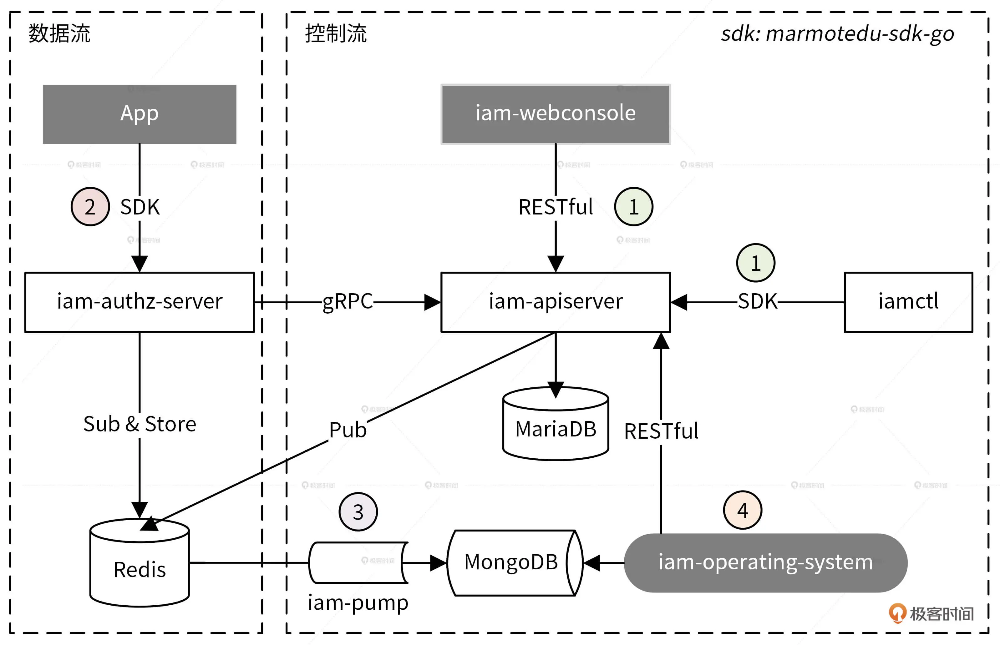
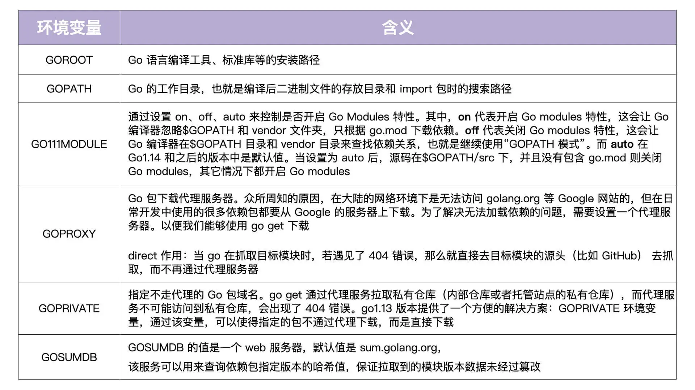

# Go构建企业级应用

## 开篇词 

### 从 0 开始搭建一个企业级 Go 应用

#### “云”是大势所趋，而 Go 是云时代的语言

最近几年，我发现腾讯很多团队的开发语言都在转 Go。其实，不光腾讯，像阿里、华为和百度这类国内一线大厂也都在积极转 Go。甚至不少团队，所有项目都是用 Go 构建的。伴随而来的，就是各个公司对 Go 研发工程师的需求越来越旺盛。那么， Go 为什么会变得这么火热呢？我认为，原因主要有两个方面。

<u>一方面，Go 是一门非常优秀的语言，它具有很多核心优势，例如：语言简单、语言层面支持并发编程、跨平台编译和自带垃圾回收机制等，这些优势是这些团队选择 Go 最根本的原因。</u>

<u>另一方面，也因为 Go 是云时代的语言。</u>为什么这么说呢？下面，我来详细说说。

随着云计算平台的逐渐成熟，应用上云已经成为一个不可逆转的趋势了，很多公司都选择将基础架构 / 业务架构云化，例如阿里、腾讯都在将公司内部业务全面云化。可以说，全面云化已经是公司层面的核心 KPI 了，我们甚至可以理解为以后所有的技术都会围绕着云来构建。

而云目前是朝着云原生架构的方向演进的，云原生架构中具有统治力（影响力）的项目绝大部分又是用 Go 构建的。我们从下面这张云[原生技术栈语言组成图](https://landscape.cncf.io/images/landscape.png)中可以看到，有 63% 的具有统治力的云原生项目都是用 Go 来构建的。

因此，想要把基础架构 / 业务架构云化，离不开对这些云原生开源项目的学习、改造。而一个团队为了节省成本，技术栈最好统一。既然我们一定要会 Go，而且 Go 这么优秀，那最好的方式就是将整个团队的语言技术栈 all in Go，这也是 Go 为什么重要的另一个原因了。

#### 学习 Go 项目开发面临哪些问题？

比如说，有个开发者写的代码依赖数据库连接，没法写单元测试。细问之后，我发现他参考的文章没有将数据库层跟业务层通过接口解耦。

再比如说，还有一些开发者开发的项目很难维护，项目中出现了大量的 common、util、const 这类 Go 包。只看包名，我完全不知道包所实现的功能，问了之后才发现他是参考了一个带有 dao、model、controller、service 目录的、不符合 Go 设计哲学的项目。

总的来说，我们在学习 Go 项目开发时会面临以下 4 大类问题。

1. 知识盲区：Go 项目开发会涉及很多知识点，但自己对这些知识点却一无所知。想要学习，却发现网上很多文章结构混乱、讲解不透彻。想要搜索一遍优秀的文章，又要花费很多时间，劳神劳力。
2. 学不到最佳实践，能力提升有限：网上有很多文章会介绍 Go 项目的构建方法，但很多都不是最佳实践，学完之后不能在能力和认知上带来最佳提升，还要自己花时间整理学习，事倍功半。
3. 不知道如何完整地开发一个 Go 项目：学了很多 Go 开发相关的知识点、构建方法，但都不体系、不全面、不深入。学完之后，自己并不能把它们有机结合成一个 Go 项目研发体系，真正开发的时候还是一团乱，效率也很低。
4. 缺乏一线项目练手，很难检验学习效果：为了避免闭门造车，我们肯定想学习一线大厂的大型项目构建和研发经验，来检验自己的学习成果，但自己平时又很难接触到，没有这样的学习途径。

#### 这个专栏是如何设计的？

《Go 语言项目开发实战》这个专栏又是如何解决上述问题的呢？在这个专栏里，我会围绕一个可部署、可运行的企业应用源码，为你详细讲解实际开发流程中会涉及的技能点，让你彻底学会如何构建企业级 Go 应用，并解决 Go 项目开发所面临的各类问题。

一方面，你能够从比较高的视野俯瞰整个 Go 企业应用开发流程，不仅知道一个优秀的企业应用涉及的技能点和开发工作，还能知道如何高效地完成每个阶段的开发工作。另一方面，你能够深入到每个技能点，掌握它们的具体构建方法、业界的最佳实践和一线开发经验。

最后我还想强调一点，除了以上内容，专栏最终还会交付给你一套优秀、可运行的企业应用代码。这套代码能够满足绝大部分的企业应用开发场景，你可以基于它做二次开发，快速构建起你的企业应用。

我按照开发顺序把它们总结在下面这张图中，图中包含了 Go 项目开发中大部分技能点。


为了让你更好地学习这门课程，我把整个专栏划分为了 6 个模块。其中，第 1 个模块是实战环境准备，第 2 到第 6 个模块我会带着你按照研发的流程来实际构建一个应用。

**实战准备**：我会先手把手带你准备一个实验环境，再带你部署我们的实战项目。加深你对实战项目的理解的同时，给你讲解一些部署的技能点，包括如何准备开发环境、制作 CA 证书，安装和配置用到的数据库、应用，以及 Shell 脚本编写技巧等。

**实战第 1 站**：规范设计：我会详细介绍开发中常见的 10 大规范，例如目录规范、日志规范、错误码规范、Commit 规范等。通过本模块，你能够学会如何设计常见的规范，为高效开发一个高质量、易阅读、易维护的 Go 应用打好基础。

**实战第 2 站**：基础功能设计或开发：我会教你设计或开发一些 Go 应用开发中的基础功能，这些功能会影响整个应用的构建方式，例如日志包、错误包、错误码等。

**实战第 3 站**：服务开发：我会带你一起解析一个企业级的 Go 项目代码，让你学会如何开发 Go 应用。在解析的过程中，我也会详细讲解 Go 开发阶段的各个技能点，例如怎么设计和开发 API 服务、Go SDK、客户端工具等。

**实战第 4 站**：服务测试：我会围绕实战项目来讲解进行单元测试、功能测试、性能分析和性能调优的方法，最终让你交付一个性能和稳定性都经过充分测试的、生产级可用的服务

**实战第 5 站**：服务部署：本模块通过实战项目的部署，来告诉你如何部署一个高可用、安全、具备容灾能力，又可以轻松水平扩展的企业应用。这里，我会重点介绍 2 种部署方式：传统部署方式和容器化部署方式，每种方式在部署方法、复杂度和能力上都有所不同。

这个专栏的代码，我都放在 GitHub 上，你可以点击[这个链接](https://github.com/marmotedu/iam)查看。

## 课前必学

### 1. IAM系统概述：我们要实现什么样的 Go 项目？

#### 项目背景：为什么选择 IAM 系统作为实战项目？

我们在做 Go 项目开发时，绕不开的一个话题是安全，如何保证 Go 应用的安全，是每个开发者都要解决的问题。虽然 Go 应用的安全包含很多方面，但大体可分为如下 2 类：

- 服务自身的安全：为了保证服务的安全，需要禁止非法用户访问服务。这可以通过服务器层面和软件层面来解决。服务器层面可以通过物理隔离、网络隔离、防火墙等技术从底层保证服务的安全性，软件层面可以通过 HTTPS、用户认证等手段来加强服务的安全性。服务器层面一般由运维团队来保障，软件层面则需要开发者来保障
- 服务资源的安全：服务内有很多资源，为了避免非法访问，开发者要避免 UserA 访问到 UserB 的资源，也即需要对资源进行授权。通常，我们可以通过资源授权系统来对资源进行授权。

总的来说，为了保障 Go 应用的安全，我们需要对访问进行认证，对资源进行授权。那么，我们要如何实现访问认证和资源授权呢？

认证功能不复杂，我们可以通过 JWT （JSON Web Token）认证来实现。授权功能比较复杂，授权功能的复杂性使得它可以囊括很多 Go 开发技能点。因此，在这个专栏中，我将认证和授权的功能实现升级为 IAM 系统，通过讲解它的构建过程，给你讲清楚 Go 项目开发的全部流程。

#### IAM 系统是什么？

IAM（Identity and Access Management，身份识别与访问管理）系统是用 Go 语言编写的一个 Web 服务，用于给第三方用户提供访问控制服务。

IAM 系统可以帮用户解决的问题是：在特定的条件下，谁能够 / 不能够对哪些资源做哪些操作（Who is able to do what on something given some context），也即完成资源授权功能。

那么，IAM 系统是如何进行资源授权的呢？下面，我们通过 IAM 系统的资源授权的流程，来看下它是如何工作的，整个过程可以分为 4 步。


1. 用户需要提供昵称、密码、邮箱、电话等信息注册并登录到 IAM 系统，这里是以用户名和密码作为唯一的身份标识来访问 IAM 系统，并且完成认证。
2. 因为访问 IAM 的资源授权接口是通过密钥（secretID/secretKey）的方式进行认证的，所以用户需要在 IAM 中创建属于自己的密钥资源。
3. 因为 IAM 通过授权策略完成授权，所以用户需要在 IAM 中创建授权策略。
4. 请求 IAM 提供的授权接口，IAM 会根据用户的请求内容和授权策略来决定一个授权请求是否被允许。

我们可以看到，在上面的流程中，IAM 使用到了 3 种系统资源：用户（User）、密钥（Secret）和策略（Policy），它们映射到程序设计中就是 3 种 RESTful 资源：

- 用户（User）：实现对用户的增、删、改、查、修改密码、批量修改等操作。
- 密钥（Secret）：实现对密钥的增、删、改、查操作。
- 策略（Policy）：实现对策略的增、删、改、查、批量删除操作。

#### IAM 系统的架构长啥样？

知道了 IAM 的功能之后，我们再来详细说说 IAM 系统的架构，架构图如下：


总的来说，IAM 架构中包括 9 大组件和 3 大数据库。我将这些组件和功能都总结在下面的表格中。这里面，我们主要记住 5 个核心组件，包括 iam-apiserver、iam-authz-server、iam-pump、marmotedu-sdk-go 和 iamctl 的功能，还有 3 个数据库 Redis、MySQL 和 MongoDB 的功能。


此外，IAM 系统为存储数据使用到的 3 种数据库的说明如下所示。


#### 通过使用流程理解架构

总的来说，我们可以通过 4 步去使用 IAM 系统的核心功能。

- 第 1 步，创建平台资源。

用户通过 iam-webconsole（RESTful API）或 iamctl（sdk marmotedu-sdk-go）客户端请求 iam-apiserver 提供的 RESTful API 接口完成用户、密钥、授权策略的增删改查，iam-apiserver 会将这些资源数据持久化存储在 MySQL 数据库中。而且，为了确保通信安全，客服端访问服务端都是通过 HTTPS 协议来访问的。

- 第 2 步，请求 API 完成资源授权。

用户可以通过请求 iam-authz-server 提供的 /v1/authz 接口进行资源授权，请求 /v1/authz 接口需要通过密钥认证，认证通过后 /v1/authz 接口会查询授权策略，从而决定资源请求是否被允许。

为了提高 /v1/authz 接口的性能，iam-authz-server 将密钥和策略信息缓存在内存中，以便实现快速查询。那密钥和策略信息是如何实现缓存的呢？

首先，iam-authz-server 通过调用 iam-apiserver 提供的 gRPC 接口，将密钥和授权策略信息缓存到内存中。同时，为了使内存中的缓存信息和 iam-apiserver 中的信息保持一致，当 iam-apiserver 中有密钥或策略被更新时，iam-apiserver 会往特定的 Redis Channel（iam-authz-server 也会订阅该 Channel）中发送 PolicyChanged 和 SecretChanged 消息。这样一来，当 iam-authz-server 监听到有新消息时就会获取并解析消息，根据消息内容判断是否需要重新调用 gRPC 接来获取密钥和授权策略信息，再更新到内存中

- 第 3 步，授权日志数据分析。

这里还有一点你要注意：iam-authz-server 将授权日志保存在 Redis 高性能 key-value 数据库中，可以最大化减少写入延时。不保存在内存中是因为授权日志量我们没法预测，当授权日志量很大时，很可能会将内存耗尽，造成服务中断。

- 第 4 步，运营平台授权数据展示。

iam-operating-system 是 IAM 的运营系统，它可以通过查询 MongoDB 获取并展示运营数据，比如某个用户的授权 / 失败次数、授权失败时的授权信息等。此外，我们也可以通过 iam-operating-system 调用 iam-apiserver 服务来做些运营管理工作。比如，以上帝视角查看某个用户的授权策略供排障使用，或者调整用户可创建密钥的最大个数，再或者通过白名单的方式，让某个用户不受密钥个数限制的影响等等。

#### IAM 软件架构模式

在设计软件时，我们首先要做的就是选择一种软件架构模式，它对软件后续的开发方式、软件维护成本都有比较大的影响。因此，这里我也会和你简单聊聊 2 种最常用的软件架构模式，分别是前后端分离架构和 MVC 架构。

##### 前后端分离架构

因为 IAM 系统采用的就是前后端分离的架构，所以我们就以 IAM 的运营系统 iam-operating-system 为例来详细说说这个架构。一般来说，运营系统的功能可多可少，对于一些具有复杂功能的运营系统，我们可以采用前后端分离的架构。其中，前端负责页面的展示以及数据的加载和渲染，后端只负责返回前端需要的数据。

iam-operating-system 前后端分离架构如下图所示。


采用了前后端分离架构之后，当你通过浏览器请求前端 ops-webconsole 时，ops-webconsole 会先请求静态文件服务器加载静态文件，比如 HTML、CSS 和 JavaScript，然后它会执行 JavaScript，通过负载均衡请求后端数据，最后把后端返回的数据渲染到前端页面中。

采用前后端分离的架构，让前后端通过 RESTful API 通信，会带来以下 5 点好处：
- 可以让前、后端人员各自专注在自己业务的功能开发上，让专业的人做专业的事，来提高代码质量和开发效率
- 前后端可并行开发和发布，这也能提高开发和发布效率，加快产品迭代速度
- 前后端组件、代码分开，职责分明，可以增加代码的维护性和可读性，减少代码改动引起的 Bug 概率，同时也能快速定位 Bug
- 前端 JavaScript 可以处理后台的数据，减少对后台服务器的压力
- 可根据需要选择性水平扩容前端或者后端来节约成本

##### MVC 架构

但是，如果运营系统功能比较少，采用前后端分离框架的弊反而大于利，比如前后端分离要同时维护 2 个组件会导致部署更复杂，并且前后端分离将人员也分开了，这会增加一定程度的沟通成本。同时，因为代码中也需要实现前后端交互的逻辑，所以会引入一定的开发量。

这个时候，我们可以尝试直接采用 MVC 软件架构，MVC 架构如下图所示。


MVC 的全名是 Model View Controller，它是一种架构模式，分为 Model、View、Controller 三层，每一层的功能如下：

- View（视图）：提供给用户的操作界面，用来处理数据的显示。
- Controller（控制器）：根据用户从 View 层输入的指令，选取 Model 层中的数据，然后对其进行相应的操作，产生最终结果。
- Model（模型）：应用程序中用于处理数据逻辑的部分。

MVC 架构的好处是通过控制器层将视图层和模型层分离之后，当更改视图层代码后时，我们就不需要重新编译控制器层和模型层的代码了。同样，如果业务流程发生改变也只需要变更模型层的代码就可以。在实际开发中为了更好的 UI 效果，视图层需要经常变更，但是通过 MVC 架构，在变更视图层时，我们根本不需要对业务逻辑层的代码做任何变化，这不仅减少了风险还能提高代码变更和发布的效率。

除此之外，还有一种跟 MVC 比较相似的软件开发架构叫三层架构，它包括 UI 层、BLL 层和 DAL 层。其中，UI 层表示用户界面，BLL 层表示业务逻辑，DAL 层表示数据访问。在实际开发中很多人将 MVC 当成三层架构在用，比如说，很多人喜欢把软件的业务逻辑放在 Controller 层里，将数据库访问操作的代码放在 Model 层里，软件最终的代码放在 View 层里，就这样硬生生将 MVC 架构变成了伪三层架构。

这种代码不仅不伦不类，同时也失去了三层架构和 MVC 架构的核心优势，也就是：通过 Controller 层将 Model 层和 View 层解耦，从而使代码更容易维护和扩展。因此在实际开发中，我们也要注意遵循 MVC 架构的开发规范，发挥 MVC 的核心价值。

### 2.环境准备:如何安装和配置一个基本的 Go 开发环境

上一讲我们讲了 IAM 系统的功能和架构，接下来的两讲，我们就将它部署到你的服务器上。不过，在正式部署之前，我们还需要准备一个 Go 开发环境，这是因为我们是通过编译源码来获取部署需要的二进制文件的。

想要配置一个 Go 开发环境，我们可以通过以下 4 步实现：

1. Linux 服务器申请和配置
2. 依赖安装和配置
3. Go 编译环境安装和配置
4. Go 开发 IDE 安装和配置

#### Linux 服务器申请和配置

毫无疑问，要安装一个 Go 开发环境，你首先需要有一个 Linux 服务器。Linux 服务器有很多操作系统可供选择，例如：CentOS、Ubuntu、RHEL、Debian 等，但目前生产环境用得最多的还是 CentOS 系统，为了跟生产环境保持一致，我们选择当前最新的 CentOS 版本：CentOS 8.2。

因为本专栏的所有操作都是在 CentOS 8.2 系统上进行的，为了避免环境不一致导致的操作失败，我建议你也使用 CentOS 8.2。安装一个 Linux 服务器需要两步：服务器申请和配置。

##### Linux 服务器申请

我们可以通过以下 3 种方式来安装一个 CentOS 8.2 系统。

1. 在物理机上安装一个 CentOS 8.2 系统。
2. 在 Windows/MacBook 上安装虚拟机管理软件，用虚拟机管理软件创建 CentOS 8.2 虚拟机。其中，Windows 建议用 VMWare Workstation 来创建虚拟机，MacBook 建议用 VirtualBox 来创建虚拟机。
3. 在诸如腾讯云、阿里云、华为云等平台上购买一个虚拟机，并预装 CentOS 8.2 系统。

##### Linux 服务器配置

申请完 Linux 服务之后，我们需要通过 SecureCRT 或 Xshell 等工具登录 Linux 服务器，并对服务器做一些简单必要的配置，包括创建普通用户、添加 sudoers、配置 $HOME/.bashrc 文件。接下来，我们一一来说。

- 第一步，用 Root 用户登录 Linux 系统，并创建普通用户。

一般来说，一个项目会由多个开发人员协作完成，为了节省企业成本，公司不会给每个开发人员都配备一台服务器，而是让所有开发人员共用一个开发机，通过普通用户登录开发机进行开发。因此，为了模拟真实的企业开发环境，我们也通过一个普通用户的身份来进行项目的开发，创建方法如下：
```bash
# useradd going # 创建 going 用户，通过 going 用户登录开发机进行开发
# passwd going # 设置密码
Changing password for user going.
New password:
Retype new password:
passwd: all authentication tokens updated successfully.
```
不仅如此，使用普通用户登录和操作开发机也可以保证系统的安全性，这是一个比较好的习惯，所以我们在日常开发中也要尽量避免使用 Root 用户。

- 第二步，添加 sudoers。

我们知道很多时候，普通用户也要用到 Root 的一些权限，但 Root 用户的密码一般是由系统管理员维护并定期更改的，每次都向管理员询问密码又很麻烦。因此，我建议你将普通用户加入到 sudoers 中，这样普通用户就可以通过 sudo 命令来暂时获取 Root 的权限。具体来说，你可以执行如下命令添加：
```bash
# sed -i '/^root.*ALL=(ALL).*ALL/a\going\tALL=(ALL) \tALL' /etc/sudoers
```

- 第三步，用新的用户名（going）和密码登录 Linux 服务器。这一步也可以验证普通用户是否创建成功。
- 第四步，配置 $HOME/.bashrc 文件。

我们登录新服务器后的第一步就是配置 $HOME/.bashrc 文件，以使 Linux 登录 shell 更加易用，例如配置 LANG 解决中文乱码，配置 PS1 可以避免整行都是文件路径，并将 $HOME/bin 加入到 PATH 路径中。配置后的内容如下：
```bash
# .bashrc
 
# User specific aliases and functions
 
alias rm='rm -i'
alias cp='cp -i'
alias mv='mv -i'
 
# Source global definitions
if [ -f /etc/bashrc ]; then
        . /etc/bashrc
fi
 
# User specific environment
# Basic envs
export LANG="en_US.UTF-8" # 设置系统语言为 en_US.UTF-8，避免终端出现中文乱码
export PS1='[\u@dev \W]\$ ' # 默认的 PS1 设置会展示全部的路径，为了防止过长，这里只展示："用户名@dev 最后的目录名"
export WORKSPACE="$HOME/workspace" # 设置工作目录
export PATH=$HOME/bin:$PATH # 将 $HOME/bin 目录加入到 PATH 变量中
 
# Default entry folder
cd $WORKSPACE # 登录系统，默认进入 workspace 目录
```
有一点需要我们注意，在 export PATH 时，最好把 $PATH 放到最后，因为我们添加到目录中的命令是期望被优先搜索并使用的。配置完 $HOME/.bashrc 后，我们还需要创建工作目录 workspace。将工作文件统一放在 $HOME/workspace 目录中，有几点好处:

可以使我们的$HOME目录保持整洁，便于以后的文件查找和分类;如果哪一天 /分区空间不足，可以将整个 workspace 目录 mv 到另一个分区中，并在 /分区中保留软连接，例如：/home/going/workspace -> /data/workspace/;如果哪天想备份所有的工作文件，可以直接备份 workspace

具体的操作指令是$ mkdir -p $HOME/workspace。配置好 $HOME/.bashrc 文件后，我们就可以执行 bash 命令将配置加载到当前 shell 中了。

至此，我们就完成了 Linux 开发机环境的申请及初步配置。

#### 依赖安装和配置

在 Linux 系统上安装 IAM 系统会依赖一些 RPM 包和工具，有些是直接依赖，有些是间接依赖。为了避免后续的操作出现依赖错误，例如，因为包不存在而导致的编译、命令执行错误等，我们先统一依赖安装和配置。安装和配置步骤如下

1. 第一步，安装依赖。

首先，我们在 CentOS 系统上通过 yum 命令来安装所需工具的依赖，安装命令如下：
```bash
$ sudo yum -y install make autoconf automake cmake perl-CPAN libcurl-devel libtool gcc gcc-c++ glibc-headers zlib-devel git-lfs telnet ctags lrzsz jq expat-devel openssl-devel
```
虽然有些 CentOS 8.2 系统已经默认安装这些依赖了，但是为了确保它们都能被安装，我仍然会尝试安装一遍。如果系统提示 Package xxx is already installed.，说明已经安装好了，你直接忽略即可。

2. 第二步，安装 Git。

因为安装 IAM 系统、执行 go get 命令、安装 protobuf 工具等都是通过 Git 来操作的，所以接下来我们还需要安装 Git。由于低版本的 Git 不支持--unshallow 参数，而 go get 在安装 Go 包时会用到 git fetch --unshallow 命令，因此我们要确保安装一个高版本的 Git，具体的安装方法如下：
```bash

$ cd /tmp
$ wget https://mirrors.edge.kernel.org/pub/software/scm/git/git-2.30.2.tar.gz
$ tar -xvzf git-2.30.2.tar.gz
$ cd git-2.30.2/
$ ./configure
$ make
$ sudo make install
$ git --version          # 输出 git 版本号，说明安装成功
git version 2.30.2
```
注意啦，按照上面的步骤安装好之后，我们要把 Git 的二进制目录添加到 PATH 路径中，不然 Git 可能会因为找不到一些命令而报错。你可以通过执行以下命令添加目录：
```bash
tee -a $HOME/.bashrc <<'EOF' # tee -a 打开文件写并将内容打印到屏幕，输入EOF结束
# Configure for git
export PATH=/usr/local/libexec/git-core:$PATH
EOF
```

3. 第三步，配置 Git。我们直接执行如下命令配置 Git：

```bash
$ git config --global user.name "Lingfei Kong"    # 用户名改成自己的
$ git config --global user.email "colin404@foxmail.com"    # 邮箱改成自己的
$ git config --global credential.helper store    # 设置 Git，保存用户名和密码
$ git config --global core.longpaths true # 解决 Git 中 'Filename too long' 的错误
```
除了按照上述步骤配置 Git 之外，我们还有几点需要注意。

首先，在 Git 中，我们会把非 ASCII 字符叫做 Unusual 字符。这类字符在 Git 输出到终端的时候默认是用 8 进制转义字符输出的（以防乱码），但现在的终端多数都支持直接显示非 ASCII 字符，所以我们可以关闭掉这个特性，具体的命令如下：
```bash
$ git config --global core.quotepath off
```
其次，如果你觉得访问 github.com 太慢，可以通过国内 GitHub 镜像网站来访问，配置方法如下：
```bash
$ git config --global url."https://github.com.cnpmjs.org/".insteadOf "https://github.com/"
```
这里你要注意，通过镜像网站访问仅对 HTTPS 协议生效，对 SSH 协议不生效，并且 github.com.cnpmjs.org 的同步时间间隔为 1 天。

最后，GitHub 限制最大只能克隆 100M 的单个文件，为了能够克隆大于 100M 的文件，我们还需要安装 Git Large File Storage，安装方式如下：
```bash
$ git lfs install --skip-repo
```
好啦，现在我们就完成了依赖的安装和配置。

#### Go 编译环境安装和配置

我们知道，Go 是一门编译型语言，所以在部署 IAM 系统之前，我们需要将代码编译成可执行的二进制文件。因此我们需要安装 Go 编译环境。

除了 Go，我们也会用 gRPC 框架展示 RPC 通信协议的用法，所以我们也需要将 ProtoBuf 的.proto 文件编译成 Go 语言的接口。因此，我们也需要安装 ProtoBuf 的编译环境。

安装 Go 语言相对来说比较简单，我们只需要下载源码包、设置相应的环境变量即可。

首先，我们从 Go 语言官方网站下载对应的 Go 安装包以及源码包，这里我下载的是 go1.17.2 版本：
```bash
$ wget https://golang.google.cn/dl/go1.17.2.linux-amd64.tar.gz -O /tmp/go1.17.2.linux-amd64.tar.gz
```
接着，我们完成解压和安装，命令如下：
```bash
$ mkdir -p $HOME/go
$ tar -xvzf /tmp/go1.17.2.linux-amd64.tar.gz -C $HOME/go
$ mv $HOME/go/go $HOME/go/go1.17.2
```
最后，我们执行以下命令，将下列环境变量追加到$HOME/.bashrc 文件中。
```bash
tee -a $HOME/.bashrc <<'EOF'
# Go envs
export GOVERSION=go1.17.2 # Go 版本设置
export GO_INSTALL_DIR=$HOME/go # Go 安装目录
export GOROOT=$GO_INSTALL_DIR/$GOVERSION # GOROOT 设置
export GOPATH=$WORKSPACE/golang # GOPATH 设置
export PATH=$GOROOT/bin:$GOPATH/bin:$PATH # 将 Go 语言自带的和通过 go install 安装的二进制文件加入到 PATH 路径中
export GO111MODULE="on" # 开启 Go moudles 特性
export GOPROXY=https://goproxy.cn,direct # 安装 Go 模块时，代理服务器设置
export GOPRIVATE=
export GOSUMDB=off # 关闭校验 Go 依赖包的哈希值
EOF
```
为什么要增加这么多环境变量呢？这是因为，Go 语言是通过一系列的环境变量来控制 Go 编译器行为的。因此，我们一定要理解每一个环境变量的含义。


因为 Go 以后会用 Go modules 来管理依赖，所以我建议你将 GO111MODULE 设置为 on。

在使用模块的时候，$GOPATH 是无意义的，不过它还是会把下载的依赖储存在 $GOPATH/pkg/mod 目录中，也会把 go install 的二进制文件存放在 $GOPATH/bin 目录中。

另外，我们还要将$GOPATH/bin、$GOROOT/bin 加入到 Linux 可执行文件搜索路径中。这样一来，我们就可以直接在 bash shell 中执行 go 自带的命令，以及通过 go install 安装的命令。

最后就是进行测试了，如果我们执行 go version 命令可以成功输出 Go 的版本，就说明 Go 编译环境安装成功。具体的命令如下：
```bash
$ bash
$ go version
go version go1.17.2 linu x/amd64
```

##### ProtoBuf 编译环境安装

接着，我们再来安装 protobuf 的编译器 protoc。protoc 需要 protoc-gen-go 来完成 Go 语言的代码转换，因此我们需要安装 protoc 和 protoc-gen-go 这 2 个工具。它们的安装方法比较简单，你直接看我下面给出的代码和操作注释就可以了。
```bash
# 第一步：安装 protobuf
$ cd /tmp/
$ git clone --depth=1 https://github.com/protocolbuffers/protobuf
$ cd protobuf
$ ./autogen.sh
$ ./configure
$ make
$ sudo make install
$ protoc --version # 查看 protoc 版本，成功输出版本号，说明安装成功
libprotoc 3.15.6

# 第二步：安装 protoc-gen-go
$ go get -u github.com/golang/protobuf/protoc-gen-go

```
当你第一次执行 go get 命令的时候，因为本地无缓存，所以需要下载所有的依赖模块。因此安装速度会比较慢，请你耐心等待。

#### Go 开发 IDE 安装和配置

编译环境准备完之后，我们还需要一个代码编辑器才能开始 Go 项目开发，并且为了提高开发效率，我们需要将这个编辑器配置成 Go IDE。

目前，GoLand、VSCode 这些 IDE 都很优秀，我们使用的也很多，但它们都是 Windows 系统下的 IDE。因此，在 Linux 环境下我们可以选择将 Vim 配置成 Go IDE，熟悉 Vim IDE 的操作之后，它的开发效率不输 GoLand 和 VSCode。

如说，我们可以通过 SpaceVim 将 Vim 配置成一个 Go IDE。SpaceVim 是一个社区驱动的模块化的 Vim IDE，以模块的方式组织管理插件以及相关配置， 为不同的语言开发量身定制了相关的开发模块，该模块提供代码自动补全、 语法检查、格式化、调试、REPL 等特性。我们只需要载入相关语言的模块就能得到一个开箱即用的 Vim IDE 了。

Vim 可以选择 NeoVim，NeoVim 是基于 Vim 的一个 fork 分支，它主要解决了 Vim8 之前版本中的异步执行、开发模式等问题，对 Vim 的兼容性很好。同时对 vim 的代码进行了大量地清理和重构，去掉了对老旧系统的支持，添加了新的特性。

虽然 Vim8 后来也新增了异步执行等特性，在使用层面两者差异不大，但是 NeoVim 开发更激进，新特性更多，架构也相对更合理，所以我选择了 NeoVim，你也可以根据个人爱好来选择（都是很优秀的编辑器，这里不做优缺点比较）。Vim IDE 的安装和配置主要分五步。

1. 第一步，安装 NeoVim。我们直接执行 pip3 和 yum 命令安装即可，安装方法如下：
```bash
$ sudo pip3 install pynvim
$ sudo yum -y install neovim
```

2. 第二步，配置 $HOME/.bashrc。先配置 nvim 的别名为 vi，这样当我们执行 vi 时，Linux 系统就会默认调用 nvim。同时，配置 EDITOR 环境变量可以使一些工具，例如 Git 默认使用 nvim。配置方法如下：
```bash
tee -a $HOME/.bashrc <<'EOF'
# Configure for nvim
export EDITOR=nvim # 默认的编辑器（git 会用到）
alias vi="nvim"
EOF
```

3. 第三步，检查 nvim 是否安装成功。我们可以通过查看 NeoVim 版本来确认是否成功安装，如果成功输出版本号，说明 NeoVim 安装成功。
```bash
$ bash
$ vi --version # 输出 NVIM v0.3.8 说明安装成功
NVIM v0.3.8
Build type: RelWithDebInfo
...
```

4. 第四步，离线安装 SpaceVim。安装 SpaceVim 步骤稍微有点复杂，为了简化你的安装，同时消除网络的影响，我将安装和配置 SpaceVim 的步骤做成了一个离线安装包 [marmotVim](https://github.com/marmotedu/marmotVim) 。marmotVim 可以进行 SpaceVim 的安装、卸载、打包等操作，安装步骤如下：
```bash
$ cd /tmp
$ wget https://marmotedu-1254073058.cos.ap-beijing.myqcloud.com/tools/marmotVim.tar.gz
$ tar -xvzf marmotVim.tar.gz
$ cd marmotVim
$ ./marmotVimCtl install
```
SpaceVim 配置文件为：$HOME/.SpaceVim.d/init.toml 和$HOME/.SpaceVim.d/autoload/custom_init.vim，你可自行配置（配置文件中有配置说明）：

init.toml：SpaceVim 的配置文件;custom_init.vim：兼容 vimrc，用户自定义的配置文件

SpaceVim Go IDE 常用操作的按键映射如下表所示：


5. 第五步，Go 工具安装。

SpaceVim 会用到一些 Go 工具，比如在函数跳转时会用到 guru、godef 工具，在格式化时会用到 goimports，所以我们也需要安装这些工具。安装方法有 2 种：

Vim 底线命令安装：vi test.go，然后执行：:GoInstallBinaries 安装。;拷贝工具：直接将整理好的工具文件拷贝到$GOPATH/bin 目录下。

为了方便，你可以直接拷贝我已经打包好的 Go 工具到指定目录下：
```bash
$ cd /tmp
$ wget https://marmotedu-1254073058.cos.ap-beijing.myqcloud.com/tools/gotools-for-spacevim.tgz
$ mkdir -p $GOPATH/bin
$ tar -xvzf gotools-for-spacevim.tgz -C $GOPATH/bin
```

#### 总结

这一讲，我们一起安装和配置了一个 Go 开发环境，为了方便你回顾，我将安装和配置过程绘制成了一个流程图，如下所示。


### 3. 项目部署：如何快速部署 IAM 系统

上一讲，我们一起安装和配置了一个基本的 Go 开发环境。这一讲，我就来教你怎么在它的基础上，快速部署好 IAM 系统。

总的来说，我把部署过程分成 2 大步。

1. 安装和配置数据库：我们需要安装和配置 MariaDB、Redis 和 MongoDB。
2. 安装和配置 IAM 服务：我们需要安装和配置 iam-apiserver、iam-authz-server、iam-pump、iamctl 和 man 文件。

当然啦，如果你实在不想这么麻烦地去安装，我也在这一讲的最后给出了一键部署 IAM 系统的方法，但我还是希望你能按照我今天讲的详细步骤来操作。


