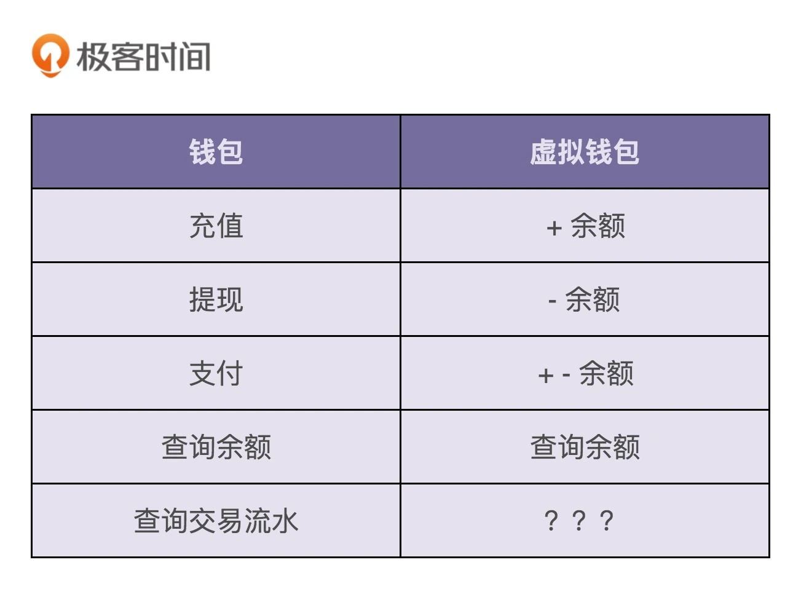
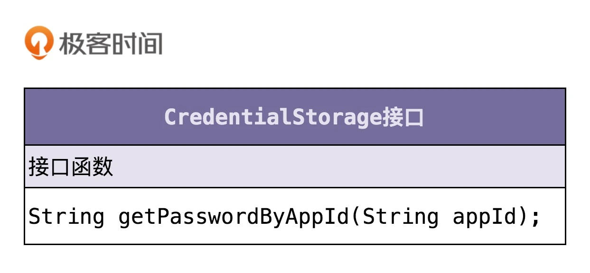
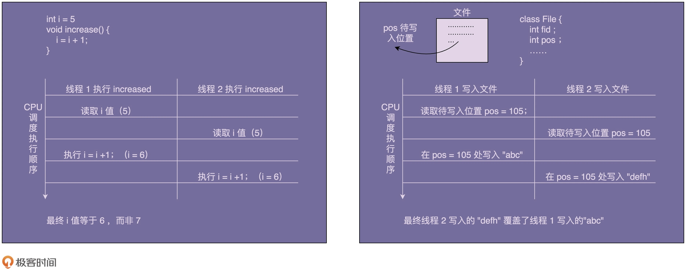
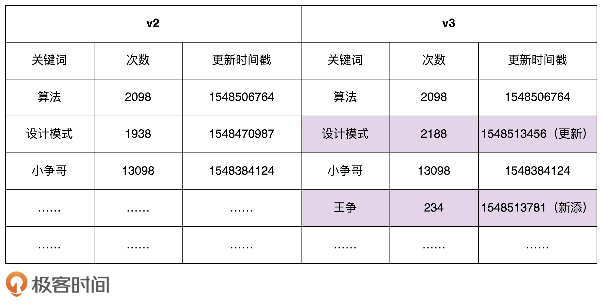
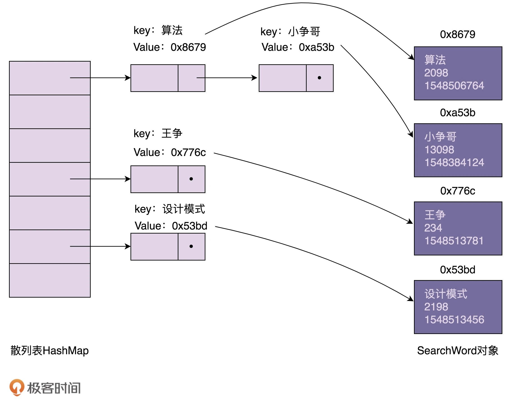

# 编写高质量代码

## 设计原则与思想：面向对象
### 面向对象在谈论什么？
#### 什么是面向对象编程和面向对象编程语言？
面向对象编程的英文缩写是 OOP，全称是 Object Oriented Programming。对应地，面向对象编程语言的英文缩写是 OOPL，全称是 Object Oriented Programming Language。
> 面向对象编程是一种编程范式或编程风格。它以**类或对象**作为组织代码的基本单元，并将封装、抽象、继承、多态四个特性，作为代码设计和实现的基石 。

> 面向对象编程语言是支持类或对象的语法机制，并有现成的语法机制，能方便地实现面向对象编程四大特性（封装、抽象、继承、多态）的编程语言。
#### 什么是面向对象分析和面向对象设计？
面向对象分析英文缩写是 OOA，全称是 Object Oriented Analysis；面向对象设计的英文缩写是 OOD，全称是 Object Oriented Design。OOA、OOD、OOP 三个连在一起就是面向对象分析、设计、编程（实现），正好是面向对象软件开发要经历的三个阶段。

面向对象分析就是要搞清楚做什么，面向对象设计就是要搞清楚怎么做。两个阶段最终的产出是类的设计，包括程序被拆解为哪些类，每个类有哪些属性方法、类与类之间如何交互等等。

### 封装、抽象、继承、多态分别可以解决哪些编程问题？
#### 封装
封装也叫数据访问保护。类通过暴露有限的访问接口，授权外部仅能通过类提供的方式来访问内部信息或者数据。它需要编程语言提供权限访问控制语法来支持，例如 Java 中的 private、protected、public 关键字。

封装特性存在的意义，一方面是保护数据不被随意修改，提高代码的可维护性；另一方面是仅暴露有限的必要接口，提高类的易用性。
#### 抽象
抽象就是讲如何隐藏方法的具体实现，让使用者只需要关心方法提供了哪些功能，不需要知道这些功能是如何实现的。抽象可以通过接口类或者抽象类来实现，但也并不需要特殊的语法机制来支持。

抽象存在的意义，一方面是提高代码的可扩展性、维护性，修改实现不需要改变定义，减少代码的改动范围；另一方面，它也是处理复杂系统的有效手段，能有效地过滤掉不必要关注的信息。
#### 继承
继承是用来表示类之间的 is-a 关系，分为两种模式：单继承和多继承。单继承表示一个子类只继承一个父类，多继承表示一个子类可以继承多个父类。为了实现继承这个特性，编程语言需要提供特殊的语法机制来支持。

继承主要是用来解决代码复用的问题。
#### 多态
多态是指子类可以替换父类，在实际的代码运行过程中，调用子类的方法实现。多态这种特性也需要编程语言提供特殊的语法机制来实现，比如继承、接口类、duck-typing。

多态可以提高代码的扩展性和复用性，是很多设计模式、设计原则、编程技巧的代码实现基础。

### 面向对象与面向过程对比
#### 什么是面向过程编程与面向过程编程语言？
类比面向对象编程与面向对象编程语言的定义，对于面向过程编程和面向过程编程语言这两个概念:
> 面向过程编程也是一种编程范式或编程风格。它以过程（可以理解为方法、函数、操作）作为组织代码的基本单元，以数据（可以理解为成员变量、属性）与方法相分离为最主要的特点。面向过程风格是一种流程化的编程风格，通过拼接一组顺序执行的方法来操作数据完成一项功能。

> 面向过程编程语言首先是一种编程语言。它最大的特点是不支持类和对象两个语法概念，不支持丰富的面向对象编程特性（比如继承、多态、封装），仅支持面向过程编程。

定义不是很严格，也比较抽象，所以，我再用一个例子进一步解释一下。假设我们有一个记录了用户信息的文本文件 users.txt，每行文本的格式是 name&age&gender（比如，小王 &28& 男）。我们希望写一个程序，从 users.txt 文件中逐行读取用户信息，然后格式化成 name\tage\tgender（其中，\t 是分隔符）这种文本格式，并且按照 age 从小到大排序之后，重新写入到另一个文本文件 formatted_users.txt 中。针对这样一个小程序的开发，我们一块来看看，用面向过程和面向对象两种编程风格，编写出来的代码有什么不同。

首先，我们先来看，用面向过程这种编程风格写出来的代码是什么样子的。注意，下面的代码是用 C 语言这种面向过程的编程语言来编写的。
```c
struct User {
  char name[64];
  int age;
  char gender[16];
};

struct User parse_to_user(char* text) {
  // 将text(“小王&28&男”)解析成结构体struct User
}

char* format_to_text(struct User user) {
  // 将结构体struct User格式化成文本（"小王\t28\t男"）
}

void sort_users_by_age(struct User users[]) {
  // 按照年龄从小到大排序users
}

void format_user_file(char* origin_file_path, char* new_file_path) {
  // open files...
  struct User users[1024]; // 假设最大1024个用户
  int count = 0;
  while(1) { // read until the file is empty
    struct User user = parse_to_user(line);
    users[count++] = user;
  }
  
  sort_users_by_age(users);
  
  for (int i = 0; i < count; ++i) {
    char* formatted_user_text = format_to_text(users[i]);
    // write to new file...
  }
  // close files...
}

int main(char** args, int argv) {
  format_user_file("/home/zheng/user.txt", "/home/zheng/formatted_users.txt");
}
```
然后，我们再来看，用面向对象这种编程风格写出来的代码是什么样子的。注意，下面的代码是用 Java 这种面向对象的编程语言来编写的。
```c

 public class User {
  private String name;
  private int age;
  private String gender;
  
  public User(String name, int age, String gender) {
    this.name = name;
    this.age = age;
    this.gender = gender;
  }
  
  public static User praseFrom(String userInfoText) {
    // 将text(“小王&28&男”)解析成类User
  }
  
  public String formatToText() {
    // 将类User格式化成文本（"小王\t28\t男"）
  }
}

public class UserFileFormatter {
  public void format(String userFile, String formattedUserFile) {
    // Open files...
    List users = new ArrayList<>();
    while (1) { // read until file is empty 
      // read from file into userText...
      User user = User.parseFrom(userText);
      users.add(user);
    }
    // sort users by age...
    for (int i = 0; i < users.size(); ++i) {
      String formattedUserText = user.formatToText();
      // write to new file...
    }
    // close files...
  }
}

public class MainApplication {
  public static void main(String[] args) {
    UserFileFormatter userFileFormatter = new UserFileFormatter();
    userFileFormatter.format("/home/zheng/users.txt", "/home/zheng/formatted_users.txt");
  }
}
```
我们可以看出，面向过程和面向对象最基本的区别就是，代码的组织方式不同。**面向过程风格的代码被组织成了一组方法集合及其数据结构（struct User），方法和数据结构的定义是分开的。面向对象风格的代码被组织成一组类，方法和数据结构被绑定一起，定义在类中。**
#### 面向对象编程相比面向过程编程有哪些优势？
- 对于大规模复杂程序的开发，程序的处理流程并非单一的一条主线，而是错综复杂的网状结构。
- 面向对象编程比起面向过程编程，更能应对这种复杂类型的程序开发。面向对象编程相比面向过程编程，具有更加丰富的特性（封装、抽象、继承、多态）。利用这些特性编写出来的代码，更加易扩展、易复用、易维护。
- 从编程语言跟机器打交道的方式的演进规律中，我们可以总结出：面向对象编程语言比起面向过程编程语言，更加人性化、更加高级、更加智能。

### 哪些代码设计看似是面向对象，实际是面向过程?
#### 1.滥用 getter、setter 方法
在设计实现类的时候，除非真的需要，否则尽量不要给属性定义 setter 方法。除此之外，尽管 getter 方法相对 setter 方法要安全些，但是如果返回的是集合容器，那也要防范集合内部数据被修改的风险。
#### 2.Constants 类、Utils 类的设计问题
对于这两种类的设计，我们尽量能做到职责单一，定义一些细化的小类，比如 RedisConstants、FileUtils，而不是定义一个大而全的 Constants 类、Utils 类。除此之外，如果能将这些类中的属性和方法，划分归并到其他业务类中，那是最好不过的了，能极大地提高类的内聚性和代码的可复用性。
> Util类，一般是无状态的，**只包含静态方法**。使用时无需创建类的实例。
> Helper类，可以有状态（类的成员变量），**一般需要创建实例才能使用**。
#### 3.基于贫血模型的开发模式
传统的 MVC 结构分为 Model 层、Controller 层、View 层这三层。不过，在做前后端分离之后，三层结构在后端开发中，会稍微有些调整，被分为 Controller 层、Service 层、Repository 层。Controller 层负责暴露接口给前端调用，Service 层负责核心业务逻辑，Repository 层负责数据读写。而在每一层中，我们又会定义相应的 VO（View Object）、BO（Business Object）、Entity。一般情况下，VO、BO、Entity 中只会定义数据，不会定义方法，所有操作这些数据的业务逻辑都定义在对应的 Controller 类、Service 类、Repository 类中。这就是典型的面向过程的编程风格。

实际上，这种开发模式叫作基于贫血模型的开发模式，也是我们现在非常常用的一种 Web 项目的开发模式。

<u>因为数据和操作是分开定义在 VO/BO/Entity 和 Controler/Service/Repository 中的。</u>今天，你只需要掌握这一点就可以了。为什么这种开发模式如此流行？如何规避面向过程编程的弊端？有没有更好的可替代的开发模式？相关的更多问题，我们在面向对象实战篇中会一一讲解。

### 接口和抽象类的区别?
#### 1. 抽象类和接口的语法特性
抽象类不允许被实例化，只能被继承。它可以包含属性和方法。方法既可以包含代码实现，也可以不包含代码实现。不包含代码实现的方法叫作抽象方法。子类继承抽象类，必须实现抽象类中的所有抽象方法。

接口不能包含属性，只能声明方法，方法不能包含代码实现。类实现接口的时候，必须实现接口中声明的所有方法。
#### 2. 抽象类和接口存在的意义
抽象类是对成员变量和方法的抽象，是一种 is-a 关系，是为了解决代码复用问题。接口仅仅是对方法的抽象，是一种 has-a 关系，表示具有某一组行为特性，是为了解决解耦问题，隔离接口和具体的实现，提高代码的扩展性。

#### 3. 抽象类和接口的应用场景区别
什么时候该用抽象类？什么时候该用接口？实际上，判断的标准很简单。如果要表示一种 is-a 的关系，并且是为了解决代码复用问题，我们就用抽象类；如果要表示一种 has-a 关系，并且是为了解决抽象而非代码复用问题，那我们就用接口。

### 基于接口而非实现编程？
#### 基于接口而非实现编程。这个原则非常重要，是一种非常有效的提高代码质量的手段，在平时的开发中特别经常被用到。（养成习惯，先写接口，再写实现）
1. “基于接口而非实现编程”，这条原则的另一个表述方式，是“基于抽象而非实现编程”。后者的表述方式其实更能体现这条原则的设计初衷。我们在做软件开发的时候，一定要有抽象意识、封装意识、接口意识。越抽象、越顶层、越脱离具体某一实现的设计，越能提高代码的灵活性、扩展性、可维护性。
2. 我们在定义接口的时候，一方面，命名要足够通用，不能包含跟具体实现相关的字眼；另一方面，与特定实现有关的方法不要定义在接口中。
3. “基于接口而非实现编程”这条原则，不仅仅可以指导非常细节的编程开发，还能指导更加上层的架构设计、系统设计等。比如，服务端与客户端之间的“接口”设计、类库的“接口”设计。

### 多用组合少用继承？
#### 为什么不推荐使用继承？
继承是面向对象的四大特性之一，用来表示类之间的 is-a 关系，可以解决代码复用的问题。虽然继承有诸多作用，但继承层次过深、过复杂，也会影响到代码的可维护性。所以，对于是否应该在项目中使用继承，网上有很多争议。很多人觉得继承是一种反模式，应该尽量少用，甚至不用。为什么会有这样的争议？我们通过一个例子来解释一下。

假设我们要设计一个关于鸟的类。我们将“鸟类”这样一个抽象的事物概念，定义为一个抽象类 AbstractBird。所有更细分的鸟，比如麻雀、鸽子、乌鸦等，都继承这个抽象类。我们知道，大部分鸟都会飞，那我们可不可以在 AbstractBird 抽象类中，定义一个 fly() 方法呢？答案是否定的。尽管大部分鸟都会飞，但也有特例，比如鸵鸟就不会飞。鸵鸟继承具有 fly() 方法的父类，那鸵鸟就具有“飞”这样的行为，这显然不符合我们对现实世界中事物的认识。当然，你可能会说，我在鸵鸟这个子类中重写（override）fly() 方法，让它抛出 UnSupportedMethodException 异常不就可以了吗？具体的代码实现如下所示:
```java

public class AbstractBird {
  //...省略其他属性和方法...
  public void fly() { //... }
}

public class Ostrich extends AbstractBird { //鸵鸟
  //...省略其他属性和方法...
  public void fly() {
    throw new UnSupportedMethodException("I can't fly.'");
  }
}
```
这种设计思路虽然可以解决问题，但不够优美。因为除了鸵鸟之外，不会飞的鸟还有很多，比如企鹅。对于这些不会飞的鸟来说，我们都需要重写 fly() 方法，抛出异常。这样的设计，一方面，徒增了编码的工作量；另一方面，也违背了我们之后要讲的最小知识原则（Least Knowledge Principle，也叫最少知识原则或者迪米特法则），暴露不该暴露的接口给外部，增加了类使用过程中被误用的概率。

你可能又会说，那我们再通过 AbstractBird 类派生出两个更加细分的抽象类：会飞的鸟类 AbstractFlyableBird 和不会飞的鸟类 AbstractUnFlyableBird，让麻雀、乌鸦这些会飞的鸟都继承 AbstractFlyableBird，让鸵鸟、企鹅这些不会飞的鸟，都继承 AbstractUnFlyableBird 类，不就可以了吗？具体的继承关系如下图所示：

从图中我们可以看出，继承关系变成了三层。不过，整体上来讲，目前的继承关系还比较简单，层次比较浅，也算是一种可以接受的设计思路。我们再继续加点难度。在刚刚这个场景中，我们只关注“鸟会不会飞”，但如果我们还关注“鸟会不会叫”，那这个时候，我们又该如何设计类之间的继承关系呢？

是否会飞？是否会叫？两个行为搭配起来会产生四种情况：会飞会叫、不会飞会叫、会飞不会叫、不会飞不会叫。如果我们继续沿用刚才的设计思路，那就需要再定义四个抽象类（AbstractFlyableTweetableBird、AbstractFlyableUnTweetableBird、AbstractUnFlyableTweetableBird、AbstractUnFlyableUnTweetableBird）。

如果我们还需要考虑“是否会下蛋”这样一个行为，那估计就要组合爆炸了。类的继承层次会越来越深、继承关系会越来越复杂。而这种层次很深、很复杂的继承关系，一方面，会导致代码的可读性变差。因为我们要搞清楚某个类具有哪些方法、属性，必须阅读父类的代码、父类的父类的代码……一直追溯到最顶层父类的代码。另一方面，这也破坏了类的封装特性，将父类的实现细节暴露给了子类。子类的实现依赖父类的实现，两者高度耦合，一旦父类代码修改，就会影响所有子类的逻辑。

总之，继承最大的问题就在于：继承层次过深、继承关系过于复杂会影响到代码的可读性和可维护性。这也是为什么我们不推荐使用继承。那刚刚例子中继承存在的问题，我们又该如何来解决呢？你可以先自己思考一下，再听我下面的讲解。

#### 组合相比继承有哪些优势？
实际上，我们可以利用组合（composition）、接口、委托（delegation）三个技术手段，一块儿来解决刚刚继承存在的问题。
> 继承(Inheritance)：利用extends来扩展一个基类。is-a的关系。

> 组合(composition)：一个类的定义中使用其他对象。has-a的关系。

> 委托(delegation)：一个对象请求另一个对象的功能，捕获一个操作并将其发送到另一个对象。有uses-a, owns-a, has-a三种关系。
我们前面讲到接口的时候说过，接口表示具有某种行为特性。针对“会飞”这样一个行为特性，我们可以定义一个 Flyable 接口，只让会飞的鸟去实现这个接口。对于会叫、会下蛋这些行为特性，我们可以类似地定义 Tweetable 接口、EggLayable 接口。我们将这个设计思路翻译成 Java 代码的话，就是下面这个样子：
```java

public interface Flyable {
  void fly();
}
public interface Tweetable {
  void tweet();
}
public interface EggLayable {
  void layEgg();
}
public class Ostrich implements Tweetable, EggLayable {//鸵鸟
  //... 省略其他属性和方法...
  @Override
  public void tweet() { //... }
  @Override
  public void layEgg() { //... }
}
public class Sparrow impelents Flyable, Tweetable, EggLayable {//麻雀
  //... 省略其他属性和方法...
  @Override
  public void fly() { //... }
  @Override
  public void tweet() { //... }
  @Override
  public void layEgg() { //... }
}
```
不过，我们知道，接口只声明方法，不定义实现。也就是说，每个会下蛋的鸟都要实现一遍 layEgg() 方法，并且实现逻辑是一样的，这就会导致代码重复的问题。那这个问题又该如何解决呢？

我们可以针对三个接口再定义三个实现类，它们分别是：实现了 fly() 方法的 FlyAbility 类、实现了 tweet() 方法的 TweetAbility 类、实现了 layEgg() 方法的 EggLayAbility 类。然后，通过组合和委托技术来消除代码重复。具体的代码实现如下所示：
```java

public interface Flyable {
  void fly()；
}
public class FlyAbility implements Flyable {
  @Override
  public void fly() { //... }
}
//省略Tweetable/TweetAbility/EggLayable/EggLayAbility

public class Ostrich implements Tweetable, EggLayable {//鸵鸟
  private TweetAbility tweetAbility = new TweetAbility(); //组合
  private EggLayAbility eggLayAbility = new EggLayAbility(); //组合
  //... 省略其他属性和方法...
  @Override
  public void tweet() {
    tweetAbility.tweet(); // 委托
  }
  @Override
  public void layEgg() {
    eggLayAbility.layEgg(); // 委托
  }
}
```
我们知道继承主要有三个作用：表示 is-a 关系，支持多态特性，代码复用。而这三个作用都可以通过其他技术手段来达成。比如 is-a 关系，我们可以通过组合和接口的 has-a 关系来替代；多态特性我们可以利用接口来实现；代码复用我们可以通过组合和委托来实现。所以，从理论上讲，通过组合、接口、委托三个技术手段，我们完全可以替换掉继承，在项目中不用或者少用继承关系，特别是一些复杂的继承关系。

#### 如何判断该用组合还是继承？
如果类之间的继承结构稳定（不会轻易改变），继承层次比较浅（比如，最多有两层继承关系），继承关系不复杂，我们就可以大胆地使用继承。反之，系统越不稳定，继承层次很深，继承关系复杂，我们就尽量使用组合来替代继承。

除此之外，还有一些设计模式会固定使用继承或者组合。比如，装饰者模式（decorator pattern）、策略模式（strategy pattern）、组合模式（composite pattern）等都使用了组合关系，而模板模式（template pattern）使用了继承关系。

前面我们讲到继承可以实现代码复用。利用继承特性，我们把相同的属性和方法，抽取出来，定义到父类中。子类复用父类中的属性和方法，达到代码复用的目的。但是，有的时候，从业务含义上，A 类和 B 类并不一定具有继承关系。比如，Crawler 类和 PageAnalyzer 类，它们都用到了 URL 拼接和分割的功能，但并不具有继承关系（既不是父子关系，也不是兄弟关系）。仅仅为了代码复用，生硬地抽象出一个父类出来，会影响到代码的可读性。如果不熟悉背后设计思路的同事，发现 Crawler 类和 PageAnalyzer 类继承同一个父类，而父类中定义的却只是 URL 相关的操作，会觉得这个代码写得莫名其妙，理解不了。这个时候，使用组合就更加合理、更加灵活。具体的代码实现如下所示：
```java

public class Url {
  //...省略属性和方法
}

public class Crawler {
  private Url url; // 组合
  public Crawler() {
    this.url = new Url();
  }
  //...
}

public class PageAnalyzer {
  private Url url; // 组合
  public PageAnalyzer() {
    this.url = new Url();
  }
  //..
}
```

### 贫血模型与充血模型？
#### 什么是基于贫血模型的传统开发模式？
MVC 三层架构中的 M 表示 Model，V 表示 View，C 表示 Controller。它将整个项目分为三层：展示层、逻辑层、数据层。MVC 三层开发架构是一个比较笼统的分层方式，落实到具体的开发层面，很多项目也并不会 100% 遵从 MVC 固定的分层方式，而是会根据具体的项目需求，做适当的调整。

比如，现在很多 Web 或者 App 项目都是前后端分离的，后端负责暴露接口给前端调用。这种情况下，我们一般就将后端项目分为 Repository 层、Service 层、Controller 层。其中，Repository 层负责数据访问，Service 层负责业务逻辑，Controller 层负责暴露接口。
```java

////////// Controller+VO(View Object) //////////
public class UserController {
  private UserService userService; //通过构造函数或者IOC框架注入
  
  public UserVo getUserById(Long userId) {
    UserBo userBo = userService.getUserById(userId);
    UserVo userVo = [...convert userBo to userVo...];
    return userVo;
  }
}

public class UserVo {//省略其他属性、get/set/construct方法
  private Long id;
  private String name;
  private String cellphone;
}

////////// Service+BO(Business Object) //////////
public class UserService {
  private UserRepository userRepository; //通过构造函数或者IOC框架注入
  
  public UserBo getUserById(Long userId) {
    UserEntity userEntity = userRepository.getUserById(userId);
    UserBo userBo = [...convert userEntity to userBo...];
    return userBo;
  }
}

public class UserBo {//省略其他属性、get/set/construct方法
  private Long id;
  private String name;
  private String cellphone;
}

////////// Repository+Entity //////////
public class UserRepository {
  public UserEntity getUserById(Long userId) { //... }
}

public class UserEntity {//省略其他属性、get/set/construct方法
  private Long id;
  private String name;
  private String cellphone;
}
```
我们平时开发 Web 后端项目的时候，基本上都是这么组织代码的。其中，UserEntity 和 UserRepository 组成了数据访问层，UserBo 和 UserService 组成了业务逻辑层，UserVo 和 UserController 在这里属于接口层。

<u>像 UserBo 这样，只包含数据，不包含业务逻辑的类，就叫作贫血模型（Anemic Domain Model）。同理，UserEntity、UserVo 都是基于贫血模型设计的。这种贫血模型将数据与操作分离，破坏了面向对象的封装特性，是一种典型的面向过程的编程风格。</u>

#### 什么是充血模型？
充血模型（Rich Domain Model），数据和对应的业务逻辑被封装到同一个类中。因此，这种充血模型满足面向对象的封装特性，是典型的面向对象编程风格。

#### 什么是基于充血模型的 DDD 开发模式？
领域驱动设计，即 DDD，主要是用来指导如何解耦业务系统，划分业务模块，定义业务领域模型及其交互。

实际上，基于充血模型的 DDD 开发模式实现的代码，也是按照 MVC 三层架构分层的。Controller 层还是负责暴露接口，Repository 层还是负责数据存取，Service 层负责核心业务逻辑。它跟基于贫血模型的传统开发模式的区别主要在 Service 层。

<u>在基于贫血模型的传统开发模式中，Service 层包含 Service 类和 BO 类两部分，BO 是贫血模型，只包含数据，不包含具体的业务逻辑。业务逻辑集中在 Service 类中。在基于充血模型的 DDD 开发模式中，Service 层包含 Service 类和 Domain 类两部分。Domain 就相当于贫血模型中的 BO。不过，Domain 与 BO 的区别在于它是基于充血模型开发的，既包含数据，也包含业务逻辑。而 Service 类变得非常单薄。总结一下的话就是，基于贫血模型的传统的开发模式，重 Service 轻 BO；基于充血模型的 DDD 开发模式，轻 Service 重 Domain。</u>

不过，DDD 也并非银弹。对于业务不复杂的系统开发来说，基于贫血模型的传统开发模式简单够用，基于充血模型的 DDD 开发模式有点大材小用，无法发挥作用。相反，对于业务复杂的系统开发来说，基于充血模型的 DDD 开发模式，因为前期需要在设计上投入更多时间和精力，来提高代码的复用性和可维护性，所以相比基于贫血模型的开发模式，更加有优势。

### 实战一:利用DDD开发一个虚拟钱包系统？
#### 钱包业务背景介绍
为了方便后续的讲解，我们限定钱包暂时只支持充值、提现、支付、查询余额、查询交易流水这五个核心的功能，其他比如冻结、透支、转赠等不常用的功能，我们暂不考虑。

1. 充值
用户通过三方支付渠道，把自己银行卡账户内的钱，充值到虚拟钱包账号中。这整个过程，我们可以分解为三个主要的操作流程：第一个操作是从用户的银行卡账户转账到应用的公共银行卡账户；第二个操作是将用户的充值金额加到虚拟钱包余额上；第三个操作是记录刚刚这笔交易流水。

2. 支付
用户用钱包内的余额，支付购买应用内的商品。实际上，支付的过程就是一个转账的过程，从用户的虚拟钱包账户划钱到商家的虚拟钱包账户上。除此之外，我们也需要记录这笔支付的交易流水信息。

3. 提现
除了充值、支付之外，用户还可以将虚拟钱包中的余额，提现到自己的银行卡中。这个过程实际上就是扣减用户虚拟钱包中的余额，并且触发真正的银行转账操作，从应用的公共银行账户转钱到用户的银行账户。同样，我们也需要记录这笔提现的交易流水信息。

4. 查询余额
查询余额功能比较简单，我们看一下虚拟钱包中的余额数字即可。

5. 查询交易流水
我们只支持三种类型的交易流水：充值、支付、提现。在用户充值、支付、提现的时候，我们会记录相应的交易信息。在需要查询的时候，我们只需要将之前记录的交易流水，按照时间、类型等条件过滤之后，显示出来即可。

#### 钱包系统的设计思路
我们可以把整个钱包系统的业务划分为两部分，其中一部分单纯跟应用内的虚拟钱包账户打交道，另一部分单纯跟银行账户打交道。我们基于这样一个业务划分，给系统解耦，将整个钱包系统拆分为两个子系统：虚拟钱包系统和三方支付系统。

我们接来下只聚焦于虚拟钱包系统的设计与实现。对于三方支付系统以及整个钱包系统的设计与实现，我们不做讲解。你可以自己思考下。

现在我们来看下，如果要支持钱包的这五个核心功能，虚拟钱包系统需要对应实现哪些操作。

从图中我们可以看出，虚拟钱包系统要支持的操作非常简单，就是余额的加加减减。其中，充值、提现、查询余额三个功能，只涉及一个账户余额的加减操作，而支付功能涉及两个账户的余额加减操作：一个账户减余额，另一个账户加余额。

从图中我们可以发现，交易流水的数据格式包含两个钱包账号，一个是入账钱包账号，一个是出账钱包账号。为什么要有两个账号信息呢？这主要是为了兼容支付这种涉及两个账户的交易类型。不过，对于充值、提现这两种交易类型来说，我们只需要记录一个钱包账户信息就够了。

接下来，我们来看一下，如何分别用基于贫血模型的传统开发模式和基于充血模型的 DDD 开发模式，来实现这样一个虚拟钱包系统？

#### 基于贫血模型的传统开发模式
这是一个典型的 Web 后端项目的三层结构。其中，Controller 和 VO 负责暴露接口，具体的代码实现如下所示。注意，Controller 中，接口实现比较简单，主要就是调用 Service 的方法，所以，我省略了具体的代码实现。
```java

public class VirtualWalletController {
  // 通过构造函数或者IOC框架注入
  private VirtualWalletService virtualWalletService;
  
  public BigDecimal getBalance(Long walletId) { ... } //查询余额
  public void debit(Long walletId, BigDecimal amount) { ... } //出账
  public void credit(Long walletId, BigDecimal amount) { ... } //入账
  public void transfer(Long fromWalletId, Long toWalletId, BigDecimal amount) { ...} //转账
  //省略查询transaction的接口
}
```
Service 和 BO 负责核心业务逻辑，Repository 和 Entity 负责数据存取。Repository 这一层的代码实现比较简单，不是我们讲解的重点，所以我也省略掉了。Service 层的代码如下所示。注意，这里我省略了一些不重要的校验代码，比如，对 amount 是否小于 0、钱包是否存在的校验等等。
```java

public class VirtualWalletBo {//省略getter/setter/constructor方法
  private Long id;
  private Long createTime;
  private BigDecimal balance;
}

public Enum TransactionType {
  DEBIT,
  CREDIT,
  TRANSFER;
}

public class VirtualWalletService {
  // 通过构造函数或者IOC框架注入
  private VirtualWalletRepository walletRepo;
  private VirtualWalletTransactionRepository transactionRepo;
  
  public VirtualWalletBo getVirtualWallet(Long walletId) {
    VirtualWalletEntity walletEntity = walletRepo.getWalletEntity(walletId);
    VirtualWalletBo walletBo = convert(walletEntity);
    return walletBo;
  }
  
  public BigDecimal getBalance(Long walletId) {
    return walletRepo.getBalance(walletId);
  }

  @Transactional
  public void debit(Long walletId, BigDecimal amount) {
    VirtualWalletEntity walletEntity = walletRepo.getWalletEntity(walletId);
    BigDecimal balance = walletEntity.getBalance();
    if (balance.compareTo(amount) < 0) {
      throw new NoSufficientBalanceException(...);
    }
    VirtualWalletTransactionEntity transactionEntity = new VirtualWalletTransactionEntity();
    transactionEntity.setAmount(amount);
    transactionEntity.setCreateTime(System.currentTimeMillis());
    transactionEntity.setType(TransactionType.DEBIT);
    transactionEntity.setFromWalletId(walletId);
    transactionRepo.saveTransaction(transactionEntity);
    walletRepo.updateBalance(walletId, balance.subtract(amount));
  }

  @Transactional
  public void credit(Long walletId, BigDecimal amount) {
    VirtualWalletTransactionEntity transactionEntity = new VirtualWalletTransactionEntity();
    transactionEntity.setAmount(amount);
    transactionEntity.setCreateTime(System.currentTimeMillis());
    transactionEntity.setType(TransactionType.CREDIT);
    transactionEntity.setFromWalletId(walletId);
    transactionRepo.saveTransaction(transactionEntity);
    VirtualWalletEntity walletEntity = walletRepo.getWalletEntity(walletId);
    BigDecimal balance = walletEntity.getBalance();
    walletRepo.updateBalance(walletId, balance.add(amount));
  }

  @Transactional
  public void transfer(Long fromWalletId, Long toWalletId, BigDecimal amount) {
    VirtualWalletTransactionEntity transactionEntity = new VirtualWalletTransactionEntity();
    transactionEntity.setAmount(amount);
    transactionEntity.setCreateTime(System.currentTimeMillis());
    transactionEntity.setType(TransactionType.TRANSFER);
    transactionEntity.setFromWalletId(fromWalletId);
    transactionEntity.setToWalletId(toWalletId);
    transactionRepo.saveTransaction(transactionEntity);
    debit(fromWalletId, amount);
    credit(toWalletId, amount);
  }
}
```
#### 基于充血模型的 DDD 开发模式
基于充血模型的 DDD 开发模式，跟基于贫血模型的传统开发模式的主要区别就在 Service 层，Controller 层和 Repository 层的代码基本上相同

在这种开发模式下，我们把虚拟钱包 VirtualWallet 类设计成一个充血的 Domain 领域模型，并且将原来在 Service 类中的部分业务逻辑移动到 VirtualWallet 类中，让 Service 类的实现依赖 VirtualWallet 类。具体的代码实现如下所示：
```java

public class VirtualWallet { // Domain领域模型(充血模型)
  private Long id;
  private Long createTime = System.currentTimeMillis();;
  private BigDecimal balance = BigDecimal.ZERO;
  
  public VirtualWallet(Long preAllocatedId) {
    this.id = preAllocatedId;
  }
  
  public BigDecimal balance() {
    return this.balance;
  }
  
  public void debit(BigDecimal amount) {
    if (this.balance.compareTo(amount) < 0) {
      throw new InsufficientBalanceException(...);
    }
    this.balance = this.balance.subtract(amount);
  }
  
  public void credit(BigDecimal amount) {
    if (amount.compareTo(BigDecimal.ZERO) < 0) {
      throw new InvalidAmountException(...);
    }
    this.balance = this.balance.add(amount);
  }
}

public class VirtualWalletService {
  // 通过构造函数或者IOC框架注入
  private VirtualWalletRepository walletRepo;
  private VirtualWalletTransactionRepository transactionRepo;
  
  public VirtualWallet getVirtualWallet(Long walletId) {
    VirtualWalletEntity walletEntity = walletRepo.getWalletEntity(walletId);
    VirtualWallet wallet = convert(walletEntity);
    return wallet;
  }
  
  public BigDecimal getBalance(Long walletId) {
    return walletRepo.getBalance(walletId);
  }
  
  @Transactional
  public void debit(Long walletId, BigDecimal amount) {
    VirtualWalletEntity walletEntity = walletRepo.getWalletEntity(walletId);
    VirtualWallet wallet = convert(walletEntity);
    wallet.debit(amount);
    VirtualWalletTransactionEntity transactionEntity = new VirtualWalletTransactionEntity();
    transactionEntity.setAmount(amount);
    transactionEntity.setCreateTime(System.currentTimeMillis());
    transactionEntity.setType(TransactionType.DEBIT);
    transactionEntity.setFromWalletId(walletId);
    transactionRepo.saveTransaction(transactionEntity);
    walletRepo.updateBalance(walletId, wallet.balance());
  }
  
  @Transactional
  public void credit(Long walletId, BigDecimal amount) {
    VirtualWalletEntity walletEntity = walletRepo.getWalletEntity(walletId);
    VirtualWallet wallet = convert(walletEntity);
    wallet.credit(amount);
    VirtualWalletTransactionEntity transactionEntity = new VirtualWalletTransactionEntity();
    transactionEntity.setAmount(amount);
    transactionEntity.setCreateTime(System.currentTimeMillis());
    transactionEntity.setType(TransactionType.CREDIT);
    transactionEntity.setFromWalletId(walletId);
    transactionRepo.saveTransaction(transactionEntity);
    walletRepo.updateBalance(walletId, wallet.balance());
  }

  @Transactional
  public void transfer(Long fromWalletId, Long toWalletId, BigDecimal amount) {
    //...跟基于贫血模型的传统开发模式的代码一样...
  }
}

```
看了上面的代码，你可能会说，领域模型 VirtualWallet 类很单薄，包含的业务逻辑很简单。相对于原来的贫血模型的设计思路，这种充血模型的设计思路，貌似并没有太大优势。你说得没错！这也是大部分业务系统都使用基于贫血模型开发的原因。不过，如果虚拟钱包系统需要支持更复杂的业务逻辑，那充血模型的优势就显现出来了。比如，我们要支持透支一定额度和冻结部分余额的功能。这个时候，我们重新来看一下 VirtualWallet 类的实现代码。
```java

public class VirtualWallet {
  private Long id;
  private Long createTime = System.currentTimeMillis();;
  private BigDecimal balance = BigDecimal.ZERO;
  private boolean isAllowedOverdraft = true;
  private BigDecimal overdraftAmount = BigDecimal.ZERO;
  private BigDecimal frozenAmount = BigDecimal.ZERO;
  
  public VirtualWallet(Long preAllocatedId) {
    this.id = preAllocatedId;
  }
  
  public void freeze(BigDecimal amount) { ... }
  public void unfreeze(BigDecimal amount) { ...}
  public void increaseOverdraftAmount(BigDecimal amount) { ... }
  public void decreaseOverdraftAmount(BigDecimal amount) { ... }
  public void closeOverdraft() { ... }
  public void openOverdraft() { ... }
  
  public BigDecimal balance() {
    return this.balance;
  }
  
  public BigDecimal getAvaliableBalance() {
    BigDecimal totalAvaliableBalance = this.balance.subtract(this.frozenAmount);
    if (isAllowedOverdraft) {
      totalAvaliableBalance += this.overdraftAmount;
    }
    return totalAvaliableBalance;
  }
  
  public void debit(BigDecimal amount) {
    BigDecimal totalAvaliableBalance = getAvaliableBalance();
    if (totoalAvaliableBalance.compareTo(amount) < 0) {
      throw new InsufficientBalanceException(...);
    }
    this.balance = this.balance.subtract(amount);
  }
  
  public void credit(BigDecimal amount) {
    if (amount.compareTo(BigDecimal.ZERO) < 0) {
      throw new InvalidAmountException(...);
    }
    this.balance = this.balance.add(amount);
  }
}

```
领域模型 VirtualWallet 类添加了简单的冻结和透支逻辑之后，功能看起来就丰富了很多，代码也没那么单薄了。如果功能继续演进，我们可以增加更加细化的冻结策略、透支策略、支持钱包账号（VirtualWallet id 字段）自动生成的逻辑（不是通过构造函数经外部传入 ID，而是通过分布式 ID 生成算法来自动生成 ID）等等。VirtualWallet 类的业务逻辑会变得越来越复杂，也就很值得设计成充血模型了。

#### 思辨：在基于充血模型的 DDD 开发模式中，将业务逻辑移动到 Domain 中，Service 类变得很薄，但在我们的代码设计与实现中，并没有完全将 Service 类去掉，这是为什么？或者说，Service 类在这种情况下担当的职责是什么？哪些功能逻辑会放到 Service 类中？

区别于 Domain 的职责，Service 类主要有下面这样几个职责。

1. <u>Service 类负责与 Repository 交流。在我的设计与代码实现中，VirtualWalletService 类负责与 Repository 层打交道，调用 Respository 类的方法，获取数据库中的数据，转化成领域模型 VirtualWallet，然后由领域模型 VirtualWallet 来完成业务逻辑，最后调用 Repository 类的方法，将数据存回数据库。</u>

这里我再稍微解释一下，之所以让 VirtualWalletService 类与 Repository 打交道，而不是让领域模型 VirtualWallet 与 Repository 打交道，那是因为我们想保持领域模型的独立性，不与任何其他层的代码（Repository 层的代码）或开发框架（比如 Spring、MyBatis）耦合在一起，将流程性的代码逻辑（比如从 DB 中取数据、映射数据）与领域模型的业务逻辑解耦，让领域模型更加可复用。

2. Service 类负责跨领域模型的业务聚合功能。VirtualWalletService 类中的 transfer() 转账函数会涉及两个钱包的操作，因此这部分业务逻辑无法放到 VirtualWallet 类中，所以，我们暂且把转账业务放到 VirtualWalletService 类中了。当然，虽然功能演进，使得转账业务变得复杂起来之后，我们也可以将转账业务抽取出来，设计成一个独立的领域模型。

3. Service 类负责一些非功能性及与三方系统交互的工作。比如幂等、事务、发邮件、发消息、记录日志、调用其他系统的 RPC 接口等，都可以放到 Service 类中。

### 实战二:利用面向对象开发接口鉴权功能
面向对象分析（OOA）、面向对象设计（OOD）、面向对象编程（OOP），是面向对象开发的三个主要环节。

#### 案例介绍和难点剖析
假设，你正在参与开发一个微服务。微服务通过 HTTP 协议暴露接口给其他系统调用，说直白点就是，其他系统通过 URL 来调用微服务的接口。有一天，你的 leader 找到你说，“为了保证接口调用的安全性，我们希望设计实现一个接口调用鉴权功能，只有经过认证之后的系统才能调用我们的接口，没有认证过的系统调用我们的接口会被拒绝。我希望由你来负责这个任务的开发，争取尽快上线。”leader 丢下这些话就走了。这个时候，你该如何来做呢？有没有脑子里一团浆糊，一时间无从下手的感觉呢？为什么会有这种感觉呢？我个人觉得主要有下面两点原因。

##### 1. 需求不明确

leader 给到的需求过于模糊、笼统，不够具体、细化，离落地到设计、编码还有一定的距离。而人的大脑不擅长思考这种过于抽象的问题。这也是真实的软件开发区别于应试教育的地方。应试教育中的考试题目，一般都是一个非常具体的问题，我们去解答就好了。而真实的软件开发中，需求几乎都不是很明确。我们前面讲过，面向对象分析主要的分析对象是“需求”，因此，面向对象分析可以粗略地看成“需求分析”。实际上，不管是需求分析还是面向对象分析，我们首先要做的都是将笼统的需求细化到足够清晰、可执行。我们需要通过沟通、挖掘、分析、假设、梳理，搞清楚具体的需求有哪些，哪些是现在要做的，哪些是未来可能要做的，哪些是不用考虑做的。

##### 2. 缺少锻炼

相比单纯的业务 CRUD 开发，鉴权这个开发任务，要更有难度。鉴权作为一个跟具体业务无关的功能，我们完全可以把它开发成一个独立的框架，集成到很多业务系统中。而作为被很多系统复用的通用框架，比起普通的业务代码，我们对框架的代码质量要求要更高。

#### 一、对案例进行需求分析
实际上，这跟做算法题类似，先从最简单的方案想起，然后再优化。所以，我把整个的分析过程分为了循序渐进的四轮。每一轮都是对上一轮的迭代优化，最后形成一个可执行、可落地的需求列表。

##### 1. 第一轮基础分析

对于如何做鉴权这样一个问题，最简单的解决方案就是，通过用户名加密码来做认证。我们给每个允许访问我们服务的调用方，派发一个应用名（或者叫应用 ID、AppID）和一个对应的密码（或者叫秘钥）。调用方每次进行接口请求的时候，都携带自己的 AppID 和密码。微服务在接收到接口调用请求之后，会解析出 AppID 和密码，跟存储在微服务端的 AppID 和密码进行比对。如果一致，说明认证成功，则允许接口调用请求；否则，就拒绝接口调用请求。

##### 2. 第二轮分析优化

不过，这样的验证方式，每次都要明文传输密码。密码很容易被截获，是不安全的。那如果我们借助加密算法（比如 SHA），对密码进行加密之后，再传递到微服务端验证，是不是就可以了呢？实际上，这样也是不安全的，因为加密之后的密码及 AppID，照样可以被未认证系统（或者说黑客）截获，未认证系统可以携带这个加密之后的密码以及对应的 AppID，伪装成已认证系统来访问我们的接口。这就是典型的**“重放攻击”**。

提出问题，然后再解决问题，是一个非常好的迭代优化方法。对于刚刚这个问题，我们可以借助 OAuth 的验证思路来解决。调用方将请求接口的 URL 跟 AppID、密码拼接在一起，然后进行加密，生成一个 token。调用方在进行接口请求的的时候，将这个 token 及 AppID，随 URL 一块传递给微服务端。微服务端接收到这些数据之后，根据 AppID 从数据库中取出对应的密码，并通过同样的 token 生成算法，生成另外一个 token。用这个新生成的 token 跟调用方传递过来的 token 对比。如果一致，则允许接口调用请求；否则，就拒绝接口调用请求。

##### 3. 第三轮分析优化

不过，这样的设计仍然存在重放攻击的风险，还是不够安全。每个 URL 拼接上 AppID、密码生成的 token 都是固定的。未认证系统截获 URL、token 和 AppID 之后，还是可以通过重放攻击的方式，伪装成认证系统，调用这个 URL 对应的接口。

为了解决这个问题，我们可以进一步优化 token 生成算法，引入一个随机变量，让每次接口请求生成的 token 都不一样。我们可以选择时间戳作为随机变量。原来的 token 是对 URL、AppID、密码三者进行加密生成的，现在我们将 URL、AppID、密码、时间戳四者进行加密来生成 token。调用方在进行接口请求的时候，将 token、AppID、时间戳，随 URL 一并传递给微服务端。

<u>微服务端在收到这些数据之后，会验证当前时间戳跟传递过来的时间戳，是否在一定的时间窗口内（比如一分钟）。如果超过一分钟，则判定 token 过期，拒绝接口请求。如果没有超过一分钟，则说明 token 没有过期，就再通过同样的 token 生成算法，在服务端生成新的 token，与调用方传递过来的 token 比对，看是否一致。如果一致，则允许接口调用请求；否则，就拒绝接口调用请求。</u>


##### 4. 第四轮分析优化

不过，你可能会说，这样还是不够安全啊。未认证系统还是可以在这一分钟的 token 失效窗口内，通过截获请求、重放请求，来调用我们的接口啊！你说得没错。不过，攻与防之间，本来就没有绝对的安全。我们能做的就是，尽量提高攻击的成本。这个方案虽然还有漏洞，但是实现起来足够简单，而且不会过度影响接口本身的性能（比如响应时间）。所以，权衡安全性、开发成本、对系统性能的影响，这个方案算是比较折中、比较合理的了。

实际上，还有一个细节我们没有考虑到，那就是，如何在微服务端存储每个授权调用方的 AppID 和密码。当然，这个问题并不难。最容易想到的方案就是存储到数据库里，比如 MySQL。不过，开发像鉴权这样的非业务功能，最好不要与具体的第三方系统有过度的耦合。

针对 AppID 和密码的存储，我们最好能灵活地支持各种不同的存储方式，比如 ZooKeeper、本地配置文件、自研配置中心、MySQL、Redis 等。我们不一定针对每种存储方式都去做代码实现，但起码要留有扩展点，保证系统有足够的灵活性和扩展性，能够在我们切换存储方式的时候，尽可能地减少代码的改动。

##### 5. 最终确定需求

最终需求描述：
- 调用方进行接口请求的时候，将 URL、AppID、密码、时间戳拼接在一起，通过加密算法生成 token，并且将 token、AppID、时间戳拼接在 URL 中，一并发送到微服务端。
- 微服务端在接收到调用方的接口请求之后，从请求中拆解出 token、AppID、时间戳。
- 微服务端首先检查传递过来的时间戳跟当前时间，是否在 token 失效时间窗口内。如果已经超过失效时间，那就算接口调用鉴权失败，拒绝接口调用请求。
- 如果 token 验证没有过期失效，微服务端再从自己的存储中，取出 AppID 对应的密码，通过同样的 token 生成算法，生成另外一个 token，与调用方传递过来的 token 进行匹配；如果一致，则鉴权成功，允许接口调用，否则就拒绝接口调用。

这就是我们需求分析的整个思考过程，从最粗糙、最模糊的需求开始，通过“提出问题 - 解决问题”的方式，循序渐进地进行优化，最后得到一个足够清晰、可落地的需求描述。

#### 二、如何进行面向对象设计？
面向对象分析的产出是详细的需求描述，那面向对象设计的产出就是类。主要包含以下几个部分：
- 划分职责进而识别出有哪些类；
- 定义类及其属性和方法；
- 定义类与类之间的交互关系；
- 将类组装起来并提供执行入口。

##### 1. 划分职责进而识别出有哪些类

**根据需求描述，把其中涉及的功能点，一个一个罗列出来，然后再去看哪些功能点职责相近，操作同样的属性，是否应该归为同一个类。**

拆解出来的每个功能点要尽可能的小。每个功能点只负责做一件很小的事情（专业叫法是“单一职责”）。得到的功能点列表：
- 把 URL、AppID、密码、时间戳拼接为一个字符串；
- 对字符串通过加密算法加密生成 token；
- 将 token、AppID、时间戳拼接到 URL 中，形成新的 URL；
- 解析 URL，得到 token、AppID、时间戳等信息；
- 从存储中取出 AppID 和对应的密码；
- 根据时间戳判断 token 是否过期失效；
- 验证两个 token 是否匹配；

从上面的功能列表中，我们发现，1、2、6、7 都是跟 token 有关，负责 token 的生成、验证；3、4 都是在处理 URL，负责 URL 的拼接、解析；5 是操作 AppID 和密码，负责从存储中读取 AppID 和密码。所以，我们可以粗略地得到三个核心的类：AuthToken、Url、CredentialStorage。AuthToken 负责实现 1、2、6、7 这四个操作；Url 负责 3、4 两个操作；CredentialStorage 负责 5 这个操作。

对复杂的需求开发，我们首先要做的是进行模块划分，将需求先简单划分成几个小的、独立的功能模块，然后再在模块内部，应用我们刚刚讲的方法，进行面向对象设计。而模块的划分和识别，跟类的划分和识别，是类似的套路。

##### 2. 定义类及其属性和方法

**AuthToken 类相关的功能点有四个：**
- 把 URL、AppID、密码、时间戳拼接为一个字符串；
- 对字符串通过加密算法加密生成 token；
- 根据时间戳判断 token 是否过期失效；
- 验证两个 token 是否匹配。

对于方法的识别，很多面向对象相关的书籍，一般都是这么讲的，<u>识别出需求描述中的动词，作为候选的方法，再进一步过滤筛选。类比一下方法的识别，我们可以把功能点中涉及的名词，作为候选属性，然后同样进行过滤筛选。</u>

我们可以借用这个思路，根据功能点描述，识别出来 AuthToken 类的属性和方法，如下所示：

从上面的类图中，我们可以发现这样三个小细节。

- 第一个细节：并不是所有出现的名词都被定义为类的属性，比如 URL、AppID、密码、时间戳这几个名词，我们把它作为了方法的参数。
- 第二个细节：我们还需要挖掘一些没有出现在功能点描述中属性，比如 createTime，expireTimeInterval，它们用在 isExpired() 函数中，用来判定 token 是否过期。
- 第三个细节：我们还给 AuthToken 类添加了一个功能点描述中没有提到的方法 getToken()。

第一个细节告诉我们，从业务模型上来说，不应该属于这个类的属性和方法，不应该被放到这个类里。比如 URL、AppID 这些信息，从业务模型上来说，不应该属于 AuthToken，所以我们不应该放到这个类中。

第二、第三个细节告诉我们，在设计类具有哪些属性和方法的时候，不能单纯地依赖当下的需求，还要分析这个类从业务模型上来讲，理应具有哪些属性和方法。这样可以一方面保证类定义的完整性，另一方面不仅为当下的需求还为未来的需求做些准备。

**Url 类相关的功能点有两个：**
- 将 token、AppID、时间戳拼接到 URL 中，形成新的 URL；
- 解析 URL，得到 token、AppID、时间戳等信息。

虽然需求描述中，我们都是以 URL 来代指接口请求，但是，接口请求并不一定是以 URL 的形式来表达，还有可能是 Dubbo、RPC 等其他形式。为了让这个类更加通用，命名更加贴切，我们接下来把它命名为 ApiRequest。下面是我根据功能点描述设计的 ApiRequest 类。


**CredentialStorage 类相关的功能点有一个：**
- 从存储中取出 AppID 和对应的密码

CredentialStorage 类非常简单，类图如下所示。为了做到抽象封装具体的存储方式，我们将 CredentialStorage 设计成了接口，基于接口而非具体的实现编程。


##### 3. 定义类与类之间的交互关系
##### 什么是 UML？我们是否需要 UML？
UML（Unified Model Language），统一建模语言。很多讲解面向对象或设计模式的书籍，常用它来画图表达面向对象或设计模式的设计思路。

实际上，UML 是一种非常复杂的东西。它不仅仅包含我们常提到类图，还有用例图、顺序图、活动图、状态图、组件图等。在我看来，即便仅仅使用类图，学习成本也是很高的。就单说类之间的关系，UML 就定义了很多种，比如泛化、实现、关联、聚合、组合、依赖等。

从开发经验来说，UML 在互联网公司的项目开发中，用处可能并不大。为了文档化软件设计或者方便讨论软件设计，大部分情况下，我们随手画个不那么规范的草图，能够达意，方便沟通就够了，而完全按照 UML 规范来将草图标准化，所付出的代价是不值得的。

**UML 统一建模语言中定义了六种类之间的关系。它们分别是：泛化、实现、关联、聚合、组合、依赖。**

我们从更加贴近编程的角度，对类与类之间的关系做了调整，只保留了四个关系：<u>泛化、实现、组合、依赖</u>，这样你掌握起来会更加容易。

其中，泛化、实现、依赖的定义不变，组合关系替代 UML 中组合、聚合、关联三个概念，也就相当于重新命名关联关系为组合关系，并且不再区分 UML 中的组合和聚合两个概念。之所以这样重新命名，是为了跟我们前面讲的“多用组合少用继承”设计原则中的“组合”统一含义。<u>只要 B 类对象是 A 类对象的成员变量，那我们就称，A 类跟 B 类是组合关系。</u>

**泛化**（Generalization）可以简单理解为继承关系。具体到 Java 代码就是下面这样：
```java
public class A { ... }
public class B extends A { ... }
```

**实现**（Realization）一般是指接口和实现类之间的关系。具体到 Java 代码就是下面这样：
```java
public interface A {...}
public class B implements A { ... }
```

**聚合**（Aggregation）是一种包含关系，A 类对象包含 B 类对象，B 类对象的生命周期可以不依赖 A 类对象的生命周期，<u>也就是说可以单独销毁 A 类对象而不影响 B 对象</u>，比如课程与学生之间的关系。具体到 Java 代码就是下面这样：
```java
public class A {
  private B b;
  public A(B b) {
    this.b = b;
  }
}
```

**组合**（Composition）也是一种包含关系。A 类对象包含 B 类对象，B 类对象的生命周期依赖 A 类对象的生命周期，<u>B 类对象不可单独存在</u>，比如鸟与翅膀之间的关系。具体到 Java 代码就是下面这样：
```java
public class A {
  private B b;
  public A() {
    this.b = new B();
  }
}
```

**关联**（Association）是一种非常弱的关系，包含聚合、组合两种关系。具体到代码层面，如果 B 类对象是 A 类的成员变量，那 B 类和 A 类就是关联关系。具体到 Java 代码就是下面这样：
```java
public class A {
  private B b;
  public A(B b) {
    this.b = b;
  }
}
或者
public class A {
  private B b;
  public A() {
    this.b = new B();
  }
}
```

**依赖**（Dependency）是一种比关联关系更加弱的关系，包含关联关系。不管是 B 类对象是 A 类对象的成员变量，还是 A 类的方法使用 B 类对象作为参数或者返回值、局部变量，只要 B 类对象和 A 类对象有任何使用关系，我们都称它们有依赖关系。具体到 Java 代码就是下面这样：
```java
public class A {
  private B b;
  public A(B b) {
    this.b = b;
  }
}
或者
public class A {
  private B b;
  public A() {
    this.b = new B();
  }
}
或者
public class A {
  public void func(B b) { ... }
}
```

4. 将类组装起来并提供执行入口

类定义好了，类之间必要的交互关系也设计好了，接下来我们要将所有的类组装在一起，提供一个执行入口。这个入口可能是一个 main() 函数，也可能是一组给外部用的 API 接口。通过这个入口，我们能触发整个代码跑起来。

接口鉴权并不是一个独立运行的系统，而是一个集成在系统上运行的组件，所以，我们封装所有的实现细节，设计了一个最顶层的 ApiAuthenticator 接口类，暴露一组给外部调用者使用的 API 接口，作为触发执行鉴权逻辑的入口。具体的类的设计如下所示：


#### 三、如何进行面向对象编程？

接下来，面向对象编程的工作，就是将这些设计思路翻译成代码实现。

对于 AuthToken、ApiRequest、CredentialStorage 这三个类，在这里我就不给出具体的代码实现了。
```java
public interface ApiAuthenticator {
  void auth(String url);
  void auth(ApiRequest apiRequest);
}

public class DefaultApiAuthenticatorImpl implements ApiAuthenticator {
  private CredentialStorage credentialStorage;
  
  public DefaultApiAuthenticatorImpl() {
    this.credentialStorage = new MysqlCredentialStorage();
  }
  
  public DefaultApiAuthenticatorImpl(CredentialStorage credentialStorage) {
    this.credentialStorage = credentialStorage;
  }

  @Override
  public void auth(String url) {
    ApiRequest apiRequest = ApiRequest.buildFromUrl(url);
    auth(apiRequest);
  }

  @Override
  public void auth(ApiRequest apiRequest) {
    String appId = apiRequest.getAppId();
    String token = apiRequest.getToken();
    long timestamp = apiRequest.getTimestamp();
    String originalUrl = apiRequest.getOriginalUrl();

    AuthToken clientAuthToken = new AuthToken(token, timestamp);
    if (clientAuthToken.isExpired()) {
      throw new RuntimeException("Token is expired.");
    }

    String password = credentialStorage.getPasswordByAppId(appId);
    AuthToken serverAuthToken = AuthToken.generate(originalUrl, appId, password, timestamp);
    if (!serverAuthToken.match(clientAuthToken)) {
      throw new RuntimeException("Token verfication failed.");
    }
  }
}
```

#### 辩思
不过，在平时的工作中，大部分程序员往往都是在脑子里或者草纸上完成面向对象分析和设计，然后就开始写代码了，边写边思考边重构，并不会严格地按照刚刚的流程来执行。而且，说实话，即便我们在写代码之前，花很多时间做分析和设计，绘制出完美的类图、UML 图，也不可能把每个细节、交互都想得很清楚。在落实到代码的时候，我们还是要反复迭代、重构、打破重写。

## 设计原则与思想：设计原则
## 设计原则与思想：规范与重构
## 设计原则与思想：总结

## 设计模式与范式：创建型

### 单例模式
#### 1. 单例的定义
> **单例设计模式**（Singleton Design Pattern）理解起来非常简单。一个类只允许创建一个对象（或者实例），那这个类就是一个单例类，这种设计模式就叫作单例设计模式，简称单例模式。


#### 2. 单例的用处
- 处理资源访问冲突

我们先来看第一个例子。在这个例子中，我们自定义实现了一个往文件中打印日志的 Logger 类。具体的代码实现如下所示：
```java

public class Logger {
  private FileWriter writer;
  
  public Logger() {
    File file = new File("/Users/wangzheng/log.txt");
    writer = new FileWriter(file, true); //true表示追加写入
  }
  
  public void log(String message) {
    writer.write(message);
  }
}

// Logger类的应用示例：
public class UserController {
  private Logger logger = new Logger();
  
  public void login(String username, String password) {
    // ...省略业务逻辑代码...
    logger.log(username + " logined!");
  }
}

public class OrderController {
  private Logger logger = new Logger();
  
  public void create(OrderVo order) {
    // ...省略业务逻辑代码...
    logger.log("Created an order: " + order.toString());
  }
}
```
在上面的代码中，我们注意到，所有的日志都写入到同一个文件 /Users/wangzheng/log.txt 中。在 UserController 和 OrderController 中，我们分别创建两个 Logger 对象。<u>在 Web 容器的 Servlet 多线程环境下，如果两个 Servlet 线程同时分别执行 login() 和 create() 两个函数，并且同时写日志到 log.txt 文件中，那就有可能存在日志信息互相覆盖的情况。</u>

为什么会出现互相覆盖呢？我们可以这么类比着理解。在多线程环境下，如果两个线程同时给同一个共享变量加 1，因为共享变量是竞争资源，所以，共享变量最后的结果有可能并不是加了 2，而是只加了 1。同理，这里的 log.txt 文件也是竞争资源，两个线程同时往里面写数据，就有可能存在互相覆盖的情况。

那如何来解决这个问题呢？我们最先想到的就是通过加锁的方式：给 log() 函数加互斥锁（Java 中可以通过 synchronized 的关键字），同一时刻只允许一个线程调用执行 log() 函数。具体的代码实现如下所示：
```java

public class Logger {
  private FileWriter writer;

  public Logger() {
    File file = new File("/Users/wangzheng/log.txt");
    writer = new FileWriter(file, true); //true表示追加写入
  }
  
  public void log(String message) {
    synchronized(this) {
      writer.write(mesasge);
    }
  }
}
```
不过，你仔细想想，这真的能解决多线程写入日志时互相覆盖的问题吗？答案是否定的。这是因为，这种锁是一个对象级别的锁，一个对象在不同的线程下同时调用 log() 函数，会被强制要求顺序执行。但是，<u>不同的对象之间并不共享同一把锁。</u>在不同的线程下，通过不同的对象调用执行 log() 函数，锁并不会起作用，仍然有可能存在写入日志互相覆盖的问题。

我这里稍微补充一下，在刚刚的讲解和给出的代码中，我故意“隐瞒”了一个事实：我们给 log() 函数加不加对象级别的锁，其实都没有关系。因为 FileWriter 本身就是线程安全的，它的内部实现中本身就加了对象级别的锁，因此，在外层调用 write() 函数的时候，再加对象级别的锁实际上是多此一举。因为不同的 Logger 对象不共享 FileWriter 对象，所以，FileWriter 对象级别的锁也解决不了数据写入互相覆盖的问题。

那我们该怎么解决这个问题呢？实际上，要想解决这个问题也不难，我们只需要把对象级别的锁，换成类级别的锁就可以了。让所有的对象都共享同一把锁。这样就避免了不同对象之间同时调用 log() 函数，而导致的日志覆盖问题。具体的代码实现如下所示：
```java

public class Logger {
  private FileWriter writer;

  public Logger() {
    File file = new File("/Users/wangzheng/log.txt");
    writer = new FileWriter(file, true); //true表示追加写入
  }
  
  public void log(String message) {
    synchronized(Logger.class) { // 类级别的锁
      writer.write(mesasge);
    }
  }
}
```
除了使用类级别锁之外，实际上，解决资源竞争问题的办法还有很多，分布式锁是最常听到的一种解决方案。不过，实现一个安全可靠、无 bug、高性能的分布式锁，并不是件容易的事情。<u>除此之外，并发队列（比如 Java 中的 BlockingQueue）也可以解决这个问题：多个线程同时往并发队列里写日志，一个单独的线程负责将并发队列中的数据，写入到日志文件。这种方式实现起来也稍微有点复杂。</u>

相对于这两种解决方案，单例模式的解决思路就简单一些了。单例模式相对于之前类级别锁的好处是，不用创建那么多 Logger 对象，一方面节省内存空间，另一方面节省系统文件句柄（对于操作系统来说，文件句柄也是一种资源，不能随便浪费）。

我们将 Logger 设计成一个单例类，程序中只允许创建一个 Logger 对象，所有的线程共享使用的这一个 Logger 对象，共享一个 FileWriter 对象，而 FileWriter 本身是对象级别线程安全的，也就避免了多线程情况下写日志会互相覆盖的问题。

- 表示全局唯一类

从业务概念上，有些数据在系统中只应该保存一份，就比较适合设计为单例类。

比如，配置信息类。在系统中，我们只有一个配置文件，当配置文件被加载到内存之后，以对象的形式存在，也理所应当只有一份。

再比如，唯一递增 ID 号码生成器（第 34 讲中我们讲的是唯一 ID 生成器，这里讲的是唯一递增 ID 生成器），如果程序中有两个对象，那就会存在生成重复 ID 的情况，所以，我们应该将 ID 生成器类设计为单例。
```java

import java.util.concurrent.atomic.AtomicLong;
public class IdGenerator {
  // AtomicLong是一个Java并发库中提供的一个原子变量类型,
  // 它将一些线程不安全需要加锁的复合操作封装为了线程安全的原子操作，
  // 比如下面会用到的incrementAndGet().
  private AtomicLong id = new AtomicLong(0);
  private static final IdGenerator instance = new IdGenerator();
  private IdGenerator() {}
  public static IdGenerator getInstance() {
    return instance;
  }
  public long getId() { 
    return id.incrementAndGet();
  }
}

// IdGenerator使用举例
long id = IdGenerator.getInstance().getId();
```
#### 3. 单例的实现
要实现一个单例，我们需要关注的点无外乎下面几个：

- 构造函数需要是 private 访问权限的，这样才能避免外部通过 new 创建实例；
- 考虑对象创建时的线程安全问题；
- 考虑是否支持延迟加载；
- 考虑 getInstance() 性能是否高（是否加锁）。


- 1. 饿汉式

饿汉式的实现方式比较简单。在类加载的时候，instance 静态实例就已经创建并初始化好了，所以，instance 实例的创建过程是线程安全的。不过，这样的实现方式不支持延迟加载（在真正用到 IdGenerator 的时候，再创建实例）。
```java
public class IdGenerator { 
  private AtomicLong id = new AtomicLong(0);
  private static final IdGenerator instance = new IdGenerator();
  private IdGenerator() {}
  public static IdGenerator getInstance() {
    return instance;
  }
  public long getId() { 
    return id.incrementAndGet();
  }
}
```
有人觉得这种实现方式不好，因为不支持延迟加载，如果实例占用资源多（比如占用内存多）或初始化耗时长（比如需要加载各种配置文件），提前初始化实例是一种浪费资源的行为。最好的方法应该在用到的时候再去初始化。不过，我个人并不认同这样的观点。

如果初始化耗时长，那我们最好不要等到真正要用它的时候，才去执行这个耗时长的初始化过程，这会影响到系统的性能（比如，在响应客户端接口请求的时候，做这个初始化操作，会导致此请求的响应时间变长，甚至超时）。采用饿汉式实现方式，将耗时的初始化操作，提前到程序启动的时候完成，这样就能避免在程序运行的时候，再去初始化导致的性能问题。

如果实例占用资源多，按照 fail-fast 的设计原则（有问题及早暴露），那我们也希望在程序启动时就将这个实例初始化好。如果资源不够，就会在程序启动的时候触发报错（比如 Java 中的 PermGen Space OOM），我们可以立即去修复。这样也能避免在程序运行一段时间后，突然因为初始化这个实例占用资源过多，导致系统崩溃，影响系统的可用性。

- 2. 懒汉式

懒汉式相对于饿汉式的优势是支持延迟加载。这种实现方式会导致频繁加锁、释放锁，以及并发度低等问题，频繁的调用会产生性能瓶颈。
```java
public class IdGenerator { 
  private AtomicLong id = new AtomicLong(0);
  private static IdGenerator instance;
  private IdGenerator() {}
  public static synchronized IdGenerator getInstance() {
    if (instance == null) {
      instance = new IdGenerator();
    }
    return instance;
  }
  public long getId() { 
    return id.incrementAndGet();
  }
}
```
不过懒汉式的缺点也很明显，我们给 getInstance() 这个方法加了一把大锁（synchronzed），导致这个函数的并发度很低。量化一下的话，并发度是 1，也就相当于串行操作了。而这个函数是在单例使用期间，一直会被调用。如果这个单例类偶尔会被用到，那这种实现方式还可以接受。但是，如果频繁地用到，那频繁加锁、释放锁及并发度低等问题，会导致性能瓶颈，这种实现方式就不可取了。

- 双重检测

双重检测实现方式既支持延迟加载、又支持高并发的单例实现方式。只要 instance 被创建之后，再调用 getInstance() 函数都不会进入到加锁逻辑中。所以，这种实现方式解决了懒汉式并发度低的问题。
```java
public class IdGenerator { 
  private AtomicLong id = new AtomicLong(0);
  private static IdGenerator instance;
  private IdGenerator() {}
  public static IdGenerator getInstance() {
    if (instance == null) {
      synchronized(IdGenerator.class) { // 此处为类级别的锁
        if (instance == null) {
          instance = new IdGenerator();
        }
      }
    }
    return instance;
  }
  public long getId() { 
    return id.incrementAndGet();
  }
}
```

- 4. 静态内部类

利用 Java 的静态内部类来实现单例。这种实现方式，既支持延迟加载，也支持高并发，实现起来也比双重检测简单。
```java
public class IdGenerator { 
  private AtomicLong id = new AtomicLong(0);
  private IdGenerator() {}

  private static class SingletonHolder{
    private static final IdGenerator instance = new IdGenerator();
  }
  
  public static IdGenerator getInstance() {
    return SingletonHolder.instance;
  }
 
  public long getId() { 
    return id.incrementAndGet();
  }
}
```

- 5. 枚举

最简单的实现方式，基于枚举类型的单例实现。这种实现方式通过 Java 枚举类型本身的特性，保证了实例创建的线程安全性和实例的唯一性。

#### 4. 单例存在哪些问题

- 1. 单例对 OOP 特性的支持不友好

我们知道，OOP 的四大特性是封装、抽象、继承、多态。单例这种设计模式对于其中的抽象、继承、多态都支持得不好。为什么这么说呢？我们还是通过 IdGenerator 这个例子来讲解。
```java
public class Order {
  public void create(...) {
    //...
    long id = IdGenerator.getInstance().getId();
    //...
  }
}

public class User {
  public void create(...) {
    // ...
    long id = IdGenerator.getInstance().getId();
    //...
  }
}
```

<u>IdGenerator 的使用方式违背了基于接口而非实现的设计原则</u>，也就违背了广义上理解的 OOP 的抽象特性。如果未来某一天，我们希望针对不同的业务采用不同的 ID 生成算法。比如，订单 ID 和用户 ID 采用不同的 ID 生成器来生成。为了应对这个需求变化，我们需要修改所有用到 IdGenerator 类的地方，这样代码的改动就会比较大。
```java
public class Order {
  public void create(...) {
    //...
    long id = IdGenerator.getInstance().getId();
    // 需要将上面一行代码，替换为下面一行代码
    long id = OrderIdGenerator.getIntance().getId();
    //...
  }
}

public class User {
  public void create(...) {
    // ...
    long id = IdGenerator.getInstance().getId();
    // 需要将上面一行代码，替换为下面一行代码
    long id = UserIdGenerator.getIntance().getId();
  }
}
```

- 2. 单例会隐藏类之间的依赖关系

通过构造函数、参数传递等方式声明的类之间的依赖关系，我们通过查看函数的定义，就能很容易识别出来。但是，单例类不需要显示创建、不需要依赖参数传递，在函数中直接调用就可以了。如果代码比较复杂，这种调用关系就会非常隐蔽。在阅读代码的时候，我们就需要仔细查看每个函数的代码实现，才能知道这个类到底依赖了哪些单例类。

- 3. 单例对代码的扩展性不友好

我们知道，单例类只能有一个对象实例。如果未来某一天，我们需要在代码中创建两个实例或多个实例，那就要对代码有比较大的改动。你可能会说，会有这样的需求吗？既然单例类大部分情况下都用来表示全局类，怎么会需要两个或者多个实例呢？

实际上，这样的需求并不少见。我们拿数据库连接池来举例解释一下。

在系统设计初期，我们觉得系统中只应该有一个数据库连接池，这样能方便我们控制对数据库连接资源的消耗。所以，我们把数据库连接池类设计成了单例类。但之后我们发现，系统中有些 SQL 语句运行得非常慢。这些 SQL 语句在执行的时候，长时间占用数据库连接资源，导致其他 SQL 请求无法响应。为了解决这个问题，我们希望将慢 SQL 与其他 SQL 隔离开来执行。为了实现这样的目的，我们可以在系统中创建两个数据库连接池，慢 SQL 独享一个数据库连接池，其他 SQL 独享另外一个数据库连接池，这样就能避免慢 SQL 影响到其他 SQL 的执行。

如果我们将数据库连接池设计成单例类，显然就无法适应这样的需求变更，也就是说，单例类在某些情况下会影响代码的扩展性、灵活性。所以，数据库连接池、线程池这类的资源池，最好还是不要设计成单例类。实际上，一些开源的数据库连接池、线程池也确实没有设计成单例类。

- 4. 单例对代码的可测试性不友好

单例模式的使用会影响到代码的可测试性。如果单例类依赖比较重的外部资源，比如 DB，我们在写单元测试的时候，希望能通过 mock 的方式将它替换掉。而单例类这种硬编码式的使用方式，导致无法实现 mock 替换。

- 5. 单例不支持有参数的构造函数

单例不支持有参数的构造函数，比如我们创建一个连接池的单例对象，我们没法通过参数来指定连接池的大小。针对这个问题，我们来看下都有哪些解决方案。

<u>第一种解决思路是：创建完实例之后，再调用 init() 函数传递参数。需要注意的是，我们在使用这个单例类的时候，要先调用 init() 方法，然后才能调用 getInstance() 方法，否则代码会抛出异常</u>。具体的代码实现如下所示：
```java

public class Singleton {
  private static Singleton instance = null;
  private final int paramA;
  private final int paramB;

  private Singleton(int paramA, int paramB) {
    this.paramA = paramA;
    this.paramB = paramB;
  }

  public static Singleton getInstance() {
    if (instance == null) {
       throw new RuntimeException("Run init() first.");
    }
    return instance;
  }

  public synchronized static Singleton init(int paramA, int paramB) {
    if (instance != null){
       throw new RuntimeException("Singleton has been created!");
    }
    instance = new Singleton(paramA, paramB);
    return instance;
  }
}

Singleton.init(10, 50); // 先init，再使用
Singleton singleton = Singleton.getInstance();
```

第二种解决思路是：将参数放到 getIntance() 方法中。具体的代码实现如下所示：
```java

public class Singleton {
  private static Singleton instance = null;
  private final int paramA;
  private final int paramB;

  private Singleton(int paramA, int paramB) {
    this.paramA = paramA;
    this.paramB = paramB;
  }

  public synchronized static Singleton getInstance(int paramA, int paramB) {
    if (instance == null) {
      instance = new Singleton(paramA, paramB);
    }
    return instance;
  }
}

Singleton singleton = Singleton.getInstance(10, 50);
```

不知道你有没有发现，上面的代码实现稍微有点问题。如果我们如下两次执行 getInstance() 方法，那获取到的 singleton1 和 signleton2 的 paramA 和 paramB 都是 10 和 50。也就是说，第二次的参数（20，30）没有起作用，而构建的过程也没有给与提示，这样就会误导用户,(不过可以判断传进来的参数和已经存在的instance里面的两个成员变量的值，如果全部相等，就直接返回已经存在的instance，否则就新创建一个instance返回)。

<u>第三种解决思路是：将参数放到另外一个全局变量中。具体的代码实现如下。Config 是一个存储了 paramA 和 paramB 值的全局变量。里面的值既可以像下面的代码那样通过静态常量来定义，也可以从配置文件中加载得到。实际上，这种方式是最值得推荐的。</u>
```java

public class Config {
  public static final int PARAM_A = 123;
  public static final int PARAM_B = 245;
}

public class Singleton {
  private static Singleton instance = null;
  private final int paramA;
  private final int paramB;

  private Singleton() {
    this.paramA = Config.PARAM_A;
    this.paramB = Config.PARAM_B;
  }

  public synchronized static Singleton getInstance() {
    if (instance == null) {
      instance = new Singleton();
    }
    return instance;
  }
}
```

#### 5. 有何替代解决方案？

实际上，单例除了我们之前讲到的使用方法之外，还有另外一种使用方法。具体的代码如下所示：
```java

// 1. 老的使用方式
public demofunction() {
  //...
  long id = IdGenerator.getInstance().getId();
  //...
}

// 2. 新的使用方式：依赖注入
public demofunction(IdGenerator idGenerator) {
  long id = idGenerator.getId();
}
// 外部调用demofunction()的时候，传入idGenerator
IdGenerator idGenerator = IdGenerator.getInsance();
demofunction(idGenerator);
```
基于新的使用方式，我们将单例生成的对象，作为参数传递给函数（也可以通过构造函数传递给类的成员变量），可以解决单例隐藏类之间依赖关系的问题。不过，对于单例存在的其他问题，比如对 OOP 特性、扩展性、可测性不友好等问题，还是无法解决。

所以，如果要完全解决这些问题，我们可能要从根上，寻找其他方式来实现全局唯一类。实际上，类对象的全局唯一性可以通过多种不同的方式来保证。<u>我们既可以通过单例模式来强制保证，也可以通过工厂模式、IOC 容器（比如 Spring IOC 容器）来保证，</u>还可以通过程序员自己来保证（自己在编写代码的时候自己保证不要创建两个类对象）。这就类似 Java 中内存对象的释放由 JVM 来负责，而 C++ 中由程序员自己负责，道理是一样的。

对于替代方案**工厂模式、IOC 容器**的详细讲解，我们放到后面的章节中讲解。

#### 6. 如何理解单例模式中的唯一性？

定义中提到，“一个类只允许创建唯一一个对象”。那对象的唯一性的作用范围是什么呢？是指线程内只允许创建一个对象，还是指进程内只允许创建一个对象？答案是后者，也就是说，<u>单例模式创建的对象是进程唯一的</u>。

进程之间是不共享地址空间的，如果我们在一个进程中创建另外一个进程（比如，代码中有一个 fork() 语句，进程执行到这条语句的时候会创建一个新的进程），操作系统会给新进程分配新的地址空间，并且将老进程地址空间的所有内容，重新拷贝一份到新进程的地址空间中，这些内容包括代码、数据（比如 user 临时变量、User 对象）。

所以，单例类在老进程中存在且只能存在一个对象，在新进程中也会存在且只能存在一个对象。而且，这两个对象并不是同一个对象，这也就说，单例类中对象的唯一性的作用范围是进程内的，在进程间是不唯一的。

#### 7. 如何实现线程唯一的单例？

<u>我们通过一个 HashMap 来存储对象，其中 key 是线程 ID，value 是对象。这样我们就可以做到，不同的线程对应不同的对象，同一个线程只能对应一个对象。</u>实际上，Java 语言本身提供了 ThreadLocal 工具类，可以更加轻松地实现线程唯一单例。不过，ThreadLocal 底层实现原理也是基于下面代码中所示的 HashMap。
```java

public class IdGenerator {
  private AtomicLong id = new AtomicLong(0);

  private static final ConcurrentHashMap<Long, IdGenerator> instances
          = new ConcurrentHashMap<>();

  private IdGenerator() {}

  public static IdGenerator getInstance() {
    Long currentThreadId = Thread.currentThread().getId();
    instances.putIfAbsent(currentThreadId, new IdGenerator());
    return instances.get(currentThreadId);
  }

  public long getId() {
    return id.incrementAndGet();
  }
}
```

#### 8. 如何实现集群环境下的单例？

“进程唯一”指的是进程内唯一、进程间不唯一。“线程唯一”指的是线程内唯一、线程间不唯一。集群相当于多个进程构成的一个集合，“集群唯一”就相当于是进程内唯一、进程间也唯一。也就是说，不同的进程间共享同一个对象，不能创建同一个类的多个对象。

为了实现集群环境下单例我们需要把这个单例对象序列化并存储到外部共享存储区（比如文件）。进程在使用这个单例对象的时候，需要先从外部共享存储区中将它读取到内存，并反序列化成对象，然后再使用，使用完成之后还需要再存储回外部共享存储区。

为了保证任何时刻，在进程间都只有一份对象存在，一个进程在获取到对象之后，需要对对象加锁，避免其他进程再将其获取。在进程使用完这个对象之后，还需要显式地将对象从内存中删除，并且释放对对象的加锁。

按照这个思路，我用伪代码实现了一下这个过程，具体如下所示：
```java

public class IdGenerator {
  private AtomicLong id = new AtomicLong(0);
  private static IdGenerator instance;
  private static SharedObjectStorage storage = FileSharedObjectStorage(/*入参省略，比如文件地址*/);
  private static DistributedLock lock = new DistributedLock();
  
  private IdGenerator() {}

  public synchronized static IdGenerator getInstance() 
    if (instance == null) {
      lock.lock();
      instance = storage.load(IdGenerator.class);
    }
    return instance;
  }
  
  public synchroinzed void freeInstance() {
    storage.save(this, IdGeneator.class);
    instance = null; //释放对象
    lock.unlock();
  }
  
  public long getId() { 
    return id.incrementAndGet();
  }
}

// IdGenerator使用举例
IdGenerator idGeneator = IdGenerator.getInstance();
long id = idGenerator.getId();
IdGenerator.freeInstance();
```

#### 9. 如何实现一个多例模式？

“单例”指的是，一个类只能创建一个对象。对应地，“多例”指的就是，一个类可以创建多个对象，但是个数是有限制的，比如只能创建 3 个对象。如果用代码来简单示例一下的话，就是下面这个样子:
```java

public class BackendServer {
  private long serverNo;
  private String serverAddress;

  private static final int SERVER_COUNT = 3;
  private static final Map<Long, BackendServer> serverInstances = new HashMap<>();

  static {
    serverInstances.put(1L, new BackendServer(1L, "192.134.22.138:8080"));
    serverInstances.put(2L, new BackendServer(2L, "192.134.22.139:8080"));
    serverInstances.put(3L, new BackendServer(3L, "192.134.22.140:8080"));
  }

  private BackendServer(long serverNo, String serverAddress) {
    this.serverNo = serverNo;
    this.serverAddress = serverAddress;
  }

  public BackendServer getInstance(long serverNo) {
    return serverInstances.get(serverNo);
  }

  public BackendServer getRandomInstance() {
    Random r = new Random();
    int no = r.nextInt(SERVER_COUNT)+1;
    return serverInstances.get(no);
  }
}
```

实际上，对于多例模式，还有一种理解方式：同一类型的只能创建一个对象，不同类型的可以创建多个对象。这里的“类型”如何理解呢？

我们还是通过一个例子来解释一下，具体代码如下所示。在代码中，logger name 就是刚刚说的“类型”，同一个 logger name 获取到的对象实例是相同的，不同的 logger name 获取到的对象实例是不同的。
```java

public class Logger {
  private static final ConcurrentHashMap<String, Logger> instances
          = new ConcurrentHashMap<>();

  private Logger() {}

  public static Logger getInstance(String loggerName) {
    instances.putIfAbsent(loggerName, new Logger());
    return instances.get(loggerName);
  }

  public void log() {
    //...
  }
}

//l1==l2, l1!=l3
Logger l1 = Logger.getInstance("User.class");
Logger l2 = Logger.getInstance("User.class");
Logger l3 = Logger.getInstance("Order.class");
```
这种多例模式的理解方式有点类似工厂模式。它跟工厂模式的不同之处是，多例模式创建的对象都是同一个类的对象，而工厂模式创建的是不同子类的对象，关于这一点，下一节课中就会讲到。实际上，它还有点类似享元模式，两者的区别等到我们讲到享元模式的时候再来分析。除此之外，实际上，枚举类型也相当于多例模式，一个类型只能对应一个对象，一个类可以创建多个对象。

### 工厂模式

工厂模式分为三种更加细分的类型：<u>简单工厂、工厂方法和抽象工厂</u>

在这三种细分的工厂模式中，简单工厂、工厂方法原理比较简单，在实际的项目中也比较常用。而抽象工厂的原理稍微复杂点，在实际的项目中相对也不常用

#### 1. 简单工厂

什么是简单工厂模式。我们通过一个例子来解释一下。

在下面这段代码中，我们根据配置文件的后缀（json、xml、yaml、properties），选择不同的解析器（JsonRuleConfigParser、XmlRuleConfigParser……），将存储在文件中的配置解析成内存对象 RuleConfig。
```java

public class RuleConfigSource {
  public RuleConfig load(String ruleConfigFilePath) {
    String ruleConfigFileExtension = getFileExtension(ruleConfigFilePath);
    IRuleConfigParser parser = null;
    if ("json".equalsIgnoreCase(ruleConfigFileExtension)) {
      parser = new JsonRuleConfigParser();
    } else if ("xml".equalsIgnoreCase(ruleConfigFileExtension)) {
      parser = new XmlRuleConfigParser();
    } else if ("yaml".equalsIgnoreCase(ruleConfigFileExtension)) {
      parser = new YamlRuleConfigParser();
    } else if ("properties".equalsIgnoreCase(ruleConfigFileExtension)) {
      parser = new PropertiesRuleConfigParser();
    } else {
      throw new InvalidRuleConfigException(
             "Rule config file format is not supported: " + ruleConfigFilePath);
    }

    String configText = "";
    //从ruleConfigFilePath文件中读取配置文本到configText中
    RuleConfig ruleConfig = parser.parse(configText);
    return ruleConfig;
  }

  private String getFileExtension(String filePath) {
    //...解析文件名获取扩展名，比如rule.json，返回json
    return "json";
  }
}
```
在“规范和重构”那一部分中，我们有讲到，为了让代码逻辑更加清晰，可读性更好，<u>我们要善于将功能独立的代码块封装成函数</u>。按照这个设计思路，我们可以将代码中涉及 parser 创建的部分逻辑剥离出来，抽象成 createParser() 函数。重构之后的代码如下所示：
```java

  public RuleConfig load(String ruleConfigFilePath) {
    String ruleConfigFileExtension = getFileExtension(ruleConfigFilePath);
    IRuleConfigParser parser = createParser(ruleConfigFileExtension);
    if (parser == null) {
      throw new InvalidRuleConfigException(
              "Rule config file format is not supported: " + ruleConfigFilePath);
    }

    String configText = "";
    //从ruleConfigFilePath文件中读取配置文本到configText中
    RuleConfig ruleConfig = parser.parse(configText);
    return ruleConfig;
  }

  private String getFileExtension(String filePath) {
    //...解析文件名获取扩展名，比如rule.json，返回json
    return "json";
  }

  private IRuleConfigParser createParser(String configFormat) {
    IRuleConfigParser parser = null;
    if ("json".equalsIgnoreCase(configFormat)) {
      parser = new JsonRuleConfigParser();
    } else if ("xml".equalsIgnoreCase(configFormat)) {
      parser = new XmlRuleConfigParser();
    } else if ("yaml".equalsIgnoreCase(configFormat)) {
      parser = new YamlRuleConfigParser();
    } else if ("properties".equalsIgnoreCase(configFormat)) {
      parser = new PropertiesRuleConfigParser();
    }
    return parser;
  }
}
```
<u>为了让类的职责更加单一、代码更加清晰，我们还可以进一步将 createParser() 函数剥离到一个独立的类中，让这个类只负责对象的创建。而这个类就是我们现在要讲的简单工厂模式类</u>。具体的代码如下所示：
```java
// 简单工厂的第一种实现
public class RuleConfigSource {
  public RuleConfig load(String ruleConfigFilePath) {
    String ruleConfigFileExtension = getFileExtension(ruleConfigFilePath);
    IRuleConfigParser parser = RuleConfigParserFactory.createParser(ruleConfigFileExtension);
    if (parser == null) {
      throw new InvalidRuleConfigException(
              "Rule config file format is not supported: " + ruleConfigFilePath);
    }

    String configText = "";
    //从ruleConfigFilePath文件中读取配置文本到configText中
    RuleConfig ruleConfig = parser.parse(configText);
    return ruleConfig;
  }

  private String getFileExtension(String filePath) {
    //...解析文件名获取扩展名，比如rule.json，返回json
    return "json";
  }
}

public class RuleConfigParserFactory {
  public static IRuleConfigParser createParser(String configFormat) {
    IRuleConfigParser parser = null;
    if ("json".equalsIgnoreCase(configFormat)) {
      parser = new JsonRuleConfigParser();
    } else if ("xml".equalsIgnoreCase(configFormat)) {
      parser = new XmlRuleConfigParser();
    } else if ("yaml".equalsIgnoreCase(configFormat)) {
      parser = new YamlRuleConfigParser();
    } else if ("properties".equalsIgnoreCase(configFormat)) {
      parser = new PropertiesRuleConfigParser();
    }
    return parser;
  }
}
```
<u>大部分工厂类都是以“Factory”这个单词结尾的</u>，但也不是必须的，比如 Java 中的 DateFormat、Calender。除此之外，工厂类中创建对象的方法一般都是 create 开头，比如代码中的 createParser()，但有的也命名为 getInstance()、createInstance()、newInstance()，有的甚至命名为 valueOf()（比如 Java String 类的 valueOf() 函数）等等，这个我们根据具体的场景和习惯来命名就好。

在上面的代码实现中，我们每次调用 RuleConfigParserFactory 的 createParser() 的时候，都要创建一个新的 parser。实际上，如果 parser 可以复用，为了节省内存和对象创建的时间，我们可以将 parser 事先创建好缓存起来。当调用 createParser() 函数的时候，我们从缓存中取出 parser 对象直接使用。

这有点类似单例模式和简单工厂模式的结合，具体的代码实现如下所示。在接下来的讲解中，<u>我们把上一种实现方法叫作简单工厂模式的第一种实现方法，把下面这种实现方法叫作简单工厂模式的第二种实现方法</u>。
```java
// 简单工厂的第二种实现
public class RuleConfigParserFactory {
  private static final Map<String, RuleConfigParser> cachedParsers = new HashMap<>();

  static {
    cachedParsers.put("json", new JsonRuleConfigParser());
    cachedParsers.put("xml", new XmlRuleConfigParser());
    cachedParsers.put("yaml", new YamlRuleConfigParser());
    cachedParsers.put("properties", new PropertiesRuleConfigParser());
  }

  public static IRuleConfigParser createParser(String configFormat) {
    if (configFormat == null || configFormat.isEmpty()) {
      return null;//返回null还是IllegalArgumentException全凭你自己说了算
    }
    IRuleConfigParser parser = cachedParsers.get(configFormat.toLowerCase());
    return parser;
  }
}
```
对于上面两种简单工厂模式的实现方法，如果我们要添加新的 parser，那势必要改动到 RuleConfigParserFactory 的代码，<u>那这是不是违反开闭原则呢？实际上，如果不是需要频繁地添加新的 parser，只是偶尔修改一下 RuleConfigParserFactory 代码，稍微不符合开闭原则，也是完全可以接受的</u>。

除此之外，在 RuleConfigParserFactory 的第一种代码实现中，有一组 if 分支判断逻辑，是不是应该用多态或其他设计模式来替代呢？实际上，如果 if 分支并不是很多，代码中有 if 分支也是完全可以接受的。应用多态或设计模式来替代 if 分支判断逻辑，也并不是没有任何缺点的，它虽然提高了代码的扩展性，更加符合开闭原则，但也增加了类的个数，牺牲了代码的可读性。关于这一点，我们在后面章节中会详细讲到。

<u>总结一下，尽管简单工厂模式的代码实现中，有多处 if 分支判断逻辑，违背开闭原则，但权衡扩展性和可读性，这样的代码实现在大多数情况下（比如，不需要频繁地添加 parser，也没有太多的 parser）是没有问题的。</u>

#### 2. 工厂方法（Factory Method）

如果我们非得要将 if 分支逻辑去掉，那该怎么办呢？比较经典处理方法就是利用多态。按照多态的实现思路，对上面的代码进行重构。重构之后的代码如下所示：
```java

public interface IRuleConfigParserFactory {
  IRuleConfigParser createParser();
}

public class JsonRuleConfigParserFactory implements IRuleConfigParserFactory {
  @Override
  public IRuleConfigParser createParser() {
    return new JsonRuleConfigParser();
  }
}

public class XmlRuleConfigParserFactory implements IRuleConfigParserFactory {
  @Override
  public IRuleConfigParser createParser() {
    return new XmlRuleConfigParser();
  }
}

public class YamlRuleConfigParserFactory implements IRuleConfigParserFactory {
  @Override
  public IRuleConfigParser createParser() {
    return new YamlRuleConfigParser();
  }
}

public class PropertiesRuleConfigParserFactory implements IRuleConfigParserFactory {
  @Override
  public IRuleConfigParser createParser() {
    return new PropertiesRuleConfigParser();
  }
}
```
实际上，这就是工厂方法模式的典型代码实现。这样当我们新增一种 parser 的时候，只需要新增一个实现了 IRuleConfigParserFactory 接口的 Factory 类即可。<u>所以，工厂方法模式比起简单工厂模式更加符合开闭原则</u>。

从上面的工厂方法的实现来看，一切都很完美，但是实际上存在挺大的问题。问题存在于这些工厂类的使用上。接下来，我们看一下，如何用这些工厂类来实现 RuleConfigSource 的 load() 函数。具体的代码如下所示：
```java

public class RuleConfigSource {
  public RuleConfig load(String ruleConfigFilePath) {
    String ruleConfigFileExtension = getFileExtension(ruleConfigFilePath);

    IRuleConfigParserFactory parserFactory = null;
    if ("json".equalsIgnoreCase(ruleConfigFileExtension)) {
      parserFactory = new JsonRuleConfigParserFactory();
    } else if ("xml".equalsIgnoreCase(ruleConfigFileExtension)) {
      parserFactory = new XmlRuleConfigParserFactory();
    } else if ("yaml".equalsIgnoreCase(ruleConfigFileExtension)) {
      parserFactory = new YamlRuleConfigParserFactory();
    } else if ("properties".equalsIgnoreCase(ruleConfigFileExtension)) {
      parserFactory = new PropertiesRuleConfigParserFactory();
    } else {
      throw new InvalidRuleConfigException("Rule config file format is not supported: " + ruleConfigFilePath);
    }
    IRuleConfigParser parser = parserFactory.createParser();

    String configText = "";
    //从ruleConfigFilePath文件中读取配置文本到configText中
    RuleConfig ruleConfig = parser.parse(configText);
    return ruleConfig;
  }

  private String getFileExtension(String filePath) {
    //...解析文件名获取扩展名，比如rule.json，返回json
    return "json";
  }
}
```
从上面的代码实现来看，工厂类对象的创建逻辑又耦合进了 load() 函数中，跟我们最初的代码版本非常相似，引入工厂方法非但没有解决问题，反倒让设计变得更加复杂了。那怎么来解决这个问题呢？

<u>我们可以为工厂类再创建一个简单工厂，也就是工厂的工厂，用来创建工厂类对象。</u>这段话听起来有点绕，我把代码实现出来了，你一看就能明白了。其中，RuleConfigParserFactoryMap 类是创建工厂对象的工厂类，getParserFactory() 返回的是缓存好的单例工厂对象。
```java

public class RuleConfigSource {
  public RuleConfig load(String ruleConfigFilePath) {
    String ruleConfigFileExtension = getFileExtension(ruleConfigFilePath);

    IRuleConfigParserFactory parserFactory = RuleConfigParserFactoryMap.getParserFactory(ruleConfigFileExtension);
    if (parserFactory == null) {
      throw new InvalidRuleConfigException("Rule config file format is not supported: " + ruleConfigFilePath);
    }
    IRuleConfigParser parser = parserFactory.createParser();

    String configText = "";
    //从ruleConfigFilePath文件中读取配置文本到configText中
    RuleConfig ruleConfig = parser.parse(configText);
    return ruleConfig;
  }

  private String getFileExtension(String filePath) {
    //...解析文件名获取扩展名，比如rule.json，返回json
    return "json";
  }
}

//因为工厂类只包含方法，不包含成员变量，完全可以复用，
//不需要每次都创建新的工厂类对象，所以，简单工厂模式的第二种实现思路更加合适。
public class RuleConfigParserFactoryMap { //工厂的工厂
  private static final Map<String, IRuleConfigParserFactory> cachedFactories = new HashMap<>();

  static {
    cachedFactories.put("json", new JsonRuleConfigParserFactory());
    cachedFactories.put("xml", new XmlRuleConfigParserFactory());
    cachedFactories.put("yaml", new YamlRuleConfigParserFactory());
    cachedFactories.put("properties", new PropertiesRuleConfigParserFactory());
  }

  public static IRuleConfigParserFactory getParserFactory(String type) {
    if (type == null || type.isEmpty()) {
      return null;
    }
    IRuleConfigParserFactory parserFactory = cachedFactories.get(type.toLowerCase());
    return parserFactory;
  }
}
```
<u>当我们需要添加新的规则配置解析器的时候，我们只需要创建新的 parser 类和 parser factory 类，并且在 RuleConfigParserFactoryMap 类中，将新的 parser factory 对象添加到 cachedFactories 中即可。代码的改动非常少，基本上符合开闭原则。</u>

实际上，对于规则配置文件解析这个应用场景来说，工厂模式需要额外创建诸多 Factory 类，也会增加代码的复杂性，而且，每个 Factory 类只是做简单的 new 操作，功能非常单薄（只有一行代码），也没必要设计成独立的类，所以，<u>在这个应用场景下，简单工厂模式简单好用，比工厂方法模式更加合适</u>。

##### 那什么时候该用工厂方法模式，而非简单工厂模式呢？

<u>我们前面提到，之所以将某个代码块剥离出来，独立为函数或者类，原因是这个代码块的逻辑过于复杂，剥离之后能让代码更加清晰，更加可读、可维护。但是，如果代码块本身并不复杂，就几行代码而已，我们完全没必要将它拆分成单独的函数或者类。</u>

<u>基于这个设计思想，当对象的创建逻辑比较复杂，不只是简单的 new 一下就可以，而是要组合其他类对象，做各种初始化操作的时候，我们推荐使用工厂方法模式，将复杂的创建逻辑拆分到多个工厂类中，让每个工厂类都不至于过于复杂。而使用简单工厂模式，将所有的创建逻辑都放到一个工厂类中，会导致这个工厂类变得很复杂。</u>

除此之外，在某些场景下，如果对象不可复用，那工厂类每次都要返回不同的对象。如果我们使用简单工厂模式来实现，就只能选择第一种包含 if 分支逻辑的实现方式。如果我们还想避免烦人的 if-else 分支逻辑，这个时候，我们就推荐使用工厂方法模式。

#### 3. 抽象工厂（Abstract Factory）

讲完了简单工厂、工厂方法，我们再来看抽象工厂模式。抽象工厂模式的应用场景比较特殊，没有前两种常用.

简单工厂和工厂方法中，类只有一种分类方式。比如，在规则配置解析那个例子中，解析器类只会根据配置文件格式（Json、Xml、Yaml……）来分类。但是，如果类有两种分类方式，比如，我们既可以按照配置文件格式来分类，也可以按照解析的对象（Rule 规则配置还是 System 系统配置）来分类，那就会对应下面这 8 个 parser 类。
```java

针对规则配置的解析器：基于接口IRuleConfigParser
JsonRuleConfigParser
XmlRuleConfigParser
YamlRuleConfigParser
PropertiesRuleConfigParser

针对系统配置的解析器：基于接口ISystemConfigParser
JsonSystemConfigParser
XmlSystemConfigParser
YamlSystemConfigParser
PropertiesSystemConfigParser
```
针对这种特殊的场景，如果还是继续用工厂方法来实现的话，我们要针对每个 parser 都编写一个工厂类，也就是要编写 8 个工厂类。如果我们未来还需要增加针对业务配置的解析器（比如 IBizConfigParser），那就要再对应地增加 4 个工厂类。而我们知道，过多的类也会让系统难维护。这个问题该怎么解决呢？

抽象工厂就是针对这种非常特殊的场景而诞生的。我们可以<u>让一个工厂负责创建多个不同类型的对象（IRuleConfigParser、ISystemConfigParser 等），而不是只创建一种 parser 对象。这样就可以有效地减少工厂类的个数。</u>具体的代码实现如下所示：
```java

public interface IConfigParserFactory {
  IRuleConfigParser createRuleParser();
  ISystemConfigParser createSystemParser();
  //此处可以扩展新的parser类型，比如IBizConfigParser
}

public class JsonConfigParserFactory implements IConfigParserFactory {
  @Override
  public IRuleConfigParser createRuleParser() {
    return new JsonRuleConfigParser();
  }

  @Override
  public ISystemConfigParser createSystemParser() {
    return new JsonSystemConfigParser();
  }
}

public class XmlConfigParserFactory implements IConfigParserFactory {
  @Override
  public IRuleConfigParser createRuleParser() {
    return new XmlRuleConfigParser();
  }

  @Override
  public ISystemConfigParser createSystemParser() {
    return new XmlSystemConfigParser();
  }
}

// 省略YamlConfigParserFactory和PropertiesConfigParserFactory代码
```
#### 4. 总结

<u>当创建逻辑比较复杂，是一个“大工程”的时候，我们就考虑使用工厂模式，封装对象的创建过程，将对象的创建和使用相分离。</u>何为创建逻辑比较复杂呢？我总结了下面两种情况。

- 第一种情况：类似规则配置解析的例子，代码中存在 if-else 分支判断，动态地根据不同的类型创建不同的对象。针对这种情况，我们就考虑使用工厂模式，将这一大坨 if-else 创建对象的代码抽离出来，放到工厂类中。
- 还有一种情况，尽管我们不需要根据不同的类型创建不同的对象，但是，单个对象本身的创建过程比较复杂，比如前面提到的要组合其他类对象，做各种初始化操作。在这种情况下，我们也可以考虑使用工厂模式，将对象的创建过程封装到工厂类中。

对于第一种情况，当每个对象的创建逻辑都比较简单的时候，我推荐使用简单工厂模式，将多个对象的创建逻辑放到一个工厂类中。当每个对象的创建逻辑都比较复杂的时候，为了避免设计一个过于庞大的简单工厂类，我推荐使用工厂方法模式，将创建逻辑拆分得更细，每个对象的创建逻辑独立到各自的工厂类中。同理，对于第二种情况，因为单个对象本身的创建逻辑就比较复杂，所以，我建议使用工厂方法模式。

现在，我们上升一个思维层面来看工厂模式，它的作用无外乎下面这四个。这也是判断要不要使用工厂模式的最本质的参考标准。

- 封装变化：创建逻辑有可能变化，封装成工厂类之后，创建逻辑的变更对调用者透明。
- 代码复用：创建代码抽离到独立的工厂类之后可以复用。
- 隔离复杂性：封装复杂的创建逻辑，调用者无需了解如何创建对象。
- 控制复杂度：将创建代码抽离出来，让原本的函数或类职责更单一，代码更简洁。

#### 5. DI容器

我们再来讲一个创建对象的“大工程”，依赖注入框架，或者叫依赖注入容器（Dependency Injection Container），简称 DI 容器.

##### 工厂模式和 DI 容器有何区别？

<u>DI 容器底层最基本的设计思路就是基于工厂模式的。DI 容器相当于一个大的工厂类，负责在程序启动的时候，根据配置（要创建哪些类对象，每个类对象的创建需要依赖哪些其他类对象）事先创建好对象。当应用程序需要使用某个类对象的时候，直接从容器中获取即可。正是因为它持有一堆对象，所以这个框架才被称为“容器”。</u>

<u>一个工厂类只负责某个类对象或者某一组相关类对象（继承自同一抽象类或者接口的子类）的创建，而 DI 容器负责的是整个应用中所有类对象的创建。</u>

##### DI 容器的核心功能有哪些？

<u>一个简单的 DI 容器的核心功能一般有三个：配置解析、对象创建和对象生命周期管理。</u>

**配置解析**

在上节课讲的工厂模式中，工厂类要创建哪个类对象是事先确定好的，并且是写死在工厂类代码中的。作为一个通用的框架来说，框架代码跟应用代码应该是高度解耦的，DI 容器事先并不知道应用会创建哪些对象，不可能把某个应用要创建的对象写死在框架代码中。所以，我们需要通过一种形式，让应用告知 DI 容器要创建哪些对象。这种形式就是我们要讲的配置。

<u>我们将需要由 DI 容器来创建的类对象和创建类对象的必要信息（使用哪个构造函数以及对应的构造函数参数都是什么等等），放到配置文件中。容器读取配置文件，根据配置文件提供的信息来创建对象。</u>

下面是一个典型的 Spring 容器的配置文件。Spring 容器读取这个配置文件，解析出要创建的两个对象：rateLimiter 和 redisCounter，并且得到两者的依赖关系：rateLimiter 依赖 redisCounter。
```java

public class RateLimiter {
  private RedisCounter redisCounter;
  public RateLimiter(RedisCounter redisCounter) {
    this.redisCounter = redisCounter;
  }
  public void test() {
    System.out.println("Hello World!");
  }
  //...
}

public class RedisCounter {
  private String ipAddress;
  private int port;
  public RedisCounter(String ipAddress, int port) {
    this.ipAddress = ipAddress;
    this.port = port;
  }
  //...
}

配置文件beans.xml：
<beans>
   <bean id="rateLimiter" class="com.xzg.RateLimiter">
      <constructor-arg ref="redisCounter"/>
   </bean>
 
   <bean id="redisCounter" class="com.xzg.redisCounter">
     <constructor-arg type="String" value="127.0.0.1">
     <constructor-arg type="int" value=1234>
   </bean>
</beans>
```

**对象创建**

在 DI 容器中，如果我们给每个类都对应创建一个工厂类，那项目中类的个数会成倍增加，这会增加代码的维护成本。要解决这个问题并不难。我们只需要将所有类对象的创建都放到一个工厂类中完成就可以了，比如 BeansFactory。

如果要创建的类对象非常多，BeansFactory 中的代码会不会线性膨胀（代码量跟创建对象的个数成正比）呢？实际上并不会。待会讲到 DI 容器的具体实现的时候，我们会讲“反射”这种机制，它能在程序运行的过程中，动态地加载类、创建对象，不需要事先在代码中写死要创建哪些对象。所以，不管是创建一个对象还是十个对象，BeansFactory 工厂类代码都是一样的。

**生命周期**

简单工厂模式有两种实现方式，一种是每次都返回新创建的对象，另一种是每次都返回同一个事先创建好的对象，也就是所谓的单例对象。在 Spring 框架中，我们可以通过配置 scope 属性，来区分这两种不同类型的对象。scope=prototype 表示返回新创建的对象，scope=singleton 表示返回单例对象。

除此之外，我们还可以配置对象是否支持懒加载。如果 lazy-init=true，对象在真正被使用到的时候（比如：BeansFactory.getBean(“userService”)）才被被创建；如果 lazy-init=false，对象在应用启动的时候就事先创建好。

不仅如此，我们还可以配置对象的 init-method 和 destroy-method 方法，比如 init-method=loadProperties()，destroy-method=updateConfigFile()。DI 容器在创建好对象之后，会主动调用 init-method 属性指定的方法来初始化对象。在对象被最终销毁之前，DI 容器会主动调用 destroy-method 属性指定的方法来做一些清理工作，比如释放数据库连接池、关闭文件。

#### 如何实现一个简单的 DI 容器？

<u>核心逻辑只需要包括这样两个部分：配置文件解析、根据配置文件通过“反射”语法来创建对象。</u>

**1. 最小原型设计**

我们只实现一个 DI 容器的最小原型。像 Spring 框架这样的 DI 容器，它支持的配置格式非常灵活和复杂。在最小原型中，我们只支持下面配置文件中涉及的配置语法.
```java

配置文件beans.xml
<beans>
   <bean id="rateLimiter" class="com.xzg.RateLimiter">
      <constructor-arg ref="redisCounter"/>
   </bean>
 
   <bean id="redisCounter" class="com.xzg.redisCounter" scope="singleton" lazy-init="true">
     <constructor-arg type="String" value="127.0.0.1">
     <constructor-arg type="int" value=1234>
   </bean>
</bean
```
最小原型的使用方式跟 Spring 框架非常类似，示例代码如下所示：
```java

public class Demo {
  public static void main(String[] args) {
    ApplicationContext applicationContext = new ClassPathXmlApplicationContext(
            "beans.xml");
    RateLimiter rateLimiter = (RateLimiter) applicationContext.getBean("rateLimiter");
    rateLimiter.test();
    //...
  }
}
```

**2. 提供执行入口**

执行入口就是一组暴露给外部使用的接口和类。过刚刚的最小原型使用示例代码，我们可以看出，执行入口主要包含两部分：ApplicationContext 和 ClassPathXmlApplicationContext。其中，ApplicationContext 是接口，ClassPathXmlApplicationContext 是接口的实现类。两个类具体实现如下所示：

```java

public interface ApplicationContext {
  Object getBean(String beanId);
}

public class ClassPathXmlApplicationContext implements ApplicationContext {
  private BeansFactory beansFactory;
  private BeanConfigParser beanConfigParser;

  public ClassPathXmlApplicationContext(String configLocation) {
    this.beansFactory = new BeansFactory();
    this.beanConfigParser = new XmlBeanConfigParser();
    loadBeanDefinitions(configLocation);
  }

  private void loadBeanDefinitions(String configLocation) {
    InputStream in = null;
    try {
      in = this.getClass().getResourceAsStream("/" + configLocation);
      if (in == null) {
        throw new RuntimeException("Can not find config file: " + configLocation);
      }
      List<BeanDefinition> beanDefinitions = beanConfigParser.parse(in);
      beansFactory.addBeanDefinitions(beanDefinitions);
    } finally {
      if (in != null) {
        try {
          in.close();
        } catch (IOException e) {
          // TODO: log error
        }
      }
    }
  }

  @Override
  public Object getBean(String beanId) {
    return beansFactory.getBean(beanId);
  }
}
```
从上面的代码中，我们可以看出，ClassPathXmlApplicationContext 负责组装 BeansFactory 和 BeanConfigParser 两个类，串联执行流程：从 classpath 中加载 XML 格式的配置文件，通过 BeanConfigParser 解析为统一的 BeanDefinition 格式，然后，BeansFactory 根据 BeanDefinition 来创建对象

**3. 配置文件解析**

配置文件解析主要包含 BeanConfigParser 接口和 XmlBeanConfigParser 实现类，负责将配置文件解析为 BeanDefinition 结构，以便 BeansFactory 根据这个结构来创建对象。这里我只给出两个类的大致设计思路，并未给出具体的实现代码。
```java

public interface BeanConfigParser {
  List<BeanDefinition> parse(InputStream inputStream);
  List<BeanDefinition> parse(String configContent);
}

public class XmlBeanConfigParser implements BeanConfigParser {

  @Override
  public List<BeanDefinition> parse(InputStream inputStream) {
    String content = null;
    // TODO:...
    return parse(content);
  }

  @Override
  public List<BeanDefinition> parse(String configContent) {
    List<BeanDefinition> beanDefinitions = new ArrayList<>();
    // TODO:...
    return beanDefinitions;
  }

}

public class BeanDefinition {
  private String id;
  private String className;
  private List<ConstructorArg> constructorArgs = new ArrayList<>();
  private Scope scope = Scope.SINGLETON;
  private boolean lazyInit = false;
  // 省略必要的getter/setter/constructors
 
  public boolean isSingleton() {
    return scope.equals(Scope.SINGLETON);
  }


  public static enum Scope {
    SINGLETON,
    PROTOTYPE
  }
  
  public static class ConstructorArg {
    private boolean isRef;
    private Class type;
    private Object arg;
    // 省略必要的getter/setter/constructors
  }
}
```

**4. 核心工厂类设计**

这是我们这个 DI 容器最核心的一个类了。它负责根据从配置文件解析得到的 BeanDefinition 来创建对象。

如果对象的 scope 属性是 singleton，那对象创建之后会缓存在 singletonObjects 这样一个 map 中，下次再请求此对象的时候，直接从 map 中取出返回，不需要重新创建。如果对象的 scope 属性是 prototype，那每次请求对象，BeansFactory 都会创建一个新的对象返回。

BeansFactory 创建对象用到的主要技术点就是 Java 中的反射语法：一种动态加载类和创建对象的机制。

具体代码实现如下所示：
```java

public class BeansFactory {
  private ConcurrentHashMap<String, Object> singletonObjects = new ConcurrentHashMap<>();
  private ConcurrentHashMap<String, BeanDefinition> beanDefinitions = new ConcurrentHashMap<>();

  public void addBeanDefinitions(List<BeanDefinition> beanDefinitionList) {
    for (BeanDefinition beanDefinition : beanDefinitionList) {
      this.beanDefinitions.putIfAbsent(beanDefinition.getId(), beanDefinition);
    }

    for (BeanDefinition beanDefinition : beanDefinitionList) {
      if (beanDefinition.isLazyInit() == false && beanDefinition.isSingleton()) {
        createBean(beanDefinition);
      }
    }
  }

  public Object getBean(String beanId) {
    BeanDefinition beanDefinition = beanDefinitions.get(beanId);
    if (beanDefinition == null) {
      throw new NoSuchBeanDefinitionException("Bean is not defined: " + beanId);
    }
    return createBean(beanDefinition);
  }

  @VisibleForTesting
  protected Object createBean(BeanDefinition beanDefinition) {
    if (beanDefinition.isSingleton() && singletonObjects.contains(beanDefinition.getId())) {
      return singletonObjects.get(beanDefinition.getId());
    }

    Object bean = null;
    try {
      Class beanClass = Class.forName(beanDefinition.getClassName());
      List<BeanDefinition.ConstructorArg> args = beanDefinition.getConstructorArgs();
      if (args.isEmpty()) {
        bean = beanClass.newInstance();
      } else {
        Class[] argClasses = new Class[args.size()];
        Object[] argObjects = new Object[args.size()];
        for (int i = 0; i < args.size(); ++i) {
          BeanDefinition.ConstructorArg arg = args.get(i);
          if (!arg.getIsRef()) {
            argClasses[i] = arg.getType();
            argObjects[i] = arg.getArg();
          } else {
            BeanDefinition refBeanDefinition = beanDefinitions.get(arg.getArg());
            if (refBeanDefinition == null) {
              throw new NoSuchBeanDefinitionException("Bean is not defined: " + arg.getArg());
            }
            argClasses[i] = Class.forName(refBeanDefinition.getClassName());
            argObjects[i] = createBean(refBeanDefinition);
          }
        }
        bean = beanClass.getConstructor(argClasses).newInstance(argObjects);
      }
    } catch (ClassNotFoundException | IllegalAccessException
            | InstantiationException | NoSuchMethodException | InvocationTargetException e) {
      throw new BeanCreationFailureException("", e);
    }

    if (bean != null && beanDefinition.isSingleton()) {
      singletonObjects.putIfAbsent(beanDefinition.getId(), bean);
      return singletonObjects.get(beanDefinition.getId());
    }
    return bean;
  }
}
```

### 建造者模式

#### 1. 为什么需要使用建造者模式?

如果存在下面情况中的任意一种，我们就要考虑使用建造者模式了。

- 我们把类的必填属性放到构造函数中，强制创建对象的时候就设置。如果必填的属性有很多，把这些必填属性都放到构造函数中设置，那构造函数就又会出现参数列表很长的问题。如果我们把必填属性通过 set() 方法设置，那校验这些必填属性是否已经填写的逻辑就无处安放了。
- 如果类的属性之间有一定的依赖关系或者约束条件，我们继续使用构造函数配合 set() 方法的设计思路，那这些依赖关系或约束条件的校验逻辑就无处安放了。
- 如果我们希望创建不可变对象，也就是说，对象在创建好之后，就不能再修改内部的属性值，要实现这个功能，我们就不能在类中暴露 set() 方法。构造函数配合 set() 方法来设置属性值的方式就不适用了。

假设有这样一道设计面试题：我们需要定义一个资源池配置类 ResourcePoolConfig。这里的资源池，你可以简单理解为线程池、连接池、对象池等。在这个资源池配置类中，有以下几个成员变量，也就是可配置项。现在，请你编写代码实现这个 ResourcePoolConfig 类。

最常见、最容易想到的实现思路如下代码所示。因为 maxTotal、maxIdle、minIdle 不是必填变量，所以在创建 ResourcePoolConfig 对象的时候，我们通过往构造函数中，给这几个参数传递 null 值，来表示使用默认值。
```java

public class ResourcePoolConfig {
  private static final int DEFAULT_MAX_TOTAL = 8;
  private static final int DEFAULT_MAX_IDLE = 8;
  private static final int DEFAULT_MIN_IDLE = 0;

  private String name;
  private int maxTotal = DEFAULT_MAX_TOTAL;
  private int maxIdle = DEFAULT_MAX_IDLE;
  private int minIdle = DEFAULT_MIN_IDLE;

  public ResourcePoolConfig(String name, Integer maxTotal, Integer maxIdle, Integer minIdle) {
    if (StringUtils.isBlank(name)) {
      throw new IllegalArgumentException("name should not be empty.");
    }
    this.name = name;

    if (maxTotal != null) {
      if (maxTotal <= 0) {
        throw new IllegalArgumentException("maxTotal should be positive.");
      }
      this.maxTotal = maxTotal;
    }

    if (maxIdle != null) {
      if (maxIdle < 0) {
        throw new IllegalArgumentException("maxIdle should not be negative.");
      }
      this.maxIdle = maxIdle;
    }

    if (minIdle != null) {
      if (minIdle < 0) {
        throw new IllegalArgumentException("minIdle should not be negative.");
      }
      this.minIdle = minIdle;
    }
  }
  //...省略getter方法...
}
```
现在，ResourcePoolConfig 只有 4 个可配置项，对应到构造函数中，也只有 4 个参数，参数的个数不多。但是，如果可配置项逐渐增多，变成了 8 个、10 个，甚至更多，那继续沿用现在的设计思路，构造函数的参数列表会变得很长，代码在可读性和易用性上都会变差。在使用构造函数的时候，我们就容易搞错各参数的顺序，传递进错误的参数值，导致非常隐蔽的 bug。
```java
// 参数太多，导致可读性差、参数可能传递错误
ResourcePoolConfig config = new ResourcePoolConfig("dbconnectionpool", 16, null, 8, null, false , true, 10, 20，false， true);
```
解决这个问题的办法你应该也已经想到了，那就是用 set() 函数来给成员变量赋值，以替代冗长的构造函数。我们直接看代码，具体如下所示。其中，配置项 name 是必填的，所以我们把它放到构造函数中设置，强制创建类对象的时候就要填写。<u>其他配置项 maxTotal、maxIdle、minIdle 都不是必填的，所以我们通过 set() 函数来设置，让使用者自主选择填写或者不填写</u>。
```java

public class ResourcePoolConfig {
  private static final int DEFAULT_MAX_TOTAL = 8;
  private static final int DEFAULT_MAX_IDLE = 8;
  private static final int DEFAULT_MIN_IDLE = 0;

  private String name;
  private int maxTotal = DEFAULT_MAX_TOTAL;
  private int maxIdle = DEFAULT_MAX_IDLE;
  private int minIdle = DEFAULT_MIN_IDLE;
  
  public ResourcePoolConfig(String name) {
    if (StringUtils.isBlank(name)) {
      throw new IllegalArgumentException("name should not be empty.");
    }
    this.name = name;
  }

  public void setMaxTotal(int maxTotal) {
    if (maxTotal <= 0) {
      throw new IllegalArgumentException("maxTotal should be positive.");
    }
    this.maxTotal = maxTotal;
  }

  public void setMaxIdle(int maxIdle) {
    if (maxIdle < 0) {
      throw new IllegalArgumentException("maxIdle should not be negative.");
    }
    this.maxIdle = maxIdle;
  }

  public void setMinIdle(int minIdle) {
    if (minIdle < 0) {
      throw new IllegalArgumentException("minIdle should not be negative.");
    }
    this.minIdle = minIdle;
  }
  //...省略getter方法...
}
```
接下来，我们来看新的 ResourcePoolConfig 类该如何使用。我写了一个示例代码，如下所示。没有了冗长的函数调用和参数列表，代码在可读性和易用性上提高了很多。
```java
// ResourcePoolConfig使用举例
ResourcePoolConfig config = new ResourcePoolConfig("dbconnectionpool");
config.setMaxTotal(16);
config.setMaxIdle(8);
```
至此，我们仍然没有用到建造者模式，通过构造函数设置必填项，通过 set() 方法设置可选配置项，就能实现我们的设计需求。如果我们把问题的难度再加大点，比如，还需要解决下面这三个问题，那现在的设计思路就不能满足了。

- 如果必填的配置项有很多，把这些必填配置项都放到构造函数中设置，那构造函数就又会出现参数列表很长的问题。如果我们把必填项也通过 set() 方法设置，那校验这些必填项是否已经填写的逻辑就无处安放了。
- 除此之外，假设配置项之间有一定的依赖关系，比如，如果用户设置了 maxTotal、maxIdle、minIdle 其中一个，就必须显式地设置另外两个；或者配置项之间有一定的约束条件，比如，maxIdle 和 minIdle 要小于等于 maxTotal。如果我们继续使用现在的设计思路，那这些配置项之间的依赖关系或者约束条件的校验逻辑就无处安放了。
- 如果我们希望 ResourcePoolConfig 类对象是不可变对象，也就是说，对象在创建好之后，就不能再修改内部的属性值。要实现这个功能，我们就不能在 ResourcePoolConfig 类中暴露 set() 方法。

<u>我们可以把校验逻辑放置到 Builder 类中，先创建建造者，并且通过 set() 方法设置建造者的变量值，然后在使用 build() 方法真正创建对象之前，做集中的校验，校验通过之后才会创建对象。除此之外，我们把 ResourcePoolConfig 的构造函数改为 private 私有权限。这样我们就只能通过建造者来创建 ResourcePoolConfig 类对象。并且，ResourcePoolConfig 没有提供任何 set() 方法，这样我们创建出来的对象就是不可变对象了。</u>

具体的代码如下所示：
```java

public class ResourcePoolConfig {
  private String name;
  private int maxTotal;
  private int maxIdle;
  private int minIdle;

  private ResourcePoolConfig(Builder builder) {
    this.name = builder.name;
    this.maxTotal = builder.maxTotal;
    this.maxIdle = builder.maxIdle;
    this.minIdle = builder.minIdle;
  }
  //...省略getter方法...

  //我们将Builder类设计成了ResourcePoolConfig的内部类。
  //我们也可以将Builder类设计成独立的非内部类ResourcePoolConfigBuilder。
  public static class Builder {
    private static final int DEFAULT_MAX_TOTAL = 8;
    private static final int DEFAULT_MAX_IDLE = 8;
    private static final int DEFAULT_MIN_IDLE = 0;

    private String name;
    private int maxTotal = DEFAULT_MAX_TOTAL;
    private int maxIdle = DEFAULT_MAX_IDLE;
    private int minIdle = DEFAULT_MIN_IDLE;

    public ResourcePoolConfig build() {
      // 校验逻辑放到这里来做，包括必填项校验、依赖关系校验、约束条件校验等
      if (StringUtils.isBlank(name)) {
        throw new IllegalArgumentException("...");
      }
      if (maxIdle > maxTotal) {
        throw new IllegalArgumentException("...");
      }
      if (minIdle > maxTotal || minIdle > maxIdle) {
        throw new IllegalArgumentException("...");
      }

      return new ResourcePoolConfig(this);
    }

    public Builder setName(String name) {
      if (StringUtils.isBlank(name)) {
        throw new IllegalArgumentException("...");
      }
      this.name = name;
      return this;
    }

    public Builder setMaxTotal(int maxTotal) {
      if (maxTotal <= 0) {
        throw new IllegalArgumentException("...");
      }
      this.maxTotal = maxTotal;
      return this;
    }

    public Builder setMaxIdle(int maxIdle) {
      if (maxIdle < 0) {
        throw new IllegalArgumentException("...");
      }
      this.maxIdle = maxIdle;
      return this;
    }

    public Builder setMinIdle(int minIdle) {
      if (minIdle < 0) {
        throw new IllegalArgumentException("...");
      }
      this.minIdle = minIdle;
      return this;
    }
  }
}

// 这段代码会抛出IllegalArgumentException，因为minIdle>maxIdle
ResourcePoolConfig config = new ResourcePoolConfig.Builder()
        .setName("dbconnectionpool")
        .setMaxTotal(16)
        .setMaxIdle(10)
        .setMinIdle(12)
        .build();
```
实际上，使用建造者模式创建对象，还能避免对象存在无效状态。

如果我们并不是很关心对象是否有短暂的无效状态，也不是太在意对象是否是可变的。比如，对象只是用来映射数据库读出来的数据，那我们直接暴露 set() 方法来设置类的成员变量值是完全没问题的。而且，<u>使用建造者模式来构建对象，代码实际上是有点重复的，ResourcePoolConfig 类中的成员变量，要在 Builder 类中重新再定义一遍。</u>

#### 2. 与工厂模式有何区别？

- 工厂模式是用来创建不同但是相关类型的对象（继承同一父类或者接口的一组子类），由给定的参数来决定创建哪种类型的对象。
- 建造者模式是用来创建一种类型的复杂对象，通过设置不同的可选参数，“定制化”地创建不同的对象。

网上有一个经典的例子很好地解释了两者的区别:

顾客走进一家餐馆点餐，我们利用工厂模式，根据用户不同的选择，来制作不同的食物，比如披萨、汉堡、沙拉。对于披萨来说，用户又有各种配料可以定制，比如奶酪、西红柿、起司，我们通过建造者模式根据用户选择的不同配料来制作披萨。

实际上，我们也不要太学院派，非得把工厂模式、建造者模式分得那么清楚，我们需要知道的是，每个模式为什么这么设计，能解决什么问题。只有了解了这些最本质的东西，我们才能不生搬硬套，才能灵活应用，甚至可以混用各种模式创造出新的模式，来解决特定场景的问题。

### 原型模式

对于熟悉 JavaScript 语言的前端程序员来说，原型模式是一种比较常用的开发模式。这是因为，有别于 Java、C++ 等基于类的面向对象编程语言，JavaScript 是一种基于原型的面向对象编程语言。即便 JavaScript 现在也引入了类的概念，但它也只是基于原型的语法糖而已。不过，如果你熟悉的是 Java、C++ 等这些编程语言，那在实际的开发中，就很少用到原型模式了。

#### 1. 原型模式的原理与应用

> 如果对象的创建成本比较大，而同一个类的不同对象之间差别不大（大部分字段都相同），在这种情况下，我们可以利用对已有对象（原型）进行复制（或者叫拷贝）的方式来创建新对象，以达到节省创建时间的目的。这种基于原型来创建对象的方式就叫作原型设计模式（Prototype Design Pattern），简称原型模式。

##### 那何为“对象的创建成本比较大”？

实际上，创建对象包含的申请内存、给成员变量赋值这一过程，本身并不会花费太多时间，或者说对于大部分业务系统来说，这点时间完全是可以忽略的。应用一个复杂的模式，只得到一点点的性能提升，这就是所谓的过度设计，得不偿失。

<u>但是，如果对象中的数据需要经过复杂的计算才能得到（比如排序、计算哈希值），或者需要从 RPC、网络、数据库、文件系统等非常慢速的 IO 中读取，这种情况下，我们就可以利用原型模式，从其他已有对象中直接拷贝得到，而不用每次在创建新对象的时候，都重复执行这些耗时的操作。</u>

接下来，我们通过一个例子来解释一下刚刚这段话:

假设数据库中存储了大约 10 万条“搜索关键词”信息，每条信息包含关键词、关键词被搜索的次数、信息最近被更新的时间等。系统 A 在启动的时候会加载这份数据到内存中，用于处理某些其他的业务需求。为了方便快速地查找某个关键词对应的信息，我们给关键词建立一个散列表索引。

如果你熟悉的是 Java 语言，可以直接使用语言中提供的 HashMap 容器来实现。其中，HashMap 的 key 为搜索关键词，value 为关键词详细信息（比如搜索次数）。我们只需要将数据从数据库中读取出来，放入 HashMap 就可以了。

不过，我们还有另外一个系统 B，专门用来分析搜索日志，定期（比如间隔 10 分钟）批量地更新数据库中的数据，并且标记为新的数据版本。比如，在下面的示例图中，我们对 v2 版本的数据进行更新，得到 v3 版本的数据。这里我们假设只有更新和新添关键词，没有删除关键词的行为。

为了保证系统 A 中数据的实时性（不一定非常实时，但数据也不能太旧），系统 A 需要定期根据数据库中的数据，更新内存中的索引和数据。

我们该如何实现这个需求呢？

实际上，也不难。我们只需要在系统 A 中，记录当前数据的版本 Va 对应的更新时间 Ta，从数据库中捞出更新时间大于 Ta 的所有搜索关键词，也就是找出 Va 版本与最新版本数据的“差集”，然后针对差集中的每个关键词进行处理。如果它已经在散列表中存在了，我们就更新相应的搜索次数、更新时间等信息；如果它在散列表中不存在，我们就将它插入到散列表中:
```java

public class Demo {
  private ConcurrentHashMap<String, SearchWord> currentKeywords = new ConcurrentHashMap<>();
  private long lastUpdateTime = -1;

  public void refresh() {
    // 从数据库中取出更新时间>lastUpdateTime的数据，放入到currentKeywords中
    List<SearchWord> toBeUpdatedSearchWords = getSearchWords(lastUpdateTime);
    long maxNewUpdatedTime = lastUpdateTime;
    for (SearchWord searchWord : toBeUpdatedSearchWords) {
      if (searchWord.getLastUpdateTime() > maxNewUpdatedTime) {
        maxNewUpdatedTime = searchWord.getLastUpdateTime();
      }
      if (currentKeywords.containsKey(searchWord.getKeyword())) {
        currentKeywords.replace(searchWord.getKeyword(), searchWord);
      } else {
        currentKeywords.put(searchWord.getKeyword(), searchWord);
      }
    }

    lastUpdateTime = maxNewUpdatedTime;
  }

  private List<SearchWord> getSearchWords(long lastUpdateTime) {
    // TODO: 从数据库中取出更新时间>lastUpdateTime的数据
    return null;
  }
}
```
不过，现在，我们有一个特殊的要求：任何时刻，系统 A 中的所有数据都必须是同一个版本的，要么都是版本 a，要么都是版本 b，不能有的是版本 a，有的是版本 b。那刚刚的更新方式就不能满足这个要求了。除此之外，我们还要求：在更新内存数据的时候，系统 A 不能处于不可用状态，也就是不能停机更新数据。

实际上，也不难。我们把正在使用的数据的版本定义为“服务版本”，当我们要更新内存中的数据的时候，我们并不是直接在服务版本（假设是版本 a 数据）上更新，而是重新创建另一个版本数据（假设是版本 b 数据），等新的版本数据建好之后，再一次性地将服务版本从版本 a 切换到版本 b。这样既保证了数据一直可用，又避免了中间状态的存在:
```java

public class Demo {
  private HashMap<String, SearchWord> currentKeywords=new HashMap<>();

  public void refresh() {
    HashMap<String, SearchWord> newKeywords = new LinkedHashMap<>();

    // 从数据库中取出所有的数据，放入到newKeywords中
    List<SearchWord> toBeUpdatedSearchWords = getSearchWords();
    for (SearchWord searchWord : toBeUpdatedSearchWords) {
      newKeywords.put(searchWord.getKeyword(), searchWord);
    }

    currentKeywords = newKeywords;
  }

  private List<SearchWord> getSearchWords() {
    // TODO: 从数据库中取出所有的数据
    return null;
  }
}
```
不过，在上面的代码实现中，newKeywords 构建的成本比较高。我们需要将这 10 万条数据从数据库中读出，然后计算哈希值，构建 newKeywords。这个过程显然是比较耗时。为了提高效率，原型模式就派上用场了。

我们拷贝 currentKeywords 数据到 newKeywords 中，然后从数据库中只捞出新增或者有更新的关键词，更新到 newKeywords 中。而相对于 10 万条数据来说，每次新增或者更新的关键词个数是比较少的，所以，这种策略大大提高了数据更新的效率:
```java
public class Demo {
  private HashMap<String, SearchWord> currentKeywords=new HashMap<>();
  private long lastUpdateTime = -1;

  public void refresh() {
    // 原型模式就这么简单，拷贝已有对象的数据，更新少量差值
    HashMap<String, SearchWord> newKeywords = (HashMap<String, SearchWord>) currentKeywords.clone(); // clone

    // 从数据库中取出更新时间>lastUpdateTime的数据，放入到newKeywords中
    List<SearchWord> toBeUpdatedSearchWords = getSearchWords(lastUpdateTime);
    long maxNewUpdatedTime = lastUpdateTime;
    for (SearchWord searchWord : toBeUpdatedSearchWords) {
      if (searchWord.getLastUpdateTime() > maxNewUpdatedTime) {
        maxNewUpdatedTime = searchWord.getLastUpdateTime();
      }
      if (newKeywords.containsKey(searchWord.getKeyword())) {
        SearchWord oldSearchWord = newKeywords.get(searchWord.getKeyword());
        oldSearchWord.setCount(searchWord.getCount());
        oldSearchWord.setLastUpdateTime(searchWord.getLastUpdateTime());
      } else {
        newKeywords.put(searchWord.getKeyword(), searchWord);
      }
    }

    lastUpdateTime = maxNewUpdatedTime;
    currentKeywords = newKeywords;
  }

  private List<SearchWord> getSearchWords(long lastUpdateTime) {
    // TODO: 从数据库中取出更新时间>lastUpdateTime的数据
    return null;
  }
}
```
这里我们利用了 Java 中的 clone() 语法来复制一个对象。如果你熟悉的语言没有这个语法，那把数据从 currentKeywords 中一个个取出来，然后再重新计算哈希值，放入到 newKeywords 中也是可以接受的。毕竟，最耗时的还是从数据库中取数据的操作。相对于数据库的 IO 操作来说，内存操作和 CPU 计算的耗时都是可以忽略的。

不过，不知道你有没有发现，实际上，刚刚的代码实现是有问题的。要弄明白到底有什么问题，我们需要先了解另外两个概念：深拷贝（Deep Copy）和浅拷贝（Shallow Copy）

#### 2. 原型模式的实现方式：深拷贝和浅拷贝

我们来看，在内存中，用散列表组织的搜索关键词信息是如何存储的。散列表索引中，每个结点存储的 key 是搜索关键词，value 是 SearchWord 对象的内存地址。SearchWord 对象本身存储在散列表之外的内存空间中。

<u>浅拷贝和深拷贝的区别在于，浅拷贝只会复制图中的索引（散列表），不会复制数据（SearchWord 对象）本身。相反，深拷贝不仅仅会复制索引，还会复制数据本身。</u>

浅拷贝得到的对象（newKeywords）跟原始对象（currentKeywords）共享数据（SearchWord 对象），而深拷贝得到的是一份完完全全独立的对象。具体的对比如下图所示：

在 Java 语言中，Object 类的 clone() 方法执行的就是我们刚刚说的浅拷贝。它只会拷贝对象中的基本数据类型的数据（比如，int、long），以及引用对象（SearchWord）的内存地址，不会递归地拷贝引用对象本身。

在上面的代码中，我们通过调用 HashMap 上的 clone() 浅拷贝方法来实现原型模式。当我们通过 newKeywords 更新 SearchWord 对象的时候（比如，更新“设计模式”这个搜索关键词的访问次数），newKeywords 和 currentKeywords 因为指向相同的一组 SearchWord 对象，就会导致 currentKeywords 中指向的 SearchWord，有的是老版本的，有的是新版本的，就没法满足我们之前的需求：currentKeywords 中的数据在任何时刻都是同一个版本的，不存在介于老版本与新版本之间的中间状态。

现在，我们又该如何来解决这个问题呢？

我们可以将浅拷贝替换为深拷贝。newKeywords 不仅仅复制 currentKeywords 的索引，还把 SearchWord 对象也复制一份出来，这样 newKeywords 和 currentKeywords 就指向不同的 SearchWord 对象，也就不存在更新 newKeywords 的数据会导致 currentKeywords 的数据也被更新的问题了。

那如何实现深拷贝呢？总结一下的话，有下面两种方法。

第一种方法：递归拷贝对象、对象的引用对象以及引用对象的引用对象……直到要拷贝的对象只包含基本数据类型数据，没有引用对象为止。根据这个思路对之前的代码进行重构。重构之后的代码如下所示：
```java

public class Demo {
  private HashMap<String, SearchWord> currentKeywords=new HashMap<>();
  private long lastUpdateTime = -1;

  public void refresh() {
    // Deep copy
    HashMap<String, SearchWord> newKeywords = new HashMap<>();
    for (HashMap.Entry<String, SearchWord> e : currentKeywords.entrySet()) {
      SearchWord searchWord = e.getValue();
      SearchWord newSearchWord = new SearchWord(
              searchWord.getKeyword(), searchWord.getCount(), searchWord.getLastUpdateTime());
      newKeywords.put(e.getKey(), newSearchWord);
    }

    // 从数据库中取出更新时间>lastUpdateTime的数据，放入到newKeywords中
    List<SearchWord> toBeUpdatedSearchWords = getSearchWords(lastUpdateTime);
    long maxNewUpdatedTime = lastUpdateTime;
    for (SearchWord searchWord : toBeUpdatedSearchWords) {
      if (searchWord.getLastUpdateTime() > maxNewUpdatedTime) {
        maxNewUpdatedTime = searchWord.getLastUpdateTime();
      }
      if (newKeywords.containsKey(searchWord.getKeyword())) {
        SearchWord oldSearchWord = newKeywords.get(searchWord.getKeyword());
        oldSearchWord.setCount(searchWord.getCount());
        oldSearchWord.setLastUpdateTime(searchWord.getLastUpdateTime());
      } else {
        newKeywords.put(searchWord.getKeyword(), searchWord);
      }
    }

    lastUpdateTime = maxNewUpdatedTime;
    currentKeywords = newKeywords;
  }

  private List<SearchWord> getSearchWords(long lastUpdateTime) {
    // TODO: 从数据库中取出更新时间>lastUpdateTime的数据
    return null;
  }

}
```
第二种方法：先将对象序列化，然后再反序列化成新的对象。具体的示例代码如下所示：
```java

public Object deepCopy(Object object) {
  ByteArrayOutputStream bo = new ByteArrayOutputStream();
  ObjectOutputStream oo = new ObjectOutputStream(bo);
  oo.writeObject(object);
  
  ByteArrayInputStream bi = new ByteArrayInputStream(bo.toByteArray());
  ObjectInputStream oi = new ObjectInputStream(bi);
  
  return oi.readObject();
}
```
刚刚的两种实现方法，不管采用哪种，深拷贝都要比浅拷贝耗时、耗内存空间。针对我们这个应用场景，有没有更快、更省内存的实现方式呢？

<u>我们可以先采用浅拷贝的方式创建 newKeywords。对于需要更新的 SearchWord 对象，我们再使用深度拷贝的方式创建一份新的对象，替换 newKeywords 中的老对象。</u>毕竟需要更新的数据是很少的。这种方式即利用了浅拷贝节省时间、空间的优点，又能保证 currentKeywords 中的中数据都是老版本的数据。具体的代码实现如下所示。<u>这也是标题中讲到的，在我们这个应用场景下，最快速 clone 散列表的方式。</u>
```java

public class Demo {
  private HashMap<String, SearchWord> currentKeywords=new HashMap<>();
  private long lastUpdateTime = -1;

  public void refresh() {
    // Shallow copy
    HashMap<String, SearchWord> newKeywords = (HashMap<String, SearchWord>) currentKeywords.clone();

    // 从数据库中取出更新时间>lastUpdateTime的数据，放入到newKeywords中
    List<SearchWord> toBeUpdatedSearchWords = getSearchWords(lastUpdateTime);
    long maxNewUpdatedTime = lastUpdateTime;
    for (SearchWord searchWord : toBeUpdatedSearchWords) {
      if (searchWord.getLastUpdateTime() > maxNewUpdatedTime) {
        maxNewUpdatedTime = searchWord.getLastUpdateTime();
      }
      if (newKeywords.containsKey(searchWord.getKeyword())) {
        newKeywords.remove(searchWord.getKeyword());
      }
      newKeywords.put(searchWord.getKeyword(), searchWord);
    }

    lastUpdateTime = maxNewUpdatedTime;
    currentKeywords = newKeywords;
  }

  private List<SearchWord> getSearchWords(long lastUpdateTime) {
    // TODO: 从数据库中取出更新时间>lastUpdateTime的数据
    return null;
  }
}
```

## 设计模式与范式：结构型


